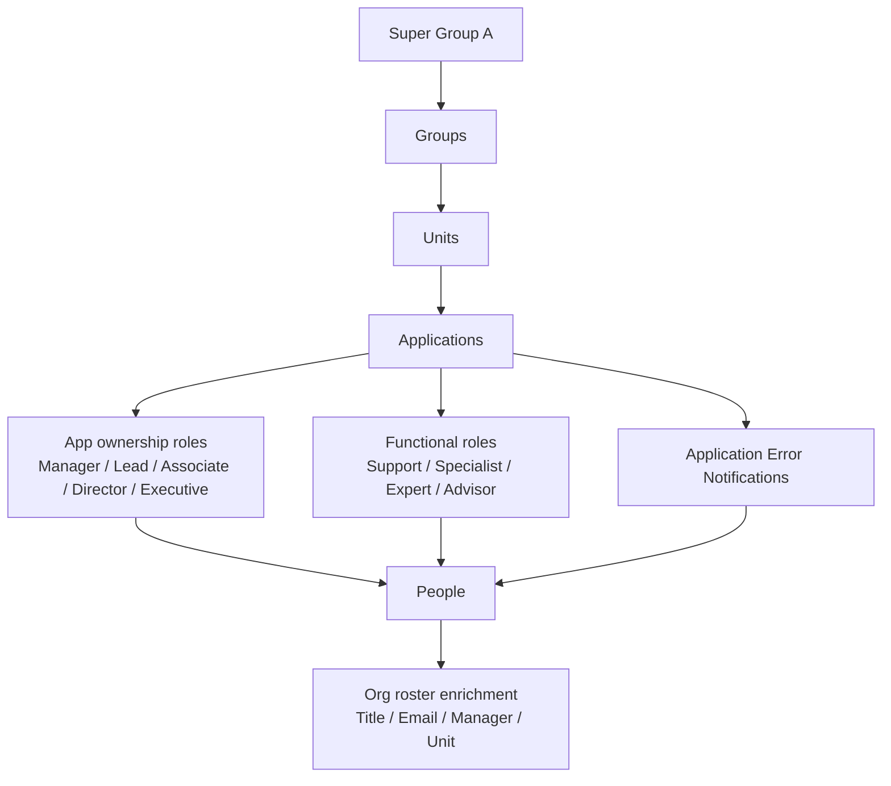
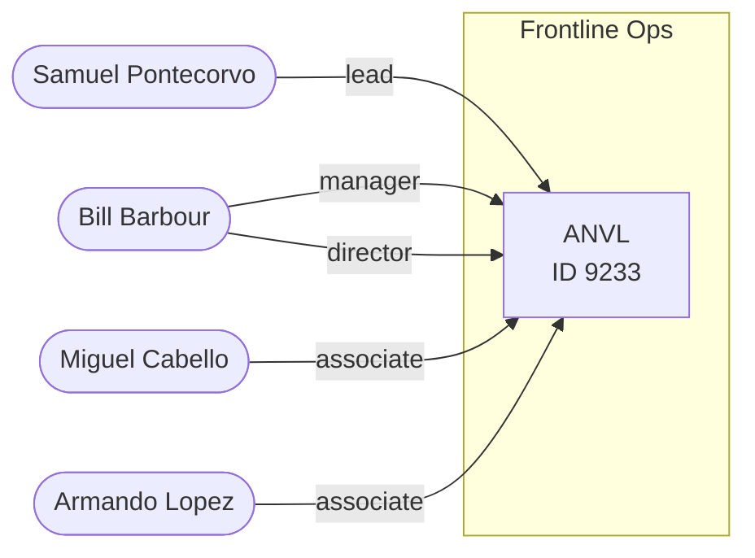

# Super Group A — App + People Connection Context

This Markdown is scoped to **Super Group A** only.

**Source scope used:**
- Org roster rows where `Super Group = Super Group A`.
- App contact rows where `Super Group = Super Group A`.
- App contact roles may include people outside Super Group A because the application file includes support, specialist, expert, advisor, deal, and notification relationships.

**Data notes:**
- Names with `*` are preserved from the source tables. Treat `*` as a source marker/primary indicator unless your internal process defines it differently.
- Short lead values in the app file such as `Gomez`, `Jha`, `Naik`, `Palacios`, `Olvera`, `Ramirez`, `Barbour`, and `MS` were expanded where the match was clear.
- Blank source fields are left blank.

## Summary

| Metric | Count |
| --- | --- |
| Super Group A org roster people | 32 |
| Super Group A applications | 40 |
| Groups represented by apps | 4 |
| Units represented by apps | 6 |
| Unique app-contact people across all roles | 179 |
| Unique app-contact people also in Super Group A roster | 26 |

## Table of contents

- [Relationship model](#relationship-model)
- [Super Group A org chart](#super-group-a-org-chart)
- [Super Group A app portfolio chart](#super-group-a-app-portfolio-chart)
- [Group summary](#group-summary)
- [Super Group A team roster](#super-group-a-team-roster)
- [Application ownership matrix](#application-ownership-matrix)
- [Super Group A person-to-app index](#super-group-a-person-to-app-index)
- [Full application connection detail](#full-application-connection-detail)
- [Lucidchart import edge model](#lucidchart-import-edge-model)
- [Group-level Mermaid ownership charts](#group-level-mermaid-ownership-charts)

## Relationship model

## Super Group A org chart

```mermaid
flowchart TD
    SGA["Super Group A<br/>Lead: Alonzo Gomez"]
    G_Action_and_Obligation_Tracking["Action and Obligation Tracking<br/>Lead: Alonzo Gomez"]
    SGA --> G_Action_and_Obligation_Tracking
    U_Action_and_Obligation_Tracking_Action_and_Obligation_Trackin["Action and Obligation Tracking<br/>Unit Lead: Rahul Jha"]
    G_Action_and_Obligation_Tracking --> U_Action_and_Obligation_Tracking_Action_and_Obligation_Trackin
    P_Chethan_Sivaramappa["Chethan Sivaramappa<br/>Lead Product Developer"]
    U_Action_and_Obligation_Tracking_Action_and_Obligation_Trackin --> P_Chethan_Sivaramappa
    P_Ernesto_Saldana["Ernesto Saldana<br/>Product Developer"]
    U_Action_and_Obligation_Tracking_Action_and_Obligation_Trackin --> P_Ernesto_Saldana
    P_Francisco_Amador["Francisco Amador<br/>Product Developer"]
    U_Action_and_Obligation_Tracking_Action_and_Obligation_Trackin --> P_Francisco_Amador
    P_Mataan_Abucar["Mataan Abucar<br/>Senior Product Developer"]
    U_Action_and_Obligation_Tracking_Action_and_Obligation_Trackin --> P_Mataan_Abucar
    P_Om_Sindagi["Om Sindagi<br/>Product Developer Associate"]
    U_Action_and_Obligation_Tracking_Action_and_Obligation_Trackin --> P_Om_Sindagi
    P_Rahul_Jha["Rahul Jha<br/>Associate Leader, Product Development and Ope…"]
    U_Action_and_Obligation_Tracking_Action_and_Obligation_Trackin --> P_Rahul_Jha
    P_Vaishnavi_Punnuri["Vaishnavi Punnuri<br/>Product Developer Associate"]
    U_Action_and_Obligation_Tracking_Action_and_Obligation_Trackin --> P_Vaishnavi_Punnuri
    G_EHS["EHS<br/>Lead: Juan Palacios"]
    SGA --> G_EHS
    U_EHS_No_primary_unit_listed["(No primary unit listed)<br/>Unit Lead: "]
    G_EHS --> U_EHS_No_primary_unit_listed
    P_Juan_Palacios["Juan Palacios<br/>Leader, Product Development and Operations"]
    U_EHS_No_primary_unit_listed --> P_Juan_Palacios
    U_EHS_Environmental["Environmental<br/>Unit Lead: Aaron Olvera"]
    G_EHS --> U_EHS_Environmental
    P_Aaron_Olvera["Aaron Olvera<br/>Associate Leader, Product Development and Ope…"]
    U_EHS_Environmental --> P_Aaron_Olvera
    P_Fernando_Cardona["Fernando Cardona<br/>Product Developer"]
    U_EHS_Environmental --> P_Fernando_Cardona
    P_Francisco_Sanchez["Francisco Sanchez<br/>Associate Leader, Product Development and Ope…"]
    U_EHS_Environmental --> P_Francisco_Sanchez
    U_EHS_Health_and_Safety_PTW["Health and Safety; PTW<br/>Unit Lead: Sebastian Ramirez"]
    G_EHS --> U_EHS_Health_and_Safety_PTW
    P_Antonyponnavin_J["Antonyponnavin J<br/>Product Developer - Consultant"]
    U_EHS_Health_and_Safety_PTW --> P_Antonyponnavin_J
    P_Carlos_Rangel["Carlos Rangel<br/>Product Developer"]
    U_EHS_Health_and_Safety_PTW --> P_Carlos_Rangel
    P_Himansu_Behera["Himansu Behera<br/>Product Developer Associate"]
    U_EHS_Health_and_Safety_PTW --> P_Himansu_Behera
    P_Luis_Castaneda["Luis Castaneda<br/>Product Development Manager"]
    U_EHS_Health_and_Safety_PTW --> P_Luis_Castaneda
    P_Pavan_N["Pavan N<br/>Product Developer"]
    U_EHS_Health_and_Safety_PTW --> P_Pavan_N
    P_Sebastian_Ramirez["Sebastian Ramirez<br/>Senior Product Development Manager"]
    U_EHS_Health_and_Safety_PTW --> P_Sebastian_Ramirez
    G_Frontline_Ops["Frontline Ops<br/>Lead: Bill Barbour"]
    SGA --> G_Frontline_Ops
    U_Frontline_Ops_ANVL_Product["ANVL Product<br/>Unit Lead: Bill Barbour"]
    G_Frontline_Ops --> U_Frontline_Ops_ANVL_Product
    P_Armando_Lopez["Armando Lopez<br/>Product Developer Associate"]
    U_Frontline_Ops_ANVL_Product --> P_Armando_Lopez
    P_Ben_Wei["Ben Wei<br/>Contractor"]
    U_Frontline_Ops_ANVL_Product --> P_Ben_Wei
    P_Miguel_Cabello["Miguel Cabello<br/>Product Developer"]
    U_Frontline_Ops_ANVL_Product --> P_Miguel_Cabello
    P_Nick_Fragakis["Nick Fragakis<br/>Leader, ANVL"]
    U_Frontline_Ops_ANVL_Product --> P_Nick_Fragakis
    P_Will_Stevenson["Will Stevenson<br/>Contractor"]
    U_Frontline_Ops_ANVL_Product --> P_Will_Stevenson
    G_Training_and_Contractor_Mgmt["Training and Contractor Mgmt<br/>Lead: Priyanka Naik"]
    SGA --> G_Training_and_Contractor_Mgmt
    U_Training_and_Contractor_Mgmt_No_primary_unit_listed["(No primary unit listed)<br/>Unit Lead: "]
    G_Training_and_Contractor_Mgmt --> U_Training_and_Contractor_Mgmt_No_primary_unit_listed
    P_Priyanka_Naik["Priyanka Naik<br/>Senior Leader, Product Development and Operat…"]
    U_Training_and_Contractor_Mgmt_No_primary_unit_listed --> P_Priyanka_Naik
    U_Training_and_Contractor_Mgmt_Health_and_Safety_Contractor_Mg["Health and Safety; Contractor Mgmt<br/>Unit Lead: Deepak MS"]
    G_Training_and_Contractor_Mgmt --> U_Training_and_Contractor_Mgmt_Health_and_Safety_Contractor_Mg
    P_Deepak_MS["Deepak MS<br/>Senior Product Development Manager"]
    U_Training_and_Contractor_Mgmt_Health_and_Safety_Contractor_Mg --> P_Deepak_MS
    P_Jesus_Sandoval["Jesus Sandoval<br/>Lead Product Developer"]
    U_Training_and_Contractor_Mgmt_Health_and_Safety_Contractor_Mg --> P_Jesus_Sandoval
    P_Shaswat_Bajpai["Shaswat Bajpai<br/>Product Developer Associate"]
    U_Training_and_Contractor_Mgmt_Health_and_Safety_Contractor_Mg --> P_Shaswat_Bajpai
    P_Srinivasulu_Avula["Srinivasulu Avula<br/>Product Developer Associate"]
    U_Training_and_Contractor_Mgmt_Health_and_Safety_Contractor_Mg --> P_Srinivasulu_Avula
    P_Yash_Arora["Yash Arora<br/>Product Developer Associate"]
    U_Training_and_Contractor_Mgmt_Health_and_Safety_Contractor_Mg --> P_Yash_Arora
    U_Training_and_Contractor_Mgmt_Training_Compliance["Training Compliance<br/>Unit Lead: Priyanka Naik"]
    G_Training_and_Contractor_Mgmt --> U_Training_and_Contractor_Mgmt_Training_Compliance
    P_Alan_Nieves["Alan Nieves<br/>Product Developer Associate"]
    U_Training_and_Contractor_Mgmt_Training_Compliance --> P_Alan_Nieves
    P_Deeksha_Shetty["Deeksha Shetty<br/>Product Developer"]
    U_Training_and_Contractor_Mgmt_Training_Compliance --> P_Deeksha_Shetty
    P_Pablo_Merla["Pablo Merla<br/>Senior Product Developer"]
    U_Training_and_Contractor_Mgmt_Training_Compliance --> P_Pablo_Merla
```

## Super Group A app portfolio chart

```mermaid
flowchart TD
    SGA["Super Group A App Portfolio"]
    AG_Action_and_Obligation_Tracking["Action and Obligation Tracking"]
    SGA --> AG_Action_and_Obligation_Tracking
    AU_Action_and_Obligation_Tracking_Action_and_Obligation_Trackin["Action and Obligation Tracking"]
    AG_Action_and_Obligation_Tracking --> AU_Action_and_Obligation_Tracking_Action_and_Obligation_Trackin
    APP_3_Action_Tracking_System["Action Tracking System<br/>ID 3"]
    AU_Action_and_Obligation_Tracking_Action_and_Obligation_Trackin --> APP_3_Action_Tracking_System
    APP_177_Audit_Assistant["Audit Assistant<br/>ID 177"]
    AU_Action_and_Obligation_Tracking_Action_and_Obligation_Trackin --> APP_177_Audit_Assistant
    APP_153_Audit_Planner["Audit Planner<br/>ID 153"]
    AU_Action_and_Obligation_Tracking_Action_and_Obligation_Trackin --> APP_153_Audit_Planner
    APP_4_Compliance_Calendar["Compliance Calendar<br/>ID 4"]
    AU_Action_and_Obligation_Tracking_Action_and_Obligation_Trackin --> APP_4_Compliance_Calendar
    APP_7_Project_Calendar["Project Calendar<br/>ID 7"]
    AU_Action_and_Obligation_Tracking_Action_and_Obligation_Trackin --> APP_7_Project_Calendar
    APP_50001_Quality_Action_Tracking_System_Action_Tracking_System["Quality Action Tracking System (Action Tracking System)<br/>ID 50001"]
    AU_Action_and_Obligation_Tracking_Action_and_Obligation_Trackin --> APP_50001_Quality_Action_Tracking_System_Action_Tracking_System
    APP_50003_Quality_Audit_Assistant_Audit_Assistant["Quality Audit Assistant (Audit Assistant)<br/>ID 50003"]
    AU_Action_and_Obligation_Tracking_Action_and_Obligation_Trackin --> APP_50003_Quality_Audit_Assistant_Audit_Assistant
    APP_50010_Quality_Compliance_Calendar_Compliance_Calendar["Quality Compliance Calendar (Compliance Calendar)<br/>ID 50010"]
    AU_Action_and_Obligation_Tracking_Action_and_Obligation_Trackin --> APP_50010_Quality_Compliance_Calendar_Compliance_Calendar
    APP_301_SAFER["SAFER<br/>ID 301"]
    AU_Action_and_Obligation_Tracking_Action_and_Obligation_Trackin --> APP_301_SAFER
    AG_EHS["EHS"]
    SGA --> AG_EHS
    AU_EHS_Environmental["Environmental"]
    AG_EHS --> AU_EHS_Environmental
    APP_2_AirLog["AirLog<br/>ID 2"]
    AU_EHS_Environmental --> APP_2_AirLog
    APP_89_Best_Practices["Best Practices<br/>ID 89"]
    AU_EHS_Environmental --> APP_89_Best_Practices
    APP_50_Discussion_Groups["Discussion Groups<br/>ID 50"]
    AU_EHS_Environmental --> APP_50_Discussion_Groups
    APP_46_EHS_Sample_Management["EHS Sample Management<br/>ID 46"]
    AU_EHS_Environmental --> APP_46_EHS_Sample_Management
    APP_35_ODS_Sentinel["ODS Sentinel<br/>ID 35"]
    AU_EHS_Environmental --> APP_35_ODS_Sentinel
    APP_224_Risk_Registry["Risk Registry<br/>ID 224"]
    AU_EHS_Environmental --> APP_224_Risk_Registry
    APP_81_Water_Watch["Water Watch<br/>ID 81"]
    AU_EHS_Environmental --> APP_81_Water_Watch
    AU_EHS_Health_and_Safety_PTW["Health and Safety; PTW"]
    AG_EHS --> AU_EHS_Health_and_Safety_PTW
    APP_97_Behavior_Based_Quality["Behavior Based Quality<br/>ID 97"]
    AU_EHS_Health_and_Safety_PTW --> APP_97_Behavior_Based_Quality
    APP_50005_Digital_FMEA_Safety_Risk_Assessment_JSA["Digital FMEA (Safety Risk Assessment (JSA))<br/>ID 50005"]
    AU_EHS_Health_and_Safety_PTW --> APP_50005_Digital_FMEA_Safety_Risk_Assessment_JSA
    APP_9020_Ergo_Evaluator["Ergo Evaluator<br/>ID 9020"]
    AU_EHS_Health_and_Safety_PTW --> APP_9020_Ergo_Evaluator
    APP_25_Ergo_Facilitator["Ergo Facilitator<br/>ID 25"]
    AU_EHS_Health_and_Safety_PTW --> APP_25_Ergo_Facilitator
    APP_91_Safe_Work_Permit["Safe Work Permit<br/>ID 91"]
    AU_EHS_Health_and_Safety_PTW --> APP_91_Safe_Work_Permit
    APP_27_Safety_Dialogue["Safety Dialogue<br/>ID 27"]
    AU_EHS_Health_and_Safety_PTW --> APP_27_Safety_Dialogue
    APP_22_Safety_Matrix["Safety Matrix<br/>ID 22"]
    AU_EHS_Health_and_Safety_PTW --> APP_22_Safety_Matrix
    APP_28_Safety_Observations["Safety Observations<br/>ID 28"]
    AU_EHS_Health_and_Safety_PTW --> APP_28_Safety_Observations
    APP_23_Safety_Risk_Assessment_JSA["Safety Risk Assessment (JSA)<br/>ID 23"]
    AU_EHS_Health_and_Safety_PTW --> APP_23_Safety_Risk_Assessment_JSA
    AG_Frontline_Ops["Frontline Ops"]
    SGA --> AG_Frontline_Ops
    AU_Frontline_Ops_ANVL_Product["ANVL Product"]
    AG_Frontline_Ops --> AU_Frontline_Ops_ANVL_Product
    APP_9233_ANVL["ANVL<br/>ID 9233"]
    AU_Frontline_Ops_ANVL_Product --> APP_9233_ANVL
    AG_Training_and_Contractor_Mgmt["Training and Contractor Mgmt"]
    SGA --> AG_Training_and_Contractor_Mgmt
    AU_Training_and_Contractor_Mgmt_Health_and_Safety_Contractor_Mg["Health and Safety; Contractor Mgmt"]
    AG_Training_and_Contractor_Mgmt --> AU_Training_and_Contractor_Mgmt_Health_and_Safety_Contractor_Mg
    APP_56_Contractor_Safety["Contractor Safety<br/>ID 56"]
    AU_Training_and_Contractor_Mgmt_Health_and_Safety_Contractor_Mg --> APP_56_Contractor_Safety
    APP_154_EHS_Project_Tracker["EHS Project Tracker<br/>ID 154"]
    AU_Training_and_Contractor_Mgmt_Health_and_Safety_Contractor_Mg --> APP_154_EHS_Project_Tracker
    APP_24_Industrial_Hygiene["Industrial Hygiene<br/>ID 24"]
    AU_Training_and_Contractor_Mgmt_Health_and_Safety_Contractor_Mg --> APP_24_Industrial_Hygiene
    APP_26_LOTO["LOTO<br/>ID 26"]
    AU_Training_and_Contractor_Mgmt_Health_and_Safety_Contractor_Mg --> APP_26_LOTO
    APP_9162_PPE_Manager["PPE Manager<br/>ID 9162"]
    AU_Training_and_Contractor_Mgmt_Health_and_Safety_Contractor_Mg --> APP_9162_PPE_Manager
    APP_48_Process_Director["Process Director<br/>ID 48"]
    AU_Training_and_Contractor_Mgmt_Health_and_Safety_Contractor_Mg --> APP_48_Process_Director
    APP_44_Survey_Engine["Survey Engine<br/>ID 44"]
    AU_Training_and_Contractor_Mgmt_Health_and_Safety_Contractor_Mg --> APP_44_Survey_Engine
    AU_Training_and_Contractor_Mgmt_Training_Compliance["Training Compliance"]
    AG_Training_and_Contractor_Mgmt --> AU_Training_and_Contractor_Mgmt_Training_Compliance
    APP_142_Action_Plan_Manager["Action Plan Manager<br/>ID 142"]
    AU_Training_and_Contractor_Mgmt_Training_Compliance --> APP_142_Action_Plan_Manager
    APP_223_Benchmark_Gensuite_University["Benchmark Gensuite University<br/>ID 223"]
    AU_Training_and_Contractor_Mgmt_Training_Compliance --> APP_223_Benchmark_Gensuite_University
    APP_219_My_LMS["My LMS<br/>ID 219"]
    AU_Training_and_Contractor_Mgmt_Training_Compliance --> APP_219_My_LMS
    APP_50008_Quality_My_LMS_My_LMS["Quality My LMS (My LMS)<br/>ID 50008"]
    AU_Training_and_Contractor_Mgmt_Training_Compliance --> APP_50008_Quality_My_LMS_My_LMS
    APP_50007_Quality_Training_Tracker_Training_Tracker["Quality Training Tracker (Training Tracker)<br/>ID 50007"]
    AU_Training_and_Contractor_Mgmt_Training_Compliance --> APP_50007_Quality_Training_Tracker_Training_Tracker
    APP_20_Training_Calendar["Training Calendar<br/>ID 20"]
    AU_Training_and_Contractor_Mgmt_Training_Compliance --> APP_20_Training_Calendar
    APP_19_Training_Tracker["Training Tracker<br/>ID 19"]
    AU_Training_and_Contractor_Mgmt_Training_Compliance --> APP_19_Training_Tracker
```

## Group summary

| Group | Expanded group lead | Units | Apps | Super Group A roster people |
| --- | --- | --- | --- | --- |
| Action and Obligation Tracking | Alonzo Gomez | 1 | 9 | 7 |
| EHS | Juan Palacios | 2 | 16 | 10 |
| Frontline Ops | Bill Barbour | 1 | 1 | 5 |
| Training and Contractor Mgmt | Priyanka Naik | 2 | 14 | 9 |

## Super Group A team roster

| Name | Title | Email | Group | Group Lead | Primary Unit | Primary Unit Lead | Lead Manager | Co-Lead Manager |
| --- | --- | --- | --- | --- | --- | --- | --- | --- |
| Chethan Sivaramappa | Lead Product Developer | chethan.sivaramappa@gensuitellc.com | Action and Obligation Tracking | Alonzo Gomez | Action and Obligation Tracking | Rahul Jha | Rahul Jha | N/A |
| Ernesto Saldana | Product Developer | ernesto.saldana@gensuitellc.com | Action and Obligation Tracking | Alonzo Gomez | Action and Obligation Tracking | Rahul Jha | Francisco Sanchez | Rahul Jha |
| Francisco Amador | Product Developer | francisco.amador@gensuitellc.com | Action and Obligation Tracking | Alonzo Gomez | Action and Obligation Tracking | Rahul Jha | Alonzo Gomez | Rahul Jha |
| Mataan Abucar | Senior Product Developer | Mataan.Abucar@gensuitellc.com | Action and Obligation Tracking | Alonzo Gomez | Action and Obligation Tracking | Rahul Jha | Alonzo Gomez | Rahul Jha |
| Om Sindagi | Product Developer Associate | om.sindagi@gensuitellc.com | Action and Obligation Tracking | Alonzo Gomez | Action and Obligation Tracking | Rahul Jha | Deepak MS | Rahul Jha |
| Rahul Jha | Associate Leader, Product Development and Operations | rahul.jha@gensuitellc.com | Action and Obligation Tracking | Alonzo Gomez | Action and Obligation Tracking | Rahul Jha | Alonzo Gomez | N/A |
| Vaishnavi Punnuri | Product Developer Associate | vaishnavi.punnuri@gensuitellc.com | Action and Obligation Tracking | Alonzo Gomez | Action and Obligation Tracking | Rahul Jha | Rahul Jha | N/A |
| Juan Palacios | Leader, Product Development and Operations | Juan.Palacios@gensuitellc.com | EHS | Juan Palacios |  |  | Alonzo Gomez | N/A |
| Aaron Olvera | Associate Leader, Product Development and Operations | Aaron.Olvera@gensuitellc.com | EHS | Juan Palacios | Environmental | Aaron Olvera | Alonzo Gomez | N/A |
| Fernando Cardona | Product Developer | fernando.cardona@gensuitellc.com | EHS | Juan Palacios | Environmental | Aaron Olvera | Sebastian Ramirez | N/A |
| Francisco Sanchez | Associate Leader, Product Development and Operations | Francisco.Sanchez@gensuitellc.com | EHS | Juan Palacios | Environmental | Aaron Olvera | Aaron Olvera | Alonzo Gomez |
| Antonyponnavin J | Product Developer - Consultant | antonyponnavin.j@gensuitellc.com | EHS | Juan Palacios | Health and Safety; PTW | Sebastian Ramirez | Juan Palacios | N/A |
| Carlos Rangel | Product Developer | carlos.rangel@gensuitellc.com | EHS | Juan Palacios | Health and Safety; PTW | Sebastian Ramirez | Sebastian Ramirez | N/A |
| Himansu Behera | Product Developer Associate | himansu.behera@gensuitellc.com | EHS | Juan Palacios | Health and Safety; PTW | Sebastian Ramirez | Deepak MS | N/A |
| Luis Castaneda | Product Development Manager | luis.castaneda@gensuitellc.com | EHS | Juan Palacios | Health and Safety; PTW | Sebastian Ramirez | Sebastian Ramirez | N/A |
| Pavan N | Product Developer | pavan.n@gensuitellc.com | EHS | Juan Palacios | Health and Safety; PTW | Sebastian Ramirez | Deepak MS | Juan Palacios |
| Sebastian Ramirez | Senior Product Development Manager | sebastian.ramirez@gensuitellc.com | EHS | Juan Palacios | Health and Safety; PTW | Sebastian Ramirez | Juan Palacios | N/A |
| Armando Lopez | Product Developer Associate | armando.lopez@gensuitellc.com | Frontline Ops | Bill Barbour | ANVL Product | Bill Barbour | Alonzo Gomez | Bill Barbour |
| Ben Wei | Contractor | ben.wei@gensuitellc.com | Frontline Ops | Bill Barbour | ANVL Product | Bill Barbour | Bill Barbour | N/A |
| Miguel Cabello | Product Developer | miguel.cabello@gensuitellc.com | Frontline Ops | Bill Barbour | ANVL Product | Bill Barbour | Alonzo Gomez | Bill Barbour |
| Nick Fragakis | Leader, ANVL | nick.fragakis@gensuitellc.com | Frontline Ops | Bill Barbour | ANVL Product | Bill Barbour | Bill Barbour | Zach Taylor |
| Will Stevenson | Contractor | will.stevenson@gensuitellc.com | Frontline Ops | Bill Barbour | ANVL Product | Bill Barbour | Bill Barbour | N/A |
| Alonzo Gomez | Director, Product Development and Operations | Alonzo.Gomez@gensuitellc.com | N/A |  |  |  | Joel Halpern | N/A |
| Priyanka Naik | Senior Leader, Product Development and Operations | priyanka.naik@gensuitellc.com | Training and Contractor Mgmt | Priyanka Naik |  |  | Alonzo Gomez | N/A |
| Deepak MS | Senior Product Development Manager | deepak.ms@gensuitellc.com | Training and Contractor Mgmt | Priyanka Naik | Health and Safety; Contractor Mgmt | Deepak MS | Priyanka Naik | N/A |
| Jesus Sandoval | Lead Product Developer | jesus.sandoval@gensuitellc.com | Training and Contractor Mgmt | Priyanka Naik | Health and Safety; Contractor Mgmt | Deepak MS | Alonzo Gomez | N/A |
| Shaswat Bajpai | Product Developer Associate | shaswat.bajpai@gensuitellc.com | Training and Contractor Mgmt | Priyanka Naik | Health and Safety; Contractor Mgmt | Deepak MS | Deepak MS | N/A |
| Srinivasulu Avula | Product Developer Associate | srinivasulu.avula@gensuitellc.com | Training and Contractor Mgmt | Priyanka Naik | Health and Safety; Contractor Mgmt | Deepak MS | Deepak MS | N/A |
| Yash Arora | Product Developer Associate | yash.arora@gensuitellc.com | Training and Contractor Mgmt | Priyanka Naik | Health and Safety; Contractor Mgmt | Deepak MS | Deepak MS | Priyanka Naik |
| Alan Nieves | Product Developer Associate | alan.nieves@gensuitellc.com | Training and Contractor Mgmt | Priyanka Naik | Training Compliance | Priyanka Naik | Alonzo Gomez | Priyanka Naik |
| Deeksha Shetty | Product Developer | deeksha.shetty@gensuitellc.com | Training and Contractor Mgmt | Priyanka Naik | Training Compliance | Priyanka Naik | Deepak MS | N/A |
| Pablo Merla | Senior Product Developer | pablo.merla@gensuitellc.com | Training and Contractor Mgmt | Priyanka Naik | Training Compliance | Priyanka Naik | Francisco Sanchez | Priyanka Naik |

## Application ownership matrix

| App ID | Application | Suite | Solution | Group | Unit | Group Lead | Unit Lead | App Manager | App Lead | App Associate | App Director | App Executive |
| --- | --- | --- | --- | --- | --- | --- | --- | --- | --- | --- | --- | --- |
| 3 | Action Tracking System | EHS Management | CAPA | Action and Obligation Tracking | Action and Obligation Tracking | Alonzo Gomez | Rahul Jha | Rahul Jha | Mataan Abucar | Ernesto Saldana,Chethan Sivaramappa*,Vaishnavi Punnuri,Om Sindagi,Francisco Amador | Rahul Jha | Alonzo Gomez |
| 177 | Audit Assistant | Compliance & Enterprise Risk | Regulatory Compliance & Auditing | Action and Obligation Tracking | Action and Obligation Tracking | Alonzo Gomez | Rahul Jha | Mataan Abucar | Mataan Abucar* | Ernesto Saldana,Francisco Amador,Om Sindagi,Vaishnavi Punnuri* | Rahul Jha | Alonzo Gomez |
| 153 | Audit Planner | Compliance & Enterprise Risk | Regulatory Compliance & Auditing | Action and Obligation Tracking | Action and Obligation Tracking | Alonzo Gomez | Rahul Jha | Rahul Jha* | Rahul Jha | Ernesto Saldana*,Om Sindagi,Chethan Sivaramappa,Vaishnavi Punnuri | Rahul Jha | Alonzo Gomez |
| 4 | Compliance Calendar | EHS Management | Obligation Management | Action and Obligation Tracking | Action and Obligation Tracking | Alonzo Gomez | Rahul Jha | Mataan Abucar | Rahul Jha | Ernesto Saldana*,Chethan Sivaramappa,Vaishnavi Punnuri,Om Sindagi | Rahul Jha* | Alonzo Gomez |
| 7 | Project Calendar | EHS Management | Obligation Management | Action and Obligation Tracking | Action and Obligation Tracking | Alonzo Gomez | Rahul Jha |  | Rahul Jha | Om Sindagi,Vaishnavi Punnuri* | Rahul Jha | Alonzo Gomez |
| 50001 | Quality Action Tracking System [Action Tracking System] | Quality | Quality Auditing and CAPA | Action and Obligation Tracking | Action and Obligation Tracking | Alonzo Gomez | Rahul Jha | Rahul Jha | Mataan Abucar | Ernesto Saldana,Chethan Sivaramappa*,Vaishnavi Punnuri,Om Sindagi,Francisco Amador | Rahul Jha | Alonzo Gomez |
| 50003 | Quality Audit Assistant [Audit Assistant] | Quality | Quality Auditing and CAPA | Action and Obligation Tracking | Action and Obligation Tracking | Alonzo Gomez | Rahul Jha | Mataan Abucar | Mataan Abucar* | Ernesto Saldana,Francisco Amador,Om Sindagi,Vaishnavi Punnuri* | Rahul Jha | Alonzo Gomez |
| 50010 | Quality Compliance Calendar [Compliance Calendar] | Quality | Quality Process Management & Control | Action and Obligation Tracking | Action and Obligation Tracking | Alonzo Gomez | Rahul Jha | Mataan Abucar | Rahul Jha | Ernesto Saldana*,Chethan Sivaramappa,Vaishnavi Punnuri,Om Sindagi | Rahul Jha* | Alonzo Gomez |
| 301 | SAFER | Operational Safety | Process Safety Management | Action and Obligation Tracking | Action and Obligation Tracking | Alonzo Gomez | Rahul Jha | Mataan Abucar | Ernesto Saldana | Chethan Sivaramappa*,Vaishnavi Punnuri | Rahul Jha | Alonzo Gomez |
| 2 | AirLog | Environmental Management | Air & ODS Compliance | EHS | Environmental | Juan Palacios | Aaron Olvera | Aaron Olvera | Francisco Sanchez | Fernando Cardona | Alonzo Gomez | Alonzo Gomez |
| 89 | Best Practices | Compliance & Enterprise Risk | Risk & ISO Management Systems | EHS | Environmental | Juan Palacios | Aaron Olvera | Aaron Olvera | Francisco Sanchez |  | Alonzo Gomez | Alonzo Gomez |
| 50 | Discussion Groups | Compliance & Enterprise Risk | Program Management | EHS | Environmental | Juan Palacios | Aaron Olvera | Aaron Olvera | Francisco Sanchez |  | Alonzo Gomez | Alonzo Gomez |
| 46 | EHS Sample Management | Environmental Management | Water Compliance | EHS | Environmental | Juan Palacios | Aaron Olvera | Francisco Sanchez* | Francisco Sanchez* | Fernando Cardona | Aaron Olvera* | Alonzo Gomez* |
| 35 | ODS Sentinel | Environmental Management | Air & ODS Compliance | EHS | Environmental | Juan Palacios | Aaron Olvera | Aaron Olvera | Francisco Sanchez | Fernando Cardona | Alonzo Gomez | Alonzo Gomez |
| 224 | Risk Registry | Compliance & Enterprise Risk | Risk & ISO Management Systems | EHS | Environmental | Juan Palacios | Aaron Olvera | Aaron Olvera | Francisco Sanchez | Fernando Cardona | Alonzo Gomez | Alonzo Gomez |
| 81 | Water Watch | Environmental Management | Water Compliance | EHS | Environmental | Juan Palacios | Aaron Olvera | Aaron Olvera | Francisco Sanchez | Fernando Cardona | Alonzo Gomez | Alonzo Gomez |
| 97 | Behavior Based Quality | Quality | Quality Incidents and Non Conformance Management | EHS | Health and Safety; PTW | Juan Palacios | Sebastian Ramirez | Sebastian Ramirez | Juan Palacios |  | Juan Palacios | Alonzo Gomez |
| 50005 | Digital FMEA [Safety Risk Assessment (JSA)] |  |  | EHS | Health and Safety; PTW | Juan Palacios | Sebastian Ramirez | Alonzo Gomez | Juan Palacios | Pavan N,Sebastian Ramirez*,Carlos Rangel | Juan Palacios | Alonzo Gomez |
| 9020 | Ergo Evaluator | Operational Safety | Ergonomic Assessment | EHS | Health and Safety; PTW | Juan Palacios | Sebastian Ramirez | Alonzo Gomez | Juan Palacios | Luis Castaneda*,Sebastian Ramirez,Pavan N | Alonzo Gomez | Alonzo Gomez |
| 25 | Ergo Facilitator | Operational Safety | Ergonomic Assessment | EHS | Health and Safety; PTW | Juan Palacios | Sebastian Ramirez | Alonzo Gomez | Juan Palacios | Luis Castaneda,Sebastian Ramirez*,Himansu Behera | Alonzo Gomez | Alonzo Gomez |
| 91 | Safe Work Permit | Operational Safety | Control of Work | EHS | Health and Safety; PTW | Juan Palacios | Sebastian Ramirez | Alonzo Gomez | Juan Palacios | Sebastian Ramirez*,Luis Castaneda,Pavan N,Himansu Behera,Priyanka Naik | Alonzo Gomez | Alonzo Gomez |
| 27 | Safety Dialogue | Operational Safety | Safety Risk Assessment | EHS | Health and Safety; PTW | Juan Palacios | Sebastian Ramirez | Alonzo Gomez | Juan Palacios | Luis Castaneda,Pavan N*,Carlos Rangel | Juan Palacios | Alonzo Gomez |
| 22 | Safety Matrix | Operational Safety | Safety Risk Assessment | EHS | Health and Safety; PTW | Juan Palacios | Sebastian Ramirez | Alonzo Gomez | Juan Palacios | Carlos Rangel,Pavan N,Sebastian Ramirez* | Juan Palacios | Alonzo Gomez |
| 28 | Safety Observations | Operational Safety | Behavior Based Safety | EHS | Health and Safety; PTW | Juan Palacios | Sebastian Ramirez | Sebastian Ramirez | Juan Palacios | Luis Castaneda*,Himansu Behera | Juan Palacios | Alonzo Gomez |
| 23 | Safety Risk Assessment (JSA) | Operational Safety | Safety Risk Assessment | EHS | Health and Safety; PTW | Juan Palacios | Sebastian Ramirez | Alonzo Gomez | Juan Palacios | Pavan N,Sebastian Ramirez*,Carlos Rangel | Juan Palacios | Alonzo Gomez |
| 9233 | ANVL | Operational Safety | Frontline Safety | Frontline Ops | ANVL Product | Bill Barbour | Bill Barbour | Bill Barbour | Samuel Pontecorvo | Miguel Cabello*,Armando Lopez | Bill Barbour | Bill Barbour |
| 56 | Contractor Safety | Operational Safety | Contractor Management | Training and Contractor Mgmt | Health and Safety; Contractor Mgmt | Priyanka Naik | Deepak MS | Deepak MS* | Deepak MS | Srinivasulu Avula*,Shaswat Bajpai,Jesus Sandoval | Alonzo Gomez,Priyanka Naik* | Priyanka Naik |
| 154 | EHS Project Tracker | Operational Safety | Process Safety Management | Training and Contractor Mgmt | Health and Safety; Contractor Mgmt | Priyanka Naik | Deepak MS | Deepak MS | Deepak MS | Shaswat Bajpai,Jesus Sandoval,Srinivasulu Avula* | Alonzo Gomez,Priyanka Naik* | Joel Halpern |
| 24 | Industrial Hygiene | Operational Safety | Industrial Hygiene | Training and Contractor Mgmt | Health and Safety; Contractor Mgmt | Priyanka Naik | Deepak MS | Deepak MS | Deepak MS | Srinivasulu Avula,Shaswat Bajpai*,Jesus Sandoval | Alonzo Gomez,Priyanka Naik* | Joel Halpern |
| 26 | LOTO | Operational Safety | Control of Work | Training and Contractor Mgmt | Health and Safety; Contractor Mgmt | Priyanka Naik | Deepak MS | Deepak MS | Deepak MS | Shaswat Bajpai,Srinivasulu Avula*,Jesus Sandoval | Alonzo Gomez,Priyanka Naik* | Joel Halpern |
| 9162 | PPE Manager | Operational Safety | Safety Risk Assessment | Training and Contractor Mgmt | Health and Safety; Contractor Mgmt | Priyanka Naik | Deepak MS | Deepak MS | Deepak MS | Jesus Sandoval,Srinivasulu Avula*,Shaswat Bajpai | Alonzo Gomez,Priyanka Naik* | Joel Halpern |
| 48 | Process Director | Compliance & Enterprise Risk | Program Management | Training and Contractor Mgmt | Health and Safety; Contractor Mgmt | Priyanka Naik | Deepak MS | Deepak MS | Deepak MS | Srinivasulu Avula*,Shaswat Bajpai,Jesus Sandoval | Alonzo Gomez,Priyanka Naik* | Joel Halpern |
| 44 | Survey Engine | Tech Platform | Document & Program Management | Training and Contractor Mgmt | Health and Safety; Contractor Mgmt | Priyanka Naik | Deepak MS | Deepak MS | Deepak MS | Srinivasulu Avula*,Shaswat Bajpai,Jesus Sandoval | Priyanka Naik*,Alonzo Gomez | Joel Halpern |
| 142 | Action Plan Manager | Compliance & Enterprise Risk | Program Management | Training and Contractor Mgmt | Training Compliance | Priyanka Naik | Priyanka Naik | Priyanka Naik* | Priyanka Naik* | Deeksha Shetty*,Pablo Merla,Pratheeksha S | Priyanka Naik*,Alonzo Gomez | Priyanka Naik |
| 223 | Benchmark Gensuite University | Platform & System Tools (non CARR) | System Tools | Training and Contractor Mgmt | Training Compliance | Priyanka Naik | Priyanka Naik | Priyanka Naik,Pablo Merla* | Priyanka Naik*,Pablo Merla | Deeksha Shetty*,Pratheeksha S | Priyanka Naik*,Alonzo Gomez | Alonzo Gomez |
| 219 | My LMS | Compliance & Enterprise Risk | Compliance Training | Training and Contractor Mgmt | Training Compliance | Priyanka Naik | Priyanka Naik | Priyanka Naik | Priyanka Naik,Pablo Merla* | Deeksha Shetty*,Pablo Merla,Pratheeksha S | Priyanka Naik*,Alonzo Gomez | Priyanka Naik |
| 50008 | Quality My LMS [My LMS] | Quality | Quality Process Management & Control | Training and Contractor Mgmt | Training Compliance | Priyanka Naik | Priyanka Naik | Priyanka Naik | Priyanka Naik,Pablo Merla* | Deeksha Shetty*,Pablo Merla,Pratheeksha S | Priyanka Naik*,Alonzo Gomez | Priyanka Naik |
| 50007 | Quality Training Tracker [Training Tracker] | Quality | Quality Process Management & Control | Training and Contractor Mgmt | Training Compliance | Priyanka Naik | Priyanka Naik | Priyanka Naik | Priyanka Naik,Pablo Merla* | Deeksha Shetty*,Pablo Merla,Pratheeksha S | Priyanka Naik*,Alonzo Gomez | Priyanka Naik |
| 20 | Training Calendar | Compliance & Enterprise Risk | Compliance Training | Training and Contractor Mgmt | Training Compliance | Priyanka Naik | Priyanka Naik | Priyanka Naik | Priyanka Naik,Pablo Merla* | Deeksha Shetty*,Pablo Merla,Pratheeksha S | Priyanka Naik*,Alonzo Gomez | Priyanka Naik |
| 19 | Training Tracker | Compliance & Enterprise Risk | Compliance Training | Training and Contractor Mgmt | Training Compliance | Priyanka Naik | Priyanka Naik | Priyanka Naik | Priyanka Naik,Pablo Merla* | Deeksha Shetty*,Pablo Merla,Pratheeksha S | Priyanka Naik*,Alonzo Gomez | Priyanka Naik |

## Super Group A person-to-app index

This section shows Super Group A roster members who appear in one or more app-contact roles.

| Person | Title | Email | Group | Primary Unit | Connected apps / roles |
| --- | --- | --- | --- | --- | --- |
| Aaron Olvera | Associate Leader, Product Development and Operations | Aaron.Olvera@gensuitellc.com | EHS | Environmental | AirLog (2) — App Manager AirLog (2) — Application Error Notifications AirLog (2) — Unit Lead Best Practices (89) — App Manager Best Practices (89) — Application Error Notifications Best Practices (89) — Unit Lead Discussion Groups (50) — App Manager Discussion Groups (50) — Application Error Notifications Discussion Groups (50) — Unit Lead EHS Sample Management (46) — App Director EHS Sample Management (46) — Unit Lead ODS Sentinel (35) — App Manager ODS Sentinel (35) — Application Error Notifications ODS Sentinel (35) — Unit Lead Risk Registry (224) — App Manager Risk Registry (224) — Application Error Notifications Risk Registry (224) — Unit Lead Water Watch (81) — App Manager Water Watch (81) — Application Error Notifications Water Watch (81) — Unit Lead |
| Alan Nieves | Product Developer Associate | alan.nieves@gensuitellc.com | Training and Contractor Mgmt | Training Compliance |  |
| Alonzo Gomez | Director, Product Development and Operations | Alonzo.Gomez@gensuitellc.com | N/A |  | ANVL (9233) — Super Group Lead Action Plan Manager (142) — App Director Action Plan Manager (142) — Application Error Notifications Action Plan Manager (142) — Super Group Lead Action Tracking System (3) — App Executive Action Tracking System (3) — Application Error Notifications Action Tracking System (3) — Group Lead Action Tracking System (3) — Super Group Lead AirLog (2) — App Director AirLog (2) — App Executive AirLog (2) — Application Error Notifications AirLog (2) — Super Group Lead Audit Assistant (177) — App Executive Audit Assistant (177) — Application Error Notifications Audit Assistant (177) — Group Lead Audit Assistant (177) — Super Group Lead Audit Planner (153) — App Executive Audit Planner (153) — Application Error Notifications Audit Planner (153) — Group Lead Audit Planner (153) — Super Group Lead Behavior Based Quality (97) — App Executive Behavior Based Quality (97) — Super Group Lead Benchmark Gensuite University (223) — App Director Benchmark Gensuite University (223) — App Executive Benchmark Gensuite University (223) — Application Error Notifications Benchmark Gensuite University (223) — Super Group Lead Best Practices (89) — App Director Best Practices (89) — App Executive Best Practices (89) — Application Error Notifications Best Practices (89) — Super Group Lead Compliance Calendar (4) — App Executive Compliance Calendar (4) — Application Error Notifications Compliance Calendar (4) — Group Lead Compliance Calendar (4) — Super Group Lead Contractor Safety (56) — App Director Contractor Safety (56) — Application Error Notifications Contractor Safety (56) — Super Group Lead Digital FMEA [Safety Risk Assessment (JSA)] (50005) — App Executive Digital FMEA [Safety Risk Assessment (JSA)] (50005) — App Manager Digital FMEA [Safety Risk Assessment (JSA)] (50005) — Application Error Notifications Digital FMEA [Safety Risk Assessment (JSA)] (50005) — Super Group Lead Discussion Groups (50) — App Director Discussion Groups (50) — App Executive Discussion Groups (50) — Application Error Notifications Discussion Groups (50) — Super Group Lead EHS Project Tracker (154) — App Director EHS Project Tracker (154) — Application Error Notifications EHS Project Tracker (154) — Super Group Lead EHS Sample Management (46) — App Executive EHS Sample Management (46) — Super Group Lead Ergo Evaluator (9020) — App Director Ergo Evaluator (9020) — App Executive Ergo Evaluator (9020) — App Manager Ergo Evaluator (9020) — Application Error Notifications Ergo Evaluator (9020) — Super Group Lead Ergo Facilitator (25) — App Director Ergo Facilitator (25) — App Executive Ergo Facilitator (25) — App Manager Ergo Facilitator (25) — Application Error Notifications Ergo Facilitator (25) — Super Group Lead Industrial Hygiene (24) — App Director Industrial Hygiene (24) — Application Error Notifications Industrial Hygiene (24) — Super Group Lead LOTO (26) — App Director LOTO (26) — Application Error Notifications LOTO (26) — Super Group Lead My LMS (219) — App Director My LMS (219) — Application Error Notifications My LMS (219) — Super Group Lead ODS Sentinel (35) — App Director ODS Sentinel (35) — App Executive ODS Sentinel (35) — Application Error Notifications ODS Sentinel (35) — Super Group Lead PPE Manager (9162) — App Director PPE Manager (9162) — Application Error Notifications PPE Manager (9162) — Super Group Lead Process Director (48) — App Director Process Director (48) — Application Error Notifications Process Director (48) — Super Group Lead Project Calendar (7) — App Executive Project Calendar (7) — Application Error Notifications Project Calendar (7) — Group Lead Project Calendar (7) — Super Group Lead Quality Action Tracking System [Action Tracking System] (50001) — App Executive Quality Action Tracking System [Action Tracking System] (50001) — Application Error Notifications Quality Action Tracking System [Action Tracking System] (50001) — Group Lead Quality Action Tracking System [Action Tracking System] (50001) — Super Group Lead Quality Audit Assistant [Audit Assistant] (50003) — App Executive Quality Audit Assistant [Audit Assistant] (50003) — Application Error Notifications Quality Audit Assistant [Audit Assistant] (50003) — Group Lead Quality Audit Assistant [Audit Assistant] (50003) — Super Group Lead Quality Compliance Calendar [Compliance Calendar] (50010) — App Executive Quality Compliance Calendar [Compliance Calendar] (50010) — Application Error Notifications Quality Compliance Calendar [Compliance Calendar] (50010) — Group Lead Quality Compliance Calendar [Compliance Calendar] (50010) — Super Group Lead Quality My LMS [My LMS] (50008) — App Director Quality My LMS [My LMS] (50008) — Application Error Notifications Quality My LMS [My LMS] (50008) — Super Group Lead Quality Training Tracker [Training Tracker] (50007) — App Director Quality Training Tracker [Training Tracker] (50007) — Application Error Notifications Quality Training Tracker [Training Tracker] (50007) — Super Group Lead Risk Registry (224) — App Director Risk Registry (224) — App Executive Risk Registry (224) — Application Error Notifications Risk Registry (224) — Super Group Lead SAFER (301) — App Executive SAFER (301) — Application Error Notifications SAFER (301) — Group Lead SAFER (301) — Super Group Lead Safe Work Permit (91) — App Director Safe Work Permit (91) — App Executive Safe Work Permit (91) — App Manager Safe Work Permit (91) — Application Error Notifications Safe Work Permit (91) — Super Group Lead Safety Dialogue (27) — App Executive Safety Dialogue (27) — App Manager Safety Dialogue (27) — Application Error Notifications Safety Dialogue (27) — Super Group Lead Safety Matrix (22) — App Executive Safety Matrix (22) — App Manager Safety Matrix (22) — Application Error Notifications Safety Matrix (22) — Super Group Lead Safety Observations (28) — App Executive Safety Observations (28) — Application Error Notifications Safety Observations (28) — Super Group Lead Safety Risk Assessment (JSA) (23) — App Executive Safety Risk Assessment (JSA) (23) — App Manager Safety Risk Assessment (JSA) (23) — Application Error Notifications Safety Risk Assessment (JSA) (23) — Super Group Lead Survey Engine (44) — App Director Survey Engine (44) — Application Error Notifications Survey Engine (44) — Super Group Lead Training Calendar (20) — App Director Training Calendar (20) — Application Error Notifications Training Calendar (20) — Super Group Lead Training Tracker (19) — App Director Training Tracker (19) — Application Error Notifications Training Tracker (19) — Super Group Lead Water Watch (81) — App Director Water Watch (81) — App Executive Water Watch (81) — Application Error Notifications Water Watch (81) — Super Group Lead |
| Antonyponnavin J | Product Developer - Consultant | antonyponnavin.j@gensuitellc.com | EHS | Health and Safety; PTW |  |
| Armando Lopez | Product Developer Associate | armando.lopez@gensuitellc.com | Frontline Ops | ANVL Product | ANVL (9233) — App Associate ANVL (9233) — Application Error Notifications |
| Ben Wei | Contractor | ben.wei@gensuitellc.com | Frontline Ops | ANVL Product |  |
| Carlos Rangel | Product Developer | carlos.rangel@gensuitellc.com | EHS | Health and Safety; PTW | Digital FMEA [Safety Risk Assessment (JSA)] (50005) — App Associate Ergo Evaluator (9020) — Application Error Notifications Safe Work Permit (91) — Application Error Notifications Safety Dialogue (27) — App Associate Safety Dialogue (27) — Application Error Notifications Safety Matrix (22) — App Associate Safety Risk Assessment (JSA) (23) — App Associate |
| Chethan Sivaramappa | Lead Product Developer | chethan.sivaramappa@gensuitellc.com | Action and Obligation Tracking | Action and Obligation Tracking | Action Tracking System (3) — App Associate Audit Planner (153) — App Associate Compliance Calendar (4) — App Associate Quality Action Tracking System [Action Tracking System] (50001) — App Associate Quality Compliance Calendar [Compliance Calendar] (50010) — App Associate SAFER (301) — App Associate |
| Deeksha Shetty | Product Developer | deeksha.shetty@gensuitellc.com | Training and Contractor Mgmt | Training Compliance | Action Plan Manager (142) — App Associate Benchmark Gensuite University (223) — App Associate Benchmark Gensuite University (223) — Application Error Notifications My LMS (219) — App Associate Quality My LMS [My LMS] (50008) — App Associate Quality Training Tracker [Training Tracker] (50007) — App Associate Training Calendar (20) — App Associate Training Tracker (19) — App Associate |
| Deepak MS | Senior Product Development Manager | deepak.ms@gensuitellc.com | Training and Contractor Mgmt | Health and Safety; Contractor Mgmt | Contractor Safety (56) — App Lead Contractor Safety (56) — App Manager Contractor Safety (56) — Unit Lead EHS Project Tracker (154) — App Lead EHS Project Tracker (154) — App Manager EHS Project Tracker (154) — Unit Lead Industrial Hygiene (24) — App Lead Industrial Hygiene (24) — App Manager Industrial Hygiene (24) — Unit Lead LOTO (26) — App Lead LOTO (26) — App Manager LOTO (26) — Unit Lead PPE Manager (9162) — App Lead PPE Manager (9162) — App Manager PPE Manager (9162) — Unit Lead Process Director (48) — App Lead Process Director (48) — App Manager Process Director (48) — Unit Lead Survey Engine (44) — App Lead Survey Engine (44) — App Manager Survey Engine (44) — Unit Lead |
| Ernesto Saldana | Product Developer | ernesto.saldana@gensuitellc.com | Action and Obligation Tracking | Action and Obligation Tracking | Action Tracking System (3) — App Associate Audit Assistant (177) — App Associate Audit Planner (153) — App Associate Compliance Calendar (4) — App Associate Quality Action Tracking System [Action Tracking System] (50001) — App Associate Quality Audit Assistant [Audit Assistant] (50003) — App Associate Quality Compliance Calendar [Compliance Calendar] (50010) — App Associate SAFER (301) — App Lead |
| Fernando Cardona | Product Developer | fernando.cardona@gensuitellc.com | EHS | Environmental | AirLog (2) — App Associate AirLog (2) — Application Error Notifications EHS Sample Management (46) — App Associate ODS Sentinel (35) — App Associate Risk Registry (224) — App Associate Risk Registry (224) — Application Error Notifications Water Watch (81) — App Associate |
| Francisco Amador | Product Developer | francisco.amador@gensuitellc.com | Action and Obligation Tracking | Action and Obligation Tracking | Action Tracking System (3) — App Associate Audit Assistant (177) — App Associate Quality Action Tracking System [Action Tracking System] (50001) — App Associate Quality Audit Assistant [Audit Assistant] (50003) — App Associate |
| Francisco Sanchez | Associate Leader, Product Development and Operations | Francisco.Sanchez@gensuitellc.com | EHS | Environmental | AirLog (2) — App Lead Best Practices (89) — App Lead Discussion Groups (50) — App Lead EHS Sample Management (46) — App Lead EHS Sample Management (46) — App Manager ODS Sentinel (35) — App Lead Risk Registry (224) — App Lead Water Watch (81) — App Lead |
| Himansu Behera | Product Developer Associate | himansu.behera@gensuitellc.com | EHS | Health and Safety; PTW | AirLog (2) — Application Error Notifications Ergo Facilitator (25) — App Associate Safe Work Permit (91) — App Associate Safety Observations (28) — App Associate Water Watch (81) — Application Error Notifications |
| Jesus Sandoval | Lead Product Developer | jesus.sandoval@gensuitellc.com | Training and Contractor Mgmt | Health and Safety; Contractor Mgmt | Contractor Safety (56) — App Associate EHS Project Tracker (154) — App Associate Industrial Hygiene (24) — App Associate LOTO (26) — App Associate PPE Manager (9162) — App Associate Process Director (48) — App Associate Survey Engine (44) — App Associate |
| Juan Palacios | Leader, Product Development and Operations | Juan.Palacios@gensuitellc.com | EHS |  | AirLog (2) — Application Error Notifications AirLog (2) — Group Lead Behavior Based Quality (97) — App Director Behavior Based Quality (97) — App Lead Behavior Based Quality (97) — Group Lead Best Practices (89) — Application Error Notifications Best Practices (89) — Group Lead Digital FMEA [Safety Risk Assessment (JSA)] (50005) — App Director Digital FMEA [Safety Risk Assessment (JSA)] (50005) — App Lead Digital FMEA [Safety Risk Assessment (JSA)] (50005) — Group Lead Discussion Groups (50) — Application Error Notifications Discussion Groups (50) — Group Lead EHS Sample Management (46) — Group Lead Ergo Evaluator (9020) — App Lead Ergo Evaluator (9020) — Group Lead Ergo Facilitator (25) — App Lead Ergo Facilitator (25) — Group Lead ODS Sentinel (35) — Application Error Notifications ODS Sentinel (35) — Group Lead Risk Registry (224) — Application Error Notifications Risk Registry (224) — Group Lead Safe Work Permit (91) — App Lead Safe Work Permit (91) — Group Lead Safety Dialogue (27) — App Director Safety Dialogue (27) — App Lead Safety Dialogue (27) — Group Lead Safety Matrix (22) — App Director Safety Matrix (22) — App Lead Safety Matrix (22) — Group Lead Safety Observations (28) — App Director Safety Observations (28) — App Lead Safety Observations (28) — Group Lead Safety Risk Assessment (JSA) (23) — App Director Safety Risk Assessment (JSA) (23) — App Lead Safety Risk Assessment (JSA) (23) — Group Lead Water Watch (81) — Application Error Notifications Water Watch (81) — Group Lead |
| Luis Castaneda | Product Development Manager | luis.castaneda@gensuitellc.com | EHS | Health and Safety; PTW | Ergo Evaluator (9020) — App Associate Ergo Facilitator (25) — App Associate Safe Work Permit (91) — App Associate Safety Dialogue (27) — App Associate Safety Observations (28) — App Associate |
| Mataan Abucar | Senior Product Developer | Mataan.Abucar@gensuitellc.com | Action and Obligation Tracking | Action and Obligation Tracking | Action Tracking System (3) — App Lead Audit Assistant (177) — App Lead Audit Assistant (177) — App Manager Compliance Calendar (4) — App Manager Quality Action Tracking System [Action Tracking System] (50001) — App Lead Quality Audit Assistant [Audit Assistant] (50003) — App Lead Quality Audit Assistant [Audit Assistant] (50003) — App Manager Quality Compliance Calendar [Compliance Calendar] (50010) — App Manager SAFER (301) — App Manager |
| Miguel Cabello | Product Developer | miguel.cabello@gensuitellc.com | Frontline Ops | ANVL Product | ANVL (9233) — App Associate ANVL (9233) — Application Error Notifications |
| Nick Fragakis | Leader, ANVL | nick.fragakis@gensuitellc.com | Frontline Ops | ANVL Product |  |
| Om Sindagi | Product Developer Associate | om.sindagi@gensuitellc.com | Action and Obligation Tracking | Action and Obligation Tracking | Action Tracking System (3) — App Associate Audit Assistant (177) — App Associate Audit Planner (153) — App Associate Compliance Calendar (4) — App Associate Project Calendar (7) — App Associate Quality Action Tracking System [Action Tracking System] (50001) — App Associate Quality Audit Assistant [Audit Assistant] (50003) — App Associate Quality Compliance Calendar [Compliance Calendar] (50010) — App Associate |
| Pablo Merla | Senior Product Developer | pablo.merla@gensuitellc.com | Training and Contractor Mgmt | Training Compliance | Action Plan Manager (142) — App Associate Benchmark Gensuite University (223) — App Lead Benchmark Gensuite University (223) — App Manager Benchmark Gensuite University (223) — Application Error Notifications My LMS (219) — App Associate My LMS (219) — App Lead Quality My LMS [My LMS] (50008) — App Associate Quality My LMS [My LMS] (50008) — App Lead Quality Training Tracker [Training Tracker] (50007) — App Associate Quality Training Tracker [Training Tracker] (50007) — App Lead Training Calendar (20) — App Associate Training Calendar (20) — App Lead Training Tracker (19) — App Associate Training Tracker (19) — App Lead |
| Pavan N | Product Developer | pavan.n@gensuitellc.com | EHS | Health and Safety; PTW | Digital FMEA [Safety Risk Assessment (JSA)] (50005) — App Associate Ergo Evaluator (9020) — App Associate Safe Work Permit (91) — App Associate Safety Dialogue (27) — App Associate Safety Matrix (22) — App Associate Safety Risk Assessment (JSA) (23) — App Associate |
| Priyanka Naik | Senior Leader, Product Development and Operations | priyanka.naik@gensuitellc.com | Training and Contractor Mgmt |  | Action Plan Manager (142) — App Director Action Plan Manager (142) — App Executive Action Plan Manager (142) — App Lead Action Plan Manager (142) — App Manager Action Plan Manager (142) — Group Lead Action Plan Manager (142) — Unit Lead Benchmark Gensuite University (223) — App Director Benchmark Gensuite University (223) — App Lead Benchmark Gensuite University (223) — App Manager Benchmark Gensuite University (223) — Application Error Notifications Benchmark Gensuite University (223) — Group Lead Benchmark Gensuite University (223) — Unit Lead Contractor Safety (56) — App Director Contractor Safety (56) — App Executive Contractor Safety (56) — Group Lead EHS Project Tracker (154) — App Director EHS Project Tracker (154) — Group Lead Industrial Hygiene (24) — App Director Industrial Hygiene (24) — Group Lead LOTO (26) — App Director LOTO (26) — Group Lead My LMS (219) — App Director My LMS (219) — App Executive My LMS (219) — App Lead My LMS (219) — App Manager My LMS (219) — Group Lead My LMS (219) — Unit Lead PPE Manager (9162) — App Director PPE Manager (9162) — Group Lead Process Director (48) — App Director Process Director (48) — Group Lead Quality My LMS [My LMS] (50008) — App Director Quality My LMS [My LMS] (50008) — App Executive Quality My LMS [My LMS] (50008) — App Lead Quality My LMS [My LMS] (50008) — App Manager Quality My LMS [My LMS] (50008) — Group Lead Quality My LMS [My LMS] (50008) — Unit Lead Quality Training Tracker [Training Tracker] (50007) — App Director Quality Training Tracker [Training Tracker] (50007) — App Executive Quality Training Tracker [Training Tracker] (50007) — App Lead Quality Training Tracker [Training Tracker] (50007) — App Manager Quality Training Tracker [Training Tracker] (50007) — Group Lead Quality Training Tracker [Training Tracker] (50007) — Unit Lead Safe Work Permit (91) — App Associate Survey Engine (44) — App Director Survey Engine (44) — Group Lead Training Calendar (20) — App Director Training Calendar (20) — App Executive Training Calendar (20) — App Lead Training Calendar (20) — App Manager Training Calendar (20) — Group Lead Training Calendar (20) — Unit Lead Training Tracker (19) — App Director Training Tracker (19) — App Executive Training Tracker (19) — App Lead Training Tracker (19) — App Manager Training Tracker (19) — Group Lead Training Tracker (19) — Unit Lead |
| Rahul Jha | Associate Leader, Product Development and Operations | rahul.jha@gensuitellc.com | Action and Obligation Tracking | Action and Obligation Tracking | Action Tracking System (3) — App Director Action Tracking System (3) — App Manager Action Tracking System (3) — Unit Lead Audit Assistant (177) — App Director Audit Assistant (177) — Unit Lead Audit Planner (153) — App Director Audit Planner (153) — App Lead Audit Planner (153) — App Manager Audit Planner (153) — Unit Lead Compliance Calendar (4) — App Director Compliance Calendar (4) — App Lead Compliance Calendar (4) — Unit Lead Project Calendar (7) — App Director Project Calendar (7) — App Lead Project Calendar (7) — Unit Lead Quality Action Tracking System [Action Tracking System] (50001) — App Director Quality Action Tracking System [Action Tracking System] (50001) — App Manager Quality Action Tracking System [Action Tracking System] (50001) — Unit Lead Quality Audit Assistant [Audit Assistant] (50003) — App Director Quality Audit Assistant [Audit Assistant] (50003) — Unit Lead Quality Compliance Calendar [Compliance Calendar] (50010) — App Director Quality Compliance Calendar [Compliance Calendar] (50010) — App Lead Quality Compliance Calendar [Compliance Calendar] (50010) — Unit Lead SAFER (301) — App Director SAFER (301) — Unit Lead |
| Sebastian Ramirez | Senior Product Development Manager | sebastian.ramirez@gensuitellc.com | EHS | Health and Safety; PTW | Behavior Based Quality (97) — App Manager Behavior Based Quality (97) — Unit Lead Digital FMEA [Safety Risk Assessment (JSA)] (50005) — App Associate Digital FMEA [Safety Risk Assessment (JSA)] (50005) — Unit Lead Ergo Evaluator (9020) — App Associate Ergo Evaluator (9020) — Unit Lead Ergo Facilitator (25) — App Associate Ergo Facilitator (25) — Unit Lead Safe Work Permit (91) — App Associate Safe Work Permit (91) — Unit Lead Safety Dialogue (27) — Unit Lead Safety Matrix (22) — App Associate Safety Matrix (22) — Unit Lead Safety Observations (28) — App Manager Safety Observations (28) — Unit Lead Safety Risk Assessment (JSA) (23) — App Associate Safety Risk Assessment (JSA) (23) — Unit Lead |
| Shaswat Bajpai | Product Developer Associate | shaswat.bajpai@gensuitellc.com | Training and Contractor Mgmt | Health and Safety; Contractor Mgmt | Contractor Safety (56) — App Associate EHS Project Tracker (154) — App Associate Industrial Hygiene (24) — App Associate LOTO (26) — App Associate PPE Manager (9162) — App Associate Process Director (48) — App Associate Survey Engine (44) — App Associate |
| Srinivasulu Avula | Product Developer Associate | srinivasulu.avula@gensuitellc.com | Training and Contractor Mgmt | Health and Safety; Contractor Mgmt | Contractor Safety (56) — App Associate EHS Project Tracker (154) — App Associate Industrial Hygiene (24) — App Associate LOTO (26) — App Associate PPE Manager (9162) — App Associate Process Director (48) — App Associate Survey Engine (44) — App Associate |
| Vaishnavi Punnuri | Product Developer Associate | vaishnavi.punnuri@gensuitellc.com | Action and Obligation Tracking | Action and Obligation Tracking | Action Tracking System (3) — App Associate Audit Assistant (177) — App Associate Audit Planner (153) — App Associate Compliance Calendar (4) — App Associate Project Calendar (7) — App Associate Quality Action Tracking System [Action Tracking System] (50001) — App Associate Quality Audit Assistant [Audit Assistant] (50003) — App Associate Quality Compliance Calendar [Compliance Calendar] (50010) — App Associate SAFER (301) — App Associate |
| Will Stevenson | Contractor | will.stevenson@gensuitellc.com | Frontline Ops | ANVL Product |  |
| Yash Arora | Product Developer Associate | yash.arora@gensuitellc.com | Training and Contractor Mgmt | Health and Safety; Contractor Mgmt |  |

## Full application connection detail

Each app below includes all non-empty role columns from the app-contact source file.

### Action Tracking System — App ID 3

| Field | Value |
| --- | --- |
| Suite | EHS Management |
| Solution | CAPA |
| Group | Action and Obligation Tracking |
| Group Lead | Alonzo Gomez |
| Unit | Action and Obligation Tracking |
| Unit Lead | Rahul Jha |
| Error notifications flag/people source column | Paola Reyes,Alonzo Gomez |
| Is App | 1 |
| Ready Enabled | 1 |
| Internal | 0 |

| Role | People / value |
| --- | --- |
| Super Group Lead | Alonzo Gomez |
| Group Lead | Alonzo Gomez |
| Unit Lead | Rahul Jha |
| Specialist | Priyanka PS,Ilse Molina |
| Expert | Paola Reyes,Mariana Pavon |
| TPL Lead | Anushya B*,Reshma CR |
| Solution Utilization Advisor | Jeremy Garner*,Natasha Porter |
| Solution Growth Leader | Malika Houghton |
| Solution Deal Advisor | Laura Fiume |
| App Manager | Rahul Jha |
| App Lead | Mataan Abucar |
| App Associate | Ernesto Saldana,Chethan Sivaramappa*,Vaishnavi Punnuri,Om Sindagi,Francisco Amador |
| App Director | Rahul Jha |
| App Executive | Alonzo Gomez |
| Advisor | Joel Halpern |
| Application Error Notifications | Paola Reyes,Alonzo Gomez |

### Audit Assistant — App ID 177

| Field | Value |
| --- | --- |
| Suite | Compliance & Enterprise Risk |
| Solution | Regulatory Compliance & Auditing |
| Group | Action and Obligation Tracking |
| Group Lead | Alonzo Gomez |
| Unit | Action and Obligation Tracking |
| Unit Lead | Rahul Jha |
| Error notifications flag/people source column | Alonzo Gomez |
| Is App | 1 |
| Ready Enabled | 0 |
| Internal | 0 |

| Role | People / value |
| --- | --- |
| Super Group Lead | Alonzo Gomez |
| Group Lead | Alonzo Gomez |
| Unit Lead | Rahul Jha |
| Support | Sindu S,Mahendra Reddy,Amalia Munoz,Lucy Diao,Riya Yadav |
| Expert | Sean Ackley |
| TPL Lead | Anushya B |
| Solution Utilization Advisor | Laura Fiume,Jeremy Garner* |
| Solution Growth Leader | Malika Houghton |
| Solution Deal Advisor | Jeremy Garner |
| App Manager | Mataan Abucar |
| App Lead | Mataan Abucar* |
| App Associate | Ernesto Saldana,Francisco Amador,Om Sindagi,Vaishnavi Punnuri* |
| App Director | Rahul Jha |
| App Executive | Alonzo Gomez |
| Advisor | Joel Halpern |
| Application Error Notifications | Alonzo Gomez |

### Audit Planner — App ID 153

| Field | Value |
| --- | --- |
| Suite | Compliance & Enterprise Risk |
| Solution | Regulatory Compliance & Auditing |
| Group | Action and Obligation Tracking |
| Group Lead | Alonzo Gomez |
| Unit | Action and Obligation Tracking |
| Unit Lead | Rahul Jha |
| Error notifications flag/people source column | Mauricio Centeno,Alonzo Gomez |
| Is App | 1 |
| Ready Enabled | 0 |
| Internal | 0 |

| Role | People / value |
| --- | --- |
| Super Group Lead | Alonzo Gomez |
| Group Lead | Alonzo Gomez |
| Unit Lead | Rahul Jha |
| Support | Sindu S,Kayla Marcum,Salman Shariff,Mahendra Reddy,Priyanka HS,Shubham Dua,Lucy Diao,Amalia Munoz |
| Solution Utilization Advisor | Laura Fiume,Jeremy Garner* |
| Solution Growth Leader | Malika Houghton |
| Solution Deal Advisor | Jeremy Garner |
| App Manager | Rahul Jha* |
| App Lead | Rahul Jha |
| App Associate | Ernesto Saldana*,Om Sindagi,Chethan Sivaramappa,Vaishnavi Punnuri |
| App Director | Rahul Jha |
| App Executive | Alonzo Gomez |
| Advisor | Joel Halpern |
| Application Error Notifications | Mauricio Centeno,Alonzo Gomez |

### Compliance Calendar — App ID 4

| Field | Value |
| --- | --- |
| Suite | EHS Management |
| Solution | Obligation Management |
| Group | Action and Obligation Tracking |
| Group Lead | Alonzo Gomez |
| Unit | Action and Obligation Tracking |
| Unit Lead | Rahul Jha |
| Error notifications flag/people source column | Alonzo Gomez |
| Is App | 1 |
| Ready Enabled | 1 |
| Internal | 0 |

| Role | People / value |
| --- | --- |
| Super Group Lead | Alonzo Gomez |
| Group Lead | Alonzo Gomez |
| Unit Lead | Rahul Jha |
| Specialist | Cecilia Pedroza |
| Expert | Riya Yadav,Wesley Smith |
| TPL Lead | Anushya B |
| Solution Utilization Advisor | Jeremy Garner*,Natasha Porter |
| App Manager | Mataan Abucar |
| App Lead | Rahul Jha |
| App Associate | Ernesto Saldana*,Chethan Sivaramappa,Vaishnavi Punnuri,Om Sindagi |
| App Director | Rahul Jha* |
| App Executive | Alonzo Gomez |
| Advisor | Joel Halpern |
| Application Error Notifications | Alonzo Gomez |

### Project Calendar — App ID 7

| Field | Value |
| --- | --- |
| Suite | EHS Management |
| Solution | Obligation Management |
| Group | Action and Obligation Tracking |
| Group Lead | Alonzo Gomez |
| Unit | Action and Obligation Tracking |
| Unit Lead | Rahul Jha |
| Error notifications flag/people source column | Alonzo Gomez |
| Is App | 1 |
| Ready Enabled | 0 |
| Internal | 0 |

| Role | People / value |
| --- | --- |
| Super Group Lead | Alonzo Gomez |
| Group Lead | Alonzo Gomez |
| Unit Lead | Rahul Jha |
| Support | Narda Aguilar,Wesley Smith,Rosa Saint Martin,Mariana Pavon |
| Solution Utilization Advisor | Jason Krueger,Laura Fiume,Natasha Porter,Jeremy Garner* |
| App Lead | Rahul Jha |
| App Associate | Om Sindagi,Vaishnavi Punnuri* |
| App Director | Rahul Jha |
| App Executive | Alonzo Gomez |
| Advisor | Joel Halpern |
| Application Error Notifications | Alonzo Gomez |

### Quality Action Tracking System [Action Tracking System] — App ID 50001

| Field | Value |
| --- | --- |
| Suite | Quality |
| Solution | Quality Auditing and CAPA |
| Group | Action and Obligation Tracking |
| Group Lead | Alonzo Gomez |
| Unit | Action and Obligation Tracking |
| Unit Lead | Rahul Jha |
| Error notifications flag/people source column | Paola Reyes,Alonzo Gomez |
| Is App | 1 |
| Ready Enabled | 1 |
| Internal | 0 |

| Role | People / value |
| --- | --- |
| Super Group Lead | Alonzo Gomez |
| Group Lead | Alonzo Gomez |
| Unit Lead | Rahul Jha |
| Specialist | Priyanka PS,Ilse Molina |
| Expert | Paola Reyes,Mariana Pavon |
| TPL Lead | Anushya B*,Reshma CR |
| Solution Utilization Advisor | Jeremy Garner*,Natasha Porter |
| Solution Growth Leader | Malika Houghton |
| Solution Deal Advisor | Laura Fiume |
| App Manager | Rahul Jha |
| App Lead | Mataan Abucar |
| App Associate | Ernesto Saldana,Chethan Sivaramappa*,Vaishnavi Punnuri,Om Sindagi,Francisco Amador |
| App Director | Rahul Jha |
| App Executive | Alonzo Gomez |
| Advisor | Joel Halpern |
| Application Error Notifications | Paola Reyes,Alonzo Gomez |

### Quality Audit Assistant [Audit Assistant] — App ID 50003

| Field | Value |
| --- | --- |
| Suite | Quality |
| Solution | Quality Auditing and CAPA |
| Group | Action and Obligation Tracking |
| Group Lead | Alonzo Gomez |
| Unit | Action and Obligation Tracking |
| Unit Lead | Rahul Jha |
| Error notifications flag/people source column | Alonzo Gomez |
| Is App | 1 |
| Ready Enabled | 0 |
| Internal | 0 |

| Role | People / value |
| --- | --- |
| Super Group Lead | Alonzo Gomez |
| Group Lead | Alonzo Gomez |
| Unit Lead | Rahul Jha |
| Support | Sindu S,Mahendra Reddy,Amalia Munoz,Lucy Diao,Riya Yadav |
| Expert | Sean Ackley |
| TPL Lead | Anushya B |
| Solution Utilization Advisor | Laura Fiume,Jeremy Garner* |
| Solution Growth Leader | Malika Houghton |
| Solution Deal Advisor | Jeremy Garner |
| App Manager | Mataan Abucar |
| App Lead | Mataan Abucar* |
| App Associate | Ernesto Saldana,Francisco Amador,Om Sindagi,Vaishnavi Punnuri* |
| App Director | Rahul Jha |
| App Executive | Alonzo Gomez |
| Advisor | Joel Halpern |
| Application Error Notifications | Alonzo Gomez |

### Quality Compliance Calendar [Compliance Calendar] — App ID 50010

| Field | Value |
| --- | --- |
| Suite | Quality |
| Solution | Quality Process Management & Control |
| Group | Action and Obligation Tracking |
| Group Lead | Alonzo Gomez |
| Unit | Action and Obligation Tracking |
| Unit Lead | Rahul Jha |
| Error notifications flag/people source column | Alonzo Gomez |
| Is App | 1 |
| Ready Enabled | 1 |
| Internal | 0 |

| Role | People / value |
| --- | --- |
| Super Group Lead | Alonzo Gomez |
| Group Lead | Alonzo Gomez |
| Unit Lead | Rahul Jha |
| Specialist | Cecilia Pedroza |
| Expert | Riya Yadav,Wesley Smith |
| TPL Lead | Anushya B |
| Solution Utilization Advisor | Jeremy Garner*,Natasha Porter |
| App Manager | Mataan Abucar |
| App Lead | Rahul Jha |
| App Associate | Ernesto Saldana*,Chethan Sivaramappa,Vaishnavi Punnuri,Om Sindagi |
| App Director | Rahul Jha* |
| App Executive | Alonzo Gomez |
| Advisor | Joel Halpern |
| Application Error Notifications | Alonzo Gomez |

### SAFER — App ID 301

| Field | Value |
| --- | --- |
| Suite | Operational Safety |
| Solution | Process Safety Management |
| Group | Action and Obligation Tracking |
| Group Lead | Alonzo Gomez |
| Unit | Action and Obligation Tracking |
| Unit Lead | Rahul Jha |
| Error notifications flag/people source column | Alonzo Gomez |
| Is App | 1 |
| Ready Enabled | 0 |
| Internal | 0 |

| Role | People / value |
| --- | --- |
| Super Group Lead | Alonzo Gomez |
| Group Lead | Alonzo Gomez |
| Unit Lead | Rahul Jha |
| Support | Jake Voyles,Scott Greenwood,Jenna Boyer |
| Expert | Chris Pansing |
| Solution Utilization Advisor | Doug Martin,Naveen GV,Chris Pansing |
| Solution Growth Leader | Malika Houghton |
| Solution Deal Advisor | Doug Martin |
| Solution Deal Technical Expert | Katy Jackson,Chris Pansing* |
| App Manager | Mataan Abucar |
| App Lead | Ernesto Saldana |
| App Associate | Chethan Sivaramappa*,Vaishnavi Punnuri |
| App Director | Rahul Jha |
| App Executive | Alonzo Gomez |
| Advisor | Joel Halpern |
| Application Error Notifications | Alonzo Gomez |

### AirLog — App ID 2

| Field | Value |
| --- | --- |
| Suite | Environmental Management |
| Solution | Air & ODS Compliance |
| Group | EHS |
| Group Lead | Juan Palacios |
| Unit | Environmental |
| Unit Lead | Aaron Olvera |
| Error notifications flag/people source column | Alonzo Gomez,Aaron Olvera,Cesar Moreno,Fernando Cardona,Juan Palacios,Himansu Behera |
| Is App | 1 |
| Ready Enabled | 1 |
| Internal | 0 |

| Role | People / value |
| --- | --- |
| Super Group Lead | Alonzo Gomez |
| Group Lead | Juan Palacios |
| Unit Lead | Aaron Olvera |
| Support | Drew McQuillin,Edgar Castaneda,Gracia Almaguer,Gilberto Romo,Celina Molina,Eduardo Flores,Pilar Munoz,Jorge Rodriguez,Rosa Saint Martin,Elizabeth Fisher,Ivan Sanchez,Kyle Casquite,Johnathan Spisak,Kyle Mattes,Ayush Vidyadharan,Ruchith B |
| Specialist | Supriya Srinivasa |
| Expert | Cesar Moreno,Gabriel Sanchez |
| TPL Lead | Natalia Compean*,Kevin O'Neill |
| Solution Utilization Advisor | Doug Martin*,Chris Pansing,Katy Jackson,Naveen GV |
| Solution Growth Leader | Katy Jackson,Kim Luces* |
| Solution Deal Advisor | Chris Pansing |
| App Manager | Aaron Olvera |
| App Lead | Francisco Sanchez |
| App Associate | Fernando Cardona |
| App Director | Alonzo Gomez |
| App Executive | Alonzo Gomez |
| Advisor | Joel Halpern |
| Application Error Notifications | Alonzo Gomez,Aaron Olvera,Cesar Moreno,Fernando Cardona,Juan Palacios,Himansu Behera |

### Best Practices — App ID 89

| Field | Value |
| --- | --- |
| Suite | Compliance & Enterprise Risk |
| Solution | Risk & ISO Management Systems |
| Group | EHS |
| Group Lead | Juan Palacios |
| Unit | Environmental |
| Unit Lead | Aaron Olvera |
| Error notifications flag/people source column | Alonzo Gomez,Aaron Olvera,Juan Palacios |
| Is App | 1 |
| Ready Enabled | 0 |
| Internal | 0 |

| Role | People / value |
| --- | --- |
| Super Group Lead | Alonzo Gomez |
| Group Lead | Juan Palacios |
| Unit Lead | Aaron Olvera |
| Support | Rosa Saint Martin,Emanuel Sanchez,Wesley Smith,David M |
| Solution Utilization Advisor | Naveen GV,Kent Kelsch,Jason Krueger,R Mukund,Natasha Porter |
| App Manager | Aaron Olvera |
| App Lead | Francisco Sanchez |
| App Director | Alonzo Gomez |
| App Executive | Alonzo Gomez |
| Advisor | Joel Halpern |
| Application Error Notifications | Alonzo Gomez,Aaron Olvera,Juan Palacios |

### Discussion Groups — App ID 50

| Field | Value |
| --- | --- |
| Suite | Compliance & Enterprise Risk |
| Solution | Program Management |
| Group | EHS |
| Group Lead | Juan Palacios |
| Unit | Environmental |
| Unit Lead | Aaron Olvera |
| Error notifications flag/people source column | Juan Palacios,Aaron Olvera,Alonzo Gomez |
| Is App | 1 |
| Ready Enabled | 0 |
| Internal | 0 |

| Role | People / value |
| --- | --- |
| Super Group Lead | Alonzo Gomez |
| Group Lead | Juan Palacios |
| Unit Lead | Aaron Olvera |
| Support | David M,Emanuel Sanchez |
| Solution Utilization Advisor | Jason Krueger,Kent Kelsch,R Mukund,Naveen GV,Natasha Porter,Anjali Sandesh |
| App Manager | Aaron Olvera |
| App Lead | Francisco Sanchez |
| App Director | Alonzo Gomez |
| App Executive | Alonzo Gomez |
| Advisor | Joel Halpern |
| Application Error Notifications | Juan Palacios,Aaron Olvera,Alonzo Gomez |

### EHS Sample Management — App ID 46

| Field | Value |
| --- | --- |
| Suite | Environmental Management |
| Solution | Water Compliance |
| Group | EHS |
| Group Lead | Juan Palacios |
| Unit | Environmental |
| Unit Lead | Aaron Olvera |
| Error notifications flag/people source column |  |
| Is App | 1 |
| Ready Enabled | 0 |
| Internal | 0 |

| Role | People / value |
| --- | --- |
| Super Group Lead | Alonzo Gomez |
| Group Lead | Juan Palacios |
| Unit Lead | Aaron Olvera |
| App Manager | Francisco Sanchez* |
| App Lead | Francisco Sanchez* |
| App Associate | Fernando Cardona |
| App Director | Aaron Olvera* |
| App Executive | Alonzo Gomez* |

### ODS Sentinel — App ID 35

| Field | Value |
| --- | --- |
| Suite | Environmental Management |
| Solution | Air & ODS Compliance |
| Group | EHS |
| Group Lead | Juan Palacios |
| Unit | Environmental |
| Unit Lead | Aaron Olvera |
| Error notifications flag/people source column | Alonzo Gomez,Aaron Olvera,Juan Palacios |
| Is App | 1 |
| Ready Enabled | 1 |
| Internal | 0 |

| Role | People / value |
| --- | --- |
| Super Group Lead | Alonzo Gomez |
| Group Lead | Juan Palacios |
| Unit Lead | Aaron Olvera |
| Support | Jorge Rodriguez,Gracia Almaguer,Supriya Srinivasa,Eduardo Flores,Ruchith B,Johnathan Spisak,Elizabeth Fisher,Gilberto Romo,Ivan Sanchez,Kyle Casquite,Ayush Vidyadharan |
| Specialist | Alam Hernandez |
| Expert | Pilar Munoz |
| Solution Utilization Advisor | Doug Martin*,Chris Pansing,Katy Jackson,Naveen GV |
| Solution Growth Leader | Kim Luces |
| Solution Deal Advisor | Chris Pansing |
| App Manager | Aaron Olvera |
| App Lead | Francisco Sanchez |
| App Associate | Fernando Cardona |
| App Director | Alonzo Gomez |
| App Executive | Alonzo Gomez |
| Advisor | Joel Halpern |
| Application Error Notifications | Alonzo Gomez,Aaron Olvera,Juan Palacios |

### Risk Registry — App ID 224

| Field | Value |
| --- | --- |
| Suite | Compliance & Enterprise Risk |
| Solution | Risk & ISO Management Systems |
| Group | EHS |
| Group Lead | Juan Palacios |
| Unit | Environmental |
| Unit Lead | Aaron Olvera |
| Error notifications flag/people source column | Alonzo Gomez,Wesley Smith,Aaron Olvera,Fernando Cardona,Juan Palacios |
| Is App | 1 |
| Ready Enabled | 0 |
| Internal | 0 |

| Role | People / value |
| --- | --- |
| Super Group Lead | Alonzo Gomez |
| Group Lead | Juan Palacios |
| Unit Lead | Aaron Olvera |
| Support | Mike Witzgall*,Kamini Kavya,Alexis Burton,Benjamin Alvarez,Jake Voyles,Jenna Boyer,Gracia Almaguer |
| Specialist | Samuel Resko |
| Expert | Benjamin Alvarez |
| Solution Utilization Advisor | Malika Houghton*,Chris Pansing,Doug Martin,Naveen GV,Chandan T |
| App Manager | Aaron Olvera |
| App Lead | Francisco Sanchez |
| App Associate | Fernando Cardona |
| App Director | Alonzo Gomez |
| App Executive | Alonzo Gomez |
| Advisor | Joel Halpern |
| Application Error Notifications | Alonzo Gomez,Wesley Smith,Aaron Olvera,Fernando Cardona,Juan Palacios |

### Water Watch — App ID 81

| Field | Value |
| --- | --- |
| Suite | Environmental Management |
| Solution | Water Compliance |
| Group | EHS |
| Group Lead | Juan Palacios |
| Unit | Environmental |
| Unit Lead | Aaron Olvera |
| Error notifications flag/people source column | Alonzo Gomez,Cesar Moreno,Aaron Olvera,Juan Palacios,Himansu Behera |
| Is App | 1 |
| Ready Enabled | 0 |
| Internal | 0 |

| Role | People / value |
| --- | --- |
| Super Group Lead | Alonzo Gomez |
| Group Lead | Juan Palacios |
| Unit Lead | Aaron Olvera |
| Support | Gracia Almaguer,Supriya Srinivasa,Eduardo Flores,Ruchith B,Jorge Rodriguez,Kyle Mattes,Celina Molina,Pilar Munoz,Elizabeth Fisher,Johnathan Spisak,Ayush Vidyadharan,Kyle Casquite,Gilberto Romo |
| Expert | Cesar Moreno,Katy Jackson,Chris Pansing |
| TPL Lead | Natalia Compean*,Kevin O'Neill |
| Solution Utilization Advisor | Parker Miller,Doug Martin*,Chris Pansing,Naveen GV |
| Solution Growth Leader | Katy Jackson*,Kim Luces |
| Solution Deal Advisor | Chris Pansing |
| Solution Deal Technical Expert | Parker Miller |
| App Manager | Aaron Olvera |
| App Lead | Francisco Sanchez |
| App Associate | Fernando Cardona |
| App Director | Alonzo Gomez |
| App Executive | Alonzo Gomez |
| Advisor | Joel Halpern |
| Application Error Notifications | Alonzo Gomez,Cesar Moreno,Aaron Olvera,Juan Palacios,Himansu Behera |

### Behavior Based Quality — App ID 97

| Field | Value |
| --- | --- |
| Suite | Quality |
| Solution | Quality Incidents and Non Conformance Management |
| Group | EHS |
| Group Lead | Juan Palacios |
| Unit | Health and Safety; PTW |
| Unit Lead | Sebastian Ramirez |
| Error notifications flag/people source column | Shaima Hashim |
| Is App | 1 |
| Ready Enabled | 0 |
| Internal | 0 |

| Role | People / value |
| --- | --- |
| Super Group Lead | Alonzo Gomez |
| Group Lead | Juan Palacios |
| Unit Lead | Sebastian Ramirez |
| Support | Shaima Hashim,Randy Burgdorf,Jake Voyles,Susan Rufai |
| Expert | Shaima Hashim |
| Solution Utilization Advisor | Randy Burgdorf,Laura Fiume,Kent Kelsch* |
| App Manager | Sebastian Ramirez |
| App Lead | Juan Palacios |
| App Director | Juan Palacios |
| App Executive | Alonzo Gomez |
| Advisor | Joel Halpern |
| Application Error Notifications | Shaima Hashim |

### Digital FMEA [Safety Risk Assessment (JSA)] — App ID 50005

| Field | Value |
| --- | --- |
| Suite |  |
| Solution |  |
| Group | EHS |
| Group Lead | Juan Palacios |
| Unit | Health and Safety; PTW |
| Unit Lead | Sebastian Ramirez |
| Error notifications flag/people source column | Alonzo Gomez |
| Is App | 1 |
| Ready Enabled | 1 |
| Internal | 0 |

| Role | People / value |
| --- | --- |
| Super Group Lead | Alonzo Gomez |
| Group Lead | Juan Palacios |
| Unit Lead | Sebastian Ramirez |
| Support | Gracia Almaguer*,Annabelle Li,Adrian Caldera,Erin Farler,Elena Rodriguez,Advait Mohanan,Sanjeev Upadhyaya,Quinn Liu,Caitlin Clements,Nisarga T,Maria Rodriguez,Skye Sawyer,Kim Koehlke,Abhishek Pandey,Pine Bai |
| Specialist | Mauricio Centeno,Pilar Munoz,Susan Boone |
| Expert | Susan Boone |
| TPL Lead | Sanjana Suresh |
| Solution Utilization Advisor | Susan Boone*,Kasee Stewart |
| Solution Deal Advisor | Kasee Stewart |
| App Manager | Alonzo Gomez |
| App Lead | Juan Palacios |
| App Associate | Pavan N,Sebastian Ramirez*,Carlos Rangel |
| App Director | Juan Palacios |
| App Executive | Alonzo Gomez |
| Advisor | Joel Halpern |
| Application Error Notifications | Alonzo Gomez |

### Ergo Evaluator — App ID 9020

| Field | Value |
| --- | --- |
| Suite | Operational Safety |
| Solution | Ergonomic Assessment |
| Group | EHS |
| Group Lead | Juan Palacios |
| Unit | Health and Safety; PTW |
| Unit Lead | Sebastian Ramirez |
| Error notifications flag/people source column | Alonzo Gomez,Carlos Rangel |
| Is App | 1 |
| Ready Enabled | 0 |
| Internal | 0 |

| Role | People / value |
| --- | --- |
| Super Group Lead | Alonzo Gomez |
| Group Lead | Juan Palacios |
| Unit Lead | Sebastian Ramirez |
| Support | Sanjeev Upadhyaya |
| Specialist | Vaibhav Kishore,Alexis Burton |
| Expert | Advait Mohanan,Yanshie Bahuguna |
| TPL Lead | Paulina Chavez |
| Solution Utilization Advisor | Kasee Stewart*,Susan Boone |
| Solution Growth Leader | Jeff Cross |
| Solution Deal Advisor | Natasha Porter |
| Solution Deal Technical Expert | Shelby Ackley |
| App Manager | Alonzo Gomez |
| App Lead | Juan Palacios |
| App Associate | Luis Castaneda*,Sebastian Ramirez,Pavan N |
| App Director | Alonzo Gomez |
| App Executive | Alonzo Gomez |
| Advisor | Joel Halpern |
| Application Error Notifications | Alonzo Gomez,Carlos Rangel |

### Ergo Facilitator — App ID 25

| Field | Value |
| --- | --- |
| Suite | Operational Safety |
| Solution | Ergonomic Assessment |
| Group | EHS |
| Group Lead | Juan Palacios |
| Unit | Health and Safety; PTW |
| Unit Lead | Sebastian Ramirez |
| Error notifications flag/people source column | Advait Mohanan,Yanshie Bahuguna,Alonzo Gomez |
| Is App | 1 |
| Ready Enabled | 0 |
| Internal | 0 |

| Role | People / value |
| --- | --- |
| Super Group Lead | Alonzo Gomez |
| Group Lead | Juan Palacios |
| Unit Lead | Sebastian Ramirez |
| Support | Advait Mohanan |
| Specialist | Pilar Munoz,Yanshie Bahuguna |
| Expert | Kasee Stewart |
| TPL Lead | Jerrin Jose*,Paulina Chavez |
| Solution Utilization Advisor | Kasee Stewart*,Susan Boone |
| Solution Growth Leader | Jeff Cross |
| Solution Deal Advisor | Vijay Alluru |
| Solution Deal Technical Expert | Olivia Salatin |
| App Manager | Alonzo Gomez |
| App Lead | Juan Palacios |
| App Associate | Luis Castaneda,Sebastian Ramirez*,Himansu Behera |
| App Director | Alonzo Gomez |
| App Executive | Alonzo Gomez |
| Advisor | Joel Halpern |
| Application Error Notifications | Advait Mohanan,Yanshie Bahuguna,Alonzo Gomez |

### Safe Work Permit — App ID 91

| Field | Value |
| --- | --- |
| Suite | Operational Safety |
| Solution | Control of Work |
| Group | EHS |
| Group Lead | Juan Palacios |
| Unit | Health and Safety; PTW |
| Unit Lead | Sebastian Ramirez |
| Error notifications flag/people source column | Anchal Jain,Alonzo Gomez,Carlos Rangel,Yanshie Bahuguna |
| Is App | 1 |
| Ready Enabled | 1 |
| Internal | 0 |

| Role | People / value |
| --- | --- |
| Super Group Lead | Alonzo Gomez |
| Group Lead | Juan Palacios |
| Unit Lead | Sebastian Ramirez |
| Support | Mahendra Reddy,Erin Farler,Advait Mohanan,Sebastian Kovac,Shravan Karthik,Yanshie Bahuguna,Mike Devoe |
| Specialist | Robert Hrib,Lauren Baird |
| TPL Lead | Sanjana Suresh* |
| Solution Utilization Advisor | Anchal Jain,Kasee Stewart* |
| Solution Growth Leader | Laura Fiume |
| Solution Deal Advisor | Kasee Stewart |
| Solution Deal Technical Expert | Mike Witzgall,Chris Pansing,Anchal Jain* |
| App Manager | Alonzo Gomez |
| App Lead | Juan Palacios |
| App Associate | Sebastian Ramirez*,Luis Castaneda,Pavan N,Himansu Behera,Priyanka Naik |
| App Director | Alonzo Gomez |
| App Executive | Alonzo Gomez |
| Advisor | Joel Halpern |
| Application Error Notifications | Anchal Jain,Alonzo Gomez,Carlos Rangel,Yanshie Bahuguna |

### Safety Dialogue — App ID 27

| Field | Value |
| --- | --- |
| Suite | Operational Safety |
| Solution | Safety Risk Assessment |
| Group | EHS |
| Group Lead | Juan Palacios |
| Unit | Health and Safety; PTW |
| Unit Lead | Sebastian Ramirez |
| Error notifications flag/people source column | Anchal Jain,Alonzo Gomez,Carlos Rangel |
| Is App | 1 |
| Ready Enabled | 0 |
| Internal | 0 |

| Role | People / value |
| --- | --- |
| Super Group Lead | Alonzo Gomez |
| Group Lead | Juan Palacios |
| Unit Lead | Sebastian Ramirez |
| Support | Adrian Caldera,Elena Rodriguez,Erin Farler,Jake Voyles,Skye Sawyer |
| Specialist | Pilar Munoz |
| Expert | Susan Boone,Kasee Stewart |
| Solution Utilization Advisor | Anjali Sandesh,Kasee Stewart |
| App Manager | Alonzo Gomez |
| App Lead | Juan Palacios |
| App Associate | Luis Castaneda,Pavan N*,Carlos Rangel |
| App Director | Juan Palacios |
| App Executive | Alonzo Gomez |
| Advisor | Joel Halpern |
| Application Error Notifications | Anchal Jain,Alonzo Gomez,Carlos Rangel |

### Safety Matrix — App ID 22

| Field | Value |
| --- | --- |
| Suite | Operational Safety |
| Solution | Safety Risk Assessment |
| Group | EHS |
| Group Lead | Juan Palacios |
| Unit | Health and Safety; PTW |
| Unit Lead | Sebastian Ramirez |
| Error notifications flag/people source column | Alonzo Gomez,Anchal Jain |
| Is App | 1 |
| Ready Enabled | 1 |
| Internal | 0 |

| Role | People / value |
| --- | --- |
| Super Group Lead | Alonzo Gomez |
| Group Lead | Juan Palacios |
| Unit Lead | Sebastian Ramirez |
| Support | Jake Voyles,Nisarga T,Erin Farler,Adrian Caldera,Skye Sawyer,Elena Rodriguez,Advait Mohanan |
| Specialist | Pilar Munoz |
| Expert | Susan Boone |
| Solution Utilization Advisor | Susan Boone,Kasee Stewart* |
| App Manager | Alonzo Gomez |
| App Lead | Juan Palacios |
| App Associate | Carlos Rangel,Pavan N,Sebastian Ramirez* |
| App Director | Juan Palacios |
| App Executive | Alonzo Gomez |
| Advisor | Joel Halpern |
| Application Error Notifications | Alonzo Gomez,Anchal Jain |

### Safety Observations — App ID 28

| Field | Value |
| --- | --- |
| Suite | Operational Safety |
| Solution | Behavior Based Safety |
| Group | EHS |
| Group Lead | Juan Palacios |
| Unit | Health and Safety; PTW |
| Unit Lead | Sebastian Ramirez |
| Error notifications flag/people source column | Antoine Ward,Anchal Jain,Riya Yadav,Alonzo Gomez |
| Is App | 1 |
| Ready Enabled | 1 |
| Internal | 0 |

| Role | People / value |
| --- | --- |
| Super Group Lead | Alonzo Gomez |
| Group Lead | Juan Palacios |
| Unit Lead | Sebastian Ramirez |
| Support | Gracia Almaguer,Sridevi S,Nisarga T,Antoine Ward,Pilar Munoz,Jake Voyles,Swathi MV,Tom Clark,Adrian Caldera,Cecilia Reed,Riya Yadav,Yanshie Bahuguna,Elena Rodriguez,Oscar Gonzalez,Emiliano Jimenez,Lauren Misquitta,Rachel Elliott,Erin Farler |
| Specialist | Pilar Munoz,Lauren Misquitta |
| Expert | Susan Boone |
| Solution Utilization Advisor | Susan Boone,Kasee Stewart* |
| Solution Growth Leader | Malika Houghton |
| Solution Deal Advisor | Donavan Hornsby |
| Solution Deal Technical Expert | Anchal Jain |
| App Manager | Sebastian Ramirez |
| App Lead | Juan Palacios |
| App Associate | Luis Castaneda*,Himansu Behera |
| App Director | Juan Palacios |
| App Executive | Alonzo Gomez |
| Advisor | Joel Halpern |
| Application Error Notifications | Antoine Ward,Anchal Jain,Riya Yadav,Alonzo Gomez |

### Safety Risk Assessment (JSA) — App ID 23

| Field | Value |
| --- | --- |
| Suite | Operational Safety |
| Solution | Safety Risk Assessment |
| Group | EHS |
| Group Lead | Juan Palacios |
| Unit | Health and Safety; PTW |
| Unit Lead | Sebastian Ramirez |
| Error notifications flag/people source column | Alonzo Gomez |
| Is App | 1 |
| Ready Enabled | 1 |
| Internal | 0 |

| Role | People / value |
| --- | --- |
| Super Group Lead | Alonzo Gomez |
| Group Lead | Juan Palacios |
| Unit Lead | Sebastian Ramirez |
| Support | Gracia Almaguer*,Annabelle Li,Adrian Caldera,Erin Farler,Elena Rodriguez,Advait Mohanan,Sanjeev Upadhyaya,Quinn Liu,Caitlin Clements,Nisarga T,Maria Rodriguez,Skye Sawyer,Kim Koehlke,Abhishek Pandey,Pine Bai |
| Specialist | Mauricio Centeno,Pilar Munoz,Susan Boone |
| Expert | Susan Boone |
| TPL Lead | Sanjana Suresh |
| Solution Utilization Advisor | Susan Boone*,Kasee Stewart |
| Solution Deal Advisor | Kasee Stewart |
| App Manager | Alonzo Gomez |
| App Lead | Juan Palacios |
| App Associate | Pavan N,Sebastian Ramirez*,Carlos Rangel |
| App Director | Juan Palacios |
| App Executive | Alonzo Gomez |
| Advisor | Joel Halpern |
| Application Error Notifications | Alonzo Gomez |

### ANVL — App ID 9233

| Field | Value |
| --- | --- |
| Suite | Operational Safety |
| Solution | Frontline Safety |
| Group | Frontline Ops |
| Group Lead | Bill Barbour |
| Unit | ANVL Product |
| Unit Lead | Bill Barbour |
| Error notifications flag/people source column | Samuel Pontecorvo,Miguel Cabello,Armando Lopez |
| Is App | 1 |
| Ready Enabled | 0 |
| Internal | 0 |

| Role | People / value |
| --- | --- |
| Super Group Lead | Alonzo Gomez |
| Group Lead | Bill Barbour |
| Unit Lead | Bill Barbour |
| Support | Jorge Rodriguez,Victoria Velasco,Sanjeev Upadhyaya,Anuar Castañon,Alonso Teran,Zubeda Khan,Mayra Robles |
| Specialist | Supriya Srinivasa |
| Expert | Lauren Baird |
| TPL Lead | Laura Batien |
| Solution Utilization Advisor | Lauren Baird,Jake Landgraf*,Zach Taylor |
| Solution Growth Leader | Jake Landgraf |
| Solution Deal Advisor | Jake Landgraf |
| Solution Deal Technical Expert | Lauren Baird |
| App Manager | Bill Barbour |
| App Lead | Samuel Pontecorvo |
| App Associate | Miguel Cabello*,Armando Lopez |
| App Director | Bill Barbour |
| App Executive | Bill Barbour |
| Application Error Notifications | Samuel Pontecorvo,Miguel Cabello,Armando Lopez |

### Contractor Safety — App ID 56

| Field | Value |
| --- | --- |
| Suite | Operational Safety |
| Solution | Contractor Management |
| Group | Training and Contractor Mgmt |
| Group Lead | Priyanka Naik |
| Unit | Health and Safety; Contractor Mgmt |
| Unit Lead | Deepak MS |
| Error notifications flag/people source column | Alonzo Gomez,Rajesh Namburi,Anchal Jain |
| Is App | 1 |
| Ready Enabled | 0 |
| Internal | 0 |

| Role | People / value |
| --- | --- |
| Super Group Lead | Alonzo Gomez |
| Group Lead | Priyanka Naik |
| Unit Lead | Deepak MS |
| Support | Shashank Kumar,Marcia Castelazo,Sam Coates,Ivan Sanchez,Preethy PS,Arunkumar A,Vaibhav Kishore,Maria Rodriguez,Ilse Molina,Summer Silva,Caitlin Clements,Mahendra Reddy,Mildred Salas,Oscar Gonzalez,Smitha M,Shravan Karthik |
| Specialist | Anjali Sandesh |
| Expert | Marcia Castelazo,Tom Clark,Pilar Munoz |
| TPL Lead | Paulina Chavez |
| Solution Utilization Advisor | Kasee Stewart*,Anjali Sandesh,Naveen GV |
| Solution Growth Leader | Shelby Ackley |
| Solution Deal Advisor | R Mukund,Donavan Hornsby* |
| Solution Deal Technical Expert | Chris Pansing,Anchal Jain* |
| App Manager | Deepak MS* |
| App Lead | Deepak MS |
| App Associate | Srinivasulu Avula*,Shaswat Bajpai,Jesus Sandoval |
| App Director | Alonzo Gomez,Priyanka Naik* |
| App Executive | Priyanka Naik |
| Advisor | Joel Halpern |
| Application Error Notifications | Alonzo Gomez,Rajesh Namburi,Anchal Jain |

### EHS Project Tracker — App ID 154

| Field | Value |
| --- | --- |
| Suite | Operational Safety |
| Solution | Process Safety Management |
| Group | Training and Contractor Mgmt |
| Group Lead | Priyanka Naik |
| Unit | Health and Safety; Contractor Mgmt |
| Unit Lead | Deepak MS |
| Error notifications flag/people source column | Alonzo Gomez |
| Is App | 1 |
| Ready Enabled | 0 |
| Internal | 0 |

| Role | People / value |
| --- | --- |
| Super Group Lead | Alonzo Gomez |
| Group Lead | Priyanka Naik |
| Unit Lead | Deepak MS |
| Support | Wesley Smith,Shaima Hashim,Jake Voyles,Jenna Boyer |
| Expert | Anjali Sandesh |
| Solution Utilization Advisor | Anjali Sandesh*,Jason Krueger,Naveen GV,Natasha Porter,R Mukund,Kent Kelsch |
| Solution Growth Leader | Malika Houghton |
| Solution Deal Advisor | Doug Martin |
| Solution Deal Technical Expert | Chris Pansing*,Katy Jackson |
| App Manager | Deepak MS |
| App Lead | Deepak MS |
| App Associate | Shaswat Bajpai,Jesus Sandoval,Srinivasulu Avula* |
| App Director | Alonzo Gomez,Priyanka Naik* |
| App Executive | Joel Halpern |
| Advisor | Joel Halpern |
| Application Error Notifications | Alonzo Gomez |

### Industrial Hygiene — App ID 24

| Field | Value |
| --- | --- |
| Suite | Operational Safety |
| Solution | Industrial Hygiene |
| Group | Training and Contractor Mgmt |
| Group Lead | Priyanka Naik |
| Unit | Health and Safety; Contractor Mgmt |
| Unit Lead | Deepak MS |
| Error notifications flag/people source column | Alonzo Gomez |
| Is App | 1 |
| Ready Enabled | 0 |
| Internal | 0 |

| Role | People / value |
| --- | --- |
| Super Group Lead | Alonzo Gomez |
| Group Lead | Priyanka Naik |
| Unit Lead | Deepak MS |
| Support | Pilar Munoz,Riya Yadav,Adrian Caldera,Anuar Castañon,Olivia Salatin,Zubeda Khan,Livi Vargas,Sindu S,Jacob Martino,Erin Farler |
| Expert | Susan Boone |
| TPL Lead | Sanjana Suresh |
| Solution Utilization Advisor | Susan Boone*,Kasee Stewart |
| Solution Growth Leader | Shelby Ackley |
| Solution Deal Advisor | Susan Boone |
| Solution Deal Technical Expert | Mike Witzgall,Brian Bond*,Matt Tepe,Parker Miller |
| App Manager | Deepak MS |
| App Lead | Deepak MS |
| App Associate | Srinivasulu Avula,Shaswat Bajpai*,Jesus Sandoval |
| App Director | Alonzo Gomez,Priyanka Naik* |
| App Executive | Joel Halpern |
| Advisor | Joel Halpern |
| Application Error Notifications | Alonzo Gomez |

### LOTO — App ID 26

| Field | Value |
| --- | --- |
| Suite | Operational Safety |
| Solution | Control of Work |
| Group | Training and Contractor Mgmt |
| Group Lead | Priyanka Naik |
| Unit | Health and Safety; Contractor Mgmt |
| Unit Lead | Deepak MS |
| Error notifications flag/people source column | Alonzo Gomez,Anchal Jain |
| Is App | 1 |
| Ready Enabled | 1 |
| Internal | 0 |

| Role | People / value |
| --- | --- |
| Super Group Lead | Alonzo Gomez |
| Group Lead | Priyanka Naik |
| Unit Lead | Deepak MS |
| Support | Erin Farler,Gabriel Sanchez,Jake Voyles,Anuar Castañon,Skye Sawyer,Adrian Caldera,Sarah Nimersheim |
| Specialist | Lauren Baird |
| Expert | Susan Boone |
| TPL Lead | Sanjana Suresh* |
| Solution Utilization Advisor | Susan Boone*,Kasee Stewart |
| Solution Growth Leader | Susan Boone*,Laura Fiume |
| Solution Deal Advisor | Susan Boone |
| Solution Deal Technical Expert | Mike Witzgall,Anchal Jain* |
| App Manager | Deepak MS |
| App Lead | Deepak MS |
| App Associate | Shaswat Bajpai,Srinivasulu Avula*,Jesus Sandoval |
| App Director | Alonzo Gomez,Priyanka Naik* |
| App Executive | Joel Halpern |
| Advisor | Joel Halpern |
| Application Error Notifications | Alonzo Gomez,Anchal Jain |

### PPE Manager — App ID 9162

| Field | Value |
| --- | --- |
| Suite | Operational Safety |
| Solution | Safety Risk Assessment |
| Group | Training and Contractor Mgmt |
| Group Lead | Priyanka Naik |
| Unit | Health and Safety; Contractor Mgmt |
| Unit Lead | Deepak MS |
| Error notifications flag/people source column | Alonzo Gomez,Anchal Jain |
| Is App | 1 |
| Ready Enabled | 0 |
| Internal | 0 |

| Role | People / value |
| --- | --- |
| Super Group Lead | Alonzo Gomez |
| Group Lead | Priyanka Naik |
| Unit Lead | Deepak MS |
| Support | Skye Sawyer,Erin Farler,Adrian Caldera,Elena Rodriguez |
| Specialist | Pilar Munoz |
| Expert | Anchal Jain |
| Solution Utilization Advisor | Susan Boone,Kasee Stewart* |
| App Manager | Deepak MS |
| App Lead | Deepak MS |
| App Associate | Jesus Sandoval,Srinivasulu Avula*,Shaswat Bajpai |
| App Director | Alonzo Gomez,Priyanka Naik* |
| App Executive | Joel Halpern |
| Advisor | Joel Halpern |
| Application Error Notifications | Alonzo Gomez,Anchal Jain |

### Process Director — App ID 48

| Field | Value |
| --- | --- |
| Suite | Compliance & Enterprise Risk |
| Solution | Program Management |
| Group | Training and Contractor Mgmt |
| Group Lead | Priyanka Naik |
| Unit | Health and Safety; Contractor Mgmt |
| Unit Lead | Deepak MS |
| Error notifications flag/people source column | Alonzo Gomez |
| Is App | 1 |
| Ready Enabled | 0 |
| Internal | 0 |

| Role | People / value |
| --- | --- |
| Super Group Lead | Alonzo Gomez |
| Group Lead | Priyanka Naik |
| Unit Lead | Deepak MS |
| Support | Paola Reyes,Emanuel Sanchez,Mauricio Centeno,David M |
| Expert | Anjali Sandesh |
| Solution Utilization Advisor | Jason Krueger,Naveen GV,Anjali Sandesh,Kent Kelsch,R Mukund,Natasha Porter |
| App Manager | Deepak MS |
| App Lead | Deepak MS |
| App Associate | Srinivasulu Avula*,Shaswat Bajpai,Jesus Sandoval |
| App Director | Alonzo Gomez,Priyanka Naik* |
| App Executive | Joel Halpern |
| Advisor | Joel Halpern |
| Application Error Notifications | Alonzo Gomez |

### Survey Engine — App ID 44

| Field | Value |
| --- | --- |
| Suite | Tech Platform |
| Solution | Document & Program Management |
| Group | Training and Contractor Mgmt |
| Group Lead | Priyanka Naik |
| Unit | Health and Safety; Contractor Mgmt |
| Unit Lead | Deepak MS |
| Error notifications flag/people source column | Alonzo Gomez,Rajesh Namburi |
| Is App | 1 |
| Ready Enabled | 0 |
| Internal | 0 |

| Role | People / value |
| --- | --- |
| Super Group Lead | Alonzo Gomez |
| Group Lead | Priyanka Naik |
| Unit Lead | Deepak MS |
| Solution Utilization Advisor | Jason Krueger,Kent Kelsch,R Mukund,Naveen GV |
| App Manager | Deepak MS |
| App Lead | Deepak MS |
| App Associate | Srinivasulu Avula*,Shaswat Bajpai,Jesus Sandoval |
| App Director | Priyanka Naik*,Alonzo Gomez |
| App Executive | Joel Halpern |
| Advisor | Joel Halpern |
| Application Error Notifications | Alonzo Gomez,Rajesh Namburi |

### Action Plan Manager — App ID 142

| Field | Value |
| --- | --- |
| Suite | Compliance & Enterprise Risk |
| Solution | Program Management |
| Group | Training and Contractor Mgmt |
| Group Lead | Priyanka Naik |
| Unit | Training Compliance |
| Unit Lead | Priyanka Naik |
| Error notifications flag/people source column | Alonzo Gomez |
| Is App | 1 |
| Ready Enabled | 0 |
| Internal | 0 |

| Role | People / value |
| --- | --- |
| Super Group Lead | Alonzo Gomez |
| Group Lead | Priyanka Naik |
| Unit Lead | Priyanka Naik |
| Support | Mauricio Centeno |
| Expert | Deysi Macias |
| Solution Utilization Advisor | Deysi Macias* |
| App Manager | Priyanka Naik* |
| App Lead | Priyanka Naik* |
| App Associate | Deeksha Shetty*,Pablo Merla,Pratheeksha S |
| App Director | Priyanka Naik*,Alonzo Gomez |
| App Executive | Priyanka Naik |
| Advisor | Joel Halpern |
| Application Error Notifications | Alonzo Gomez |

### Benchmark Gensuite University — App ID 223

| Field | Value |
| --- | --- |
| Suite | Platform & System Tools (non CARR) |
| Solution | System Tools |
| Group | Training and Contractor Mgmt |
| Group Lead | Priyanka Naik |
| Unit | Training Compliance |
| Unit Lead | Priyanka Naik |
| Error notifications flag/people source column | Priyanka Naik,Pablo Merla,Deeksha Shetty,Alonzo Gomez |
| Is App | 0 |
| Ready Enabled | 1 |
| Internal | 0 |

| Role | People / value |
| --- | --- |
| Super Group Lead | Alonzo Gomez |
| Group Lead | Priyanka Naik |
| Unit Lead | Priyanka Naik |
| Support | Leelavathi K,Fernando Aguilar,Kiran Venkatesh,Mahendra Reddy,Zubeda Khan,Pallavi M |
| Expert | Elsa Zepeda |
| Solution Utilization Advisor | Natasha Porter,Brian Bond* |
| App Manager | Priyanka Naik,Pablo Merla* |
| App Lead | Priyanka Naik*,Pablo Merla |
| App Associate | Deeksha Shetty*,Pratheeksha S |
| App Director | Priyanka Naik*,Alonzo Gomez |
| App Executive | Alonzo Gomez |
| Advisor | Joel Halpern |
| Application Error Notifications | Priyanka Naik,Pablo Merla,Deeksha Shetty,Alonzo Gomez |

### My LMS — App ID 219

| Field | Value |
| --- | --- |
| Suite | Compliance & Enterprise Risk |
| Solution | Compliance Training |
| Group | Training and Contractor Mgmt |
| Group Lead | Priyanka Naik |
| Unit | Training Compliance |
| Unit Lead | Priyanka Naik |
| Error notifications flag/people source column | Alonzo Gomez |
| Is App | 1 |
| Ready Enabled | 1 |
| Internal | 0 |

| Role | People / value |
| --- | --- |
| Super Group Lead | Alonzo Gomez |
| Group Lead | Priyanka Naik |
| Unit Lead | Priyanka Naik |
| Support | Jenna Boyer,Jessica Shi,Mildred Salas,Paulina Medina,Jake Voyles |
| Expert | Mauricio Centeno,Samreen Taj,Paola Reyes |
| TPL Lead | Anushya B |
| Solution Utilization Advisor | Doug Martin*,Vijay Alluru |
| Solution Growth Leader | Malika Houghton*,Jake Landgraf |
| Solution Deal Advisor | Doug Martin |
| App Manager | Priyanka Naik |
| App Lead | Priyanka Naik,Pablo Merla* |
| App Associate | Deeksha Shetty*,Pablo Merla,Pratheeksha S |
| App Director | Priyanka Naik*,Alonzo Gomez |
| App Executive | Priyanka Naik |
| Advisor | Joel Halpern,Vijay Alluru* |
| Application Error Notifications | Alonzo Gomez |

### Quality My LMS [My LMS] — App ID 50008

| Field | Value |
| --- | --- |
| Suite | Quality |
| Solution | Quality Process Management & Control |
| Group | Training and Contractor Mgmt |
| Group Lead | Priyanka Naik |
| Unit | Training Compliance |
| Unit Lead | Priyanka Naik |
| Error notifications flag/people source column | Alonzo Gomez |
| Is App | 1 |
| Ready Enabled | 1 |
| Internal | 0 |

| Role | People / value |
| --- | --- |
| Super Group Lead | Alonzo Gomez |
| Group Lead | Priyanka Naik |
| Unit Lead | Priyanka Naik |
| Support | Jenna Boyer,Jessica Shi,Mildred Salas,Paulina Medina,Jake Voyles |
| Expert | Mauricio Centeno,Samreen Taj,Paola Reyes |
| TPL Lead | Anushya B |
| Solution Utilization Advisor | Doug Martin*,Vijay Alluru |
| Solution Growth Leader | Malika Houghton*,Jake Landgraf |
| Solution Deal Advisor | Doug Martin |
| App Manager | Priyanka Naik |
| App Lead | Priyanka Naik,Pablo Merla* |
| App Associate | Deeksha Shetty*,Pablo Merla,Pratheeksha S |
| App Director | Priyanka Naik*,Alonzo Gomez |
| App Executive | Priyanka Naik |
| Advisor | Joel Halpern,Vijay Alluru* |
| Application Error Notifications | Alonzo Gomez |

### Quality Training Tracker [Training Tracker] — App ID 50007

| Field | Value |
| --- | --- |
| Suite | Quality |
| Solution | Quality Process Management & Control |
| Group | Training and Contractor Mgmt |
| Group Lead | Priyanka Naik |
| Unit | Training Compliance |
| Unit Lead | Priyanka Naik |
| Error notifications flag/people source column | Alonzo Gomez |
| Is App | 1 |
| Ready Enabled | 1 |
| Internal | 0 |

| Role | People / value |
| --- | --- |
| Super Group Lead | Alonzo Gomez |
| Group Lead | Priyanka Naik |
| Unit Lead | Priyanka Naik |
| Support | Samreen Taj*,Javier Reyna,Fernando Aguilar,Anuar Castañon,Abril De Leon,Jenna Boyer,Alexis Burton,Olivia Salatin,Caitlin Clements,Alonso Teran,Sara Sun,Jessica Shi,Nutan Pujar,Tom Clark,Scott Greenwood,Annabelle Li,Arina Hasya,Quinn Liu,Mike Devoe,Lucy Diao |
| Specialist | Eric Felchak,Adrian Caldera,Paulina Medina |
| Expert | Mauricio Centeno*,Mildred Salas,Paola Reyes |
| TPL Lead | Anushya B |
| Solution Utilization Advisor | Vijay Alluru,Doug Martin* |
| Solution Growth Leader | Jake Landgraf,Malika Houghton* |
| Solution Deal Advisor | Doug Martin |
| App Manager | Priyanka Naik |
| App Lead | Priyanka Naik,Pablo Merla* |
| App Associate | Deeksha Shetty*,Pablo Merla,Pratheeksha S |
| App Director | Priyanka Naik*,Alonzo Gomez |
| App Executive | Priyanka Naik |
| Advisor | Vijay Alluru*,Joel Halpern |
| Application Error Notifications | Alonzo Gomez |

### Training Calendar — App ID 20

| Field | Value |
| --- | --- |
| Suite | Compliance & Enterprise Risk |
| Solution | Compliance Training |
| Group | Training and Contractor Mgmt |
| Group Lead | Priyanka Naik |
| Unit | Training Compliance |
| Unit Lead | Priyanka Naik |
| Error notifications flag/people source column | Alonzo Gomez |
| Is App | 1 |
| Ready Enabled | 0 |
| Internal | 0 |

| Role | People / value |
| --- | --- |
| Super Group Lead | Alonzo Gomez |
| Group Lead | Priyanka Naik |
| Unit Lead | Priyanka Naik |
| Support | Paola Reyes,Jessica Shi,Jenna Boyer,Eric Felchak,Tom Clark,Paulina Medina,Jolly Liu,Jake Voyles |
| Specialist | Jessica Shi |
| Expert | Mauricio Centeno |
| Solution Utilization Advisor | Vijay Alluru,Doug Martin* |
| App Manager | Priyanka Naik |
| App Lead | Priyanka Naik,Pablo Merla* |
| App Associate | Deeksha Shetty*,Pablo Merla,Pratheeksha S |
| App Director | Priyanka Naik*,Alonzo Gomez |
| App Executive | Priyanka Naik |
| Advisor | Vijay Alluru*,Joel Halpern |
| Application Error Notifications | Alonzo Gomez |

### Training Tracker — App ID 19

| Field | Value |
| --- | --- |
| Suite | Compliance & Enterprise Risk |
| Solution | Compliance Training |
| Group | Training and Contractor Mgmt |
| Group Lead | Priyanka Naik |
| Unit | Training Compliance |
| Unit Lead | Priyanka Naik |
| Error notifications flag/people source column | Alonzo Gomez |
| Is App | 1 |
| Ready Enabled | 1 |
| Internal | 0 |

| Role | People / value |
| --- | --- |
| Super Group Lead | Alonzo Gomez |
| Group Lead | Priyanka Naik |
| Unit Lead | Priyanka Naik |
| Support | Samreen Taj*,Javier Reyna,Fernando Aguilar,Anuar Castañon,Abril De Leon,Jenna Boyer,Alexis Burton,Olivia Salatin,Caitlin Clements,Alonso Teran,Sara Sun,Jessica Shi,Nutan Pujar,Tom Clark,Scott Greenwood,Annabelle Li,Arina Hasya,Quinn Liu,Mike Devoe,Lucy Diao |
| Specialist | Eric Felchak,Adrian Caldera,Paulina Medina |
| Expert | Mauricio Centeno*,Mildred Salas,Paola Reyes |
| TPL Lead | Anushya B |
| Solution Utilization Advisor | Vijay Alluru,Doug Martin* |
| Solution Growth Leader | Jake Landgraf,Malika Houghton* |
| Solution Deal Advisor | Doug Martin |
| App Manager | Priyanka Naik |
| App Lead | Priyanka Naik,Pablo Merla* |
| App Associate | Deeksha Shetty*,Pablo Merla,Pratheeksha S |
| App Director | Priyanka Naik*,Alonzo Gomez |
| App Executive | Priyanka Naik |
| Advisor | Vijay Alluru*,Joel Halpern |
| Application Error Notifications | Alonzo Gomez |

## Lucidchart import edge model

The companion CSV files in the package provide a Lucid-friendly graph model:

- `Super_Group_A_Lucid_Nodes.csv` — node records for Super Group, groups, units, apps, and people.
- `Super_Group_A_Lucid_Edges.csv` — app-to-person role edges with app metadata and roster enrichment.

Recommended Lucid import mapping:

| Lucid concept | CSV field |
| --- | --- |
| Node label | Label |
| Node type/category | Type |
| Connector source | Source |
| Connector target | Target |
| Connector label | Relationship |
| Grouping/swimlane | Group or Unit |

Sample edge rows:

| Application | Relationship | Person | In SG A roster | Group | Unit |
| --- | --- | --- | --- | --- | --- |
| Action Tracking System | Super Group Lead | Alonzo Gomez | Yes | Action and Obligation Tracking | Action and Obligation Tracking |
| Action Tracking System | Group Lead | Alonzo Gomez | Yes | Action and Obligation Tracking | Action and Obligation Tracking |
| Action Tracking System | Unit Lead | Rahul Jha | Yes | Action and Obligation Tracking | Action and Obligation Tracking |
| Action Tracking System | Specialist | Priyanka PS | No | Action and Obligation Tracking | Action and Obligation Tracking |
| Action Tracking System | Specialist | Ilse Molina | No | Action and Obligation Tracking | Action and Obligation Tracking |
| Action Tracking System | Expert | Paola Reyes | No | Action and Obligation Tracking | Action and Obligation Tracking |
| Action Tracking System | Expert | Mariana Pavon | No | Action and Obligation Tracking | Action and Obligation Tracking |
| Action Tracking System | TPL Lead | Anushya B | No | Action and Obligation Tracking | Action and Obligation Tracking |
| Action Tracking System | TPL Lead | Reshma CR | No | Action and Obligation Tracking | Action and Obligation Tracking |
| Action Tracking System | Solution Utilization Advisor | Jeremy Garner | No | Action and Obligation Tracking | Action and Obligation Tracking |
| Action Tracking System | Solution Utilization Advisor | Natasha Porter | No | Action and Obligation Tracking | Action and Obligation Tracking |
| Action Tracking System | Solution Growth Leader | Malika Houghton | No | Action and Obligation Tracking | Action and Obligation Tracking |
| Action Tracking System | Solution Deal Advisor | Laura Fiume | No | Action and Obligation Tracking | Action and Obligation Tracking |
| Action Tracking System | App Manager | Rahul Jha | Yes | Action and Obligation Tracking | Action and Obligation Tracking |
| Action Tracking System | App Lead | Mataan Abucar | Yes | Action and Obligation Tracking | Action and Obligation Tracking |
| Action Tracking System | App Associate | Ernesto Saldana | Yes | Action and Obligation Tracking | Action and Obligation Tracking |
| Action Tracking System | App Associate | Chethan Sivaramappa | Yes | Action and Obligation Tracking | Action and Obligation Tracking |
| Action Tracking System | App Associate | Vaishnavi Punnuri | Yes | Action and Obligation Tracking | Action and Obligation Tracking |
| Action Tracking System | App Associate | Om Sindagi | Yes | Action and Obligation Tracking | Action and Obligation Tracking |
| Action Tracking System | App Associate | Francisco Amador | Yes | Action and Obligation Tracking | Action and Obligation Tracking |
| Action Tracking System | App Director | Rahul Jha | Yes | Action and Obligation Tracking | Action and Obligation Tracking |
| Action Tracking System | App Executive | Alonzo Gomez | Yes | Action and Obligation Tracking | Action and Obligation Tracking |
| Action Tracking System | Advisor | Joel Halpern | No | Action and Obligation Tracking | Action and Obligation Tracking |
| Action Tracking System | Application Error Notifications | Paola Reyes | No | Action and Obligation Tracking | Action and Obligation Tracking |
| Action Tracking System | Application Error Notifications | Alonzo Gomez | Yes | Action and Obligation Tracking | Action and Obligation Tracking |

## Group-level Mermaid ownership charts

These compact charts show app ownership relationships. Full role coverage remains in the tables and CSV edge export.

### Action and Obligation Tracking

```mermaid
flowchart LR
    subgraph GRP["Action and Obligation Tracking"]
        APP_3_Action_Tracking_System["Action Tracking System<br/>ID 3"]
        APP_177_Audit_Assistant["Audit Assistant<br/>ID 177"]
        APP_153_Audit_Planner["Audit Planner<br/>ID 153"]
        APP_4_Compliance_Calendar["Compliance Calendar<br/>ID 4"]
        APP_7_Project_Calendar["Project Calendar<br/>ID 7"]
        APP_50001_Quality_Action_Tracking_System_Action_Tracking_System["Quality Action Tracking System (Action Tracking System)<br/>ID 50001"]
        APP_50003_Quality_Audit_Assistant_Audit_Assistant["Quality Audit Assistant (Audit Assistant)<br/>ID 50003"]
        APP_50010_Quality_Compliance_Calendar_Compliance_Calendar["Quality Compliance Calendar (Compliance Calendar)<br/>ID 50010"]
        APP_301_SAFER["SAFER<br/>ID 301"]
    end
    PER_Rahul_Jha(["Rahul Jha"])
    PER_Rahul_Jha -->|manager| APP_3_Action_Tracking_System
    PER_Mataan_Abucar(["Mataan Abucar"])
    PER_Mataan_Abucar -->|lead| APP_3_Action_Tracking_System
    PER_Ernesto_Saldana(["Ernesto Saldana"])
    PER_Ernesto_Saldana -->|associate| APP_3_Action_Tracking_System
    PER_Chethan_Sivaramappa(["Chethan Sivaramappa"])
    PER_Chethan_Sivaramappa -->|associate| APP_3_Action_Tracking_System
    PER_Vaishnavi_Punnuri(["Vaishnavi Punnuri"])
    PER_Vaishnavi_Punnuri -->|associate| APP_3_Action_Tracking_System
    PER_Om_Sindagi(["Om Sindagi"])
    PER_Om_Sindagi -->|associate| APP_3_Action_Tracking_System
    PER_Francisco_Amador(["Francisco Amador"])
    PER_Francisco_Amador -->|associate| APP_3_Action_Tracking_System
    PER_Rahul_Jha -->|director| APP_3_Action_Tracking_System
    PER_Mataan_Abucar -->|manager| APP_177_Audit_Assistant
    PER_Mataan_Abucar -->|lead| APP_177_Audit_Assistant
    PER_Ernesto_Saldana -->|associate| APP_177_Audit_Assistant
    PER_Francisco_Amador -->|associate| APP_177_Audit_Assistant
    PER_Om_Sindagi -->|associate| APP_177_Audit_Assistant
    PER_Vaishnavi_Punnuri -->|associate| APP_177_Audit_Assistant
    PER_Rahul_Jha -->|director| APP_177_Audit_Assistant
    PER_Rahul_Jha -->|manager| APP_153_Audit_Planner
    PER_Rahul_Jha -->|lead| APP_153_Audit_Planner
    PER_Ernesto_Saldana -->|associate| APP_153_Audit_Planner
    PER_Om_Sindagi -->|associate| APP_153_Audit_Planner
    PER_Chethan_Sivaramappa -->|associate| APP_153_Audit_Planner
    PER_Vaishnavi_Punnuri -->|associate| APP_153_Audit_Planner
    PER_Rahul_Jha -->|director| APP_153_Audit_Planner
    PER_Mataan_Abucar -->|manager| APP_4_Compliance_Calendar
    PER_Rahul_Jha -->|lead| APP_4_Compliance_Calendar
    PER_Ernesto_Saldana -->|associate| APP_4_Compliance_Calendar
    PER_Chethan_Sivaramappa -->|associate| APP_4_Compliance_Calendar
    PER_Vaishnavi_Punnuri -->|associate| APP_4_Compliance_Calendar
    PER_Om_Sindagi -->|associate| APP_4_Compliance_Calendar
    PER_Rahul_Jha -->|director| APP_4_Compliance_Calendar
    PER_Rahul_Jha -->|lead| APP_7_Project_Calendar
    PER_Om_Sindagi -->|associate| APP_7_Project_Calendar
    PER_Vaishnavi_Punnuri -->|associate| APP_7_Project_Calendar
    PER_Rahul_Jha -->|director| APP_7_Project_Calendar
    PER_Rahul_Jha -->|manager| APP_50001_Quality_Action_Tracking_System_Action_Tracking_System
    PER_Mataan_Abucar -->|lead| APP_50001_Quality_Action_Tracking_System_Action_Tracking_System
    PER_Ernesto_Saldana -->|associate| APP_50001_Quality_Action_Tracking_System_Action_Tracking_System
    PER_Chethan_Sivaramappa -->|associate| APP_50001_Quality_Action_Tracking_System_Action_Tracking_System
    PER_Vaishnavi_Punnuri -->|associate| APP_50001_Quality_Action_Tracking_System_Action_Tracking_System
    PER_Om_Sindagi -->|associate| APP_50001_Quality_Action_Tracking_System_Action_Tracking_System
    PER_Francisco_Amador -->|associate| APP_50001_Quality_Action_Tracking_System_Action_Tracking_System
    PER_Rahul_Jha -->|director| APP_50001_Quality_Action_Tracking_System_Action_Tracking_System
    PER_Mataan_Abucar -->|manager| APP_50003_Quality_Audit_Assistant_Audit_Assistant
    PER_Mataan_Abucar -->|lead| APP_50003_Quality_Audit_Assistant_Audit_Assistant
    PER_Ernesto_Saldana -->|associate| APP_50003_Quality_Audit_Assistant_Audit_Assistant
    PER_Francisco_Amador -->|associate| APP_50003_Quality_Audit_Assistant_Audit_Assistant
    PER_Om_Sindagi -->|associate| APP_50003_Quality_Audit_Assistant_Audit_Assistant
    PER_Vaishnavi_Punnuri -->|associate| APP_50003_Quality_Audit_Assistant_Audit_Assistant
    PER_Rahul_Jha -->|director| APP_50003_Quality_Audit_Assistant_Audit_Assistant
    PER_Mataan_Abucar -->|manager| APP_50010_Quality_Compliance_Calendar_Compliance_Calendar
    PER_Rahul_Jha -->|lead| APP_50010_Quality_Compliance_Calendar_Compliance_Calendar
    PER_Ernesto_Saldana -->|associate| APP_50010_Quality_Compliance_Calendar_Compliance_Calendar
    PER_Chethan_Sivaramappa -->|associate| APP_50010_Quality_Compliance_Calendar_Compliance_Calendar
    PER_Vaishnavi_Punnuri -->|associate| APP_50010_Quality_Compliance_Calendar_Compliance_Calendar
    PER_Om_Sindagi -->|associate| APP_50010_Quality_Compliance_Calendar_Compliance_Calendar
    PER_Rahul_Jha -->|director| APP_50010_Quality_Compliance_Calendar_Compliance_Calendar
    PER_Mataan_Abucar -->|manager| APP_301_SAFER
    PER_Ernesto_Saldana -->|lead| APP_301_SAFER
    PER_Chethan_Sivaramappa -->|associate| APP_301_SAFER
    PER_Vaishnavi_Punnuri -->|associate| APP_301_SAFER
    PER_Rahul_Jha -->|director| APP_301_SAFER
```

### EHS

```mermaid
flowchart LR
    subgraph GRP["EHS"]
        APP_2_AirLog["AirLog<br/>ID 2"]
        APP_97_Behavior_Based_Quality["Behavior Based Quality<br/>ID 97"]
        APP_89_Best_Practices["Best Practices<br/>ID 89"]
        APP_50005_Digital_FMEA_Safety_Risk_Assessment_JSA["Digital FMEA (Safety Risk Assessment (JSA))<br/>ID 50005"]
        APP_50_Discussion_Groups["Discussion Groups<br/>ID 50"]
        APP_46_EHS_Sample_Management["EHS Sample Management<br/>ID 46"]
        APP_9020_Ergo_Evaluator["Ergo Evaluator<br/>ID 9020"]
        APP_25_Ergo_Facilitator["Ergo Facilitator<br/>ID 25"]
        APP_35_ODS_Sentinel["ODS Sentinel<br/>ID 35"]
        APP_224_Risk_Registry["Risk Registry<br/>ID 224"]
        APP_91_Safe_Work_Permit["Safe Work Permit<br/>ID 91"]
        APP_27_Safety_Dialogue["Safety Dialogue<br/>ID 27"]
        APP_22_Safety_Matrix["Safety Matrix<br/>ID 22"]
        APP_28_Safety_Observations["Safety Observations<br/>ID 28"]
        APP_23_Safety_Risk_Assessment_JSA["Safety Risk Assessment (JSA)<br/>ID 23"]
        APP_81_Water_Watch["Water Watch<br/>ID 81"]
    end
    PER_Aaron_Olvera(["Aaron Olvera"])
    PER_Aaron_Olvera -->|manager| APP_2_AirLog
    PER_Francisco_Sanchez(["Francisco Sanchez"])
    PER_Francisco_Sanchez -->|lead| APP_2_AirLog
    PER_Fernando_Cardona(["Fernando Cardona"])
    PER_Fernando_Cardona -->|associate| APP_2_AirLog
    PER_Alonzo_Gomez(["Alonzo Gomez"])
    PER_Alonzo_Gomez -->|director| APP_2_AirLog
    PER_Sebastian_Ramirez(["Sebastian Ramirez"])
    PER_Sebastian_Ramirez -->|manager| APP_97_Behavior_Based_Quality
    PER_Juan_Palacios(["Juan Palacios"])
    PER_Juan_Palacios -->|lead| APP_97_Behavior_Based_Quality
    PER_Juan_Palacios -->|director| APP_97_Behavior_Based_Quality
    PER_Aaron_Olvera -->|manager| APP_89_Best_Practices
    PER_Francisco_Sanchez -->|lead| APP_89_Best_Practices
    PER_Alonzo_Gomez -->|director| APP_89_Best_Practices
    PER_Alonzo_Gomez -->|manager| APP_50005_Digital_FMEA_Safety_Risk_Assessment_JSA
    PER_Juan_Palacios -->|lead| APP_50005_Digital_FMEA_Safety_Risk_Assessment_JSA
    PER_Pavan_N(["Pavan N"])
    PER_Pavan_N -->|associate| APP_50005_Digital_FMEA_Safety_Risk_Assessment_JSA
    PER_Sebastian_Ramirez -->|associate| APP_50005_Digital_FMEA_Safety_Risk_Assessment_JSA
    PER_Carlos_Rangel(["Carlos Rangel"])
    PER_Carlos_Rangel -->|associate| APP_50005_Digital_FMEA_Safety_Risk_Assessment_JSA
    PER_Juan_Palacios -->|director| APP_50005_Digital_FMEA_Safety_Risk_Assessment_JSA
    PER_Aaron_Olvera -->|manager| APP_50_Discussion_Groups
    PER_Francisco_Sanchez -->|lead| APP_50_Discussion_Groups
    PER_Alonzo_Gomez -->|director| APP_50_Discussion_Groups
    PER_Francisco_Sanchez -->|manager| APP_46_EHS_Sample_Management
    PER_Francisco_Sanchez -->|lead| APP_46_EHS_Sample_Management
    PER_Fernando_Cardona -->|associate| APP_46_EHS_Sample_Management
    PER_Aaron_Olvera -->|director| APP_46_EHS_Sample_Management
    PER_Alonzo_Gomez -->|manager| APP_9020_Ergo_Evaluator
    PER_Juan_Palacios -->|lead| APP_9020_Ergo_Evaluator
    PER_Luis_Castaneda(["Luis Castaneda"])
    PER_Luis_Castaneda -->|associate| APP_9020_Ergo_Evaluator
    PER_Sebastian_Ramirez -->|associate| APP_9020_Ergo_Evaluator
    PER_Pavan_N -->|associate| APP_9020_Ergo_Evaluator
    PER_Alonzo_Gomez -->|director| APP_9020_Ergo_Evaluator
    PER_Alonzo_Gomez -->|manager| APP_25_Ergo_Facilitator
    PER_Juan_Palacios -->|lead| APP_25_Ergo_Facilitator
    PER_Luis_Castaneda -->|associate| APP_25_Ergo_Facilitator
    PER_Sebastian_Ramirez -->|associate| APP_25_Ergo_Facilitator
    PER_Himansu_Behera(["Himansu Behera"])
    PER_Himansu_Behera -->|associate| APP_25_Ergo_Facilitator
    PER_Alonzo_Gomez -->|director| APP_25_Ergo_Facilitator
    PER_Aaron_Olvera -->|manager| APP_35_ODS_Sentinel
    PER_Francisco_Sanchez -->|lead| APP_35_ODS_Sentinel
    PER_Fernando_Cardona -->|associate| APP_35_ODS_Sentinel
    PER_Alonzo_Gomez -->|director| APP_35_ODS_Sentinel
    PER_Aaron_Olvera -->|manager| APP_224_Risk_Registry
    PER_Francisco_Sanchez -->|lead| APP_224_Risk_Registry
    PER_Fernando_Cardona -->|associate| APP_224_Risk_Registry
    PER_Alonzo_Gomez -->|director| APP_224_Risk_Registry
    PER_Alonzo_Gomez -->|manager| APP_91_Safe_Work_Permit
    PER_Juan_Palacios -->|lead| APP_91_Safe_Work_Permit
    PER_Sebastian_Ramirez -->|associate| APP_91_Safe_Work_Permit
    PER_Luis_Castaneda -->|associate| APP_91_Safe_Work_Permit
    PER_Pavan_N -->|associate| APP_91_Safe_Work_Permit
    PER_Himansu_Behera -->|associate| APP_91_Safe_Work_Permit
    PER_Priyanka_Naik(["Priyanka Naik"])
    PER_Priyanka_Naik -->|associate| APP_91_Safe_Work_Permit
    PER_Alonzo_Gomez -->|director| APP_91_Safe_Work_Permit
    PER_Alonzo_Gomez -->|manager| APP_27_Safety_Dialogue
    PER_Juan_Palacios -->|lead| APP_27_Safety_Dialogue
    PER_Luis_Castaneda -->|associate| APP_27_Safety_Dialogue
    PER_Pavan_N -->|associate| APP_27_Safety_Dialogue
    PER_Carlos_Rangel -->|associate| APP_27_Safety_Dialogue
    PER_Juan_Palacios -->|director| APP_27_Safety_Dialogue
    PER_Alonzo_Gomez -->|manager| APP_22_Safety_Matrix
    PER_Juan_Palacios -->|lead| APP_22_Safety_Matrix
    PER_Carlos_Rangel -->|associate| APP_22_Safety_Matrix
    PER_Pavan_N -->|associate| APP_22_Safety_Matrix
    PER_Sebastian_Ramirez -->|associate| APP_22_Safety_Matrix
    PER_Juan_Palacios -->|director| APP_22_Safety_Matrix
    PER_Sebastian_Ramirez -->|manager| APP_28_Safety_Observations
    PER_Juan_Palacios -->|lead| APP_28_Safety_Observations
    PER_Luis_Castaneda -->|associate| APP_28_Safety_Observations
    PER_Himansu_Behera -->|associate| APP_28_Safety_Observations
    PER_Juan_Palacios -->|director| APP_28_Safety_Observations
    PER_Alonzo_Gomez -->|manager| APP_23_Safety_Risk_Assessment_JSA
    PER_Juan_Palacios -->|lead| APP_23_Safety_Risk_Assessment_JSA
    PER_Pavan_N -->|associate| APP_23_Safety_Risk_Assessment_JSA
    PER_Sebastian_Ramirez -->|associate| APP_23_Safety_Risk_Assessment_JSA
    PER_Carlos_Rangel -->|associate| APP_23_Safety_Risk_Assessment_JSA
    PER_Juan_Palacios -->|director| APP_23_Safety_Risk_Assessment_JSA
    PER_Aaron_Olvera -->|manager| APP_81_Water_Watch
    PER_Francisco_Sanchez -->|lead| APP_81_Water_Watch
    PER_Fernando_Cardona -->|associate| APP_81_Water_Watch
    PER_Alonzo_Gomez -->|director| APP_81_Water_Watch
```

### Frontline Ops

### Training and Contractor Mgmt

```mermaid
flowchart LR
    subgraph GRP["Training and Contractor Mgmt"]
        APP_142_Action_Plan_Manager["Action Plan Manager<br/>ID 142"]
        APP_223_Benchmark_Gensuite_University["Benchmark Gensuite University<br/>ID 223"]
        APP_56_Contractor_Safety["Contractor Safety<br/>ID 56"]
        APP_154_EHS_Project_Tracker["EHS Project Tracker<br/>ID 154"]
        APP_24_Industrial_Hygiene["Industrial Hygiene<br/>ID 24"]
        APP_26_LOTO["LOTO<br/>ID 26"]
        APP_219_My_LMS["My LMS<br/>ID 219"]
        APP_9162_PPE_Manager["PPE Manager<br/>ID 9162"]
        APP_48_Process_Director["Process Director<br/>ID 48"]
        APP_50008_Quality_My_LMS_My_LMS["Quality My LMS (My LMS)<br/>ID 50008"]
        APP_50007_Quality_Training_Tracker_Training_Tracker["Quality Training Tracker (Training Tracker)<br/>ID 50007"]
        APP_44_Survey_Engine["Survey Engine<br/>ID 44"]
        APP_20_Training_Calendar["Training Calendar<br/>ID 20"]
        APP_19_Training_Tracker["Training Tracker<br/>ID 19"]
    end
    PER_Priyanka_Naik(["Priyanka Naik"])
    PER_Priyanka_Naik -->|manager| APP_142_Action_Plan_Manager
    PER_Priyanka_Naik -->|lead| APP_142_Action_Plan_Manager
    PER_Deeksha_Shetty(["Deeksha Shetty"])
    PER_Deeksha_Shetty -->|associate| APP_142_Action_Plan_Manager
    PER_Pablo_Merla(["Pablo Merla"])
    PER_Pablo_Merla -->|associate| APP_142_Action_Plan_Manager
    PER_Pratheeksha_S(["Pratheeksha S"])
    PER_Pratheeksha_S -->|associate| APP_142_Action_Plan_Manager
    PER_Priyanka_Naik -->|director| APP_142_Action_Plan_Manager
    PER_Alonzo_Gomez(["Alonzo Gomez"])
    PER_Alonzo_Gomez -->|director| APP_142_Action_Plan_Manager
    PER_Priyanka_Naik -->|manager| APP_223_Benchmark_Gensuite_University
    PER_Pablo_Merla -->|manager| APP_223_Benchmark_Gensuite_University
    PER_Priyanka_Naik -->|lead| APP_223_Benchmark_Gensuite_University
    PER_Pablo_Merla -->|lead| APP_223_Benchmark_Gensuite_University
    PER_Deeksha_Shetty -->|associate| APP_223_Benchmark_Gensuite_University
    PER_Pratheeksha_S -->|associate| APP_223_Benchmark_Gensuite_University
    PER_Priyanka_Naik -->|director| APP_223_Benchmark_Gensuite_University
    PER_Alonzo_Gomez -->|director| APP_223_Benchmark_Gensuite_University
    PER_Deepak_MS(["Deepak MS"])
    PER_Deepak_MS -->|manager| APP_56_Contractor_Safety
    PER_Deepak_MS -->|lead| APP_56_Contractor_Safety
    PER_Srinivasulu_Avula(["Srinivasulu Avula"])
    PER_Srinivasulu_Avula -->|associate| APP_56_Contractor_Safety
    PER_Shaswat_Bajpai(["Shaswat Bajpai"])
    PER_Shaswat_Bajpai -->|associate| APP_56_Contractor_Safety
    PER_Jesus_Sandoval(["Jesus Sandoval"])
    PER_Jesus_Sandoval -->|associate| APP_56_Contractor_Safety
    PER_Alonzo_Gomez -->|director| APP_56_Contractor_Safety
    PER_Priyanka_Naik -->|director| APP_56_Contractor_Safety
    PER_Deepak_MS -->|manager| APP_154_EHS_Project_Tracker
    PER_Deepak_MS -->|lead| APP_154_EHS_Project_Tracker
    PER_Shaswat_Bajpai -->|associate| APP_154_EHS_Project_Tracker
    PER_Jesus_Sandoval -->|associate| APP_154_EHS_Project_Tracker
    PER_Srinivasulu_Avula -->|associate| APP_154_EHS_Project_Tracker
    PER_Alonzo_Gomez -->|director| APP_154_EHS_Project_Tracker
    PER_Priyanka_Naik -->|director| APP_154_EHS_Project_Tracker
    PER_Deepak_MS -->|manager| APP_24_Industrial_Hygiene
    PER_Deepak_MS -->|lead| APP_24_Industrial_Hygiene
    PER_Srinivasulu_Avula -->|associate| APP_24_Industrial_Hygiene
    PER_Shaswat_Bajpai -->|associate| APP_24_Industrial_Hygiene
    PER_Jesus_Sandoval -->|associate| APP_24_Industrial_Hygiene
    PER_Alonzo_Gomez -->|director| APP_24_Industrial_Hygiene
    PER_Priyanka_Naik -->|director| APP_24_Industrial_Hygiene
    PER_Deepak_MS -->|manager| APP_26_LOTO
    PER_Deepak_MS -->|lead| APP_26_LOTO
    PER_Shaswat_Bajpai -->|associate| APP_26_LOTO
    PER_Srinivasulu_Avula -->|associate| APP_26_LOTO
    PER_Jesus_Sandoval -->|associate| APP_26_LOTO
    PER_Alonzo_Gomez -->|director| APP_26_LOTO
    PER_Priyanka_Naik -->|director| APP_26_LOTO
    PER_Priyanka_Naik -->|manager| APP_219_My_LMS
    PER_Priyanka_Naik -->|lead| APP_219_My_LMS
    PER_Pablo_Merla -->|lead| APP_219_My_LMS
    PER_Deeksha_Shetty -->|associate| APP_219_My_LMS
    PER_Pablo_Merla -->|associate| APP_219_My_LMS
    PER_Pratheeksha_S -->|associate| APP_219_My_LMS
    PER_Priyanka_Naik -->|director| APP_219_My_LMS
    PER_Alonzo_Gomez -->|director| APP_219_My_LMS
    PER_Deepak_MS -->|manager| APP_9162_PPE_Manager
    PER_Deepak_MS -->|lead| APP_9162_PPE_Manager
    PER_Jesus_Sandoval -->|associate| APP_9162_PPE_Manager
    PER_Srinivasulu_Avula -->|associate| APP_9162_PPE_Manager
    PER_Shaswat_Bajpai -->|associate| APP_9162_PPE_Manager
    PER_Alonzo_Gomez -->|director| APP_9162_PPE_Manager
    PER_Priyanka_Naik -->|director| APP_9162_PPE_Manager
    PER_Deepak_MS -->|manager| APP_48_Process_Director
    PER_Deepak_MS -->|lead| APP_48_Process_Director
    PER_Srinivasulu_Avula -->|associate| APP_48_Process_Director
    PER_Shaswat_Bajpai -->|associate| APP_48_Process_Director
    PER_Jesus_Sandoval -->|associate| APP_48_Process_Director
    PER_Alonzo_Gomez -->|director| APP_48_Process_Director
    PER_Priyanka_Naik -->|director| APP_48_Process_Director
    PER_Priyanka_Naik -->|manager| APP_50008_Quality_My_LMS_My_LMS
    PER_Priyanka_Naik -->|lead| APP_50008_Quality_My_LMS_My_LMS
    PER_Pablo_Merla -->|lead| APP_50008_Quality_My_LMS_My_LMS
    PER_Deeksha_Shetty -->|associate| APP_50008_Quality_My_LMS_My_LMS
    PER_Pablo_Merla -->|associate| APP_50008_Quality_My_LMS_My_LMS
    PER_Pratheeksha_S -->|associate| APP_50008_Quality_My_LMS_My_LMS
    PER_Priyanka_Naik -->|director| APP_50008_Quality_My_LMS_My_LMS
    PER_Alonzo_Gomez -->|director| APP_50008_Quality_My_LMS_My_LMS
    PER_Priyanka_Naik -->|manager| APP_50007_Quality_Training_Tracker_Training_Tracker
    PER_Priyanka_Naik -->|lead| APP_50007_Quality_Training_Tracker_Training_Tracker
    PER_Pablo_Merla -->|lead| APP_50007_Quality_Training_Tracker_Training_Tracker
    PER_Deeksha_Shetty -->|associate| APP_50007_Quality_Training_Tracker_Training_Tracker
    PER_Pablo_Merla -->|associate| APP_50007_Quality_Training_Tracker_Training_Tracker
    PER_Pratheeksha_S -->|associate| APP_50007_Quality_Training_Tracker_Training_Tracker
    PER_Priyanka_Naik -->|director| APP_50007_Quality_Training_Tracker_Training_Tracker
    PER_Alonzo_Gomez -->|director| APP_50007_Quality_Training_Tracker_Training_Tracker
    PER_Deepak_MS -->|manager| APP_44_Survey_Engine
    PER_Deepak_MS -->|lead| APP_44_Survey_Engine
    PER_Srinivasulu_Avula -->|associate| APP_44_Survey_Engine
    PER_Shaswat_Bajpai -->|associate| APP_44_Survey_Engine
    PER_Jesus_Sandoval -->|associate| APP_44_Survey_Engine
    PER_Priyanka_Naik -->|director| APP_44_Survey_Engine
    PER_Alonzo_Gomez -->|director| APP_44_Survey_Engine
    PER_Priyanka_Naik -->|manager| APP_20_Training_Calendar
    PER_Priyanka_Naik -->|lead| APP_20_Training_Calendar
    PER_Pablo_Merla -->|lead| APP_20_Training_Calendar
    PER_Deeksha_Shetty -->|associate| APP_20_Training_Calendar
    PER_Pablo_Merla -->|associate| APP_20_Training_Calendar
    PER_Pratheeksha_S -->|associate| APP_20_Training_Calendar
    PER_Priyanka_Naik -->|director| APP_20_Training_Calendar
    PER_Alonzo_Gomez -->|director| APP_20_Training_Calendar
    PER_Priyanka_Naik -->|manager| APP_19_Training_Tracker
    PER_Priyanka_Naik -->|lead| APP_19_Training_Tracker
    PER_Pablo_Merla -->|lead| APP_19_Training_Tracker
    PER_Deeksha_Shetty -->|associate| APP_19_Training_Tracker
    PER_Pablo_Merla -->|associate| APP_19_Training_Tracker
    PER_Pratheeksha_S -->|associate| APP_19_Training_Tracker
    PER_Priyanka_Naik -->|director| APP_19_Training_Tracker
    PER_Alonzo_Gomez -->|director| APP_19_Training_Tracker
```

