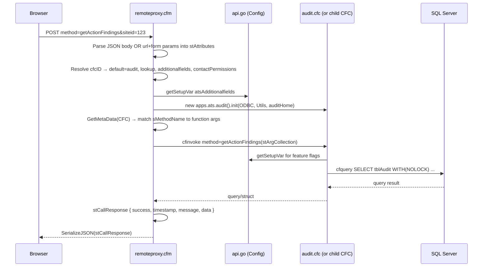
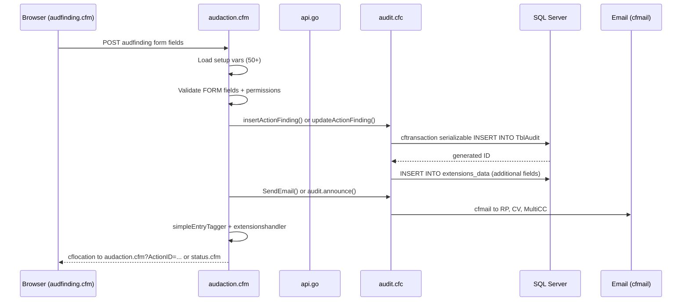
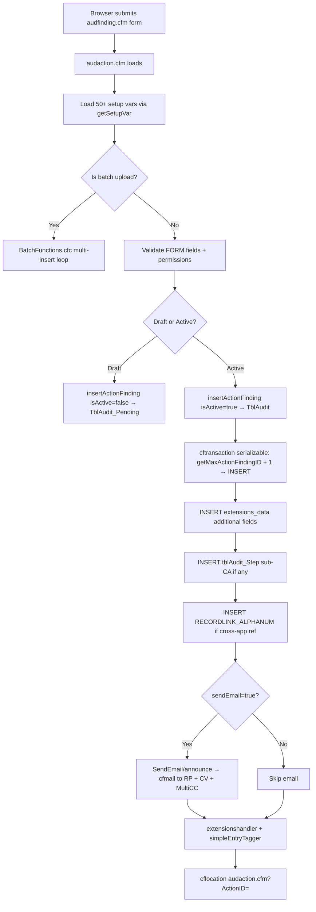
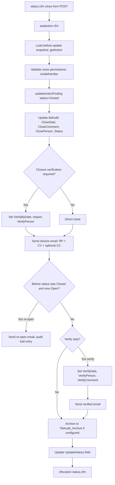
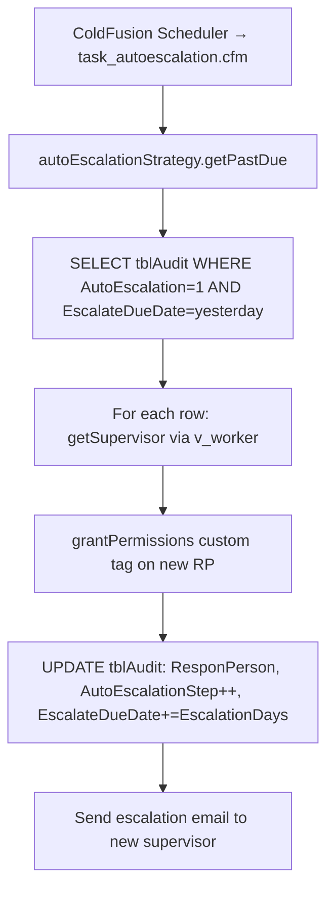
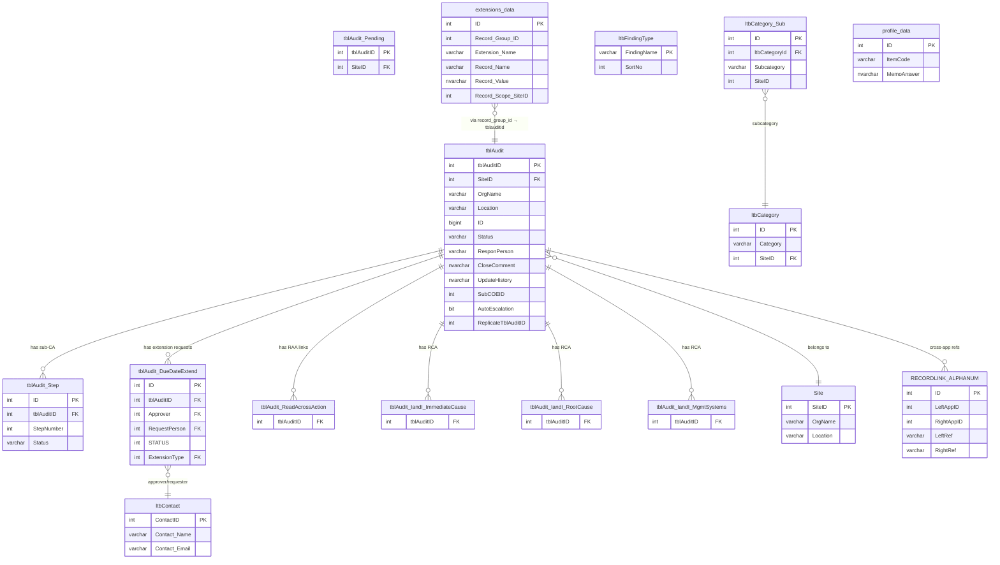
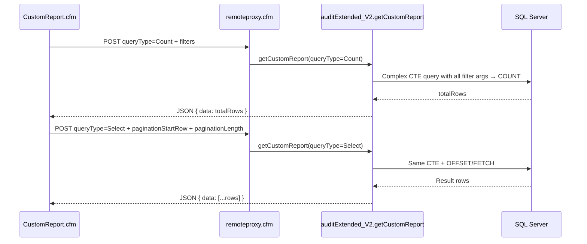
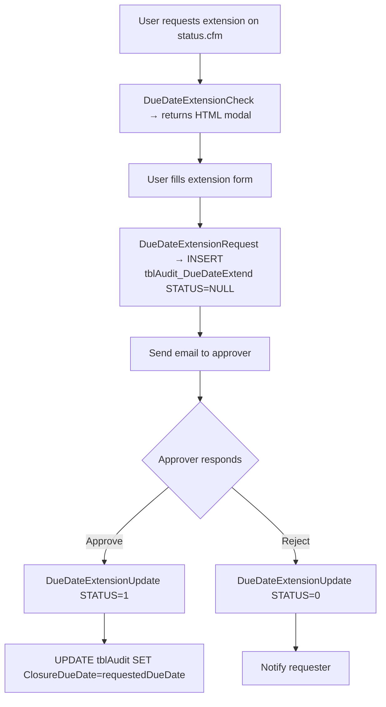

# ATS Audit — Backend Architecture Reference

> **Repository:** `cfc/apps/ats/` (library CFCs) + `audit/` (CFM pages / handlers)  
> **Generated for:** Technical requirement assessment, complexity estimation, change impact analysis, developer assignment, and delivery planning  
> **Architecture type:** ColdFusion Component (CFC) monolith — no microservices, no ORM — direct SQL via `cfquery`  
> **Database:** Microsoft SQL Server (accessed via named DSN `#this.ODBC#` / `#ODBC#`)

---

## Table of Contents

1. [Backend Project Overview](#backend-project-overview)
2. [Backend Architecture](#backend-architecture)
3. [Database Architecture](#database-architecture)
4. [API Architecture](#api-architecture)
5. [Configuration and Differentiation Architecture](#configuration-and-differentiation-architecture)
6. [Technical Assessment Support Layer](#technical-assessment-support-layer)
7. [Suggested Ownership by Developer Level](#suggested-ownership-by-developer-level)
8. [Developer Execution Guide](#developer-execution-guide)
9. [Appendices](#appendices)

---

# Backend Project Overview

## Tech Stack

| Concern | Technology |
|---------|------------|
| Language | ColdFusion (CFML) — tag + cfscript hybrid |
| Framework | Custom Gensuite "portal" framework (no ColdBox/FW1/etc.) |
| API style | Three patterns: 1) remoteproxy.cfm (custom JSON-RPC), 2) REST via `restapi.cfc`, 3) Form-POST to `audaction.cfm` |
| Data access | Direct `cfquery` — no ORM, no query builder |
| Database | Microsoft SQL Server — all reads use `WITH (NOLOCK)`, writes use transactions for inserts |
| Auth | Portal session (`request.user`, `request.permissions`); REST API uses business ID scoping |
| Background jobs | ColdFusion scheduler (`cfschedule`) — invokes `task_*.cfm` pages via HTTP |
| Email | `cfmail` + portal `emaildetails.cfm` / `SendEmail()` method in `audit.cfc` |
| Config | `api.go.getSetupVar(var, busid, siteid, appid, default)` — DB-backed key/value from portal setup system |
| Inheritance | CFC inheritance chain: `audit.cfc` extends `auditExtended.cfc`, several CFCs extend `audit.cfc` |

## Project Structure

```
cfc/apps/ats/                   Backend CFC library
├── audit.cfc                   Primary business object (~11k lines), extends auditExtended
├── auditExtended.cfc           Custom report engine v1 (~2,900 lines), remote access
├── auditExtended_V2.cfc        Custom report engine v2, same API, feature-switched
├── restapi.cfc                 REST API entry point (getfinding, insertRecord, updateRecord, getStats)
├── approvals.cfc               Multi-role approval workflow, extends audit
├── dueDateExtend.cfc           Due date extension workflow, extends audit
├── readAcrossActions.cfc       PDCA / read-across actions
├── autoEscalationStrategy.cfc  Auto-escalation scheduled job logic
├── BatchFunctions.cfc          Batch upload / Handsontable insert logic
├── atsRCA.cfc                  Root Cause Analysis
├── atslookups.cfc              Lookup helpers
├── atsgenny.cfc                Genny AI integration
├── ltv.cfc                     LTV records module
├── exceltemplate.cfc           Setup variable loader for Excel/batch
├── fieldmap.cfc                Field mapping utilities
├── dataupload_validation.cfc   Batch upload validation
├── ciadditionalfields.cfc      CI app additional fields
├── integration_dakota_ats.cfc  Dakota integration
├── integration_qirp_ats.cfc    QIRP integration
└── comments/
    ├── actionComments.cfc      In-progress notes + completion comments (extends calendar.comments)
    ├── subCorrectiveActionComments.cfc  Sub-CA comments
    └── actionCustomComments.cfc Custom comments via extensions_data

audit/                          Frontend + handler layer
├── audaction.cfm               Primary form POST handler (add/edit/close/verify)
├── remoteproxy.cfm             JSON AJAX gateway → CFC methods
├── setupvars.cfm               Setup variable bootstrap
├── task_*.cfm                  Scheduled job CFM pages (7 tasks)
└── update*.cfm                 Email notification batch pages
```

## Major Modules and Responsibilities

| Module | File(s) | Responsibility |
|--------|---------|----------------|
| Core CRUD | `audit.cfc`, `audaction.cfm` | Insert/update/delete findings, email dispatch |
| Custom Reports | `auditExtended_V2.cfc` → `auditExtended.cfc` | Paginated report queries, sub-CA reports |
| REST API | `restapi.cfc` | External partner/integration GET/POST/PUT |
| Approvals | `approvals.cfc` | Multi-role sign-off workflow via extensions_data |
| Due Date Extension | `dueDateExtend.cfc` | Extension request/approval lifecycle |
| Read-Across | `readAcrossActions.cfc` | PDCA/RAA cross-site action linking |
| Auto-Escalation | `autoEscalationStrategy.cfc`, `task_autoescalation.cfm` | Supervisor escalation on past-due findings |
| Comments | `comments/actionComments.cfc` | JSON-encoded comment history in `tblAudit.CloseComment` |
| Batch Upload | `BatchFunctions.cfc`, `batchupload.cfm` | Handsontable bulk insert |
| Scheduled Tasks | `task_pending.cfm`, `task_autoescalation.cfm`, etc. | Draft cleanup, email reminders, escalation, approvals |

## Entry Points

| Entry | Mechanism | Purpose |
|-------|-----------|---------|
| `remoteproxy.cfm` | HTTP GET/POST from browser | AJAX JSON-RPC gateway |
| `audaction.cfm` | HTTP POST form submission | Primary mutation handler |
| `restapi.cfc` methods | Portal REST framework | External API calls |
| `task_*.cfm` | ColdFusion Scheduler (HTTP) | Scheduled maintenance, email jobs |
| `update*.cfm` | Scheduler or direct HTTP | Email notification batches |

---

# Backend Architecture

## 2.1 High-level Architecture

```
┌──────────────────────────────────────────────────────────────────┐
│  Portal Application Layer (application.cfc, not in audit/)       │
│  Sets: request.user, request.permissions, request.businessID,    │
│        ODBC (DSN), AuditHome, request.library.CFC.DotPath        │
└──────────────────────────────────────┬───────────────────────────┘
                                       │
             ┌─────────────────────────┼──────────────────────────┐
             │                         │                          │
    ┌────────▼───────┐      ┌──────────▼──────────┐   ┌──────────▼────────┐
    │ remoteproxy.cfm│      │   audaction.cfm      │   │  restapi.cfc      │
    │  JSON gateway  │      │  Form POST handler   │   │  REST endpoint    │
    └────────┬───────┘      └──────────┬──────────┘   └──────────┬────────┘
             │                         │                          │
             └──────────┬──────────────┘                         │
                        ▼                                         │
    ┌───────────────────────────────────────────────────────────────────────┐
    │                    Business Logic CFC Layer                            │
    │                                                                        │
    │  audit.cfc ─extends─► auditExtended ─(delegated)─► auditExtended_V2  │
    │     │                                                                  │
    │     ├── approvals.cfc       (workflow sign-off)                        │
    │     ├── dueDateExtend.cfc   (extension request/approval)               │
    │     ├── readAcrossActions.cfc (PDCA cross-site)                        │
    │     ├── autoEscalationStrategy.cfc (scheduled escalation)              │
    │     ├── BatchFunctions.cfc  (bulk insert)                              │
    │     └── comments/actionComments.cfc (comment JSON)                     │
    └──────────────────────────────┬────────────────────────────────────────┘
                                   │
    ┌──────────────────────────────▼──────────────────────────────────┐
    │           Configuration Layer                                    │
    │  api.go.getSetupVar(var, busid, siteid, appid, default)          │
    │  Reads from portal setup tables (PowerSuiteODBC)                 │
    └──────────────────────────────┬──────────────────────────────────┘
                                   │
    ┌──────────────────────────────▼──────────────────────────────────┐
    │                    SQL Server Database                           │
    │  Primary DSN: site-specific ODBC per business unit              │
    │  Portal DSN: PowerSuiteODBC (setup_*, permissions)              │
    └─────────────────────────────────────────────────────────────────┘
```

### Layer Descriptions

| Layer | Purpose | Key Files |
|-------|---------|-----------|
| Portal bootstrap | Auth, session, DSN, permissions, `request.*` globals | Parent `application.cfc` |
| Request entry | Route HTTP to appropriate handler | `remoteproxy.cfm`, `audaction.cfm`, REST endpoint |
| CFC business logic | Queries, validation, email, workflow | `cfc/apps/ats/*` |
| Config resolution | `getSetupVar` per business/site/app | `api.go.*` portal service |
| Data access | Direct `cfquery` to SQL Server | All CFC methods |
| External integrations | CI, ET, I&I, Dakota, QIRP, ANVL | `cfc/apps/ats/integration_*`, portal custom tags |

## 2.2 Request Lifecycle

### AJAX / remoteproxy.cfm Flow



### Form POST / audaction.cfm Flow



**Error handling:** `cftry/cfcatch` in `remoteproxy.cfm` catches all CFC errors, sets `stCallResponse.success = false`, emails dev team (dev/stage) or PM team (prod). `audaction.cfm` uses `cftry/cfcatch` blocks around critical inserts; sends failure email on exception.

**Transaction handling:** `insertActionFinding` uses `<cftransaction isolation="serializable">` to serialize ID generation (`getMaxActionFindingID` + 1) and insert, preventing duplicate IDs.

## 2.3 Module and Service Architecture

### `audit.cfc` — Primary Business Object

Extends `auditExtended.cfc` (custom reports v1). `getCustomReport` and `draftsGetCustomReport` are delegation methods that swap to `auditExtended_V2.cfc` when `use_auditExtended_V2` setup var equals `"auditExtended_V2"`.

| Service Group | Key Methods | DB Tables |
|---------------|-------------|-----------|
| **Find / Read** | `getAudit`, `getAction`, `getActionFindings`, `getActionFindingsCount` | `tblAudit`, `Site`, `Org`, `extensions_data` |
| **Insert** | `insertActionFinding` | `TblAudit`, `TblAudit_Pending`, `extensions_data`, `tblAudit_Step` |
| **Update** | `updateActionFinding`, `setQuickClosureVerify`, `updateComment`, `downgradeFinding` | `tblAudit`, `extensions_data` |
| **Delete** | `deleteAction`, `deleteDraftedAction`, `deletePendingAction` | `tblAudit_Pending`, `tblAudit_Pending_Status`, `siteAttach` |
| **Drafts** | `insertDraftedAction`, `updateDraftedAction`, `getDraftedAction`, `getDraftedActionList`, `deleteDraftedAction`, `getDraftedActionForCleanup` | `tblAudit_Pending`, `tblAuditPending_Status` |
| **Sub-CA** | `insertUpdateSubCorrectiveAction`, `qGetSubCA`, `replicateSubCA` | `tblAudit_Step`, `tblAudit_Step_Pending` |
| **Category/lookup** | `getLtbCoe`, `getLtbBuilding`, `getCategorySub`, `addSubCategory`, `updateSubCategory`, `keyWordsearch` | `ltbCoe`, `ltbBuilding`, `ltbCategory`, `ltbCategory_Sub`, `ltbFindingType` |
| **Email** | `SendEmail`, `quickSendEmail`, `sendNotificationEmail`, `getPendingEmails`, `buildEmailIntro` | `tblAudit` (reads), `cfmail` |
| **RCA** | `addImmediateCause`, `addRootCause`, `addMgmtSystems`, `getMgmtSysFailDetails`, `getAllRCADetails` | `tblAudit_IandI_ImmediateCause`, `tblAudit_IandI_RootCause`, `tblAudit_IandI_MgmtSystems` |
| **Metrics** | `getActionFindingsCount`, `getOpenActionDueWithinMetrics`, `getClosureRateMetrics`, `getMetricsBySite` | `tblAudit` |
| **JSON shortcuts** | `getJsonDefaultShortcut`, `insertJsonShortcut`, `updateJsonShortcut` | `profile_data` |
| **Permissions** | `isValidVerifier`, `handleDraftedAction`, `deletionNotification` | `ltbContact`, `setup_permissions` |
| **References** | `removeATSRef`, `getReferenceLabel`, `getIMReferenceViaKey` | `tblAudit`, `RECORDLINK_ALPHANUM` |
| **History** | `addHistory`, `updateCommentAndGetItBack`, `getFormattedComment` | `tblAudit.updatehistory`, `tblAudit.CloseComment` |
| **AutoEscalation** | `updateComment`, `activateActionFinding` | `tblAudit` |

### `auditExtended.cfc` / `auditExtended_V2.cfc` — Custom Reports

Both expose the same `getCustomReport`, `draftsGetCustomReport`, `getCustomReportSubCAOnly` API. v2 is the active version for most businesses (`use_auditExtended_V2` = `"auditExtended_V2"`).

Key private helpers: `getCountSQL`, `getStandardColums`, `getSubCADefinition`, `getRAADefinition`, `limitDueDateExtensionsCriteria`, `getOutageCTE`, `processAdditionalATSFields`.

### `approvals.cfc` — Multi-Role Approval Workflow

Stores all approval state in `extensions_data` table (EAV pattern) keyed by `record_group_id`. Uses `extensions.extensions` CFC for setup. Key methods: `getPendingApprovals`, `loadApprovalsSection`, `approveRole`, `rejectRole`, `getNextApproval`.

### `dueDateExtend.cfc` — Due Date Extension

State machine: `Pending` → `Approved` / `Rejected`. Methods: `DueDateExtensionCheck` (read + HTML modal), `DueDateExtensionRequest` (INSERT into `tblAudit_DueDateExtend`), `DueDateExtensionUpdate` (UPDATE status + `tblAudit.ClosureDueDate`).

### `readAcrossActions.cfc` — PDCA/RAA

Dynamic table name: `variables.raa` (e.g. `tblAudit_ReadAcrossAction`). CRUD for cross-site action linking. Methods: `getFormHTML`, `getDMSteps`, `getSiteQryByBusiness`, `getSiteQryByOrg`, `getRepeatCycle`, `getOrgs`.

### `autoEscalationStrategy.cfc` — Scheduled Escalation

Called by `task_autoescalation.cfm`. Reads past-due actions from `tblAudit` (where `AutoEscalation=1`, `EscalateDueDate=yesterday`), finds supervisor via `v_worker`, escalates RP, sends email.

### `BatchFunctions.cfc` — Bulk Upload

Handles Handsontable batch insert. Validates data via `dataupload_validation.cfc`. Inserts into `tblAudit` in a loop. Handles read-across (`tblAudit_ReadAcrossAction`) and `extensions_data` for additional fields.

### `comments/actionComments.cfc` — Comment History

Extends `calendar.comments.comments`. Comments stored as JSON array in `tblAudit.CloseComment`. Methods: `getComment`, `addComment`, `editComment`, `deleteComment`, `getFormattedComment`.

### `restapi.cfc` — External REST API

Extends `audit.cfc`. Entry functions: `getfinding`, `insertRecord`, `updateRecord`, `getStats`. Private `validate()` enforces required fields, lookups, and permission checks. `mapArgs()` supports configurable field name aliasing via `RESTArgMap` setup var.

## 2.4 Core Business Flows

### Add Finding (Form POST path)



### Close/Verify Finding (Status POST path)



### Auto-Escalation Job



---

# Database Architecture

## 3.1 Tables / Models Inventory

> **Note:** No migration files exist. Schema is inferred from queries in CFC files and `audaction.cfm`. Column types are inferred from `cfqueryparam` `cfsqltype` values and context.

### Core Findings Table

**`tblAudit`** — Primary action/finding record (one row per finding)

| Column | Type (inferred) | Notes |
|--------|-----------------|-------|
| `OrgName` | varchar | Organization name |
| `Location` | varchar | Site location name |
| `ID` | bigint | Per-site sequential ID (PK composite with OrgName+Location) |
| `tblAuditID` | int | Surrogate identity PK |
| `AuditName` | varchar | Action/finding name and number |
| `AuditDate` | datetime | Date of finding |
| `AuditType` | varchar | Audit type (EHS, EHS Read Across, etc.) |
| `FindingType` | varchar | FK → `ltbFindingType.FindingName` |
| `Category` | varchar | Finding category |
| `Citation` | varchar(255) | Reference citation |
| `NumItems` | int | Number of items |
| `RepeatItem` | bit | Is repeat finding (0/1) |
| `ClassificationType` | varchar | Risk classification type |
| `Classification` | varchar | Closure category / severity |
| `COE` | varchar | Department/Center of Excellence |
| `Bldg` | varchar | Building |
| `Workstation` | varchar | Workstation |
| `ResponPerson` | varchar | Responsible person name |
| `CoResponPerson` | varchar | Co-responsible person |
| `Description` | nvarchar(max) | Finding description (HTML) |
| `CorrectiveAction` | nvarchar(max) | Corrective action text (HTML) |
| `ContactPerson` | varchar | Contact person name |
| `ContactPhone` | varchar | Contact phone |
| `CloseDate` | datetime | Date closed |
| `CloseComment` | nvarchar(max) | JSON-encoded comment history (see actionComments.cfc) |
| `ClosePerson` | varchar | Person who closed |
| `Status` | varchar | `'Open'` or `'Closed'` |
| `ClosureDueDate` | datetime | Due date for closure |
| `Optional_1` – `Optional_8` | nvarchar(max) | Configurable extension fields |
| `RefType` | varchar | Reference type (delimited with `\|\|`) |
| `RefID` | varchar | Reference ID (delimited with char(8)) |
| `UpdateDate` | datetime | Last update timestamp |
| `UpdateUser` | varchar | Last update user name |
| `UpdateHistory` | nvarchar(max) | Pipe-delimited audit trail string |
| `HighPriority` | bit | High priority flag |
| `VerifyPerson` | varchar | Closure verifier person |
| `VerifyDate` | datetime | Closure verification date |
| `VerifyComment` | varchar | Verification comment |
| `DaysBeforeReminder` | int | Days before email reminder |
| `VerifyByDate` | datetime | Verification due date |
| `SubCOEID` | int | FK → `ltbSubCOE` or `ltbContact_Extended` |
| `MultiCC` | varchar | Comma-separated email CC list |
| `InvestigationDetails` | nvarchar(max) | Investigation details text |
| `CAPARequired` | bit | CAPA required flag |
| `MXWasChecked` / `MXHasDouble` / `MXWasUpdated` / `MXEncode` | various | Maintenance-related fields |
| `ExternalSubmit` | bit | Submitted externally |
| `Employee` | varchar | Employee name |
| `AutoEscalation` | bit | Auto-escalation enabled |
| `EscalateDueDate` | datetime | Next escalation date |
| `AutoEscalationStep` | int | Current escalation step counter |
| `AutoEscalationDays` | int | Days between escalation steps |
| `Case_PSM` | varchar | PSM case reference |
| `ReplicateTblAuditID` | int | Original tblAuditID when replicated |
| `SiteID` | int | FK → `Site.SiteID` |

**`tblAudit_Pending`** — Draft findings (same schema as `tblAudit`, used for save-as-draft feature)

**`tblAudit_Archive`** — Archived closed findings (subset of tblAudit columns)

### Sub-Corrective Actions

**`tblAudit_Step`** — Sub-corrective actions linked to a finding

| Column | Type | Notes |
|--------|------|-------|
| `ID` | int | PK |
| `tblAuditID` | int | FK → `tblAudit.tblAuditID` |
| `StepNumber` | int | Step order |
| `Description` | nvarchar(max) | Sub-CA description |
| `Status` | varchar | Open/Closed |
| `ClosureDate` | datetime | |
| `ResponsiblePerson` | varchar | |
| `ClosureDueDate` | datetime | |

**`tblAudit_Step_Pending`** — Draft sub-CAs (parallel to `tblAudit_Step`)

**`tblAuditPending_Status`** — Status tracking rows for pending/draft lifecycle

### Extensions / Additional Fields (EAV)

**`extensions_data`** — Entity-Attribute-Value table for all configurable/extension fields

| Column | Type | Notes |
|--------|------|-------|
| `ID` | int PK | |
| `Extension_Name` | varchar | App name (e.g. `'ats'`) |
| `Record_Name` | varchar | Field/key name |
| `Record_Value` | nvarchar(max) | Field value |
| `Record_Group_ID` | int | Groups related records (e.g., all fields for one tblAuditID) |
| `Record_Scope_SiteID` | int | Site scoping |

> **Used for:** Additional ATS fields (`atsAdditionalfields` JSON schema), approval state (`Approvals_*` keys), read-across fields, QIRP/Dakota integration flags.

### Due Date Extension

**`tblAudit_DueDateExtend`**

| Column | Type | Notes |
|--------|------|-------|
| `ID` | int PK | |
| `tblAuditID` | int | FK → `tblAudit.tblAuditID` |
| `OriginalDueDate` | datetime | |
| `RequestedDueDate` | datetime | |
| `Reason` | nvarchar | Extension reason |
| `Approver` | int | FK → `ltbContact.ContactID` |
| `STATUS` | int | `NULL`=Pending, `1`=Approved, `0`=Rejected |
| `RequestDate` | datetime | |
| `RequestPerson` | int | FK → `ltbContact.ContactID` |
| `Comment` | nvarchar | Approver comment |
| `ExtensionType` | int | FK → `tblAudit_ExtendType.ID` |

**`tblAudit_ExtendType`** — Lookup for extension request types

### Read-Across / PDCA

**`tblAudit_ReadAcrossAction`** — Cross-site action links

| Column | Notes |
|--------|-------|
| `tblAuditID` | FK → `tblAudit.tblAuditID` |
| `gsConEvent`, `origin_site`, `ra_business` | RAA-specific fields |
| Various | Configured via `readAcrossActions.cfc` dynamic table |

**`tblAudit_ReadAcrossActionType`** — Lookup for RAA action types

### Root Cause Analysis (RCA)

**`tblAudit_IandI_ImmediateCause`**, **`tblAudit_IandI_RootCause`**, **`tblAudit_IandI_MgmtSystems`**

Each keyed by `tblAuditID`, stores I&I RCA fields. Upsert pattern: UPDATE first, if rowcount=0 then INSERT.

**`tblAudit_RCA`** — Legacy RCA table (still queried by `atsRCA.cfc`)

### Lookup / Reference Tables

| Table | Purpose |
|-------|---------|
| `ltbFindingType` | Finding type values + sort order (used by `downgradeFinding`) |
| `ltbCategory` | Finding categories |
| `ltbCategory_Sub` | Subcategories (managed by `addSubCategory`, `updateSubCategory`) |
| `ltbCoe` | Department/COE list |
| `ltbBuilding` | Building list |
| `ltbContact` | Contact directory (name, email, contactID) |
| `ltbRoles` | Role definitions (used by auto-escalation) |
| `RoleAssign` | Role assignments (RP escalation target) |

### Site / Org Structure

| Table | Purpose |
|-------|---------|
| `Site` | Site records with `SiteID`, `OrgName`, `Location` |
| `Org` | Organization records; `[table]` column for DSN-link |
| `v_worker` | HR worker view (used by auto-escalation for supervisor lookup) |

### Cross-App Integration

| Table | Purpose |
|-------|---------|
| `RECORDLINK_ALPHANUM` | Cross-app reference links (`LeftAppID`, `RightAppID`, `LeftRef`, `RightRef`) |
| `profile_data` | User preferences; stores JSON default shortcuts (`ATS_DATASHORTCUT_DEFAULT`) |
| `TblAudit_Archive` | Archived finding rows |

### Portal / Admin Tables (PowerSuiteODBC DSN)

| Table | Purpose |
|-------|---------|
| `setup_company` | Company records |
| `setup_business` | Business unit records (businessID, virtualpath) |

## 3.2 Relationships



## 3.3 Data Lifecycle

### Record Creation

1. **Active finding:** `INSERT INTO TblAudit` via `insertActionFinding()` in `cftransaction serializable`
2. **Draft finding:** `INSERT INTO TblAudit_Pending` + `tblAuditPending_Status`
3. **Sub-CA:** `INSERT INTO tblAudit_Step` (or `tblAudit_Step_Pending`)
4. **Additional fields:** `INSERT INTO extensions_data` after main insert
5. **Approval entries:** `INSERT INTO extensions_data` keyed `Approvals_*`

### Record Update

- Updates go through `updateActionFinding()` — which reads before-state, updates `tblAudit`, then reads after-state
- Status transitions (`Open → Closed`, `Closed → Open`) trigger email paths
- `UpdateHistory` field: pipe-delimited string appended on every change (`date,time|user|action`)
- `CloseComment` field: JSON array maintained by `actionComments.cfc`

### Soft Deletes

- **Drafts:** Deleted from `tblAudit_Pending` + `tblAuditPending_Status` + `siteAttach` by `deleteDraftedAction()`
- **Active findings:** `deleteAction()` sets a deleted flag or removes record (confirm in `deleteAction` method); `deletionNotification()` sends email
- **Archive:** `INSERT INTO TblAudit_Archive` from `audaction.cfm` when configured

### Audit / History Tracking

- `tblAudit.UpdateHistory`: string field, format `mm/dd/yyyy,hh:mm:ss tt|user|action|...` — never truncated, only appended
- `tblAudit.CloseComment`: JSON array (handled by `actionComments.cfc`) storing timestamped comments
- Downgrade: `addHistory()` method appends downgrade event to `UpdateHistory`
- Replication: `ReplicateTblAuditID` links replicated findings to originals

### Tenant / Client Scoping

- All `tblAudit` queries scope by `OrgName` + `Location` (site identity) OR `SiteID`
- `extensions_data` scoped by `Record_Scope_SiteID` where applicable
- Setup vars loaded with `busid=request.businessID` for client-specific behavior
- Per-client additional fields in `extensions_data` via `atsAdditionalfields` JSON schema

---

# API Architecture

## 4.1 API Structure

The ATS backend exposes three distinct API surfaces:

| Surface | Entry | Protocol | Auth | Response |
|---------|-------|----------|------|----------|
| **remoteproxy.cfm** | `POST /audit/remoteproxy.cfm?method=X` | HTTP POST + JSON body | Portal session cookie | `SerializeJSON({ success, timestamp, message, data })` |
| **audaction.cfm** | `POST /audit/audaction.cfm` | HTML form POST | Portal session | `cflocation` redirect (HTML response) |
| **restapi.cfc** | Via portal REST routing | REST (JSON) | Business ID–based API key/setup | `{ responsecode, data }` struct |

### remoteproxy.cfm — Routing Logic

```
url.method (or form.method) → sMethodName
url.component (or form.component) → componentToCreate

cfcID routing:
  "default"            → apps/ats/{component}  (default: "audit")
  "contactPermissions" → apps/contacts/permissions
  "lookup"             → lookup/{component}
  "additionalfields"   → AdditionalFields

GetMetaData(CFC) → find method → match args from stAttributes
cfinvoke component method → return → SerializeJSON
```

### Response Envelope (remoteproxy)

```json
{
  "success": true,
  "timestamp": "2026-06-17 10:00:00",
  "message": "",
  "data": "..." 
}
```

`data` is: a query converted to struct, an array, a plain string, or a boolean — depends on the method's returntype.

### Response Code Format (REST API)

`3.{success}.{uniqueNumber}` — e.g.:
- `3.1.1` = inserted successfully
- `3.1.2` = updated successfully
- `3.1.3` = success (read)
- `3.0.X` = error codes (3.0.3=invalid ID, 3.0.4=generated ID invalid, 3.0.8=siteid required, 3.0.48=no valid params, etc.)

### Validation Pattern (REST API)

`restapi.cfc.validate()` — invoked by `insertRecord` and `updateRecord`:
- Looks up `ltbClosure`, `ltbFindingType`, contact records, site data
- Checks `ats_API_allowAnyClosePerson`, `allowAddAtArchivedSite` setup vars
- Returns `{ insert: boolean, dataSet: struct, responsecode: string }`

## 4.2 Endpoint Inventory

### remoteproxy.cfm Endpoints (component=audit or default)

| Method | HTTP | CFC Method | DB Tables | Description |
|--------|------|------------|-----------|-------------|
| `getActionFindings` | POST | `audit.getActionFindings` | `tblAudit`, `Site`, `extensions_data` | Homepage grid data (paginated) |
| `getActionFindingsCount` | POST | `audit.getActionFindingsCount` | `tblAudit` | Count for header metrics |
| `keyWordsearch` | GET | `audit.keyWordsearch` | `tblAudit` | Autocomplete keyword search |
| `setQuickClosureVerify` | POST | `audit.setQuickClosureVerify` | `tblAudit` | Inline verify closure |
| `getActionStatus` | GET | `audit.getActionStatus` | `tblAudit` | Current status check |
| `downgradeFinding` | GET/POST | `audit.downgradeFinding` | `tblAudit`, `ltbFindingType` | Downgrade finding type |
| `getDraftedActionList` | GET | `audit.getDraftedActionList` | `tblAudit_Pending` | User's draft list |
| `deleteDraftedAction` | POST | `audit.deleteDraftedAction` | `tblAudit_Pending`, `tblAuditPending_Status`, `siteAttach` | Delete draft |
| `getJsonDefaultShortcut` | POST | `audit.getJsonDefaultShortcut` | `profile_data` | Load default action shortcut |
| `saveDraft` | POST | `audit.insertDraftedAction` or `updateDraftedAction` | `tblAudit_Pending` | Save as draft |
| `getCustomReport` | POST | `auditExtended_V2.getCustomReport` | `tblAudit`, `extensions_data`, many joins | Custom report data |
| `getCustomReportSubCAOnly` | POST | `auditExtended_V2.getCustomReportSubCAOnly` | `tblAudit`, `tblAudit_Step` | Sub-CA only report |
| `getCategorySub` | POST | `audit.getCategorySub` | `ltbCategory_Sub` | Subcategory dropdown |
| `getSubCorrectiveActions` | POST | `audit.getSubcorrectiveactions` | `tblAudit_Step` | Sub-CA modal data |
| `draftsGetCustomReport` | POST | `auditExtended_V2.draftsGetCustomReport` | `tblAudit_Pending` | Draft custom report |
| `getFormattedComment` | POST | `audit.getFormattedComment` | `tblAudit.CloseComment` | WIP comment HTML |
| `updateCommentAndGetItBack` | POST | `audit.updateCommentAndGetItBack` | `tblAudit.CloseComment` | Save WIP comment |
| `getIBATRequirementData` | GET | `audit.getIBATRequirementData` | `extensions_data` | IBAT custom field data |
| `emailVerifier` | POST | `audit.emailVerifier` | — | Email verifier on downgrade |
| `checkSubCategoryExists` | POST | `audit.checkSubCategoryExists` | `ltbCategory_Sub` | Check sub-cat uniqueness |
| `addSubCategory` | POST | `audit.addSubCategory` | `ltbCategory_Sub` | Add new sub-category |
| `updateSubCategory` | POST | `audit.updateSubCategory` | `ltbCategory_Sub`, `tblAudit` | Update sub-category |
| `getLTVRecords` | POST | `audit.getLTVRecords` | `tblAudit`, `extensions_data` | LTV datatable |
| `lookupCaseRecordable` | POST | `audit.lookupCaseRecordable` | `extensions_data` | I&I recordable lookup |
| `getSupervisorCounts` | POST | `audit.getSupervisorCounts` | `tblAudit` | Supervisor report counts |

### remoteproxy.cfm — Other cfcID Targets

| cfcID | Component Path | Methods Used |
|-------|----------------|-------------|
| `lookup` | `lookup/audit` | `getLtbContacstByRight`, `getOrgSite` |
| `contactPermissions` | `apps/contacts/permissions` | `hasLevel`, `setScope` |
| `additionalfields` | `AdditionalFields` | Additional field data options |
| `approvals` | `apps/ats/approvals` | `loadApprovalsSection`, `approveRole`, `rejectRole`, `getNextApproval` |
| `dueDateExtend` | `apps/ats/dueDateExtend` | `DueDateExtensionCheck`, `DueDateExtensionRequest`, `DueDateExtensionUpdate` |
| `readAcrossActions` | `apps/ats/readAcrossActions` | `getFormHTML`, `getDMSteps`, `getSiteQryByBusiness`, `getSiteQryByOrg` |
| `Chart` | `apps/ats/Chart` (assumed) | `getChartData` |

### audaction.cfm Mutation Surface (Form POST)

| FORM.ACTION / flow | DB Operation | Email Triggered |
|--------------------|-------------|----------------|
| `frmSub=1` + new finding | `insertActionFinding → INSERT tblAudit` | Add finding email (RP + CV + CC) |
| `frmSub=1` + edit finding | `updateActionFinding → UPDATE tblAudit` | Edit email (RP, conditional) |
| Status=Closed | `updateActionFinding` + close logic | Closure email + CV reminder |
| Status=Open (re-open) | `updateActionFinding` status change | Re-open email |
| `action=UpdateVerifyBy` | `UPDATE tblAudit SET VerifyByDate` | CV notification |
| `action=ExportCI` | CI integration export | CI system notification |
| Verify/Reject (status.cfm POST) | `UPDATE tblAudit SET VerifyDate, VerifyPerson` | Verified email |
| Batch upload | `BatchFunctions.cfc` loop inserts | Batch email summary |

### REST API Endpoints

| Method | Function | Description |
|--------|----------|-------------|
| GET-equivalent | `restapi.getfinding(id, siteid)` | Get single finding by ID |
| GET-equivalent | `restapi.getfinding(auditStartDate, auditEndDate)` | Get findings in date range |
| GET-equivalent | `restapi.getfinding(updateStartDate, updateEndDate)` | Get updated findings in range |
| POST-equivalent | `restapi.insertRecord(...)` | Create new finding |
| PUT-equivalent | `restapi.updateRecord(id, ...)` | Update existing finding |
| GET-equivalent | `restapi.getStats(siteid, items)` | Get site statistics |

Field list for REST API read is configurable via `ats_API_fieldsToSelect` setup var.

## 4.3 Endpoint-to-Service Mapping

| Endpoint | Handler | CFC Method | DB Tables | Notes |
|----------|---------|------------|-----------|-------|
| `remoteproxy.cfm?method=getActionFindings` | `remoteproxy.cfm` | `audit.getActionFindings` | `tblAudit`, `Site`, `extensions_data`, `ltbContact` | Paginated, multi-filter |
| `remoteproxy.cfm?method=getCustomReport` | `remoteproxy.cfm` | `auditExtended_V2.getCustomReport` | `tblAudit`, `extensions_data`, `tblAudit_DueDateExtend`, `tblAudit_ReadAcrossAction` | Feature-switched to v2 |
| `remoteproxy.cfm?component=dueDateExtend&method=DueDateExtensionRequest` | `remoteproxy.cfm` | `dueDateExtend.DueDateExtensionRequest` | `tblAudit_DueDateExtend` | Creates extension record |
| `remoteproxy.cfm?component=approvals&method=approveRole` | `remoteproxy.cfm` | `approvals.approveRole` | `extensions_data` | Updates approval status |
| `remoteproxy.cfm?component=readAcrossActions&method=getFormHTML` | `remoteproxy.cfm` | `readAcrossActions.getFormHTML` | `tblAudit_ReadAcrossAction` | Returns HTML fragment |
| `audaction.cfm` (add) | `audaction.cfm` | `audit.insertActionFinding` | `TblAudit`, `extensions_data`, `tblAudit_Step` | Full save cycle |
| `audaction.cfm` (update) | `audaction.cfm` | `audit.updateActionFinding` | `tblAudit`, `extensions_data` | Status transitions |
| REST `insertRecord` | `restapi.cfc` | `audit.insertActionFinding` | `TblAudit` | API insert |
| REST `updateRecord` | `restapi.cfc` | `audit.updateActionFinding` | `tblAudit` | API update |

## 4.4 Request Flow Diagrams

### Custom Report with Pagination



### Due Date Extension Request/Approval



---

# Configuration and Differentiation Architecture

## 5.1 Configuration Sources

| Source | Mechanism | Scope | Controls |
|--------|-----------|-------|----------|
| **Setup variables (primary)** | `api.go.getSetupVar(var, busid, siteid, appid, default)` | Per business unit, per site, per app | Feature flags, field behavior, labels, workflow toggles |
| **`atsAdditionalfields` JSON** | Setup var value (JSON string) | Per business | Additional field schema: type, label, visibility, validation, options |
| **`RESTArgMap` JSON** | Setup var | Per business | REST API field name aliasing |
| **`jsFiles_ats` string** | Setup var | Per business + per page | Which custom JS files load per page |
| **`ats_API_fieldsToSelect`** | Setup var | Per business | REST API response fields |
| **Extensions data (DB)** | `extensions_data` table (EAV) | Per site / per tblAuditID | Approval steps config, approval state, additional field values |
| **Hardcoded logic** | CFC conditionals | N/A | Legacy, rare — mostly commented out |
| **Environment** | `server.api.go.getEnvironment()` | Server-wide | Email routing, error detail level |
| **Portal permissions** | `request.permissions.accessRights`, `request.permissions.accessLevel` | Per user + site | Feature visibility, write access |

## 5.2 Field Logic

### Field Types Handled by Backend

| Mechanism | Backend Handling |
|-----------|-----------------|
| Standard `tblAudit` columns | Direct INSERT/UPDATE in `insertActionFinding` / `updateActionFinding` |
| `Optional_1` to `Optional_8` | Generic columns on `tblAudit`, mapped to client-named fields |
| `atsAdditionalfields` JSON fields | Read from `extensions_data` via `record_group_id`; written back to `extensions_data` after main insert |
| Extension fields | Written/read via portal `extensions.cfc` and `extensions_data` table |
| Sub-corrective actions | Separate `tblAudit_Step` table; `insertUpdateSubCorrectiveAction` method |

### Field Validation (Server-side)

- `audaction.cfm`: Required fields checked via `cfparam` + conditional `cfif` blocks
- `restapi.cfc.validate()`: Explicit checks (contact exists, finding type in lookup table, date valid, etc.)
- `insertActionFinding`: Validates COE, Building, Workstation against lookup tables; resets to empty if invalid
- `dataupload_validation.cfc`: Batch upload field validation per row

### Dynamic / Config-Driven Fields

- `atsAdditionalfields` setup var (JSON): defines additional field names, types, labels, options, visibility rules
- `ats_insertActionDefaultValues` setup var (array): default values applied when a field is empty on insert
- `ats_API_fieldsToSelect` setup var: controls which columns the REST API returns
- `Optional_1–8` columns used differently per client (labeled via setup vars)

## 5.3 Workflow Logic

### Finding Status Machine

```
States:  Open  ←→  Closed  (→ Verified state via VerifyDate/VerifyPerson)
         Open  →   Draft (tblAudit_Pending when isSaveAsDraftEnabled)

Transitions:
  Open → Closed:      audaction.cfm sets Status=Closed, CloseDate, ClosePerson
  Closed → Open:      Re-open via audaction.cfm; sends re-open email
  Open → Closed (CV): When RequireClosureVerification=true, requires VerifyPerson
  Closed → Verified:  VerifyPerson sets VerifyDate, VerifyComment
  Open → Escalated:   Scheduler escalates ResponPerson via autoEscalationStrategy
  Open → Due Date Extended: DueDateExtensionRequest/Update flow
  Draft → Active:     preserveDraftedAction() moves tblAudit_Pending → tblAudit
```

### Approval Workflow (Multi-Role)

- Config: stored in `extensions_data` keys `ATS_APPROVALS_SETUP`, `Role`, `roleid`, `SortNo`, `ContactDefault`
- State: per-tblAuditID `extensions_data` rows: `Approvals_{role}_signoff`, `Approvals_{role}_status`
- Trigger: `ats_isMultipleApprovalsActive` setup var
- Logic: `approvals.cfc.getPendingApprovals()` uses CTE to count approvals needed vs granted

### Auto-Escalation Workflow

- Config: `autoEscalation_enable`, `AutoEscalation_EscalationDays`, `autoEscalation_StopNum`
- State: `tblAudit.AutoEscalation` (bit), `tblAudit.AutoEscalationStep`, `tblAudit.EscalateDueDate`
- Trigger: scheduled `task_autoescalation.cfm` daily

### Sub-Corrective Action Workflow

- Sub-CAs in `tblAudit_Step`; each has own `Status`, `ClosureDueDate`, `ResponsiblePerson`
- Managed by `insertUpdateSubCorrectiveAction()` in `audit.cfc`

## 5.4 Client / Tenant Differentiation

### Tenant Identity Resolution

```
request.businessID         (numeric, from portal session)
request.companyID          (parent company)
request.user.AccessName    (current user)
request.permissions        (access rights list, access level)
request.siteData           (org, location, siteid from URL params)
```

### What Differs Per Client (Backend)

| Dimension | Mechanism | Files |
|-----------|-----------|-------|
| Feature flags | `getSetupVar(var, busid=request.businessID)` | `audit.cfc`, `audaction.cfm`, `remoteproxy.cfm` |
| Additional fields | `atsAdditionalfields` JSON setup var | `audit.cfc.getAudit()`, `insertActionFinding()`, `remoteproxy.cfm` |
| Validation rules | `ats_API_allowAnyClosePerson`, `checkPermissions_onCFCInsert` | `restapi.cfc.validate()`, `insertActionFinding()` |
| Email behavior | `includeSubmitterOnActionEmails`, `ATSCOEMGRCC`, `emailLangIndex` | `audit.cfc.SendEmail()`, `audaction.cfm` |
| REST field selection | `ats_API_fieldsToSelect` | `restapi.cfc.getfinding()` |
| REST field mapping | `RESTArgMap` | `restapi.cfc.mapArgs()` |
| Insert defaults | `ats_insertActionDefaultValues` | `audit.cfc.insertActionFinding()` |
| Report engine | `use_auditExtended_V2` | `audit.cfc.getCustomReport()` delegation |
| Closure due date | `ltbClosure` table values per site | `getClosureDueDate()` |
| Permission checks on insert | `checkPermissions_onCFCInsert` | `insertActionFinding()` |

### Approval Config Per Client/Site

Approval steps stored in `extensions_data` with `record_scope_siteid` — same record schema reused across sites. `ATS_APPROVALS_SETUP=true` rows define roles and approvers.

## 5.5 Configuration Resolution Flow

```mermaid
flowchart TD
    A[Incoming request to CFC] --> B[Portal sets request.businessID, permissions]
    B --> C[CFC init: this.businessID = request.businessID]
    C --> D[api.go.getSetupVar for each feature flag]
    D --> E{atsAdditionalfields JSON?}
    E -->|Yes| F[Deserialize → additionalATSFields struct]
    E -->|No| G[Standard fields only]
    F --> H[Additional field names added to SQL SELECT / INSERT]
    D --> I{insertViaCFC_enable=true?}
    I -->|Yes| J[Allow programmatic CFC insert]
    I -->|No| K[Block non-HTTP insert path]
    D --> L{checkPermissions_onCFCInsert?}
    L -->|Yes| M[contacts.permissions.hasLevel check]
    M --> N{HasLevel(1)?}
    N -->|No| O[Block insert: userCanInsert=false]
    N -->|Yes| P[Proceed with INSERT]
    L -->|No| P
    P --> Q[tblAudit INSERT with all resolved field values]
```

## 5.6 Risks and Inconsistencies

| Issue | Evidence | Impact |
|-------|----------|--------|
| **Mega CFC / mega handler** | `audit.cfc` ~11k lines; `audaction.cfm` ~7.6k lines | Merge conflicts, hard to reason about change blast radius |
| **`updateHistory` string field** | Pipe-delimited string, never truncated — grows unbounded | Risk of DB column overflow for long-lived records; no standard parsing |
| **ID generation without IDENTITY** | `getMaxActionFindingID() + 1` in `cftransaction serializable` | Fragile; concurrent inserts on same org/location need the transaction; any lock failure loses the ID slot |
| **EAV (`extensions_data`) for approval state** | Approval steps, state, signoff all in EAV rows — no typed schema | Query complexity, hard to index, pivot queries for reporting |
| **Duplicate due-date logic** | `dueDateExtend.cfc` + 15+ `custom_all.js` client copies | Backend is canonical but frontend patches override; desync risk |
| **`Optional_1–8` columns** | Generic columns mapped differently per client | No self-documenting schema; requires setup var knowledge to understand data |
| **Mixed remote/public access** | Some methods `access="remote"` (skip remoteproxy auth), some `access="public"` | Inconsistent access control surface |
| **`getCustomReport` feature switch** | `use_auditExtended_V2` setup var swaps report engine | Two codebases for same feature; maintaining both diverges |
| **`restapi.cfc` date parsing** | Custom `parseDate()` / `isValidDateStrict()` for non-standard date formats | Complex edge cases; custom validation instead of standard ColdFusion date functions |
| **Hardcoded email addresses** | `this.DebugEmail = "anthony.cox@...,rahul.jha@..."` in `audit.cfc` init | Should be config-driven; breaks if personnel changes |
| **No formal migration system** | Schema changes require manual SQL scripts; no version tracking visible | DDL drift risk across environments |

---

# Technical Assessment Support Layer

## 6.1 Change Surface Map

| Area | Primary Files | Secondary Files | DB Impact | API Impact | Risk |
|------|---------------|-----------------|-----------|------------|------|
| Add/Edit finding core | `audit.cfc` (insertActionFinding, updateActionFinding) | `audaction.cfm`, `tblAudit` | `TblAudit` INSERT/UPDATE | remoteproxy + REST | Very High — transaction + email + extensions |
| Custom report query | `auditExtended_V2.cfc.getCustomReport` | `auditExtended.cfc` (v1 fallback) | `tblAudit`, many joins | remoteproxy | High — complex CTE, feature-switched |
| Due date extension | `dueDateExtend.cfc` | `tblAudit_DueDateExtend` | `tblAudit_DueDateExtend`, `tblAudit` | remoteproxy | High — state machine |
| Approval workflow | `approvals.cfc` | `extensions_data` | `extensions_data` (EAV) | remoteproxy | High — EAV complexity |
| Auto-escalation | `autoEscalationStrategy.cfc`, `task_autoescalation.cfm` | `tblAudit`, `v_worker`, `RoleAssign` | `tblAudit` UPDATE | scheduler | Medium |
| Additional fields | `audit.cfc.insertActionFinding`, `remoteproxy.cfm`, `atsAdditionalfields` setup | `extensions_data` | `extensions_data` | remoteproxy + REST | High — schema change ripples |
| REST API insert | `restapi.cfc.insertRecord`, `validate` | `audit.cfc.insertActionFinding` | `TblAudit` | REST endpoint | Medium — isolated layer |
| Sub-CA | `audit.cfc.insertUpdateSubCorrectiveAction` | `tblAudit_Step`, `audaction.cfm` | `tblAudit_Step` | remoteproxy | Medium |
| RCA | `audit.cfc` (addImmediateCause etc.), `atsRCA.cfc` | `tblAudit_IandI_*` | RCA tables | audaction (form) | Medium |
| Email logic | `audit.cfc.SendEmail`, `quickSendEmail` | `audaction.cfm` email blocks | Read `tblAudit` | side-effect | Medium — cfmail templates |
| Scheduled tasks | `task_*.cfm`, `update*.cfm` | CFC methods they invoke | Varies per task | scheduler | Low–Medium per task |
| Lookup tables | `audit.cfc.getCategorySub`, `addSubCategory` | `ltbCategory_Sub`, `ltbCategory` | Lookup tables | remoteproxy | Low |
| Comments | `comments/actionComments.cfc` | `tblAudit.CloseComment` | `tblAudit` (JSON column) | remoteproxy | Low–Medium |
| remoteproxy gateway | `remoteproxy.cfm` | All CFC methods | — | All AJAX | Very High — blast radius |

## 6.2 Complexity Signals

| Module | Module Coupling | Workflow Branching | Client Overrides | DB Complexity | Transaction | Overall |
|--------|----------------|-------------------|------------------|---------------|-------------|---------|
| `insertActionFinding` | Very High | High (draft/active/API) | High (50+ setup vars) | Medium | **Yes (serializable)** | **Very High** |
| `updateActionFinding` | Very High | Very High (status transitions) | High | Medium | No | **Very High** |
| `audaction.cfm` | Very High | Very High (add/close/verify/re-open) | High | High | No | **Very High** |
| `getCustomReport` (v2) | High | High (filter params) | Medium | Very High (CTE) | No | **Very High** |
| `approvals.cfc` | High | Medium | Medium | High (EAV pivot) | No | **High** |
| `dueDateExtend.cfc` | Medium | Medium | High (15+ client dupes) | Medium | No | **High** |
| `restapi.cfc` | Medium | Medium | High (`atsAdditionalfields`) | Low | No | **High** |
| `autoEscalationStrategy` | Low | Low | Low | Low | No | **Low** |
| `BatchFunctions.cfc` | Medium | Medium | Low | Medium | No | **Medium** |
| `actionComments.cfc` | Low | Low | Low | Low | No | **Low** |
| `remoteproxy.cfm` | Very High | Low | Low | — | No | **High** (gateway) |
| Lookup methods | Low | Low | Low | Low | No | **Low** |

## 6.3 Change Risk Indicators

| Risk Factor | Location | Why Risky |
|-------------|----------|-----------|
| Serializable transaction in insert | `audit.cfc.insertActionFinding` | Database-level lock; any schema change to `tblAudit` affects lock behavior |
| `UpdateHistory` string format | `tblAudit.updateHistory`, `addHistory()` | Any parsing code breaks if format changes |
| `CloseComment` JSON format | `actionComments.cfc` | Changing JSON schema breaks existing records |
| EAV `extensions_data` for approvals | `approvals.cfc` | Pivot queries; adding approval roles changes `record_name` key names |
| `remoteproxy.cfm` argument injection loop | Lines ~184–191 | Adding atsAdditionalfields fields auto-injects into any CFC method; naming collisions possible |
| Feature switch `use_auditExtended_V2` | `audit.cfc.getCustomReport` | v1 and v2 must stay in sync; silent switch |
| ID generation sequence | `getMaxActionFindingID() + 1` | Not using IDENTITY column; race condition if transaction isolation fails |
| Setup var proliferation | 50+ setup vars in `audaction.cfm` | Adding a new setup var requires touching multiple CFM pages that independently read it |
| Email side effects in update | `audit.cfc.SendEmail`, `audaction.cfm` | Updating a finding always risks triggering emails; wrong conditions = spam |

## 6.4 Requirement Assessment Guidance

| Dimension | Question | Low Risk | High Risk |
|-----------|----------|----------|-----------|
| DB vs API vs config | Where does the change live? | New setup var + `cfif` on one page | New `tblAudit` column or new table |
| Single module vs cross-module | How many CFCs touched? | One method in `audit.cfc` | `insertActionFinding` + `remoteproxy.cfm` + `audaction.cfm` + `restapi.cfc` |
| Backward compatibility | Does schema change affect existing records? | No schema change | `tblAudit` column ADD with default |
| Data migration | Existing records need updating? | None | Mass UPDATE across all `tblAudit` rows |
| Email side effects | Does the change touch `SendEmail` paths? | No | Yes — regression-test all email triggers |
| Client override impact | Does the change change method signatures? | No | Yes — 15+ `custom_all.js` duplicates affected |
| Approval/EAV impact | Does the change add approval steps or extension fields? | No | Yes — `extensions_data` schema + pivot queries |

**Decision shortcuts:**
- Label/visibility toggle → `getSetupVar` new var + one `cfif` → **Low complexity**
- New field on `tblAudit` → schema + `insertActionFinding` + `updateActionFinding` + `getAudit` + CSV export + REST API → **Very High**
- New additional field (JSON-schema) → `atsAdditionalfields` setup var JSON update only → **Low–Medium**
- New REST endpoint → `restapi.cfc` new method + `validate()` extension → **Medium**
- New workflow state transition → `audaction.cfm` + `audit.cfc.updateActionFinding` + email block → **High**
- New approval role → `extensions_data` config row + `approvals.cfc` → **Medium**

---

# Suggested Ownership by Developer Level

## 7.1 Ownership Model

### Associate Developer
- Simple config changes (new setup var + one `cfif`)
- Read-only query additions on stable methods
- New lookup table entry / subcategory management
- Email template text changes
- Isolated bug fixes in `comments/actionComments.cfc` or `atslookups.cfc`

### Developer / Mid-level Developer
- New `remoteproxy.cfm` endpoint wiring an existing CFC method
- `atsAdditionalfields` JSON schema additions (new optional field)
- Standard feature additions in `restapi.cfc` (new parameter on `getfinding`)
- Scheduled task modifications (`task_*.cfm` + matching CFC method)
- `ltbCategory_Sub` admin changes
- Client-specific `custom.js` or `cfm/custom/busid_*` overrides

### Senior Developer
- Changes to `insertActionFinding` or `updateActionFinding`
- Status transition logic in `audaction.cfm`
- `dueDateExtend.cfc` state machine changes
- New `tblAudit` column additions (schema + all CFC read/write paths)
- `restapi.cfc.validate()` logic changes
- `approvals.cfc` workflow changes
- `autoEscalationStrategy.cfc` changes
- Email trigger changes in `audit.cfc.SendEmail`
- `BatchFunctions.cfc` insert logic changes

### Lead Developer
- `remoteproxy.cfm` gateway changes (routing, arg injection)
- `auditExtended_V2.cfc` custom report CTE changes
- Feature switch migration (`use_auditExtended_V2`)
- `audit.cfc` structural refactoring (method decomposition)
- New table design decisions (EAV vs dedicated table)
- Cross-app integration changes (CI, ET, I&I, Dakota)
- REST API contract changes (response structure)

### Director / Architect Oversight
- `tblAudit` major restructuring (removing generic `Optional_*` columns)
- Multi-tenant DSN architecture changes
- ID generation strategy replacement (IDENTITY column migration)
- Migrating `UpdateHistory` to structured audit table
- Decommissioning `auditExtended.cfc` (v1 report engine)
- Platform-wide permission model changes

## 7.2 Codebase-Specific Ownership Recommendations

| Area / Change Type | Recommended Owner | Why | Escalate When |
|--------------------|-------------------|-----|---------------|
| New setup var + cfif | Associate → Mid | Established pattern, low impact | Same var needed in 5+ files |
| `atsAdditionalfields` JSON field add | Mid | JSON-driven, no schema change | Field needs `tblAudit` column or custom SQL |
| REST API `getfinding` param | Mid → Senior | `validate()` coupling | New lookup required or schema change |
| `insertActionFinding` change | Senior | Transaction + email + extensions impact | Schema change on `tblAudit` |
| `audaction.cfm` status logic | Senior | Complex branching, email risk | Approval or escalation also affected |
| `auditExtended_V2.getCustomReport` | Senior → Lead | CTE complexity, report output | Output format changes or new join table |
| `remoteproxy.cfm` routing | Lead | Gateway, affects all AJAX | New cfcID type or auth change |
| New `tblAudit` column | Senior → Lead | Schema + all read/write paths | Data migration or index change needed |
| Approval workflow config | Senior | EAV pivot dependency | Approval chain structure change |
| Due date extension state machine | Senior | State machine + client overrides | New state or email path |
| Scheduled tasks | Mid → Senior | Simple structure; email side effects | Multi-business or DSN change |
| REST API contract | Lead | External consumers | Breaking change |
| ID generation | Lead + Architect | Serializable transaction risk | Migration from manual to IDENTITY |

## 7.3 Speed vs Quality Assignment Guidance

| Work Type | Parallelizable? | Guidance |
|-----------|-----------------|----------|
| Setup var additions per page | Yes | Mid devs in parallel per page; Senior reviews global vars |
| `atsAdditionalfields` additions | Yes | Mid dev; Senior reviews field type edge cases |
| REST API new param | Partially | Mid for param; Senior reviews `validate()` impact |
| `insertActionFinding` + `audaction.cfm` coordinated change | No | Single Senior owner; test all email paths |
| Custom report CTE change | No | Senior/Lead pair; regression test pagination + all filters |
| New `tblAudit` column | No | Lead owns; sequential: schema → CFC → audaction → REST → report → export |
| Approval role add | Parallel with above | Mid: `extensions_data` config rows; Senior: `approvals.cfc` |
| Scheduled task | Yes | Mid per task; Senior reviews CFC method being called |

**Design review required before coding:**
- Any `tblAudit` schema change
- Any change to `insertActionFinding` argument list
- Any `remoteproxy.cfm` routing change
- Any `DueDateExtension*` method signature change (15+ client JS copies)
- Any change to `UpdateHistory` or `CloseComment` format
- REST API response structure changes (external consumers)

---

# Developer Execution Guide

## Adding a New Backend Endpoint (remoteproxy.cfm)

1. Add public method to `audit.cfc` (or appropriate CFC):
   ```cfm
   <cffunction name="myNewMethod" access="public" returntype="any" output="false" hint="...">
       <cfargument name="siteid" required="true">
       <!-- query logic -->
       <cfreturn local.result>
   </cffunction>
   ```
2. The method is automatically available via `remoteproxy.cfm?method=myNewMethod` — no routing change needed for default component
3. For a new component: add to `cfcStruct` in `remoteproxy.cfm` if it needs a custom init signature
4. Frontend call:
   ```javascript
   GS.fn.ajax({
       url: 'remoteproxy.cfm',
       type: 'post',
       data: { method: 'myNewMethod', siteid: GS.data.scope.siteID }
   }).done(function(response) {
       const data = _.queryToArray(JSON.parse(response).data);
   });
   ```

## Adding a New Table

1. Create DDL script; run against dev DB
2. Add INSERT in `insertActionFinding` (within `cftransaction`) if linked to main finding
3. Add SELECT in `getAudit` or new dedicated read method
4. Add to `getCustomReport` CTE if reportable (via `auditExtended_V2.cfc`)
5. Handle in `deleteAction` / `deleteDraftedAction` if cascaded
6. Expose via `remoteproxy.cfm` for AJAX reads
7. Update REST API `validate()` if needed

## Updating Workflow Logic (Status Transition)

1. Identify transition in `audaction.cfm` (search `variables.beforeUpdate.status`, `variables.afterUpdate.status`)
2. Add/modify `cfif` block for the new transition condition
3. Update `audit.cfc.updateActionFinding` if `tblAudit` columns need new values
4. Add email block: call `audit.announce()` or `audit.SendEmail()` with appropriate template
5. Update `GetStatusTextForDisplay()` in `audit.cfc` for display text
6. Test: add → close → verify → re-open → escalate paths to ensure no unintended email triggers

## Adding Client-Specific Backend Behavior

1. **Prefer setup var:** `api.go.getSetupVar(var="myFeature", default=false, busid=request.businessID)` — add to page init block and use in `cfif`
2. **JSON additional field:** Add to `atsAdditionalfields` setup var JSON (no code change)
3. **REST field alias:** Add to `RESTArgMap` setup var JSON
4. **Last resort — client CFC method override:** Extend `audit.cfc` in a client-specific CFC and swap via setup var (pattern exists in `use_auditExtended_V2`)

## Debugging a Request Flow

```
1. Browser DevTools → Network: find remoteproxy.cfm call
   → Note method=X and component=Y params
   
2. Open remoteproxy.cfm:
   → Trace cfcStruct routing for the cfcID
   → Confirm which CFC and init args are used
   
3. Open cfc/apps/ats/{component}.cfc:
   → Find <cffunction name="X">
   → Check argument list matches what's being passed
   
4. Check setup vars at top of the CFC method:
   → api.go.getSetupVar calls control behavior
   
5. For audaction.cfm POST:
   → Search for FORM.{fieldname} in audaction.cfm
   → Find the relevant INSERT or UPDATE block
   → Check for surrounding cfif conditions
   
6. For permission issues:
   → Check request.permissions.accessRights (ListFind)
   → Check isValidVerifier() for closure
   → Check insertViaCFC_enable and checkPermissions_onCFCInsert setup vars
   
7. For missing data in response:
   → Add debugMode=1 to remoteproxy.cfm call
   → Check stCallResponse.success=false + message
   → Check cfcatch email in dev environment
```

---

# Appendices

## 9.1 File-to-Responsibility Map

| File | Responsibility |
|------|----------------|
| `cfc/apps/ats/audit.cfc` | Primary CFC: insert, update, delete, email, queries, metrics |
| `cfc/apps/ats/auditExtended.cfc` | Custom report engine v1 (extended by audit.cfc) |
| `cfc/apps/ats/auditExtended_V2.cfc` | Custom report engine v2 (feature-switched via setup var) |
| `cfc/apps/ats/restapi.cfc` | External REST API surface: getfinding, insertRecord, updateRecord |
| `cfc/apps/ats/approvals.cfc` | Multi-role approval workflow; reads/writes extensions_data |
| `cfc/apps/ats/dueDateExtend.cfc` | Due date extension state machine; tblAudit_DueDateExtend |
| `cfc/apps/ats/readAcrossActions.cfc` | PDCA read-across cross-site linking |
| `cfc/apps/ats/autoEscalationStrategy.cfc` | Scheduled escalation logic; invoked by task_autoescalation.cfm |
| `cfc/apps/ats/BatchFunctions.cfc` | Handsontable batch upload insert logic |
| `cfc/apps/ats/atsRCA.cfc` | Root Cause Analysis methods |
| `cfc/apps/ats/atslookups.cfc` | ATS-specific lookup helpers |
| `cfc/apps/ats/comments/actionComments.cfc` | JSON comment history in tblAudit.CloseComment |
| `cfc/apps/ats/comments/subCorrectiveActionComments.cfc` | Sub-CA JSON comments |
| `cfc/apps/ats/dataupload_validation.cfc` | Batch upload per-row validation |
| `cfc/apps/ats/integration_dakota_ats.cfc` | Dakota system integration |
| `cfc/apps/ats/integration_qirp_ats.cfc` | QIRP integration |
| `audit/audaction.cfm` | Form POST mutation handler: add/edit/close/verify + emails |
| `audit/remoteproxy.cfm` | AJAX JSON gateway: routes to CFC methods |
| `audit/task_pending.cfm` | Scheduled: draft cleanup (deleteDraftedAction) |
| `audit/task_autoescalation.cfm` | Scheduled: responsible person escalation |
| `audit/task_approvalWorkflowStatus.cfm` | Scheduled: approval workflow status |
| `audit/task_supplierActionReminder.cfm` | Scheduled: supplier action reminders |
| `audit/task_pushtopm.cfm` | Scheduled: push to PM system |
| `audit/task_whchem_oa_gaps.cfm` | Scheduled: WH Chem OA gap processing |
| `audit/update*.cfm` | Email notification batch runners |

## 9.2 Endpoint-to-Files Map

| Endpoint / Method | Entry File | CFC | Key Tables |
|-------------------|------------|-----|------------|
| `method=getActionFindings` | `remoteproxy.cfm` | `audit.cfc` | `tblAudit`, `Site` |
| `method=getCustomReport` | `remoteproxy.cfm` | `auditExtended_V2.cfc` | `tblAudit`, `extensions_data`, `tblAudit_DueDateExtend` |
| `method=DueDateExtensionRequest` | `remoteproxy.cfm` | `dueDateExtend.cfc` | `tblAudit_DueDateExtend` |
| `method=DueDateExtensionUpdate` | `remoteproxy.cfm` | `dueDateExtend.cfc` | `tblAudit_DueDateExtend`, `tblAudit` |
| `method=approveRole` | `remoteproxy.cfm` | `approvals.cfc` | `extensions_data` |
| `method=getFormHTML` | `remoteproxy.cfm` | `readAcrossActions.cfc` | `tblAudit_ReadAcrossAction` |
| `method=insertActionFinding` | `audaction.cfm` POST | `audit.cfc` | `TblAudit`, `extensions_data`, `tblAudit_Step` |
| `method=updateActionFinding` | `audaction.cfm` POST | `audit.cfc` | `tblAudit`, `extensions_data` |
| REST `getfinding` | `restapi.cfc` | `audit.cfc.getAudit` | `tblAudit` |
| REST `insertRecord` | `restapi.cfc` | `audit.cfc.insertActionFinding` | `TblAudit` |
| REST `updateRecord` | `restapi.cfc` | `audit.cfc.updateActionFinding` | `tblAudit` |
| Scheduler draft cleanup | `task_pending.cfm` | `audit.cfc.deleteDraftedAction` | `tblAudit_Pending` |
| Scheduler escalation | `task_autoescalation.cfm` | `autoEscalationStrategy.cfc` | `tblAudit`, `v_worker` |

## 9.3 Table-to-Files Map

| Table | Written By | Read By |
|-------|-----------|---------|
| `tblAudit` | `audit.cfc.insertActionFinding`, `updateActionFinding`, `setQuickClosureVerify`, `audaction.cfm` | `audit.cfc.getAudit/getActionFindings`, `auditExtended_V2.getCustomReport`, `restapi.cfc` |
| `tblAudit_Pending` | `audit.cfc.insertDraftedAction`, `BatchFunctions.cfc` | `audit.cfc.getDraftedAction`, `getDraftedActionList`, `auditExtended_V2.draftsGetCustomReport` |
| `tblAudit_Step` | `audit.cfc.insertUpdateSubCorrectiveAction`, `BatchFunctions.cfc` | `audit.cfc.qGetSubCA`, `auditExtended_V2.getCustomReport` |
| `tblAudit_DueDateExtend` | `dueDateExtend.cfc.DueDateExtensionRequest/Update` | `dueDateExtend.cfc.getDueDateRequestDetails`, `auditExtended_V2` |
| `extensions_data` | `audit.cfc` (additional fields), `approvals.cfc`, `BatchFunctions.cfc` | `approvals.cfc`, `audit.cfc.getAudit`, `auditExtended_V2.getCustomReport` |
| `tblAudit_ReadAcrossAction` | `readAcrossActions.cfc` | `readAcrossActions.cfc`, `auditExtended_V2` |
| `tblAudit_IandI_*` | `audit.cfc.addImmediateCause/addRootCause/addMgmtSystems` | `audit.cfc.getMgmtSysFailDetails`, `getAllRCADetails` |
| `ltbCategory_Sub` | `audit.cfc.addSubCategory`, `updateSubCategory` | `audit.cfc.getCategorySub` |
| `profile_data` | `audit.cfc.insertJsonShortcut`, `updateJsonShortcut` | `audit.cfc.getJsonDefaultShortcut` |
| `RECORDLINK_ALPHANUM` | `audaction.cfm` | `audit.cfc.getActionDetailsForAppRecordLinks` |

## 9.4 Config-to-Files Map

| Setup Variable | Controls | Primary Files |
|----------------|----------|---------------|
| `atsAdditionalfields` | Additional field schema + behavior | `audit.cfc.insertActionFinding`, `getAudit`, `remoteproxy.cfm` |
| `use_auditExtended_V2` | Custom report engine version | `audit.cfc.getCustomReport` delegation |
| `isSaveAsDraftEnabled` | Draft save feature | `audit.cfc.insertActionFinding` (table selection) |
| `insertViaCFC_enable` | Allow CFC-path inserts | `audit.cfc.insertActionFinding` |
| `checkPermissions_onCFCInsert` | Permission check on CFC insert | `audit.cfc.insertActionFinding` |
| `ats_insertActionDefaultValues` | Default field values on insert | `audit.cfc.insertActionFinding` |
| `ats_API_fieldsToSelect` | REST API response columns | `restapi.cfc.getfinding` |
| `RESTArgMap` | REST field name aliasing | `restapi.cfc.mapArgs` |
| `autoEscalation_enable` | Auto-escalation on/off | `audaction.cfm`, `task_autoescalation.cfm` |
| `AutoEscalation_EscalationDays` | Days between escalation steps | `autoEscalationStrategy.cfc` |
| `autoEscalation_StopNum` | Max escalation step | `autoEscalationStrategy.cfc` |
| `ats_isMultipleApprovalsActive` | Multi-role approvals on/off | `audaction.cfm`, `approvals.cfc` |
| `RequireClosureVerification` | CV required for close | `setupvars.cfm`, `audaction.cfm` |
| `readAcrossActionEnable` | PDCA/RAA feature | `audaction.cfm`, `readAcrossActions.cfc` |
| `ats_dueDateExtend` | Due date extension feature | `dueDateExtend.cfc` |
| `commentHistory` | JSON comment history | `audit.cfc.getAudit`, `actionComments.cfc` |
| `emailLangIndex` | Language for email templates | `audaction.cfm` |
| `ATSCOEMGRCC` | COE manager CC on emails | `audaction.cfm` |
| `includeSubmitterOnActionEmails` | CC submitter on emails | `audaction.cfm` |

## 9.5 Assumptions and Uncertain Areas

| Item | Assumption | Evidence |
|------|------------|----------|
| SQL Server as DB | Microsoft SQL dialect throughout | `WITH (NOLOCK)`, `OFFSET/FETCH`, `IDENTITY` patterns, `convert(varchar, date, 106)` |
| Multi-DSN per business | ODBC passed as argument to all init methods | `this.ODBC = arguments.ODBC` in `audit.cfc.init` |
| `Chart` component CFC | Lives at `apps/ats/Chart.cfc` | `remoteproxy.cfm` routes `component=Chart` to default path; not found in workspace glob |
| `tblAudit.ID` vs `tblauditID` | `ID` = per-site sequential; `tblAuditID` = global surrogate PK | `getMaxActionFindingID()` query uses `orgname+location` scope; `tblauditID` used as FK everywhere else |
| `extensions_data` record_group_id | One `record_group_id` per `tblAuditID` for additional fields | Queried as `WHERE record_name='tblauditid' AND record_value=#tblauditid#` |
| `deleteAction` removes vs soft-deletes | Not confirmed — method body not fully read | Need to verify whether it deletes from `tblAudit` or sets a flag |

## 9.6 Gaps Where Code Intent Is Unclear

| Gap | Location | Notes |
|-----|----------|-------|
| `tblAudit.ID` identity generation race | `insertActionFinding` `cftransaction serializable` | What happens if two simultaneous inserts for same site? Need to verify lock behavior |
| Full `updateActionFinding` argument list | `audit.cfc` ~line 1378 | Partially read; need to confirm all columns updated and their conditions |
| `tblAudit_Archive` exact schema | `audaction.cfm` INSERT INTO TblAudit_Archive | Column list not verified |
| REST API authentication mechanism | `restapi.cfc` | No explicit API key or token validation visible in `init()`; relies on business ID scoping — unclear security model |
| `Chart.cfc` component | Referenced as `component=Chart` | Not in `cfc/apps/ats/` glob results — may be at a different path |
| `extensions.extensions.cfc` | Used in `approvals.cfc` init | Not in this repo; portal library component |
| Full list of `request.permissions.accessRights` values | Permission checks throughout | No central rights manifest in this repo |
| `update*.cfm` email batch mechanism | `updateauditemail.cfm` etc. | Not fully analyzed — may use `getPendingEmails()` from `audit.cfc` |

---

*Document generated from analysis of `cfc/apps/ats/` CFC library and `audit/` handler pages. SQL schema inferred from `cfquery` bodies and `cfqueryparam` types — no DDL migration files are present in the repository.*
