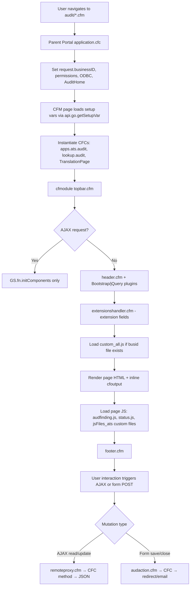
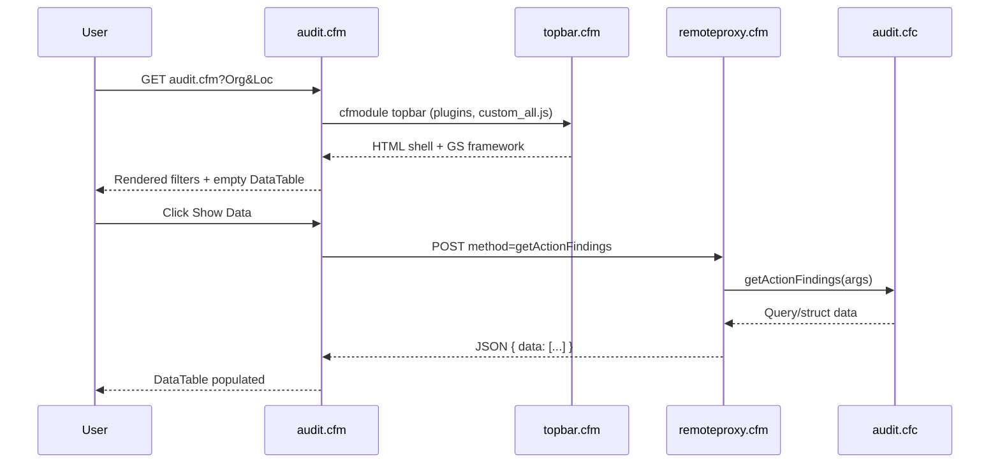
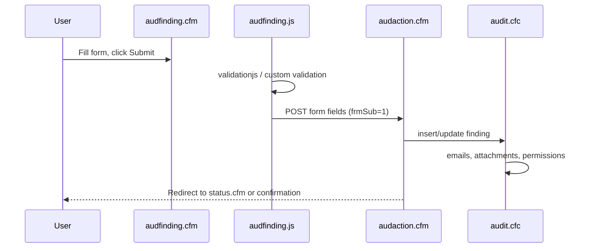
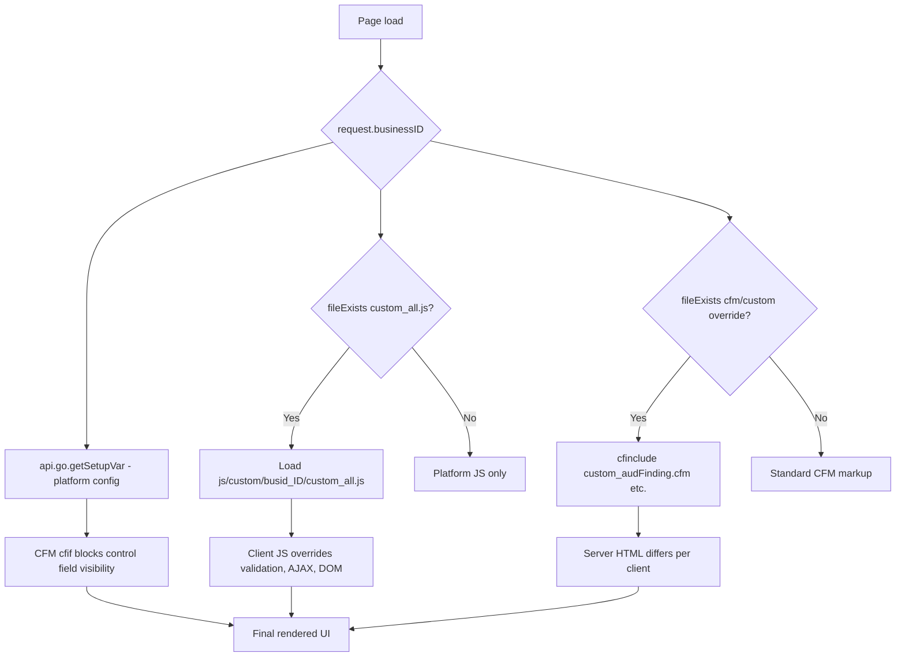
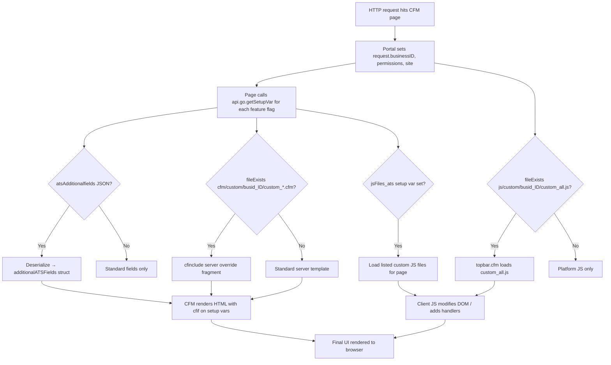

# ATS Audit — Frontend Architecture Reference

> **Repository:** `audit` (Action Tracking System)  
> **Generated for:** Technical requirement assessment, complexity estimation, developer assignment, and delivery planning  
> **Architecture type:** Server-rendered ColdFusion (CFM) embedded in Gensuite/Benchmark Portal — **not** a React/Vue SPA  
> **Related backend CFCs:** `cfc/apps/ats/*` (shared library, invoked via `remoteproxy.cfm` and direct `createObject`)

---

## Table of Contents

1. [Frontend Project Overview](#frontend-project-overview)
2. [Frontend Architecture](#frontend-architecture)
3. [Backend Integration Map](#backend-integration-map)
4. [Configuration and Differentiation Architecture](#configuration-and-differentiation-architecture)
5. [Technical Assessment Support Layer](#technical-assessment-support-layer)
6. [Suggested Ownership by Developer Level](#suggested-ownership-by-developer-level)
7. [Developer Execution Guide](#developer-execution-guide)
8. [Appendices](#appendices)

---

# Frontend Project Overview

## Tech Stack Summary

| Layer | Technology | Evidence |
|-------|------------|----------|
| Page rendering | ColdFusion (CFM) server-side templates | 228 `.cfm` files in `audit/` |
| Layout shell | Custom tag `topbar.cfm` → portal `header.cfm` / `footer.cfm` | `audit/topbar.cfm` |
| JavaScript | jQuery (primary), Lodash (`_`), GS Framework (`GS.fn.*`) | `audit/js/*.js`, inline scripts in CFM pages |
| AJAX | `GS.fn.ajax` (preferred), legacy `$.ajax` | ~60 files use `GS.fn.ajax`; ~20 still use `$.ajax` |
| AJAX gateway | `remoteproxy.cfm` → library CFC remote/public methods | `audit/remoteproxy.cfm` |
| Form POST handlers | `audaction.cfm` (primary save/close handler) | `audit/audaction.cfm` |
| CSS | `css/ats.css`, `rcATSStyle.css`, Bootstrap utilities | `audit/css/`, root `rcATSStyle.css` |
| UI libraries | Bootstrap (3/4 hybrid), Select2, Flatpickr, DataTables, Summernote, Handsontable, Bootbox, html2pdf | Loaded via `topbar.cfm` `plugins` attribute |
| i18n | `TranslationPage` CFC + `AuditLang_*.cfm` / `AudFindingLang_*.cfm` label files | `audit/audit.cfm`, `audit/audfinding.cfm` |
| Auth/session | Parent portal `application.cfc` (not in `audit/`) | `audit/index.cfm` placeholder comment |
| Build | No webpack/vite; static JS/CSS served from `audit/` path | File-based deployment |

## Project Structure Summary

```
audit/                          (~525 application files)
├── [root]                      174 primary CFM pages (audit.cfm, audfinding.cfm, status.cfm, …)
├── topbar.cfm                  Shared layout custom tag (shell + JS bootstrap)
├── remoteproxy.cfm             JSON AJAX gateway to library CFCs
├── setupvars.cfm               Shared setup-variable loader
├── vardefinition.cfm           Label/setup-var resolution helpers
├── js/                         13 core JS + 225 client custom JS (166 busid_* folders)
│   └── custom/busid_{id}/      Per-business overrides (custom.js, custom_all.js, custom_hot.js)
├── cfm/custom/busid_{id}/      27 server-side CFM fragment overrides
├── css/                        App stylesheets
├── cfc/                        4 local CFC helpers (appref, report, extension, custommetricsDAO)
├── dependentFieldCustomizations/  Per-bus dependent field rules
├── genny/                      Genny AI page command hooks
└── ATShelp/                    Static help content
```

## Directory Responsibility Map

| Path | Responsibility |
|------|----------------|
| `audit/*.cfm` (root) | Routable pages: homepage, forms, status, reports, exports, admin, scheduled tasks |
| `audit/topbar.cfm` | Page shell, plugin loading, menu construction, `custom_all.js` injection |
| `audit/remoteproxy.cfm` | Central JSON API router to `cfc/apps/ats/*` and related CFCs |
| `audit/audaction.cfm` | Server-side POST handler for add/edit/close finding (emails, attachments, permissions) |
| `audit/js/*.js` | Shared client logic (finding form, status, approvals, due-date extension, reports) |
| `audit/js/custom/busid_*` | Client-side per-business customization |
| `audit/cfm/custom/busid_*` | Server-side per-business CFM includes |
| `audit/setupvars.cfm` | Closure verification, additional fields bootstrap |
| `cfc/apps/ats/audit.cfc` | Primary business object (~11k lines); queries, remote methods, email logic |
| `cfc/apps/ats/*.cfc` | Extensions: `dueDateExtend`, `approvals`, `readAcrossActions`, `auditExtended_V2` |
| `customtags/` (sibling repo) | Shared UI: `ContactsList`, `attachDisplay`, `extensionshandler`, GPS, 5-Why |

## Major Entry Points

| Entry | File | Role |
|-------|------|------|
| Portal routing | Parent `application.cfc` | Sets `request.*`, ODBC, permissions, `request.businessID` |
| Homepage | `audit/audit.cfm` | Action/finding grid, filters, CSV export, threshold metrics |
| Add/Edit Finding | `audit/audfinding.cfm` | Primary data-entry form (~10k lines) |
| Save handler | `audit/audaction.cfm` | Form POST target; insert/update/close, emails |
| View/Close/Verify | `audit/status.cfm` | Closure workflow, verification, sub-CA, PDF export |
| AJAX API | `audit/remoteproxy.cfm` | All async JSON calls |
| Layout | `audit/topbar.cfm` | Included via `<cfmodule>` on every major page |

---

# Frontend Architecture

## 2.1 High-level Architecture

ATS Audit uses a **classic server-rendered web application** pattern embedded in the Gensuite portal. There is no client-side router or global JS state store. Each CFM page is a self-contained screen that:

1. Loads setup variables (`api.go.getSetupVar`)
2. Instantiates CFCs for server-side data
3. Renders HTML via CFM + shared custom tags
4. Attaches jQuery/GS client scripts for interactivity
5. Calls `remoteproxy.cfm` or posts to `audaction.cfm` for mutations

### Architecture Layers

| Layer | Purpose | Key Files/Folders | Connections |
|-------|---------|-------------------|-------------|
| Portal bootstrap | Auth, DSN, `request.businessID`, permissions | Parent `application.cfc` (external) | All pages inherit `request.*` |
| Setup/config | Feature flags, labels, field visibility | `setupvars.cfm`, `vardefinition.cfm`, inline `getSetupVar` in each page | Controls CFM conditionals + JS globals |
| Layout shell | Header, plugins, menus, `custom_all.js` | `topbar.cfm` → `header.cfm` | Wraps all major pages |
| Pages/screens | Business UI per workflow step | `audit.cfm`, `audfinding.cfm`, `status.cfm`, `CustomReport.cfm`, `export.cfm` | Include topbar, page JS, custom overrides |
| Feature fragments | Sub-flows included into pages | `closeFinding.cfm`, `audfinding_subAdd.cfm`, `status_subEdit.cfm` | Included from parent CFM |
| Shared components | Reusable UI (contacts, attachments, GPS) | Portal `customtags/` via `<cfmodule>` | Used across finding/status/close |
| Client JS modules | Form validation, AJAX, UI widgets | `js/audfinding.js`, `js/status.js`, `js/dueDateExtend.js` | Loaded per-page from CFM |
| Client overrides | Per-business JS | `js/custom/busid_{id}/custom*.js` | Loaded by `topbar.cfm` + `jsFiles_ats` setup var |
| Server overrides | Per-business CFM fragments | `cfm/custom/busid_{id}/custom_*.cfm` | `cfinclude` when `fileExists` |
| API gateway | JSON RPC to CFCs | `remoteproxy.cfm` | Called by `GS.fn.ajax` / `$.ajax` |
| Business logic CFCs | Queries, validation, emails | `cfc/apps/ats/audit.cfc` and siblings | Invoked server-side and via remoteproxy |
| Form POST handler | Synchronous save/close | `audaction.cfm` | Form `action` target; also `cfhttp` from integrations |

## 2.2 Application Startup and Render Flow



**Confirmed boot sequence** (from `audit/topbar.cfm`, `audit/audit.cfm`):

1. Parent portal resolves org/site (`request.sitedata`), user permissions (`request.permissions`)
2. Page reads dozens of `api.go.getSetupVar()` values (per-page, not centralized)
3. `<cfmodule template="topbar.cfm" plugins="..."/>` loads GS framework plugins
4. `topbar.cfm` always attempts `js/custom/busid_{request.businessID}/custom_all.js`
5. Page-specific JS loaded after HTML render
6. `jsFiles_ats` setup var may load additional `custom.js`, `custom_hot.js` per business

## 2.3 Feature and Page Flow Mapping

### Core Workflow: Add Finding

| Step | Route/File | Component/Function | Service/API | Backend | Result |
|------|------------|-------------------|-------------|---------|--------|
| 1 | `audfinding.cfm?Org=&Loc=` | Form `#addAudit` | Server CFC queries on page load | `apps.ats.audit`, `lookup.audit` | Rendered form with fields per setup vars |
| 2 | User fills form | `audfinding.js`, `dependentDD.js` | Client validation (`validationjs` setup var) | — | Field interactivity, dependent dropdowns |
| 3 | Optional draft save | `audfinding.js` `saveDraft()` | `remoteproxy.cfm?method=saveDraft` | `audit.cfc` | Draft stored |
| 4 | Submit | Form POST | `audaction.cfm?frmSub=1` | `audit.cfc` insert/update | Redirect, emails, attachments |
| 5 | View result | `status.cfm?id=` | Server queries | `audit.cfc` | Status/close UI |

### Core Workflow: Homepage Grid

| Step | Route | JS | API | CFC Method | Result |
|------|-------|-----|-----|------------|--------|
| 1 | `audit.cfm` | DataTables init | `remoteproxy.cfm?method=getActionFindings` | `audit.getActionFindings()` | Paginated finding grid |
| 2 | Filter/search | `createTableResults()` | Same + URL params | `audit.getActionFindings()` | Filtered rows |
| 3 | Keyword search | Select2 ajax | `remoteproxy.cfm?method=keyWordsearch` | `audit.keyWordsearch()` | Autocomplete tags |
| 4 | Quick verify | Inline handler | `remoteproxy.cfm?method=setQuickClosureVerify` | `audit.setQuickClosureVerify()` | Row status update |
| 5 | CSV export | URL `?downloadCSV=1` | Server-side (no AJAX) | `audit.getActionFindings()` | File download |

### Core Workflow: Close / Verify Finding

| Step | Route | Component | API | Backend | Result |
|------|-------|-----------|-----|---------|--------|
| 1 | `status.cfm?id=` | Status display | Server queries on load | `audit.cfc` | Finding detail view |
| 2 | Open close modal | `closeFinding.cfm` include | — | — | Close form fields |
| 3 | Submit close | Form POST `Status` | `audaction.cfm` or self-post | `audit.cfc` | Status transition, emails |
| 4 | Verify/reject | `VerifyStatus` / `RejectStatus` forms | POST to `status.cfm` | Server-side | CV workflow |
| 5 | Due date extension | `dueDateExtend.js` | `DueDateExtensionCheck/Request/Update` | `dueDateExtend.cfc` | Extension UI + approval |
| 6 | Downgrade finding | `status.cfm` JS | `remoteproxy.cfm?method=downgradeFinding` | `audit.downgradeFinding()` | Severity downgrade |

### Reports & Export

| Page | Entry | Key JS | Endpoints |
|------|-------|--------|-----------|
| `CustomReport.cfm` | Report builder UI | Inline + DataTables | `getCustomReport`, `getCustomReportSubCAOnly`, `getCategorySub`, `getSubCorrectiveActions` |
| `export.cfm` | Lite/compact form | Page inline JS | Select2 → `remoteproxy.cfm` (contact lookup), POST to self |
| `chart.cfm` | Chart filters | Inline | `remoteproxy.cfm?component=Chart&method=getChartData` |
| `DraftsCustomReport.cfm` | Draft report | DataTables ajax | `draftsGetCustomReport` |
| `supervisorReport.cfm` | Supervisor view | `supervisorReport.js` | `supervisorgrid.cfm?method=getSupervisorCounts` |

## 2.4 Component and Function Architecture

### `audit/topbar.cfm` — Layout Shell Custom Tag

| Attribute | Purpose |
|-----------|---------|
| `plugins` | Comma list of GS plugins (flatpickr, data-tables, summernote, handsontable, etc.) |
| `title` | Page title via translator |
| `headerIncludes` | Extra CSS/JS paths |
| `cfmIncludes` | Additional CFM fragments under `include/` |

**Key behaviors:**
- Detects AJAX via `x-requested-with` header → only runs `GS.fn.initComponents()`
- Loads `js/custom/busid_{request.businessID}/custom_all.js` with cache-busting version query
- Builds `GS.topbar.app.data.menu` via `ATSTopBarMenu()` JS function
- Instantiates `ScopeAppConfig` and runs `extensionshandler.cfm` for extension fields
- Resolves `siteid` via `lookup.audit.getOrgSite()`

### `audit/remoteproxy.cfm` — AJAX Gateway

**Purpose:** Single JSON entry point for all async frontend→backend calls.

**Routing logic:**
- Default CFC: `request.library.cfc.dotpath/apps/ats/{component}` (default component=`audit`)
- Alternate `cfcID` routes: `contactPermissions`, `lookup`, `additionalfields`
- Method resolved from `url.method` or `form.method` (form wins)
- Uses `GetMetaData()` introspection to map URL/FORM params to CFC method arguments
- Injects `BusinessID`, `LimitUserOrgName`, additional ATS fields from `atsAdditionalfields` setup var
- Returns `{ success, timestamp, message, data }` JSON envelope

### `audit/js/audfinding.js` — Finding Form Client Logic

| Function/Area | Purpose |
|---------------|---------|
| Form validation hooks | Works with `validationjs` setup var (often `check(document.addAudit, 'Add')`) |
| Draft save | `$.ajax` → `remoteproxy.cfm?method=saveDraft` |
| Flatpickr date pickers | Closure due date, audit date |
| Contact search | `gsContactSearch` / Select2 integration |
| Batch upload helpers | Handsontable coordination |

### `audit/js/status.js` — Status Page Client Logic

| Area | Purpose |
|------|---------|
| Modal management | Close, verify, reject dialogs |
| PDF export | html2pdf / html2canvas |
| Date comparison | Closure due date validation |
| Sub-CA WIP | Comment editing via `updateCommentAndGetItBack` |

### `audit/js/dueDateExtend.js` — Due Date Extension Module

| Function | remoteproxy Method | CFC |
|----------|-------------------|-----|
| `enableRequestLogic()` | `DueDateExtensionCheck` | `dueDateExtend.cfc` (via audit delegation) |
| Extension request submit | `DueDateExtensionRequest` | `component=dueDateExtend` |
| Approve/reject | `DueDateExtensionUpdate` | `dueDateExtend.cfc` |
| `getDueDateExtension()` | `DueDateExtensionCheck` (HTML + query modes) | `dueDateExtend.cfc` |

**Note:** Many `busid_*` clients duplicate/override this logic in `custom.js` / `custom_all.js`.

### `audit/js/dependentDD.js` — Dependent Dropdown Handler

- Consumes `DDjSON` global (from `dependentDropdownJSON_config` setup var)
- Filters child `<select>` options based on parent selection on `audfinding.cfm`
- Uses jQuery delegated `change` events on `.ddd` class

### `audit/js/approvals.js` — Multi-Approval Workflow

| Function | Endpoint | Component |
|----------|----------|-----------|
| `loadApprovalsSection` | `remoteProxy.cfm` | `component=approvals` |
| `approveRole` / `rejectRole` | `remoteProxy.cfm` (JSON body) | `component=approvals` |

### Major CFM Pages (Business-Critical)

| File | Lines (approx) | Purpose | Key Dependencies |
|------|----------------|---------|------------------|
| `audit.cfm` | ~6,700 | Homepage grid, filters, metrics | `audit.cfc`, `status.js`, `threshold-metrics.js` |
| `audfinding.cfm` | ~10,100 | Add/edit finding form | `ContactsList`, `AppLookup`, `audfinding.js`, custom overrides |
| `audaction.cfm` | ~7,600 | POST handler (no UI on pure POST) | `audit.cfc`, email templates, ET integration |
| `status.cfm` | ~6,700 | View/close/verify | `closeFinding.cfm`, `status.js`, 5-Why, GPS |
| `CustomReport.cfm` | ~8,400 | Custom report builder | DataTables, `auditExtended` methods |
| `export.cfm` | ~6,800 | Compact/lite export form | Extension data, custom export overrides |
| `closeFinding.cfm` | ~2,100 | Close-finding sub-form | Included from `status.cfm`, verify-by Select2 ajax |

## 2.5 State Management Architecture

ATS Audit has **no global client-side state store** (no Redux, Vuex, or React Context). State is distributed across:

| Mechanism | Source | Purpose | Consumers |
|-----------|--------|---------|-----------|
| Server session | Portal `request.user`, `request.permissions` | Auth, access rights, org limits | All CFM conditionals |
| Request scope | `request.businessID`, `request.atsFindingName` | Tenant identity, terminology | Labels, override paths |
| Setup variables | `api.go.getSetupVar()` at page load | Feature flags, field visibility | CFM `cfif` blocks + JS globals |
| Inline JS globals | `<cfoutput>` in CFM pages | Page context (`ats`, `cf_GEBusiness`, `page`) | Custom JS, `custom_all.js` |
| `GS.data` | GS Framework (portal) | `GS.data.scope.siteID`, `GS.data.user.accessName` | All `GS.fn.ajax` calls |
| `GS.topbar` | `topbar.cfm` | Saved URL, menu state, alerts | Homepage navigation |
| Form DOM state | HTML forms | Primary UI state | jQuery selectors |
| DataTables internal | DataTables plugin | Grid pagination/sort state | `audit.cfm`, `CustomReport.cfm` |
| Local JS variables | Per-file (`cf_qCheckRequestExists`, `ats.scenario`) | Workflow-specific temp state | Due date extension, read-across |

**Data flow pattern:** Server renders initial state in HTML → JS enhances → AJAX fetches supplemental data → DOM updated. Mutations go through `audaction.cfm` (full POST) or `remoteproxy.cfm` (partial JSON).

## 2.6 Shared Hooks and Utilities

| File | Purpose | Used By |
|------|---------|---------|
| `js/dependentDD.js` | Dependent dropdown filtering from JSON config | `audfinding.cfm` |
| `js/dueDateExtend.js` | Standard due-date extension workflow | `audfinding.cfm`, `status.cfm`, `closeFinding.cfm` |
| `js/filtersTemplate.js` | Saved filter templates | `audit.cfm` |
| `js/threshold-metrics.js` | Homepage threshold metric widgets | `audit.cfm` |
| `js/custommetrics.js` | Custom metrics UI | `CustomMetrics.cfm` |
| `js/report.js` | Report page helpers | `report.cfm` |
| `js/supervisorReport.js` | Supervisor grid ajax | `supervisorReport.cfm` |
| `js/app.js` / `js/ats.js` | Legacy `ajaxCall()` wrapper around `$.ajax` | Older pages |
| `setupvars.cfm` | Shared closure/additional-fields bootstrap | Pages that `cfinclude` it |
| `vardefinition.cfm` | Label resolution (e.g. `ClosureDueDateMessage`) | `audfinding.cfm`, `status.cfm` |
| `utilities.cfm` | Shared CF utility includes | `audfinding.cfm` |
| Portal `GS.fn.translator` | Client-side label translation | All major pages |
| Portal `GS.fn.ajax` | Standard AJAX wrapper | Preferred for all new AJAX |
| `_.queryToArray` | JSON response normalization | AJAX success callbacks (company standard) |

---

# Backend Integration Map

## 3.1 API Architecture Overview

### Request Client Setup

| Aspect | Implementation |
|--------|----------------|
| Primary client | `GS.fn.ajax({ url, type, data })` — company GS Framework wrapper |
| Legacy client | `$.ajax()` — still present in ~20 files; `js/app.js` defines `ajaxCall()` helper |
| `fetch()` | **Not used** in audit repo |
| Base URL | Relative `remoteproxy.cfm` or `GS.data.paths.domainURL + auditHome + "remoteproxy.cfm"` |
| Auth | Session cookies from portal; no explicit token injection in JS |
| Request format | URL query params + form data; some calls use `JSON.stringify` POST body (`approvals.js`) |
| Response format | JSON envelope `{ success, timestamp, message, data }` from `remoteproxy.cfm` |
| Response parsing | `JSON.parse(response)` or jQuery auto-parse; company standard: `_.queryToArray(JSON.parse(response).data)` |
| Error handling | `remoteproxy.cfm` catch → email in dev/stage; `success: false` in JSON |
| Retry logic | None standardized; Select2/ajax calls use `delay` (250–1200ms debounce) |
| Partial HTML | `atsTableAsync.cfm` returns HTML fragments (not via remoteproxy) |

### Non-remoteproxy Endpoints

| Pattern | Example | Purpose |
|---------|---------|---------|
| Form POST | `audaction.cfm?frmSub=1` | Full finding save/close |
| Partial HTML | `atsTableAsync.cfm` | Async table rows in forms |
| Page-local ajax | `supervisorgrid.cfm?method=getSupervisorCounts` | Supervisor report data |
| Integration | `envisionAPI.cfm`, `receiver.cfm`, `XMLreceiver.cfm` | External system integration |
| Server-side HTTP | `audit.cfc` → `cfhttp` to `audaction.cfm` | Programmatic form submission |

## 3.2 Endpoint Inventory

All paths below route through `audit/remoteproxy.cfm` unless noted. Default CFC is `apps.ats.audit` when `component` is omitted.

### Homepage & Grid (`audit.cfc`)

| Method | HTTP | Component | Triggered From | Payload (key params) | Response Usage |
|--------|------|-----------|----------------|---------------------|----------------|
| `getActionFindings` | POST | audit | `audit.cfm` `createTableResults()` | `siteid`, `business`, pagination, filter URL vars | DataTables row data |
| `getActionFindingsCount` | POST | audit | `audit.cfm` threshold/header counts | `siteid`, `business`, filters | Header metric counts |
| `keyWordsearch` | GET | audit | `audit.cfm` Select2 keyword | `siteid`, `term`, `page` | Autocomplete options |
| `setQuickClosureVerify` | POST | audit | `audit.cfm` quick verify button | `busActionID`, `status` | Row refresh |
| `getDraftedActionList` | GET | audit | `topbar.cfm` manage drafts modal | `siteID` | Draft list HTML/table |
| `deleteDraftedAction` | POST | audit | `topbar.cfm` draft delete confirm | `tblAuditIDList` | Modal refresh |
| `getActionStatus` | GET | audit | `status.cfm` on open finding check | `tblauditid` | Redirect if status changed |
| `downgradeFinding` | GET/POST | audit | `status.cfm` downgrade confirm | `findingID`, `oname`, `loc`, `accessName` | Page reload |
| `getAudit` | POST | audit | `js/custom/busid_1630/custom_all.js` | `method`, filters | Custom client data load |
| `getContactInfo` | POST | audit | `js/custom/busid_1630/custom_all.js` | contact params | Contact details |

### Finding Form (`audit.cfc`)

| Method | HTTP | Triggered From | Payload | Response Usage |
|--------|------|----------------|---------|----------------|
| `getJsonDefaultShortcut` | POST | `audfinding.cfm` my-default modal | `itemCode: ATS_DATASHORTCUT_DEFAULT`, `updateBy` | Pre-fill form defaults |
| `saveMyDefault` / draft methods | POST | `audfinding.cfm`, `audfinding.js` | Form field JSON, `draftTitle` | Draft saved confirmation |
| `saveDraft` | POST | `audfinding.js` | Serialized form data | Draft ID |
| Select2 contact lookup | POST | `audfinding.cfm`, `closeFinding.cfm`, `export.cfm` | `cfcid=lookup`, `method=getLtbContacstByRight` | Contact options |

### Custom Reports (`audit.cfc` / `auditExtended_V2.cfc`)

| Method | HTTP | Triggered From | Payload | Response Usage |
|--------|------|----------------|---------|----------------|
| `getCustomReport` | POST | `CustomReport.cfm` | `queryType` (Count/Select), filters, pagination | Report rows/count |
| `getCustomReportSubCAOnly` | POST | `CustomReport.cfm` (checkbox) | Same + sub-CA flag | Sub-CA filtered report |
| `getCategorySub` | POST | `CustomReport.cfm` | `siteid`, `category` | Subcategory dropdown |
| `getSubCorrectiveActions` | POST | `CustomReport.cfm` | `siteid`, `id` | Sub-CA modal content |
| `draftsGetCustomReport` | POST | `DraftsCustomReport.cfm` | Draft filter fields | Draft report DataTable |

### Due Date Extension (`dueDateExtend.cfc` via `component=dueDateExtend` or audit delegation)

| Method | HTTP | Triggered From | Payload | Response Usage |
|--------|------|----------------|---------|----------------|
| `DueDateExtensionCheck` | POST | `dueDateExtend.js`, many `custom_all.js` | `siteid`, `business`, `tblauditid`, mode flags | HTML display or query JSON |
| `DueDateExtensionRequest` | POST | `dueDateExtend.js`, custom overrides | Extension form data | Request created |
| `DueDateExtensionUpdate` | POST | Approver actions | `approverID`, approve/reject | Status update + email |
| `rpExtend` | POST | `js/custom/busid_1471/custom.js` | RP extension params | Client-specific extension |

### Approvals (`approvals.cfc`, `component=approvals`)

| Method | HTTP | Triggered From | Payload | Response Usage |
|--------|------|----------------|---------|----------------|
| `loadApprovalsSection` | POST | `approvals.js` | `tblAuditId`, `siteId`, `busId` | Approvals HTML section |
| `approveRole` | POST (JSON) | `approvals.js` | `role`, `rolesList`, `comments` | Role sign-off |
| `rejectRole` | POST (JSON) | `approvals.js` | `role`, `roleBack`, `comments` | Role rejection |
| `getNextApproval` | — | Server/remote | — | Next approval step |

### Read Across Actions (`readAcrossActions.cfc`, `component=readAcrossActions`)

| Method | Triggered From | Purpose |
|--------|----------------|---------|
| `getFormHTML` | `custom_all.js` (busid 56, 97, 132, 138, 1912–1921, etc.) | PDCA/read-across form HTML injection |
| `getDMSteps` | `CustomReport.cfm` | DM steps for read-across |
| `getSiteQryByBusiness` | `custom_all.js` | Site dropdown for cross-business RAA |
| `getRepeatCycle` | Commented/active in some busid files | Repeat cycle steps |

### Admin & Category (`audit.cfc`)

| Method | Triggered From | Purpose |
|--------|----------------|---------|
| `checkSubCategoryExists` | `Admin_Category.cfm` | Subcategory validation |
| `addSubCategory` | `Admin_Category.cfm` | Add subcategory |
| `updateSubCategory` | `Admin_Category.cfm` | Update subcategory |
| `getLTVRecords` | LTV pages | LTV datatable data |

### Other Components

| Method | Component/cfcID | Triggered From | Purpose |
|--------|-----------------|----------------|---------|
| `getChartData` | `component=Chart` | `chart.cfm` | Chart data series |
| `getIBATRequirementData` | audit | `busid_56/custom_all.js` | IBAT requirement data |
| `getRCAtextAnswer` | `atsRCA.cfc` | RCA integration | RCA text retrieval |
| `showATSValues` | `ciadditionalfields` | CI integration | Additional field values |
| `getFormattedComment` | audit | `status_subEdit.cfm`, `wip.cfm` | Formatted WIP comment HTML |
| `updateCommentAndGetItBack` | audit | `status_subEdit.cfm`, `wip.cfm` | Save WIP comment |
| `emailVerifier` | audit | Contact validation | Email verification JSON |
| `lookupCaseRecordable` | audit (assumed) | `busid_1036/custom_all.js` | I&I case recordable lookup |

### Form POST Endpoints (Non-remoteproxy)

| Endpoint | Method | Triggered From | Purpose |
|----------|--------|----------------|---------|
| `audaction.cfm` | POST | `audfinding.cfm`, `status.cfm`, `closeFinding.cfm` | Primary save/update/close |
| `status.cfm` | POST | Verify/reject forms | Closure verification workflow |
| `batchUploadEdit.cfm` | POST | `CustomReport.cfm` batch edit | Batch upload edits |
| `supervisorgrid.cfm` | GET/POST | `supervisorReport.js` | Supervisor counts |

## 3.3 Endpoint-to-Feature Mapping

| Feature/Page | UI Entry Files | Hook/Service | Backend Endpoint | Resulting UI Behavior | Notes |
|--------------|----------------|--------------|-------------------|----------------------|-------|
| Homepage grid | `audit.cfm` | `createTableResults()` | `getActionFindings` | Paginated finding table | Core homepage |
| Homepage metrics | `audit.cfm` | threshold JS | `getActionFindingsCount` | Header count badges | Setup: `enableThresholdMetrics` |
| Keyword search | `audit.cfm` | Select2 ajax | `keyWordsearch` | Tag autocomplete | min 3 chars |
| Quick closure verify | `audit.cfm` | inline | `setQuickClosureVerify` | Inline status change | Setup: `quickVerifyClosure` |
| Add finding | `audfinding.cfm` | form POST | `audaction.cfm` | Save + redirect | Primary mutation path |
| Save draft | `audfinding.cfm` | `audfinding.js` | `saveDraft` via remoteproxy | Draft saved | Setup: `isSaveAsDraftEnabled` |
| My default action | `audfinding.cfm` | inline JS | `getJsonDefaultShortcut` | Form pre-fill | User shortcut feature |
| View/close finding | `status.cfm` | forms + `status.js` | `audaction.cfm`, self-POST | Close/verify/reject | Largest workflow surface |
| Due date extension | `status.cfm`, `closeFinding.cfm` | `dueDateExtend.js` | `DueDateExtension*` | Extension request UI | Heavily customized per busid |
| Custom report | `CustomReport.cfm` | DataTables ajax | `getCustomReport*` | Report grid/export | Extended in `auditExtended_V2` |
| Approvals | `status.cfm`, `approvals.cfm` | `approvals.js` | `component=approvals` | Multi-role sign-off | Setup: `ats_isMultipleApprovalsActive` |
| Read-across (PDCA) | `audfinding.cfm` | `custom_all.js` | `readAcrossActions.*` | Dynamic form HTML | Setup: `readAcrossActionEnable` |
| Batch upload | `batchupload.cfm` | Handsontable | `audaction.cfm` (batch) | Bulk insert | `custom_hot.js` per busid |
| Charts | `chart.cfm` | inline | `Chart.getChartData` | Chart render | |
| Supervisor report | `supervisorReport.cfm` | `supervisorReport.js` | `supervisorgrid.cfm` | Supervisor grid | Not via remoteproxy |
| Manage drafts | `topbar.cfm` | topbar JS | `getDraftedActionList`, `deleteDraftedAction` | Draft modal | Setup: `isSaveAsDraftEnabled` |

## 3.4 Key Request Flow Diagrams

### Page Load — Homepage Grid



### Form Submission — Add Finding



### Client-Specific Conditional Rendering



---

# Configuration and Differentiation Architecture

## 4.1 Configuration Sources Inventory

| Source | Path/Mechanism | Format | Controls | Consumed By |
|--------|----------------|--------|----------|-------------|
| Setup variables (primary) | `api.go.getSetupVar(var, busid, siteid, appid, default)` | DB-backed key/value (portal setup system) | Field visibility, labels, workflows, feature flags | Every major CFM page at load |
| `setupvars.cfm` | `audit/setupvars.cfm` | CFM | Closure verification, additional fields bootstrap | Pages that include it |
| `vardefinition.cfm` | `audit/vardefinition.cfm` | CFM | Label overrides (e.g. `ClosureDueDateMessage`) | Finding/status pages |
| `atsAdditionalfields` setup var | JSON in setup system | JSON array of field groups | Additional/custom field definitions, CSV export columns | `audfinding.cfm`, `remoteproxy.cfm`, `export.cfm` |
| `dependentDropdownJSON_config` | Setup var | JSON | Parent→child dropdown mappings | `dependentDD.js` via CFM output |
| `jsFiles_ats` | Setup var (comma list) | String → array | Which custom JS files to load per page | `audit.cfm`, `audfinding.cfm`, `closeFinding.cfm`, `export.cfm` |
| `submit_validation_js` | Setup var | JS function name string | Form submit validation override | `audfinding.cfm` |
| Per-business JS | `js/custom/busid_{id}/custom*.js` | JavaScript | Client behavior, validation, AJAX overrides | `topbar.cfm` (always `custom_all.js`) + page `jsFiles_ats` |
| Per-business CFM | `cfm/custom/busid_{id}/custom_*.cfm` | CFM fragments | Server HTML/logic overrides | Dynamic `cfinclude` when `fileExists` |
| Dependent field rules | `dependentFieldCustomizations/busid_{id}.cfm` | CFM | Dependent field customization | Specific clients (e.g. 1528) |
| Language files | `AuditLang_*.cfm`, `AudFindingLang_*.cfm` | CFM label sets | i18n labels per language | Pages via translator |
| Extension fields | `extensionshandler.cfm` + DB `extensions_data` | DB + custom tag | Custom extension field values | `topbar.cfm`, `export.cfm` |
| Permissions | `request.permissions.accessRights`, `accessLevel` | Portal session | Role-based UI visibility | CFM `ListFind` checks throughout |
| XML schema docs | `findings.xsd`, `*XMLExample.xml` | XML/XSD | Integration field requirements | `fieldRequirements.cfm`, integrations |
| Environment | `server.api.go.getEnvironment()` | Server config | Prod vs dev error handling | `remoteproxy.cfm` catch blocks |
| Hardcoded busid branches | Inline `request.businessID eq N` | CFML conditionals | Legacy client-specific logic | Scattered (mostly commented) |

## 4.2 Field Differentiation

### How Fields Are Handled

| Concern | Mechanism | Config Type | Key Files |
|---------|-----------|-------------|-----------|
| Field visibility | `api.go.getSetupVar` + `cfif` | Setup var (backend-driven) | `audfinding.cfm`, `status.cfm`, `closeFinding.cfm` |
| Field labels | Setup vars + `vardefinition.cfm` + translator | Setup var + i18n files | All form pages |
| Required/optional | Setup vars (`ats_isRiskCategoryRequired`, `mandatoryUploadClosureAttachment`, etc.) | Setup var | `closeFinding.cfm`, `audfinding.cfm` |
| Additional/custom fields | `atsAdditionalfields` JSON | Schema-driven (setup JSON) | `audfinding.cfm`, `remoteproxy.cfm` |
| Extension fields | `extensionshandler.cfm` | DB-driven | `topbar.cfm`, forms |
| Dependent dropdowns | `dependentDropdownJSON_config` | JSON config | `dependentDD.js` |
| Validation (client) | `submit_validation_js` + `custom.js` | Config + override | `audfinding.cfm`, `js/custom/busid_*` |
| Validation (server) | `audaction.cfm` + `audit.cfc` | Hardcoded + setup vars | `audaction.cfm` |
| Editability / lock | Setup vars (`isCloseDateLocked`, `byPassLevel2_RPEdit`) | Setup var | `audfinding.cfm`, `status.cfm` |
| Conditional rendering | `cfif` on setup vars + permissions | Mixed | All pages |

### Field Behavior Classification

| Pattern | Examples | Prevalence |
|---------|----------|------------|
| **Setup-var driven (platform)** | `showAuditNameNumber`, `hideFindingDescription`, `ats_showCoResponPerson` | Most common — preferred pattern |
| **JSON schema driven** | `atsAdditionalfields`, `dependentDropdownJSON_config` | Additional fields, dependent DDs |
| **Backend-driven (DB)** | Extension fields, category/subcategory lookups | Extensions, lookups via CFC |
| **Per-client JS override** | `custom.js` validation, due-date logic duplication | 166 busid folders |
| **Per-client CFM override** | `custom_audFinding.cfm`, `custom_closefinding.cfm` | 27 busid folders |
| **Hardcoded** | Legacy `request.businessID eq N` blocks | Declining (mostly commented) |

## 4.3 Workflow Differentiation

### Status / Closure Workflow

| Aspect | Configuration | Files |
|--------|---------------|-------|
| Closure verification required | `RequireClosureVerification` setup var | `setupvars.cfm`, `status.cfm` |
| Quick close | `enableCapaQuickClose`, `quickVerifyClosure` | `status.cfm`, `audit.cfm` |
| Multi-approval | `ats_isMultipleApprovalsActive`, `ApprovalWorkFlowEnabled` | `approvals.cfm`, `status.cfm`, `approvals.js` |
| 5-Why required before close | `isAttach5WhyRequiredPriorClosure` | `setupvars.cfm`, `closeFinding.cfm` |
| Due date extension | `ats_dueDateExtend`, `ats_dueDateExtend_showOnStatusPage` | `dueDateExtend.js`, custom overrides |
| Auto-escalation | `autoEscalation_enable`, `AutoEscalation_EscalationDays` | `status.cfm`, `task_autoescalation.cfm` |
| Read-across (PDCA) | `readAcrossActionEnable`, `PDCAauditType` | `custom_all.js`, `readAcrossActions.cfc` |
| Custom closure logic | `customLogicForActionClosureEnabled`, `isCustomClosureLogic` | `status.cfm`, `closeFinding.cfm` |

### Workflow Logic Location

| Workflow Area | Configured In | Hardcoded In |
|---------------|---------------|--------------|
| Open → Closed transition | Setup vars + `audaction.cfm` | `audit.cfc` status rules |
| Closure verification | Setup vars | `status.cfm` permission checks |
| Approvals chain | `approvals.cfc` + setup vars | `approvals.js` |
| Due date extension | `dueDateExtend.cfc` + setup vars | Duplicated in many `custom_all.js` |
| Batch upload | `hotUploadEnabled`, `restrictHotToSpecialRight` | `batchupload.cfm`, `custom_hot.js` |

## 4.4 Per-Client / Per-Tenant Differentiation

### Client Identity Resolution

```
Portal session → request.businessID (numeric)
              → request.companyID
              → request.sitedata (org, site, siteid)
              → request.permissions (accessRights, accessLevel)
```

### Override Resolution Paths

| Override Type | Path Pattern | Load Trigger |
|---------------|-------------|--------------|
| Global client JS | `js/custom/busid_{businessID}/custom_all.js` | `topbar.cfm` — always if file exists |
| Page-specific client JS | `js/custom/busid_{businessID}/{file from jsFiles_ats}` | Per-page CFM loop |
| Handsontable batch | `js/custom/busid_{businessID}/custom_hot.js` | `batchupload.cfm` |
| Finding form CFM | `cfm/custom/busid_{businessID}/custom_audFinding.cfm` | `audfinding.cfm` `fileExists` check |
| Close finding CFM | `cfm/custom/busid_{businessID}/custom_closefinding.cfm` | `closeFinding.cfm` |
| Export CFM | `cfm/custom/busid_{businessID}/custom_export.cfm` | `export.cfm` |
| Pre-export CFM | `cfm/custom/busid_{businessID}/custom_export_pre.cfm` | `export.cfm` |
| Async table CFM | `cfm/custom/busid_{businessID}/custom_atsTableAsync.cfm` | `atsTableAsync.cfm` |
| Dependent fields | `dependentFieldCustomizations/busid_{businessID}.cfm` | Specific clients |

### What Differs Per Client

| Dimension | Mechanism |
|-----------|-----------|
| Fields visible/required | Setup vars scoped by `busid=` + CFM overrides |
| Labels/terminology | Setup vars + `request.atsFindingName` + language files |
| Permissions | Portal `accessRights` (not per-client files) |
| Workflows | Setup vars + `custom_all.js` workflow overrides |
| Validation rules | `custom.js` / `submit_validation_js` |
| Branding/legal | `atsLegalBlurb` setup var |
| Visible modules/menus | `api.go.isBusAppActive()`, company flags in `topbar.cfm` |
| API behavior | Custom JS may add params (e.g. `oa=1` in busid 1471) |
| Business rules | CFM overrides + custom JS (most complex clients: 1241, 1471, 1908, 2133) |

### Differentiation Type Separation

| Type | Example |
|------|---------|
| **Env-based** | `server.api.go.getEnvironment()` → error email routing in `remoteproxy.cfm` |
| **Runtime setup var** | `api.go.getSetupVar(var, busid=request.businessID)` — primary mechanism |
| **Tenant-ID file override** | `busid_{request.businessID}` folder existence check |
| **Hardcoded client branch** | Commented `request.businessID eq 2` blocks in `status.cfm` |
| **Backend-controlled** | `extensions_data` table, category/subcategory DB data |

## 4.5 Configuration Resolution Flow



## 4.6 Configuration Risks and Maintainability Issues

> Evidence-backed issues only.

| Issue | Evidence | Impact |
|-------|----------|--------|
| **Duplicated due-date extension logic** | Same `DueDateExtensionCheck/Request/Update` blocks copied across `dueDateExtend.js` and 15+ `custom_all.js` files (busid 1241, 1268, 1471, 1493, 1502, 1528, 1728, 1908, 2177, 2178, etc.) | Bug fixes must be replicated; high regression risk |
| **Mega-files** | `audfinding.cfm` (~10k lines), `audaction.cfm` (~7.6k), `audit.cfm` (~6.7k), `status.cfm` (~6.7k), `audit.cfc` (~11k) | Hard to reason about change impact; merge conflicts |
| **Mixed AJAX patterns** | `GS.fn.ajax` and `$.ajax` coexist; inconsistent response parsing | New devs may use wrong pattern; parsing bugs |
| **Setup vars scattered per page** | Each CFM page calls `getSetupVar` independently (50+ vars on `status.cfm` alone) | No single config manifest; easy to miss a page when adding a flag |
| **166 client JS folders** | `js/custom/busid_*` with inconsistent naming (`custom.js` vs `custom_all.js` vs `custom_hot.js`) | Onboarding cost; unclear which file to edit |
| **Legacy `$.ajax` in new-adjacent code** | `approvals.js`, `audfinding.js` draft save still use `$.ajax` | Inconsistent with company `GS.fn.ajax` standard |
| **No `fetch()` adoption** | Zero usage | Not a bug, but indicates aging patterns |
| **Hardcoded busid comments** | Commented `request.businessID eq 2` blocks in `status.cfm` | Confusing archaeology; risk if uncommented without review |
| **Client override without platform hook** | Some clients reimplement entire workflows in JS instead of extending `dueDateExtend.js` | Platform improvements don't propagate |

---

# Technical Assessment Support Layer

## 5.1 Change Surface Map

| Area | Primary Files | Secondary Files | Endpoint Impact | Config Impact | Risk Notes |
|------|---------------|-----------------|-----------------|---------------|------------|
| Homepage grid/filters | `audit.cfm`, `js/threshold-metrics.js` | `topbar.cfm`, `status.js` | `getActionFindings`, `getActionFindingsCount`, `keyWordsearch` | 20+ setup vars on `audit.cfm` | Mega-file; DataTables coupling |
| Add/edit finding form | `audfinding.cfm`, `js/audfinding.js` | `audaction.cfm`, `dependentDD.js`, `cfm/custom/busid_*/custom_audFinding.cfm` | `audaction.cfm` POST, `saveDraft`, lookups | `atsAdditionalfields`, `jsFiles_ats`, 40+ setup vars | Highest complexity page |
| Close/verify workflow | `status.cfm`, `closeFinding.cfm`, `js/status.js` | `audaction.cfm`, `js/dueDateExtend.js` | `audaction.cfm`, `getActionStatus`, `downgradeFinding`, `DueDateExtension*` | Closure setup vars, approval flags | Permission logic dense |
| Custom reports | `CustomReport.cfm` | `cfc/apps/ats/auditExtended_V2.cfc` | `getCustomReport*`, `getCategorySub`, `getSubCorrectiveActions` | Report field lists, checkbox fields | Large inline JS |
| Due date extension | `js/dueDateExtend.js` | Many `js/custom/busid_*/custom_all.js` | `DueDateExtensionCheck/Request/Update` | `ats_dueDateExtend*` setup vars | Heavy client override duplication |
| Approvals workflow | `approvals.cfm`, `js/approvals.js` | `status.cfm`, `cfc/apps/ats/approvals.cfc` | `component=approvals` methods | `ats_isMultipleApprovalsActive`, `ApprovalWorkFlowEnabled` | JSON POST body pattern |
| Read-across (PDCA) | `js/custom/busid_*/custom_all.js` | `cfc/apps/ats/readAcrossActions.cfc` | `getFormHTML`, `getDMSteps`, `getSiteQryByBusiness` | `readAcrossActionEnable`, `PDCAauditType` | Client-specific activation |
| Batch upload | `batchupload.cfm`, `batchUploadEdit.cfm` | `custom_hot.js`, `audaction.cfm` | `audaction.cfm` (batch POST) | `hotUploadEnabled`, `restrictHotToSpecialRight` | Handsontable version coupling |
| Per-client customization | `js/custom/busid_{id}/*`, `cfm/custom/busid_{id}/*` | Parent page that loads them | May add custom remoteproxy calls | `jsFiles_ats`, `submit_validation_js` | Isolated but proliferating |
| Export/lite form | `export.cfm` | `cfm/custom/busid_*/custom_export*.cfm` | Contact lookups via remoteproxy | Extension data, compact form vars | Custom pre/post export hooks |
| Topbar/menus | `topbar.cfm` | Portal `header.cfm` | `getDraftedActionList`, `deleteDraftedAction` | Menu setup vars, `isSaveAsDraftEnabled` | Affects every page |
| AJAX gateway | `remoteproxy.cfm` | All CFCs in `cfc/apps/ats/` | All remote methods | `atsAdditionalfields` injection | Central chokepoint — high blast radius |
| i18n/labels | `AuditLang_*.cfm`, `AudFindingLang_*.cfm` | `TranslationPage` CFC | — | Language index setup vars | 15+ language files to maintain |

## 5.2 Complexity Signals

| Area | Files Involved | Cross-Module Deps | Config Branching | Client Overrides | Endpoint Coupling | State Complexity | Overall |
|------|---------------|-------------------|------------------|------------------|-------------------|----------------|---------|
| Homepage (`audit.cfm`) | 5–8 | Medium (CFC, topbar, metrics) | High (20+ setup vars) | Medium (`custom_all.js`) | Medium (3–4 endpoints) | Low (DataTables) | **High** |
| Finding form (`audfinding.cfm`) | 10–15 | Very High (custom tags, extensions, RCA, I&I) | Very High (40+ setup vars) | High (CFM + JS overrides) | High (POST + 5+ AJAX) | Medium (form DOM) | **Very High** |
| Status/close (`status.cfm`) | 10–12 | Very High (close, verify, approvals, GPS) | Very High (50+ setup vars) | High | High | Medium | **Very High** |
| `audaction.cfm` handler | 3–5 | Very High (emails, ET, permissions) | High | Medium (CFM includes) | High (all mutations) | Low (server-only) | **Very High** |
| Custom reports | 4–6 | Medium (auditExtended) | Medium | Low | Medium | Low (DataTables) | **High** |
| Due date extension | 3 + N clients | Medium | Medium | **Very High** (15+ dupes) | Medium (3 endpoints) | Medium | **High** |
| Per-client JS only | 1–3 | Low | Low | N/A | Variable | Low | **Low–Medium** |
| Per-client CFM only | 1–2 | Low | Low | N/A | Low | Low | **Low–Medium** |
| Topbar/menu | 2–3 | Medium (portal) | Medium | Medium (`custom_all.js`) | Low | Low | **Medium** |
| `remoteproxy.cfm` | 1 (+ all CFCs) | Very High | Medium | Low | **Very High** | Low | **Very High** |
| Styling/layout | 2–3 CSS | Low | Low | Rare | None | Low | **Low** |
| New setup var (existing pattern) | 2–4 CFM | Low | Low | None | None | Low | **Low–Medium** |

## 5.3 Change Risk Indicators

| Risk Factor | Location | Why Risky |
|-------------|----------|-----------|
| `remoteproxy.cfm` | `audit/remoteproxy.cfm` | Single gateway for all AJAX; change affects every async feature |
| `audaction.cfm` | `audit/audaction.cfm` | All form mutations; email side effects; permission checks |
| `audit.cfc` | `cfc/apps/ats/audit.cfc` | ~11k lines; queries, business rules, remote methods |
| `topbar.cfm` | `audit/topbar.cfm` | Loads on every page; menu, plugins, `custom_all.js` |
| `custom_all.js` proliferation | 91 `custom_all.js` files | Unknown interactions with platform JS |
| Due-date client copies | 15+ busid folders | Fix in platform JS may not reach clients |
| Permission conditionals | `status.cfm`, `audfinding.cfm` | `ListFind` on `accessRights`; easy to break access |
| `atsAdditionalfields` JSON | Setup system | Schema change affects forms, remoteproxy arg injection, CSV export |
| Extension fields | `extensionshandler.cfm` | Cross-app field coupling |
| Legacy `$.ajax` callbacks | Multiple JS files | Inconsistent error handling and response parsing |

## 5.4 Requirement Assessment Guidance

When evaluating incoming requirements, assess these dimensions:

| Dimension | Question | Low Risk Signal | High Risk Signal |
|-----------|----------|-----------------|------------------|
| UI-only vs UI+API | Does it need new data? | CSS/label change via setup var | New `audit.cfc` method + remoteproxy + UI |
| Single-screen vs cross-workflow | How many pages? | One CFM page | Finding + status + audaction + email |
| Config-only vs code change | Can `getSetupVar` handle it? | New setup var + one `cfif` | New workflow branch in `audaction.cfm` |
| Client-specific vs platform | Which clients? | One `busid_*` folder | Platform file + multiple client overrides |
| Existing pattern available? | Precedent? | Follow `dueDateExtend.js` or existing setup var | Net-new integration pattern |
| Regression area | What breaks? | Isolated custom JS | `remoteproxy.cfm`, `audaction.cfm`, `topbar.cfm` |

**Decision shortcuts:**
- Label/visibility change → check setup vars first → **config-only** likely
- New field on finding form → `audfinding.cfm` + `audaction.cfm` + possibly `atsAdditionalfields` JSON → **High**
- Client-specific validation → `js/custom/busid_{id}/custom.js` → **Medium** (isolated)
- New AJAX data on homepage → `audit.cfc` method + `audit.cfm` JS + `remoteproxy.cfm` → **High**
- New closure rule → `status.cfm` + `closeFinding.cfm` + `audaction.cfm` → **Very High**

---

# Suggested Ownership by Developer Level

## 6.1 Ownership Model

### Associate Developer
- CSS tweaks in `css/ats.css` or `rcATSStyle.css`
- Label text changes in language CFM files under guidance
- Isolated HTML markup changes in low-traffic pages
- Adding entries to an existing `custom.js` under senior review
- Setup var toggles in dev environment under supervision

### Developer / Mid-level Developer
- Standard field visibility via new setup var + `cfif` on one page
- Wiring existing remoteproxy method to new UI button
- `custom.js` / `custom_all.js` changes for a single `busid_*` client
- `cfm/custom/busid_*/` server override fragments
- DataTables column additions on homepage
- Bug fixes in isolated JS modules (`threshold-metrics.js`, `supervisorReport.js`)

### Senior Developer
- Cross-page workflow changes (finding → action → status)
- New remoteproxy method + `audit.cfc` function + frontend wiring
- `atsAdditionalfields` JSON schema changes
- Due date extension platform changes (must assess client overrides)
- Approval workflow modifications
- Custom report query/filter changes
- Refactoring duplicated client JS into shared modules
- Permission logic changes in `status.cfm` / `audaction.cfm`

### Lead Developer
- `remoteproxy.cfm` routing changes
- `topbar.cfm` plugin/menu architecture changes
- New client customization strategy (reducing 166-folder proliferation)
- `audit.cfc` structural refactoring
- Extension field architecture changes
- Cross-app integration (ET, I&I, RCA, CI)
- Batch upload / Handsontable architecture

### Director / Engineering Manager / Architect Oversight
- Multi-team impacts (audit + cfc library + customtags + portal)
- Client customization strategy (setup vars vs overrides vs net-new platform features)
- Major workflow redesign (e.g. replacing POST model with API-first)
- Prioritization when 15+ client overrides block a platform improvement
- Security/permission model changes

## 6.2 Codebase-Specific Ownership Recommendations

| Area / Change Type | Recommended Owner | Why | Escalate When |
|--------------------|-------------------|-----|---------------|
| CSS/layout/styling | Associate → Mid | Isolated, low blast radius | Shared `topbar.cfm` or `rcATSStyle.css` affects all pages |
| Label/i18n changes | Associate → Mid | Language CFM files are patterned | Terminology driven by `request.atsFindingName` setup |
| Single setup var + cfif | Mid | Established pattern on one page | Var needed on 3+ pages or in `audaction.cfm` |
| Single busid `custom.js` | Mid | Isolated per client | Client has `custom_all.js` duplicating platform logic |
| Single busid CFM override | Mid | `cfinclude` pattern is bounded | Override changes POST field names affecting `audaction.cfm` |
| Homepage grid changes | Mid → Senior | DataTables + multiple endpoints | CSV export, threshold metrics also affected |
| Finding form field add | Senior | `audfinding.cfm` + `audaction.cfm` coupling | Additional field JSON or extension field involvement |
| Close/verify workflow | Senior | `status.cfm` permission density | Approval or due-date extension also involved |
| New remoteproxy endpoint | Senior | CFC + gateway + JS wiring | Multiple pages consume same method |
| `remoteproxy.cfm` changes | Lead | Central gateway | Any change to routing or arg injection |
| `audaction.cfm` changes | Senior → Lead | All mutations/emails | Email templates, ET integration, permissions |
| `audit.cfc` new methods | Senior → Lead | 11k-line CFC | Query performance, cross-app usage |
| `topbar.cfm` changes | Lead | Every page loads it | Plugin or menu architecture change |
| Platform due-date extension | Senior → Lead | 15+ client duplicates | Any change to `DueDateExtension*` contract |
| Custom report engine | Senior | `auditExtended_V2.cfc` complexity | Export format or sub-CA logic changes |
| New client onboarding | Mid (JS) + Mid (CFM) | Follow existing `busid_*` patterns | Client needs workflow diverging from setup vars |
| Cross-app integration | Lead | ET, I&I, RCA, CI coupling | Portal custom tag changes needed |
| Architecture refactor | Lead + Architect | Mega-file decomposition | Multi-sprint, multi-team effort |

## 6.3 Speed vs Quality Assignment Guidance

| Work Type | Parallelizable? | Recommended Approach |
|-----------|-----------------|---------------------|
| Independent busid `custom.js` fixes | Yes — per client | Mid devs in parallel; senior reviews contract with platform JS |
| Platform `dueDateExtend.js` fix | No | Senior owns; must audit all `custom_all.js` copies before release |
| Setup var additions | Yes — per page | Mid devs per page; senior maintains setup var naming convention |
| Homepage + status coordinated change | No | Single senior owner across both files |
| `remoteproxy.cfm` + CFC method | No | Senior/lead pair; gateway change needs focused regression |
| New field (platform-wide) | Partial | Senior: audfinding + audaction; Mid: language labels + CSS |
| Custom report new column | Yes | Mid with senior review of `auditExtended_V2` query |
| Client onboarding | Yes | Mid: create `busid_*` folder; Senior: review setup vars list |

**Design review required before coding:**
- Any `remoteproxy.cfm` routing change
- Any `audaction.cfm` email or permission change
- Any new `atsAdditionalfields` JSON structure
- Any change to `DueDateExtension*` method signatures
- Any new `custom_all.js` pattern (prefer extending platform JS)

---

# Developer Execution Guide

## 7.1 If Adding a New Field

1. **Determine field type:** Standard form field vs additional field (JSON) vs extension field
2. **Standard field:**
   - Add setup var for visibility/label: `api.go.getSetupVar(var="myField_show", default=false)`
   - Add CFM markup in `audfinding.cfm` (search for similar field pattern)
   - Add read logic in `status.cfm` for display
   - Add save logic in `audaction.cfm` (form field processing section)
   - Add validation in `audit.cfc` if server-side rule needed
   - Add client validation in `audfinding.js` or `submit_validation_js` setup var
3. **Additional field (JSON-driven):**
   - Update `atsAdditionalfields` setup var JSON schema
   - Verify `remoteproxy.cfm` arg injection loop (lines 184–191) picks up field name
   - Test CSV export if `enableCSVexportOnHomepage` needed
4. **Extension field:** Coordinate via `extensionshandler.cfm` and extension admin
5. **Client-specific:** Prefer setup var; if impossible, use `cfm/custom/busid_{id}/custom_audFinding.cfm`

## 7.2 If Adding a New Workflow or Workflow Branch

1. Identify affected status transitions in `audit.cfc`
2. Check closure/verification setup vars in `setupvars.cfm` and `status.cfm`
3. Add UI branch in `status.cfm` and/or `closeFinding.cfm`
4. Add POST handler logic in `audaction.cfm`
5. If async steps needed: add CFC method → wire through `remoteproxy.cfm` → add JS in `status.js`
6. Check email templates triggered from `audaction.cfm`
7. Check if approvals (`approvals.cfc`) or due-date extension affected
8. Assess per-client `custom_all.js` impact

## 7.3 If Adding a New Client-Specific Customization

1. Create folder `js/custom/busid_{businessID}/`
2. Add `custom_all.js` (loaded automatically by `topbar.cfm` if file exists)
3. Set `jsFiles_ats` setup var to load `custom.js` on specific pages
4. For server HTML overrides, create `cfm/custom/busid_{businessID}/custom_audFinding.cfm` (or appropriate override file)
5. Use `fileExists(expandPath(...))` pattern already in parent pages
6. Export globals: `ats.page`, `ats.scenario`, `page` are set by parent CFM
7. Prefer setup vars over hardcoded `request.businessID` checks
8. **Do not** duplicate `dueDateExtend.js` — extend/wrap it instead

## 7.4 If Wiring a New Backend Endpoint

1. Add public/remote method to appropriate CFC in `cfc/apps/ats/`
2. If non-default component, confirm `remoteproxy.cfm` `cfcStruct` routing (or pass `component=` param)
3. Frontend call pattern:
```javascript
GS.fn.ajax({
	url: 'remoteproxy.cfm',
	type: 'post',
	data: {
		method: 'myNewMethod',
		siteid: GS.data.scope.siteID,
		// additional args matching CFC method parameters
	}
}).done(function(response) {
	const data = _.queryToArray(JSON.parse(response).data);
	// update DOM
});
```
4. Add to homepage/status/finding JS as appropriate
5. Test with `debugMode=1` on remoteproxy for dev debugging

## 7.5 If Tracing a Bug from UI to Backend

```
UI symptom (browser)
  → Browser DevTools Network tab: identify remoteproxy.cfm or audaction.cfm call
  → Note \`method\` param and \`component\` param
  → Open audit/remoteproxy.cfm: trace cfcStruct routing
  → Open cfc/apps/ats/{component}.cfc: find method definition
  → If form POST: open audit/audaction.cfm, search for form field name
  → Check setup vars: was feature disabled via getSetupVar?
  → Check js/custom/busid_{id}/custom_all.js: client override interfering?
  → Check cfm/custom/busid_{id}/: server override changing markup?
  → For permission issues: grep accessRights in status.cfm/audfinding.cfm
```

---

# Appendices

## 8.1 File-to-Responsibility Map

| File | Responsibility |
|------|----------------|
| `audit.cfm` | Homepage grid, filters, CSV, threshold metrics, keyword search |
| `audfinding.cfm` | Add/edit finding form |
| `audaction.cfm` | Form POST handler (save/close/email) |
| `status.cfm` | View/close/verify finding |
| `closeFinding.cfm` | Close-finding sub-form (included) |
| `topbar.cfm` | Layout shell, plugins, menus, `custom_all.js` |
| `remoteproxy.cfm` | AJAX JSON gateway |
| `setupvars.cfm` | Shared setup var bootstrap |
| `vardefinition.cfm` | Label resolution helpers |
| `CustomReport.cfm` | Custom report builder |
| `export.cfm` | Compact/lite export form |
| `batchupload.cfm` | Handsontable batch upload |
| `approvals.cfm` | Approvals workflow UI |
| `chart.cfm` | Chart generation |
| `js/audfinding.js` | Finding form client logic |
| `js/status.js` | Status page client logic |
| `js/dueDateExtend.js` | Due date extension standard logic |
| `js/dependentDD.js` | Dependent dropdown handler |
| `js/approvals.js` | Approvals AJAX |
| `js/threshold-metrics.js` | Homepage metrics widget |
| `cfc/apps/ats/audit.cfc` | Primary business object |
| `cfc/apps/ats/dueDateExtend.cfc` | Due date extension backend |
| `cfc/apps/ats/approvals.cfc` | Approvals backend |
| `cfc/apps/ats/readAcrossActions.cfc` | Read-across/PDCA backend |
| `cfc/apps/ats/auditExtended_V2.cfc` | Custom report engine v2 |

## 8.2 Feature-to-Files Map

| Feature | Files |
|---------|-------|
| Homepage | `audit.cfm`, `topbar.cfm`, `js/threshold-metrics.js`, `js/status.js` |
| Add finding | `audfinding.cfm`, `audfinding.js`, `audaction.cfm`, `dependentDD.js` |
| Edit finding | Same as add + `status.cfm` link |
| Close finding | `status.cfm`, `closeFinding.cfm`, `js/status.js`, `audaction.cfm` |
| Verify/reject | `status.cfm`, `audaction.cfm` |
| Due date extension | `js/dueDateExtend.js`, `cfc/apps/ats/dueDateExtend.cfc`, client `custom_all.js` |
| Approvals | `approvals.cfm`, `js/approvals.js`, `cfc/apps/ats/approvals.cfc` |
| Custom report | `CustomReport.cfm`, `cfc/apps/ats/auditExtended_V2.cfc` |
| Batch upload | `batchupload.cfm`, `custom_hot.js`, `audaction.cfm` |
| Draft save | `audfinding.js`, `topbar.cfm`, `audit.cfc` draft methods |
| Read-across | `js/custom/busid_*/custom_all.js`, `readAcrossActions.cfc` |
| Export | `export.cfm`, `cfm/custom/busid_*/custom_export*.cfm` |
| Admin categories | `Admin_Category.cfm`, `subcategory.cfm` |
| Integrations | `receiver.cfm`, `XMLreceiver.cfm`, `envisionAPI.cfm`, `IandI_Integration.cfm` |

## 8.3 Endpoint-to-Files Map

| Endpoint/Method | CFC | Frontend Files |
|-----------------|-----|----------------|
| `getActionFindings` | `audit.cfc` | `audit.cfm` |
| `getActionFindingsCount` | `audit.cfc` | `audit.cfm` |
| `keyWordsearch` | `audit.cfc` | `audit.cfm` |
| `setQuickClosureVerify` | `audit.cfc` | `audit.cfm` |
| `getActionStatus` | `audit.cfc` | `status.cfm` |
| `downgradeFinding` | `audit.cfc` | `status.cfm` |
| `getDraftedActionList` | `audit.cfc` | `topbar.cfm` |
| `deleteDraftedAction` | `audit.cfc` | `topbar.cfm` |
| `getJsonDefaultShortcut` | `audit.cfc` | `audfinding.cfm` |
| `getCustomReport` | `auditExtended_V2.cfc` | `CustomReport.cfm` |
| `getCategorySub` | `audit.cfc` | `CustomReport.cfm` |
| `getSubCorrectiveActions` | `audit.cfc` | `CustomReport.cfm` |
| `draftsGetCustomReport` | `auditExtended_V2.cfc` | `DraftsCustomReport.cfm` |
| `DueDateExtensionCheck` | `dueDateExtend.cfc` | `dueDateExtend.js`, many `custom_all.js` |
| `DueDateExtensionRequest` | `dueDateExtend.cfc` | `dueDateExtend.js`, `custom_all.js` |
| `DueDateExtensionUpdate` | `dueDateExtend.cfc` | `dueDateExtend.js`, `custom_all.js` |
| `loadApprovalsSection` | `approvals.cfc` | `approvals.js` |
| `approveRole` / `rejectRole` | `approvals.cfc` | `approvals.js` |
| `getFormHTML` | `readAcrossActions.cfc` | `custom_all.js` (multiple busids) |
| `getChartData` | `Chart` component | `chart.cfm` |
| `getLtbContacstByRight` | `lookup.cfc` | `audfinding.cfm`, `closeFinding.cfm`, `export.cfm` |
| `audaction.cfm` POST | `audit.cfc` | `audfinding.cfm`, `status.cfm`, `closeFinding.cfm` |
| `supervisorgrid.cfm` | Local handler | `supervisorReport.js` |

## 8.4 Config-to-Files Map

| Setup Variable | Controls | Primary Files |
|----------------|----------|---------------|
| `atsAdditionalfields` | Additional/custom fields JSON | `audfinding.cfm`, `remoteproxy.cfm`, `export.cfm` |
| `jsFiles_ats` | Per-page custom JS files | `audit.cfm`, `audfinding.cfm`, `closeFinding.cfm` |
| `submit_validation_js` | Form validation function name | `audfinding.cfm` |
| `dependentDropdownJSON_config` | Dependent dropdown mappings | `topbar.cfm`, `dependentDD.js` |
| `isSaveAsDraftEnabled` | Draft save feature | `topbar.cfm`, `audfinding.js` |
| `readAcrossActionEnable` | PDCA/read-across form | `status.cfm`, `custom_all.js` |
| `ats_dueDateExtend` | Due date extension toggle | `status.cfm`, `dueDateExtend.js` |
| `ats_isMultipleApprovalsActive` | Multi-approval workflow | `status.cfm`, `approvals.cfm` |
| `RequireClosureVerification` | CV required | `setupvars.cfm`, `status.cfm` |
| `quickVerifyClosure` | Quick verify on homepage | `audit.cfm` |
| `hotUploadEnabled` | Batch upload feature | `topbar.cfm`, `batchupload.cfm` |
| `enableThresholdMetrics` | Homepage metrics | `audit.cfm`, `threshold-metrics.js` |
| `hideAddAction` | Hide add finding link | `topbar.cfm` |
| `atsLegalBlurb` | Legal disclaimer banner | `topbar.cfm` |
| `businessActionID_show` | Show business action ID | `audit.cfm`, `status.cfm` |
| `showAuditNameNumber` | Audit name/number field | `audfinding.cfm`, `audit.cfm` |
| `ats_showCoResponPerson` | Co-responsible person field | `status.cfm`, `audfinding.cfm` |
| `customLogicForActionClosureEnabled` | Custom closure logic | `status.cfm` |
| `ApprovalWorkFlowEnabled` | Approval workflow | `status.cfm` |
| `isAttach5WhyRequiredPriorClosure` | 5-Why required before close | `setupvars.cfm`, `closeFinding.cfm` |

## 8.5 Assumptions and Uncertain Areas

| Item | Assumption | Supporting Evidence |
|------|------------|---------------------|
| Parent `application.cfc` location | Lives in portal root, not in `audit/` repo | `audit/index.cfm` comment |
| Some `audit.cfc` methods callable via remoteproxy | Methods without explicit `access="remote"` may still be invoked if public | `remoteproxy.cfm` uses `cfinvoke` with introspection, not remote-only gate |
| `getSubCorrectiveActions` location | Assumed in `audit.cfc` based on `CustomReport.cfm` call | Called via `remoteproxy.cfm?method=getSubCorrectiveActions` — **not confirmed in grep of remote declarations**; may be public method |
| `saveDraft` / `saveMyDefault` method names | Inferred from JS URL patterns | `audfinding.js` uses `draft_method` variable |
| Bootstrap version | Hybrid 3.x/4.x classes coexist | `btn-primary`, `data-toggle`, `d-none` classes throughout |
| `Chart` component path | `component=Chart` routes to `apps/ats/Chart` | `chart.cfm` URL pattern; **CFC file not verified in local workspace** |
| Full remote method inventory | Grep found only explicit `access="remote"` declarations; many more methods are called via remoteproxy | `getActionFindings`, `keyWordsearch` etc. lack `access="remote"` in grep but are actively called |

## 8.6 Gaps Where Code Intent Is Unclear

| Gap | Location | Notes |
|-----|----------|-------|
| Mega-file boundaries | `audfinding.cfm`, `status.cfm`, `audaction.cfm` | No clear section markers for workflow phases; navigation requires search |
| Client override contract | `js/custom/busid_*` | No documented API contract for `ats.*` globals beyond informal convention |
| When to use CFM vs JS override | Per-client customization | No decision tree in codebase; historical accumulation |
| `audit_beta.cfm` purpose | `audit/audit_beta.cfm` | Parallel homepage implementation; relationship to `audit.cfm` unclear |
| Deprecated files | `archive/`, `*.dep.cfm`, `topbar.dep.cfm` | Still in repo; unclear if deployed |
| `box.json` | Root | ColdBox 4.2 metadata; appears unused for current architecture |
| Mixed `$.ajax` migration status | Multiple JS files | No tracking of which files are scheduled for `GS.fn.ajax` migration |
| `getSubCorrectiveActions` CFC location | Called from frontend | Not found in explicit remote function grep; needs CFC file confirmation |
| Full list of `accessRights` values | Permission checks | Scattered `ListFind` calls; no central permission map in audit repo |

---

*Document generated from analysis of the `audit` repository and shared `cfc/apps/ats` library. Cross-referenced with Sourcebot code search where noted. For backend CFC deep-dives, see the companion `cfc/apps/ats/` components.*
