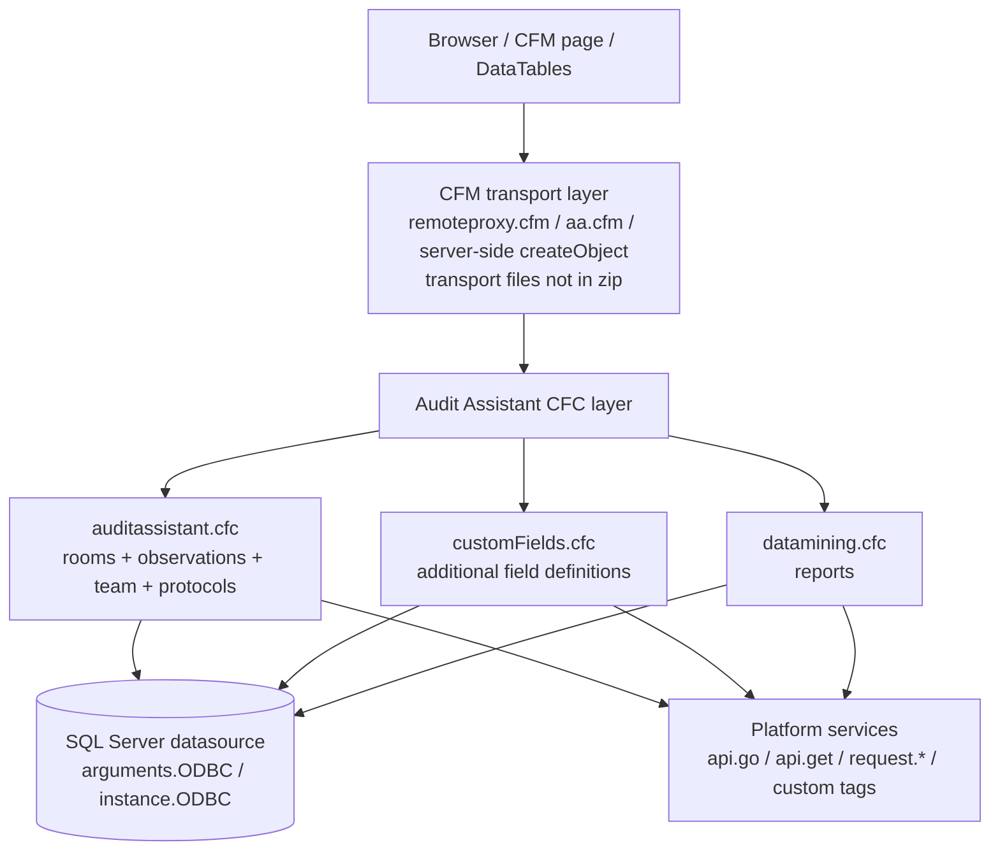
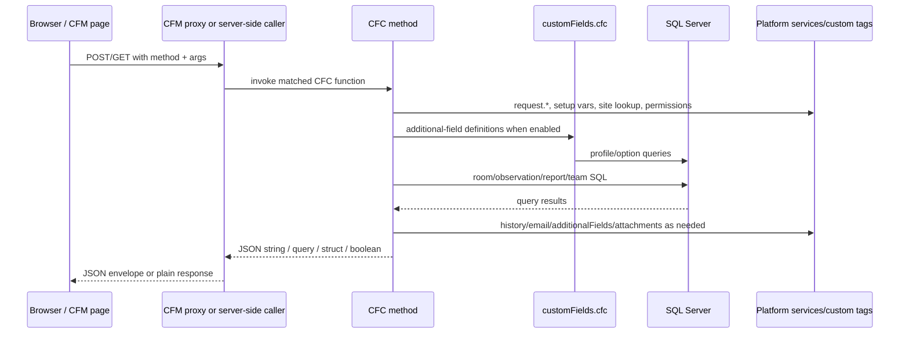
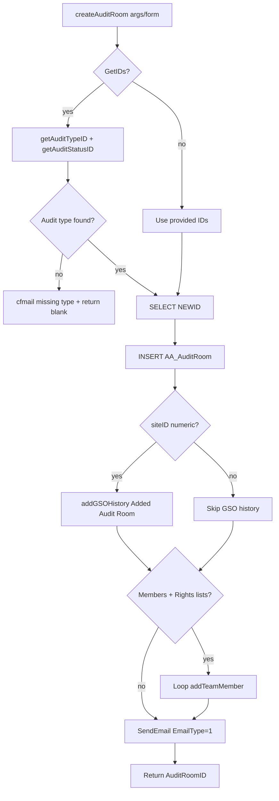
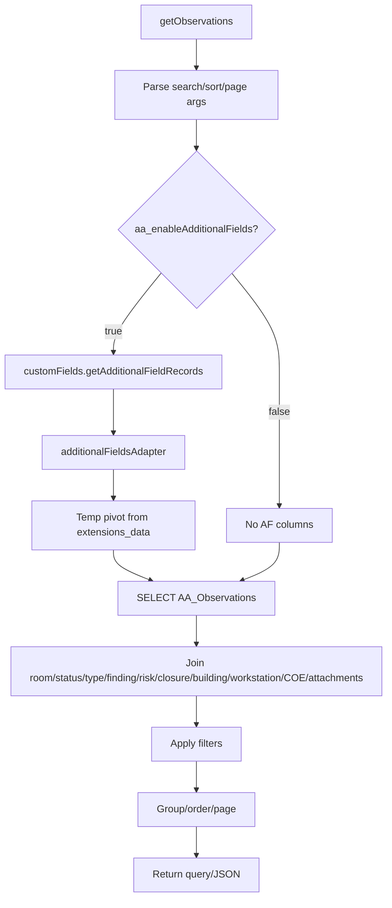
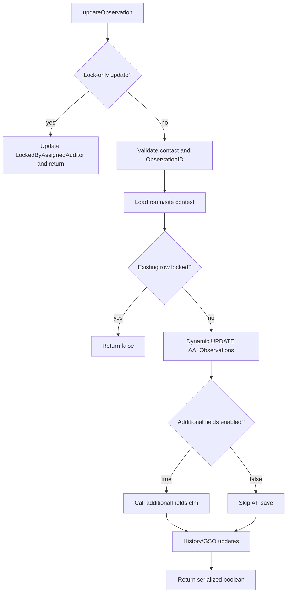
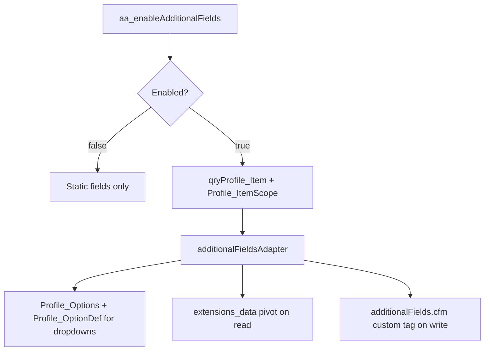
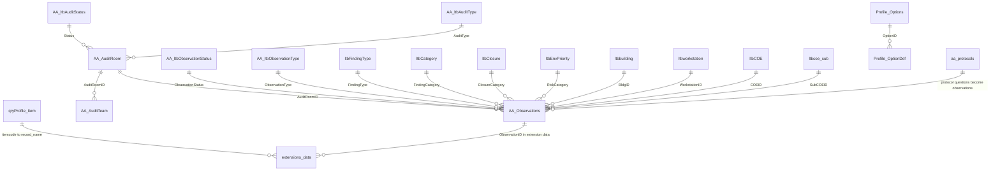
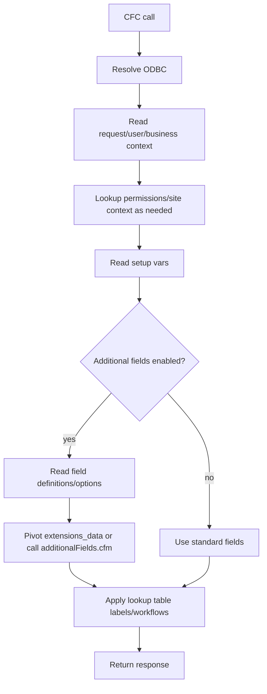

# Audit Assistant — Backend Architecture Reference

> **Purpose:** Backend architecture reference for the included Audit Assistant backend code. It is written for technical requirement assessment, task complexity estimation, change impact analysis, developer assignment, and delivery planning.
>
> **Grounding:** Based only on `backendCode-frontendDoc.zip`: three backend CFCs under `library/cfc/apps/auditAssistant/` plus the included `docs/frontend-architecture.md`. Database DDL/migrations, proxy CFM files, page CFM files, platform custom tags, and most frontend JS are not present and are listed as gaps.
>
> **Generated:** 2026-07-06.

---

## Table of Contents

1. [Backend Project Overview](#1-backend-project-overview)
2. [Backend Architecture](#2-backend-architecture)
3. [Database Architecture](#3-database-architecture)
4. [API Architecture](#4-api-architecture)
5. [Configuration and Differentiation Architecture](#5-configuration-and-differentiation-architecture)
6. [Technical Assessment Support Layer](#6-technical-assessment-support-layer)
7. [Suggested Ownership by Developer Level](#7-suggested-ownership-by-developer-level)
8. [Developer Execution Guide](#8-developer-execution-guide)
9. [Appendices](#9-appendices)

---

# 1. Backend Project Overview

## 1.1 Tech stack

| Concern | Finding | Evidence |
|---|---|---|
| Server language | ColdFusion / CFML | `.cfc` components with `<cfcomponent>`, `<cffunction>`, `<cfquery>`, `<cfargument>`. |
| Application style | Platform-integrated modular monolith | All included backend logic is in `library/cfc/apps/auditAssistant/`. |
| API style | CFC method calls; RPC-style remote methods | `auditassistant.cfc` has `access="remote"` methods. Included frontend doc describes `remoteproxy.cfm?method=<name>`, but that proxy file is absent. |
| Data access | Direct SQL in CFC methods | No repository layer or ORM in the zip. |
| Database | SQL Server / T-SQL | `WITH (NOLOCK)`, `NEWID()`, `OUTPUT inserted`, `OFFSET ... FETCH`, `OPENJSON`, `PIVOT`, and `cf_sql_*` types. |
| Auth/permissions | Platform request context + DB permission/team tables | Uses `request.user`, `request.businessID`, `AA_AuditTeam`, `ltbcontact_permissions`, `ltbapppermissions`. |
| Background jobs / queues | Not found in included backend files | No scheduler, queue, or worker source in this zip. |
| External integrations | Platform services/custom tags | `api.go.getSetupVar`, `api.get('sitelookup')`, `additionalFields.cfm`, `getAttachments`, `aws.s3v4`, `cfmail`. |

## 1.2 Project structure

```text
backendCode-frontendDoc.zip
├── docs/
│   ├── frontend-architecture.md
│   └── backend-architecture.md        # generated by this task
└── library/cfc/apps/auditAssistant/
    ├── auditassistant.cfc             # main backend component
    ├── customFields.cfc               # additional-field config adapter
    └── datamining.cfc                 # Data Mining/reporting component
```

## 1.3 Source file inventory

| File | Lines | Responsibility |
|---|---:|---|
| `library/cfc/apps/auditAssistant/auditassistant.cfc` | 4094 | Main backend component: app activation, audit rooms, observations, lookups, team, rights, emails, protocols, scoring, history, validation. |
| `library/cfc/apps/auditAssistant/customFields.cfc` | 179 | Additional-field metadata retrieval and adapter. Extends `auditassistant`. |
| `library/cfc/apps/auditAssistant/datamining.cfc` | 708 | Data Mining filter routing and custom report query assembly. Extends `auditassistant`. |
| `docs/frontend-architecture.md` | 821 | Existing frontend/integration reference; many referenced CFM/JS files are not included in this zip. |

## 1.4 Major modules

| Module | Main functions/files | Responsibility |
|---|---|---|
| Audit Room Management | `createAuditRoom`, `getAuditRooms`, `getAuditRoomDetails`, `updateAuditRoom`, `updateAuditLead`, `updateAuditComments` | Create/search/update room headers, lead/team linkage, dates, comments, history/email side effects. |
| Observation Management | `getObservations`, `insertObservation`, `updateObservation`, `updateObservations`, `convertFindings`, `updateObservationStatus` | Core observation/finding/action list and CRUD logic, plus locks, lookups, exports, history, and additional fields. |
| Team and Permissions | `addTeamMember`, `RemoveTeamMember`, `updateRights`, `getAuditTeam`, `getAuditRights`, `getUserPermissions`, `grantSiteLead`, `checkUserRights` | Room team membership, rights bitmasking, and app-level permission grants. |
| Lookup Data | `getAuditTypes`, `getAuditStatuses`, `getObservationTypes`, `getObservationStatuses`, `getTypeStatusPairs`, category/risk/COE/building/workstation getters | Dropdowns, validation, and workflow pairings. |
| Additional Fields | `customFields.cfc:getAdditionalFieldRecords`, `getDataOptions`, `additionalFieldsAdapter`; called by `getObservations`, `updateObservation`, `getCustomReport` | Dynamic tenant/config-driven fields; read-time pivot from `extensions_data`; write-time platform custom tag persistence. |
| Data Mining | `datamining.cfc:getReportFilters`, `getCustomReport`, `isCurrentSiteDemo` | Reporting query with dynamic sort/filter/paging, scope, attachments, and additional fields. |
| Protocol Builder | `saveProtocol`, `saveProtocolQuestions`, `loadProtocolQuestions`, `protocolToObservation`, `getProtocols` | Stores protocol metadata/questions in `aa_protocols`, loads questions, converts active questions into observation drafts. |

## 1.5 Entry points

- `access="remote"` methods in `auditassistant.cfc` are the directly exposed backend surface in the included code.
- `access="public"` methods support CFM templates/server-side callers and inherited components. The actual runtime proxy behavior must be verified because `remoteproxy.cfm` is not included.
- No `Application.cfc`, REST route registry, controller layer, worker, scheduler, or migration files are included.

---

# 2. Backend Architecture

## 2.1 High-level architecture



## 2.2 Layers

| Layer | Purpose | Key files | Notes |
|---|---|---|---|
| Transport/page layer | Receives requests and calls CFCs. | Not included; referenced by `docs/frontend-architecture.md`. | Missing files include `remoteproxy.cfm`, `aa.cfm`, `observations_api.cfm`, and page fragments. |
| Service/business/data layer | Performs business logic and data access together. | `auditassistant.cfc`, `customFields.cfc`, `datamining.cfc`. | No controller/service/repository separation in included backend. |
| Configuration layer | Feature flags, fields, labels, tenant behavior, ODBC. | `api.go.getSetupVar`, profile tables, `request.*`, `CC_ODBC`. | Read directly from CFC methods. |
| Database layer | SQL Server tables/views/lookups. | No schema files included. | Derived from inline SQL only. |
| Platform integration | History, additional fields, attachments, S3, mail, site lookup. | Platform custom tags/services outside zip. | High external coupling. |

## 2.3 Request lifecycle



## 2.4 Middleware, validation, errors, and transactions

| Concern | Observed behavior |
|---|---|
| Middleware | None in included CFCs. Runtime page/proxy middleware is outside the zip. |
| Auth | No top-level CFC session guard visible. Methods rely on platform context and caller/proxy/page checks. |
| Validation | Mixed. `validateArgs()` covers selected API-style calls; `validateParams()` checks status/type lookup values; `updateObservation()` validates GUID/existence/contact; other paths interpolate arguments directly. |
| Error handling | Not centralized in included CFCs. Some methods return booleans/JSON strings; actual proxy wrapper is absent. |
| Transactions | No `cftransaction` usage found in the included CFCs. Multi-step write flows can partially succeed unless handled by absent caller/platform code. |
| Logging/history | `addGSOHistory`, `recordHistory`, and `[Record_History]` are used, but platform implementations are outside the zip. |

## 2.5 Core flows

### Audit room creation



### Observation list/read



### Observation update



### Additional field resolution



---

# 3. Database Architecture

## 3.1 Schema availability

No `CREATE TABLE`, migration, model, or ORM files are included. The database section is therefore grounded in inline SQL references only. Primary keys, foreign keys, indexes, data types, and constraints cannot be confirmed from this zip unless explicitly visible in query usage.

## 3.2 Tables / models inventory

| Table/model | Key/constraints evidence | Observed columns | Relationships / usage |
| --- | --- | --- | --- |
| `AA_AuditRoom` | DDL absent. Inferred key from joins/filters: `AuditRoomID`; numeric display: `AuditRoomNumber`. | `auditroomid`, `auditroomnumber`, `auditroomname`, `org`, `suborg`, `site`, `status`, `audittype`, `createdby`, `createddate`, `startdate`, `enddate`, `auditplannerid`, `deptid`, `subcoeid`, `AuditComments`. | Parent of observations and team rows; joins to audit status/type lookups. |
| `AA_Observations` | DDL absent. Inferred key: `ObservationID`; int key: `ObservationID_IntID`; display id: `ObservationViewableID`. | `auditroomid`, `siteid`, `observationtype`, `description`, `createdby`, `createddate`, `assignedauditor`, `observationstatus`, `findingtype`, `findingcategory`, `repeatfinding`, `responsibleperson`, `RiskCategory`, `closurecategory`, `coeid`, `bldgid`, `workstationid`, `subcoeid`, `citation`, `numitems`, `observationdate`, `LockedByAssignedAuditor`, `fastforward`. | Child of audit room; joins to type/status/category/risk/closure/location lookups; extended by `extensions_data`. |
| `AA_AuditTeam` | DDL absent. Inferred relationship: `AuditRoomID` + member/contact. | Room member/contact and rights fields are used by membership and permission functions. | Child of audit room; links users to room rights. |
| `aa_protocols` | DDL absent. Inferred key: `ProtocolID`. | `ProtocolID`, `Name`, `Description`, `Active`, `QuestionsJSON`, `UpdateHistory`, `UpdateUser`, `UpdateDate`. | Stores protocol metadata and question JSON; active questions can become observations. |
| `extensions_data` | Platform table; DDL absent. | `extension_name`, `record_name`, `record_value`, `record_group_id`. | Stores additional-field values for `aaObservation`; pivoted into temporary read columns. |
| Additional-field definition tables | DDL absent. | `qryProfile_Item` fields such as `item`, `itemdesc`, `itemcode`, `datatypeid`, `FormatTypeDesc`, `maxlength`, `fieldsize`, `isrequired`, `supercategory`, `category`, display flags; `Profile_Options` / `Profile_OptionDef` provide options. | Defines dynamic fields/options and report visibility. |
| Lookup/platform tables | DDL absent. | Audit, observation, finding, risk, closure, building, workstation, COE, contact, permission, site, attachment, and history tables/views. | Support dropdowns, permissions, scope, attachments, and history. |


## 3.3 Full observed table/view reference inventory

This table is generated from included CFC SQL references. CTEs, temp tables, and obvious parser false positives are excluded.

| Table/view | Observed responsibility | Evidence lines |
| --- | --- | --- |
| `[Record_History]` | Platform record history. | `library/cfc/apps/auditAssistant/auditassistant.cfc:3345` |
| `AA_AuditRoom` | Core audit-room/header record: room create, search, update, comments, scoring, observation joins. | `library/cfc/apps/auditAssistant/auditassistant.cfc:109`<br>`library/cfc/apps/auditAssistant/auditassistant.cfc:257`<br>`library/cfc/apps/auditAssistant/auditassistant.cfc:348`<br>`library/cfc/apps/auditAssistant/auditassistant.cfc:422`<br>`library/cfc/apps/auditAssistant/auditassistant.cfc:479`<br>`library/cfc/apps/auditAssistant/auditassistant.cfc:513`<br>… (19 refs) |
| `AA_AuditTeam` | Room team membership and rights. | `library/cfc/apps/auditAssistant/auditassistant.cfc:161`<br>`library/cfc/apps/auditAssistant/auditassistant.cfc:432`<br>`library/cfc/apps/auditAssistant/auditassistant.cfc:461`<br>`library/cfc/apps/auditAssistant/auditassistant.cfc:467`<br>`library/cfc/apps/auditAssistant/auditassistant.cfc:607`<br>`library/cfc/apps/auditAssistant/auditassistant.cfc:819`<br>… (12 refs) |
| `AA_ltbAuditStatus` | Audit-room status lookup. | `library/cfc/apps/auditAssistant/auditassistant.cfc:596`<br>`library/cfc/apps/auditAssistant/auditassistant.cfc:798`<br>`library/cfc/apps/auditAssistant/auditassistant.cfc:1355`<br>`library/cfc/apps/auditAssistant/auditassistant.cfc:1561`<br>`library/cfc/apps/auditAssistant/auditassistant.cfc:1674`<br>`library/cfc/apps/auditAssistant/auditassistant.cfc:2769`<br>… (11 refs) |
| `AA_ltbAuditType` | Audit-room type lookup. | `library/cfc/apps/auditAssistant/auditassistant.cfc:602`<br>`library/cfc/apps/auditAssistant/auditassistant.cfc:844`<br>`library/cfc/apps/auditAssistant/auditassistant.cfc:1357`<br>`library/cfc/apps/auditAssistant/auditassistant.cfc:1562`<br>`library/cfc/apps/auditAssistant/auditassistant.cfc:2748`<br>`library/cfc/apps/auditAssistant/auditassistant.cfc:3060`<br>… (9 refs) |
| `aa_ltbobservationmodes` | Referenced by included SQL; schema not included. | `library/cfc/apps/auditAssistant/auditassistant.cfc:1625` |
| `aa_ltbobservationmodesdetails` | Referenced by included SQL; schema not included. | `library/cfc/apps/auditAssistant/auditassistant.cfc:1627` |
| `AA_ltbObservationStatus` | Observation status lookup. | `library/cfc/apps/auditAssistant/auditassistant.cfc:1349`<br>`library/cfc/apps/auditAssistant/auditassistant.cfc:1564`<br>`library/cfc/apps/auditAssistant/auditassistant.cfc:1587`<br>`library/cfc/apps/auditAssistant/auditassistant.cfc:1694`<br>`library/cfc/apps/auditAssistant/auditassistant.cfc:1924`<br>`library/cfc/apps/auditAssistant/auditassistant.cfc:2477`<br>… (13 refs) |
| `AA_ltbObservationType` | Observation type lookup. | `library/cfc/apps/auditAssistant/auditassistant.cfc:54`<br>`library/cfc/apps/auditAssistant/auditassistant.cfc:62`<br>`library/cfc/apps/auditAssistant/auditassistant.cfc:1376`<br>`library/cfc/apps/auditAssistant/auditassistant.cfc:1565`<br>`library/cfc/apps/auditAssistant/auditassistant.cfc:1607`<br>`library/cfc/apps/auditAssistant/auditassistant.cfc:1693`<br>… (11 refs) |
| `aa_ltbrights` | Referenced by included SQL; schema not included. | `library/cfc/apps/auditAssistant/auditassistant.cfc:154`<br>`library/cfc/apps/auditAssistant/auditassistant.cfc:495` |
| `aa_ltbtypestatuspairs` | Referenced by included SQL; schema not included. | `library/cfc/apps/auditAssistant/auditassistant.cfc:1691` |
| `AA_Observations` | Core observation/finding/action record: list, insert, update, conversion, reports, scoring. | `library/cfc/apps/auditAssistant/auditassistant.cfc:70`<br>`library/cfc/apps/auditAssistant/auditassistant.cfc:474`<br>`library/cfc/apps/auditAssistant/auditassistant.cfc:764`<br>`library/cfc/apps/auditAssistant/auditassistant.cfc:1345`<br>`library/cfc/apps/auditAssistant/auditassistant.cfc:1563`<br>`library/cfc/apps/auditAssistant/auditassistant.cfc:1845`<br>… (22 refs) |
| `aa_protocols` | Protocol metadata and question JSON storage. | `library/cfc/apps/auditAssistant/auditassistant.cfc:3492`<br>`library/cfc/apps/auditAssistant/auditassistant.cfc:3498`<br>`library/cfc/apps/auditAssistant/auditassistant.cfc:3502`<br>`library/cfc/apps/auditAssistant/auditassistant.cfc:3540`<br>`library/cfc/apps/auditAssistant/auditassistant.cfc:3602`<br>`library/cfc/apps/auditAssistant/auditassistant.cfc:3662`<br>… (9 refs) |
| `extensions_data` | Platform extension/custom-field values, pivoted into observation/report columns. | `library/cfc/apps/auditAssistant/auditassistant.cfc:1236`<br>`library/cfc/apps/auditAssistant/datamining.cfc:307` |
| `Incident_Data` | ATS/incident scoring integration. | `library/cfc/apps/auditAssistant/auditassistant.cfc:2899`<br>`library/cfc/apps/auditAssistant/auditassistant.cfc:2906`<br>`library/cfc/apps/auditAssistant/auditassistant.cfc:2915` |
| `incident_data` | Lowercase variant of incident data reference. | `library/cfc/apps/auditAssistant/auditassistant.cfc:3030` |
| `ltbapppermissions` | Permission definitions. | `library/cfc/apps/auditAssistant/auditassistant.cfc:1741` |
| `ltbbuilding` | Building lookup. | `library/cfc/apps/auditAssistant/auditassistant.cfc:862`<br>`library/cfc/apps/auditAssistant/auditassistant.cfc:1367`<br>`library/cfc/apps/auditAssistant/datamining.cfc:402` |
| `ltbCategory` | Finding category lookup. | `library/cfc/apps/auditAssistant/auditassistant.cfc:1039`<br>`library/cfc/apps/auditAssistant/auditassistant.cfc:1365`<br>`library/cfc/apps/auditAssistant/auditassistant.cfc:3452`<br>`library/cfc/apps/auditAssistant/datamining.cfc:401` |
| `ltbClosure` | Closure lookup. | `library/cfc/apps/auditAssistant/auditassistant.cfc:887`<br>`library/cfc/apps/auditAssistant/auditassistant.cfc:1359`<br>`library/cfc/apps/auditAssistant/auditassistant.cfc:3428`<br>`library/cfc/apps/auditAssistant/datamining.cfc:398` |
| `ltbCOE` | Department/COE lookup. | `library/cfc/apps/auditAssistant/auditassistant.cfc:610`<br>`library/cfc/apps/auditAssistant/auditassistant.cfc:908`<br>`library/cfc/apps/auditAssistant/auditassistant.cfc:1371`<br>`library/cfc/apps/auditAssistant/datamining.cfc:404` |
| `ltbcoe_sub` | Sub-department lookup. | `library/cfc/apps/auditAssistant/auditassistant.cfc:612`<br>`library/cfc/apps/auditAssistant/auditassistant.cfc:1373`<br>`library/cfc/apps/auditAssistant/datamining.cfc:405` |
| `ltbcontact` | Contact lookup. | `library/cfc/apps/auditAssistant/auditassistant.cfc:359`<br>`library/cfc/apps/auditAssistant/auditassistant.cfc:604`<br>`library/cfc/apps/auditAssistant/auditassistant.cfc:615`<br>`library/cfc/apps/auditAssistant/auditassistant.cfc:724`<br>`library/cfc/apps/auditAssistant/auditassistant.cfc:821`<br>`library/cfc/apps/auditAssistant/auditassistant.cfc:946`<br>… (10 refs) |
| `ltbcontact_extended` | Extended contact metadata. | `library/cfc/apps/auditAssistant/auditassistant.cfc:726`<br>`library/cfc/apps/auditAssistant/auditassistant.cfc:949`<br>`library/cfc/apps/auditAssistant/auditassistant.cfc:999`<br>`library/cfc/apps/auditAssistant/auditassistant.cfc:2835`<br>`library/cfc/apps/auditAssistant/auditassistant.cfc:3123` |
| `ltbcontact_permissions` | App-level permissions. | `library/cfc/apps/auditAssistant/auditassistant.cfc:357`<br>`library/cfc/apps/auditAssistant/auditassistant.cfc:378`<br>`library/cfc/apps/auditAssistant/auditassistant.cfc:947`<br>`library/cfc/apps/auditAssistant/auditassistant.cfc:1751`<br>`library/cfc/apps/auditAssistant/auditassistant.cfc:1764`<br>`library/cfc/apps/auditAssistant/auditassistant.cfc:1774`<br>… (8 refs) |
| `ltbEnvPriority` | Risk category lookup. | `library/cfc/apps/auditAssistant/auditassistant.cfc:1361`<br>`library/cfc/apps/auditAssistant/auditassistant.cfc:3427`<br>`library/cfc/apps/auditAssistant/datamining.cfc:399` |
| `ltbFindingType` | Finding type lookup. | `library/cfc/apps/auditAssistant/auditassistant.cfc:1064`<br>`library/cfc/apps/auditAssistant/auditassistant.cfc:1363`<br>`library/cfc/apps/auditAssistant/datamining.cfc:84`<br>`library/cfc/apps/auditAssistant/datamining.cfc:400` |
| `ltbworkstation` | Workstation lookup. | `library/cfc/apps/auditAssistant/auditassistant.cfc:1369`<br>`library/cfc/apps/auditAssistant/auditassistant.cfc:1713`<br>`library/cfc/apps/auditAssistant/datamining.cfc:403` |
| `org` | Organization table used in room update/site logic. | `library/cfc/apps/auditAssistant/auditassistant.cfc:2269` |
| `Profile_ItemScope` | Additional-field org/location scope filtering. | `library/cfc/apps/auditAssistant/customFields.cfc:24` |
| `Profile_OptionDef` | Additional-field option labels. | `library/cfc/apps/auditAssistant/customFields.cfc:72`<br>`library/cfc/apps/auditAssistant/datamining.cfc:321` |
| `Profile_Options` | Additional-field option mapping. | `library/cfc/apps/auditAssistant/customFields.cfc:70`<br>`library/cfc/apps/auditAssistant/datamining.cfc:309` |
| `qrygroupSiteList` | Group-to-site scope view. | `library/cfc/apps/auditAssistant/datamining.cfc:449` |
| `qryOrgSite` | Org/site/location view. | `library/cfc/apps/auditAssistant/auditassistant.cfc:1378`<br>`library/cfc/apps/auditAssistant/datamining.cfc:98`<br>`library/cfc/apps/auditAssistant/datamining.cfc:408` |
| `qryProfile_Item` | Additional-field definition source. | `library/cfc/apps/auditAssistant/customFields.cfc:24` |
| `setup_businessapp` | App activation check for AppID 177. | `library/cfc/apps/auditAssistant/auditassistant.cfc:93` |
| `site` | Site/org/location and demo-site filtering. | `library/cfc/apps/auditAssistant/auditassistant.cfc:598`<br>`library/cfc/apps/auditAssistant/auditassistant.cfc:864`<br>`library/cfc/apps/auditAssistant/auditassistant.cfc:910`<br>`library/cfc/apps/auditAssistant/auditassistant.cfc:1567`<br>`library/cfc/apps/auditAssistant/auditassistant.cfc:3071`<br>`library/cfc/apps/auditAssistant/datamining.cfc:106`<br>… (11 refs) |
| `SITE` | Referenced by included SQL; schema not included. | `library/cfc/apps/auditAssistant/datamining.cfc:450` |
| `siteAttach` | Attachment metadata. | `library/cfc/apps/auditAssistant/auditassistant.cfc:1352`<br>`library/cfc/apps/auditAssistant/datamining.cfc:394` |


## 3.4 Relationships

The diagram is based on observed joins and filters, not declared constraints.



## 3.5 Data lifecycle

| Entity | Created by | Updated by | Delete/archive behavior | History |
|---|---|---|---|---|
| Audit room | `createAuditRoom()` | `updateAuditRoom()`, `updateAuditLead()`, `updateAuditComments()` | No hard delete observed in included CFCs. | `addGSOHistory()` on create/update paths. |
| Observation | `insertObservation()` and protocol import callers | `updateObservation()`, `updateObservations()`, `updateObservationStatus()`, `convertFindings()` | No physical delete observed; deleted appears to be a status. | `addGSOHistory()` and `recordHistory()`; `[Record_History]` read. |
| Team membership | `addTeamMember()` | `updateRights()` | `RemoveTeamMember()` deletes team rows. | No dedicated team history observed. |
| Additional field values | Platform `additionalFields.cfm` custom tag | `updateObservation()` calls custom tag with edit mode. | Not visible in included code. | Not visible beyond observation history. |
| Protocols | `saveProtocol()` and `saveProtocolQuestions()` | Same methods | No delete observed; `Active` flag controls availability. | `UpdateHistory` string in `aa_protocols`. |

---

# 4. API Architecture

## 4.1 API structure

The included backend does not define REST routes. It defines CFC methods. The included frontend architecture doc describes generic RPC through `remoteproxy.cfm?method=<name>` and purpose-built CFM endpoints, but those files are not present. Therefore the CFC inventory below is the reliable backend surface in this zip.

## 4.2 Remote CFC endpoint inventory

| Transport | Method | Source | Key args | Effect |
| --- | --- | --- | --- | --- |
| POST/CFC remote or proxy | `convertFindings` | `library/cfc/apps/auditAssistant/auditassistant.cfc:22` | ODBC, AssignedAuditor, AuditRoomID, Bldg, Citation, ClosureCategory, COE, CreatedBy, CreatedDate, Description… | Bulk-converts observations in a room to the configured default export type; updates `AA_Observations.observationtype`. |
| POST/CFC remote or proxy | `addTeamMember` | `library/cfc/apps/auditAssistant/auditassistant.cfc:116` | ODBC, AuditRoomID, Member, OrgName, Location, NewAuditRoom, IgnoreContacts, Rights, SaveMode | Validates contact and adds `AA_AuditTeam` row; can validate without saving. |
| POST/CFC remote or proxy | `createAuditRoom` | `library/cfc/apps/auditAssistant/auditassistant.cfc:186` | ODBC, JSONFormat, AuditPlannerID, GetIDs, Members, Rights, siteId, Site, SubOrg, CreatedBy… | Creates `AA_AuditRoom`, resolves type/status, optionally adds team members, sends email. |
| POST/CFC remote or proxy | `getContactRecords` | `library/cfc/apps/auditAssistant/auditassistant.cfc:979` | ODBC, ContactName, ExactMatch, IgnoreContacts, JSONFormat, limitRows | Searches active contacts in `ltbcontact` and `ltbcontact_extended`. |
| POST/CFC remote or proxy | `getObservations` | `library/cfc/apps/auditAssistant/auditassistant.cfc:1093` | ODBC, AuditRoomID, ObservationIDs, siteID, startdate, enddate, isExportedToATS, FastForward, ViewableIDMinimum, ViewableIDs… | Main observation list/count method; supports search, sort, paging, lookups, attachments, and additional-field pivot columns. |
| POST/CFC remote or proxy | `grantSiteLead` | `library/cfc/apps/auditAssistant/auditassistant.cfc:1732` | ODBC, ContactName, OrgName, SubOrg, Location | Creates/grants Site Lead permissions via app permission tables. |
| POST/CFC remote or proxy | `insertObservation` | `library/cfc/apps/auditAssistant/auditassistant.cfc:1814` | ODBC, AuditRoomID, CreatedBy, FastForward, observationtype, description, citation, assignedauditor, findingtype, closurecategory… | Creates `AA_Observations` row and records platform history. |
| POST/CFC remote or proxy | `RemoveTeamMember` | `library/cfc/apps/auditAssistant/auditassistant.cfc:2076` | ODBC, AuditRoomID, Member | Deletes a room team member. |
| POST/CFC remote or proxy | `SendEmail` | `library/cfc/apps/auditAssistant/auditassistant.cfc:2092` | ODBC, EmailType, AuditRoomID, TeamMember | Sends Audit Assistant emails by type through CF/platform mail. |
| POST/CFC remote or proxy | `updateAuditLead` | `library/cfc/apps/auditAssistant/auditassistant.cfc:2113` | ODBC, AuditRoomID, Member | Updates audit lead/team lead behavior and sends related notification. |
| POST/CFC remote or proxy | `updateAuditComments` | `library/cfc/apps/auditAssistant/auditassistant.cfc:2153` | ODBC, AuditRoomID, AuditComments, siteId | Updates audit comments; gated by `AA_enable_AuditComments`. |
| POST/CFC remote or proxy | `updateAuditRoom` | `library/cfc/apps/auditAssistant/auditassistant.cfc:2235` | ODBC, AuditRoomID, CreatedBy, EndDate, Name, Org, Site, StartDate, Status, Suborg… | Updates selected room columns and records history. |
| POST/CFC remote or proxy | `updateObservations` | `library/cfc/apps/auditAssistant/auditassistant.cfc:2343` | odbc, auditRoomNumber, fieldToUpdate, fieldValueToUpdate | Bulk-updates observation fields for a room. |
| POST/CFC remote or proxy | `updateObservation` | `library/cfc/apps/auditAssistant/auditassistant.cfc:2369` | ODBC, AssignedAuditor, LockedByAssignedAuditor, AuditRoomID, Bldg, Citation, ClosureCategory, COE, CreatedBy, CreatedDate… | Updates a single observation, saves additional fields, and records history. |
| POST/CFC remote or proxy | `updateRights` | `library/cfc/apps/auditAssistant/auditassistant.cfc:2713` | ODBC, AuditRoomID, Member, Value | Adjusts room-team rights bitmask. |


## 4.3 Public method inventory

| File:line | Method | Access | Return | Key args | Queries |
| --- | --- | --- | --- | --- | --- |
| `auditassistant.cfc:22` | convertFindings | remote | string | ODBC, AssignedAuditor, AuditRoomID, Bldg, Citation, ClosureCategory, COE, CreatedBy… | 4 |
| `auditassistant.cfc:84` | isActive | public | boolean | BusID, ODBC | 1 |
| `auditassistant.cfc:116` | addTeamMember | remote | string | ODBC, AuditRoomID, Member, OrgName, Location, NewAuditRoom, IgnoreContacts, Rights… | 2 |
| `auditassistant.cfc:186` | createAuditRoom | remote | string | ODBC, JSONFormat, AuditPlannerID, GetIDs, Members, Rights, siteId, Site… | 2 |
| `auditassistant.cfc:451` | getAuditLeads | public | query | ODBC, AuditRoomID | 1 |
| `auditassistant.cfc:489` | getAuditRights | public | array | ODBC | 1 |
| `auditassistant.cfc:751` | getAuditRoomID | public | query | ODBC, ObservationID, observationviewableid | 1 |
| `auditassistant.cfc:781` | getAuditRoomDetails | public | query | ODBC, ObservationID | 0 |
| `auditassistant.cfc:792` | getAuditStatuses | public | query | ODBC | 1 |
| `auditassistant.cfc:838` | getAuditTypes | public | query | ODBC | 1 |
| `auditassistant.cfc:927` | getATSContactRecords | public | query | ODBC, location | 3 |
| `auditassistant.cfc:979` | getContactRecords | remote | any | ODBC, ContactName, ExactMatch, IgnoreContacts, JSONFormat, limitRows | 1 |
| `auditassistant.cfc:1093` | getObservations | remote | any | ODBC, AuditRoomID, ObservationIDs, siteID, startdate, enddate, isExportedToATS, FastForward… | 3 |
| `auditassistant.cfc:1732` | grantSiteLead | remote | boolean | ODBC, ContactName, OrgName, SubOrg, Location | 2 |
| `auditassistant.cfc:1814` | insertObservation | remote | string | ODBC, AuditRoomID, CreatedBy, FastForward, observationtype, description, citation, assignedauditor… | 1 |
| `auditassistant.cfc:2076` | RemoveTeamMember | remote | string | ODBC, AuditRoomID, Member | 1 |
| `auditassistant.cfc:2092` | SendEmail | remote | boolean | ODBC, EmailType, AuditRoomID, TeamMember | 0 |
| `auditassistant.cfc:2113` | updateAuditLead | remote | string | ODBC, AuditRoomID, Member | 0 |
| `auditassistant.cfc:2153` | updateAuditComments | remote | struct | ODBC, AuditRoomID, AuditComments, siteId | 3 |
| `auditassistant.cfc:2235` | updateAuditRoom | remote | string | ODBC, AuditRoomID, CreatedBy, EndDate, Name, Org, Site, StartDate… | 15 |
| `auditassistant.cfc:2343` | updateObservations | remote | not declared | odbc, auditRoomNumber, fieldToUpdate, fieldValueToUpdate | 1 |
| `auditassistant.cfc:2369` | updateObservation | remote | string | ODBC, AssignedAuditor, LockedByAssignedAuditor, AuditRoomID, Bldg, Citation, ClosureCategory, COE… | 8 |
| `auditassistant.cfc:2713` | updateRights | remote | boolean | ODBC, AuditRoomID, Member, Value | 1 |
| `auditassistant.cfc:2740` | getAuditTypeID | public | not declared | ODBC, typeName | 1 |
| `auditassistant.cfc:2761` | getAuditStatusID | public | not declared | ODBC, StatusName | 1 |
| `auditassistant.cfc:2782` | getAuditStatusName | public | not declared | ODBC, StatusID | 1 |
| `auditassistant.cfc:2802` | updateObservationStatus | public | not declared | ODBC, status, ObservationID | 1 |
| `auditassistant.cfc:2827` | validateContacts | public | string | ODBC, contact | 1 |
| `auditassistant.cfc:3482` | saveProtocolQuestions | public | not declared |  | 3 |
| `auditassistant.cfc:3512` | loadProtocolQuestions | public | not declared |  | 2 |
| `auditassistant.cfc:3579` | protocolToObservation | public | query |  | 2 |
| `auditassistant.cfc:3635` | getProtocols | public | query | bOnlyActive | 2 |
| `auditassistant.cfc:3697` | saveProtocol | public | not declared |  | 10 |
| `auditassistant.cfc:3756` | getUserPermissions | public | any | accessName, OrgName, SubOrg, Location, SPECIALRIGHTS | 11 |
| `customFields.cfc:3` | getAdditionalFieldRecords | public | query | RefType, Group, excludeFields, orgName, location, isReportPage | 6 |
| `customFields.cfc:62` | getDataOptions | public | any | itemCode | 2 |
| `customFields.cfc:87` | additionalFieldsAdapter | public | struct | query, formDisplayOnly | 1 |
| `datamining.cfc:21` | getReportFilters | public | any | filter | 0 |
| `datamining.cfc:136` | getCustomReport | public | any | assignedauditor, auditRoom, auditroomlead, auditteam, dept, scopeValue, levelCrit, startDate… | 24 |
| `datamining.cfc:644` | isCurrentSiteDemo | public | boolean | siteid, location, orgname, suborg | 6 |


## 4.4 Endpoint-to-service mapping

| Caller / transport | CFC method | Component | DB tables | Notes |
|---|---|---|---|---|
| Room create/edit/search | `createAuditRoom`, `getAuditRooms`, `updateAuditRoom` | `auditassistant.cfc` | `AA_AuditRoom`, `AA_AuditTeam`, audit lookup tables | Multi-step create/update with history/email side effects. |
| Observation table | `getObservations` | `auditassistant.cfc` + `customFields.cfc` | `AA_Observations`, lookups, `siteAttach`, `extensions_data` | Highest-read complexity; dynamic search/sort/paging and custom fields. |
| Observation save/create | `updateObservation`, `insertObservation` | `auditassistant.cfc` + platform custom tags | `AA_Observations`, `extensions_data`, `[Record_History]` | Highest-write complexity; validation, lock, AF save, history. |
| Data Mining | `getCustomReport`, `getReportFilters` | `datamining.cfc` | Observation/room/lookups/scope/views/profile tables | Report-specific SQL and response shape. |
| Protocol Builder | `saveProtocol`, `saveProtocolQuestions`, `loadProtocolQuestions`, `protocolToObservation`, `getProtocols` | `auditassistant.cfc` | `aa_protocols` | JSON-backed protocol storage. |
| Team/permissions | `addTeamMember`, `RemoveTeamMember`, `updateRights`, `grantSiteLead`, `getUserPermissions` | `auditassistant.cfc` | `AA_AuditTeam`, contact and permission tables | Security-sensitive. |
| Additional-field definitions | `getAdditionalFieldRecords`, `getDataOptions`, `additionalFieldsAdapter` | `customFields.cfc` | Profile field/option tables | Supports observation and report dynamic fields. |

## 4.5 Response patterns

| Pattern | Request shape | Response shape |
|---|---|---|
| Remote CFC plain/JSON | URL/Form args matched to `<cfargument>` names. | JSON strings, booleans, strings, queries, or structs depending on method. |
| DataTables-style | `draw`, `start`, `length`, sort/search/filter args. | `getCustomReport()` returns `draw`, `recordsTotal`, `recordsFiltered`, `data`; `getObservations()` supports the same inputs but wrapping may be done by absent CFM endpoint. |
| Additional-field save | Form fields plus `additionalFields.cfm` custom tag args. | Side-effect write to platform extension storage; parent method returns observation update boolean. |

---

# 5. Configuration and Differentiation Architecture

## 5.1 Configuration sources

| Source | Mechanism | Purpose |
|---|---|---|
| Datasource | `init(ODBC=...)`, `CC_ODBC`, `instance["ODBC"]`, `arguments.ODBC`, `getODBC()` | Select database. |
| Platform request context | `request.user`, `request.businessID`, `request.companyID`, `request.library.*` | User, business, company, paths, custom tags, history. |
| Setup variables | `api.go.getSetupVar(...)` | Flags/defaults: `defaultObservationTypeForExport`, `aa_showArchivedCategories`, `aa_enableAdditionalFields`, `AA_enable_SubDept`, `AA_enable_AuditComments`, `isDemoToggleActivated`. |
| Site lookup | `api.get('sitelookup')` | Site/org/location resolution. |
| Additional field config | `qryProfile_Item`, `Profile_ItemScope`, `Profile_Options`, `Profile_OptionDef` | Dynamic tenant fields and options. |
| Lookup tables | `AA_ltb*`, `ltb*` | Status/type/category/closure/risk/COE/building/workstation options. |
| Permissions | `AA_AuditTeam`, `ltbcontact_permissions`, `ltbapppermissions`, `aa_ltbRights` | App and room access. |
| JSON storage | `aa_protocols.QuestionsJSON` | Protocol question storage. |
| Platform custom tags/services | `additionalFields.cfm`, `getAttachments`, history tags, S3 component | Additional-field persistence, attachments, audit history. |

## 5.2 Field logic

Standard observation fields are hardcoded in `updateObservation()` as conditional SQL assignments. Dynamic additional fields are configuration-driven: `aa_enableAdditionalFields` gates field loading, `customFields.cfc` reads definitions/options, read paths pivot `extensions_data`, and write paths call `additionalFields.cfm`.

## 5.3 Workflow logic

| Workflow | Data/config driven | Code/hardcoded |
|---|---|---|
| Audit room lifecycle | Audit status/type lookup tables. | Create/update behavior, expired/active semantics in callers/CFC. |
| Observation lifecycle | Observation type/status tables and `aa_ltbTypeStatusPairs`. | Special status names and delete/export semantics appear hardcoded in CFC/frontend doc. |
| Export conversion | `defaultObservationTypeForExport`. | `convertFindings()` updates all room observations to the resolved type. |
| Row lock | `LockedByAssignedAuditor` column. | `updateObservation()` short-circuits edits for locked observations. |
| Protocols | `aa_protocols.Active`, `QuestionsJSON`. | No formal state machine; JSON shape is assumed by SQL projections. |
| Demo-site behavior | `isDemoToggleActivated`, `site.isDemo`. | Fallback string match on location containing Demo. |

## 5.4 Client / tenant differentiation

- Platform business/request context drives setup variables and paths.
- Field-level variation is managed through profile/additional-field tables with org/location filters.
- Site/org/location fields and `qryOrgSite`/`site` views drive scope and demo filters.
- Permissions combine app-level contact permissions and room-level `AA_AuditTeam` rights.
- No reliable hardcoded business-ID branch was found in the included backend CFCs.

## 5.5 Configuration resolution flow



## 5.6 Risks and inconsistencies

| Risk | Impact |
|---|---|
| No schema/migration files | DB-impact work requires database introspection or another repository. |
| Monolithic CFC | `auditassistant.cfc` mixes endpoints, service logic, data access, validation, history, email, and protocols. |
| No explicit transactions | Multi-step writes can partially succeed. |
| Mixed SQL parameterization | Some queries use `cfqueryparam`; others interpolate values. Security/correctness review required. |
| Dynamic SQL/pivot for additional fields | Field names and item codes can affect SQL shape; high regression risk. |
| Mixed response contracts | JSON strings, booleans, queries, and structs are returned inconsistently. |
| Missing platform/proxy files | Full auth/error/transport behavior cannot be confirmed from this zip. |

---

# 6. Technical Assessment Support Layer

## 6.1 Change surface map

| Area | Primary functions | Secondary areas | DB impact | API impact | Risk |
| --- | --- | --- | --- | --- | --- |
| Audit room create/update/search | `createAuditRoom`, `getAuditRooms`, `updateAuditRoom`, `getAuditRoomDetails` | Team, email, history, validation helpers | `AA_AuditRoom`, `AA_AuditTeam`, lookups | RPC/server-side CFC | High |
| Observation grid/list | `getObservations` | `customFields.cfc`, Data Mining parity, absent CFM transport | `AA_Observations`, lookups, `extensions_data`, `siteAttach` | DataTables/CFC response | Very High |
| Observation save | `updateObservation`, `insertObservation` | Custom fields tag, history/GSO, contact validation | `AA_Observations`, `extensions_data`, `[Record_History]` | RPC save methods | Very High |
| Additional fields | `customFields.cfc`, `getObservations`, `updateObservation`, `getCustomReport` | Platform `additionalFields.cfm` | Profile tables + `extensions_data` | List/save/report | Very High |
| Data Mining report | `datamining.cfc:getCustomReport` | Attachment/S3 flow, custom fields | Observation tables, lookups, scope views | Report/DataTables response | High |
| Protocol Builder | `saveProtocol*`, `loadProtocolQuestions`, `protocolToObservation`, `getProtocols` | Observation insert callers | `aa_protocols`, `AA_Observations` | RPC/public methods | Medium/High |
| Permissions/team rights | `addTeamMember`, `RemoveTeamMember`, `updateRights`, `getUserPermissions`, `grantSiteLead` | Page permissions outside zip | `AA_AuditTeam`, `ltbcontact*`, permission tables | RPC + server-side checks | High |


## 6.2 Complexity signals

| Signal | Complexity | Reason |
|---|---|---|
| Single lookup/dropdown change | Low | Usually isolated to lookup table/function. |
| Room field change | Medium | Affects room create/update/read and sometimes history/team/email. |
| Observation standard field | High | Affects read, save, report/export, frontend columns, and validation. |
| Additional-field behavior | Very High | Dynamic config, extension storage, pivot SQL, report integration, custom tag persistence. |
| Workflow/status/type behavior | High/Very High | Data-driven pairs plus hardcoded status/type semantics. |
| Permission changes | Very High | Security-sensitive and cross-cutting. |
| Data Mining changes | High | Large query, dynamic columns, scope filters, attachment/S3 behavior. |

## 6.3 Requirement assessment guidance

1. Determine whether the request is a schema change, config change, or code change.
2. Decide whether a field should be a standard column or an additional field.
3. For observation workflow changes, inspect lookup tables plus all hardcoded status/type comparisons outside this zip.
4. For writes, check validation, locks, additional-field save, history/GSO, and transaction needs.
5. For report parity, update `datamining.cfc:getCustomReport` and any absent export/report CFM files.
6. For permissions, treat app-level and room-level access separately.

---

# 7. Suggested Ownership by Developer Level

| Area | Owner | Why | Escalate when |
| --- | --- | --- | --- |
| Lookup dropdowns / labels | Associate Developer | Small query/config changes; low blast radius. | New business semantics or workflow rules. |
| Room fields | Mid-level Developer | Bounded to room methods but can affect history/team/email. | Status/type/permission semantics change. |
| Observation fields | Senior Developer | Read, write, report, export, and frontend alignment required. | New lifecycle or ATS/export behavior. |
| Additional-field architecture | Senior / Lead | Dynamic config, pivot SQL, and platform custom tag storage. | Storage model or tenant resolution changes. |
| Permissions / proxy/auth | Lead Developer | Security-sensitive and broad blast radius. | External API or platform auth changes. |
| System decomposition / migrations | Director / Architect oversight | Current CFC is monolithic and schema source is absent. | REST/service-layer or schema governance work. |


---

# 8. Developer Execution Guide

## 8.1 Adding a new endpoint

1. Add a `<cffunction>` to the right CFC.
2. Use `access="remote"` only for remotely callable methods.
3. Define explicit `<cfargument>` names/types/defaults.
4. Use `cfqueryparam` for SQL inputs.
5. Return a consistent struct/JSON contract for new consumers.
6. Add validation through `validateArgs()` or a new centralized validator.
7. Add history/permission checks intentionally.
8. Add `cftransaction` or platform-equivalent transaction handling for multi-step writes.

## 8.2 Adding a new table

1. Locate the real schema/migration source; it is not in this zip.
2. Define PK/FK/indexes and tenant/scope columns.
3. Add CFC query logic only after schema is available.
4. Document rollback/migration behavior.
5. Update this backend architecture document after the schema is added.

## 8.3 Updating workflow logic

1. Identify whether the rule is lookup-driven, setup-var driven, or hardcoded.
2. For observation type/status rules, inspect `AA_ltbObservationType`, `AA_ltbObservationStatus`, and `aa_ltbTypeStatusPairs`.
3. Search absent CFM/JS files for hardcoded status/type names.
4. Update read, write, Data Mining, export/report, and mobile paths together.
5. Test locked rows, deleted/hidden rows, exported rows, and additional-field rows.

## 8.4 Adding client-specific behavior

1. Prefer existing setup variables.
2. Prefer additional fields for client-specific data capture/reporting.
3. Use `Profile_ItemScope` org/location filters for field scope.
4. Avoid hardcoding client/business IDs in shared CFC code unless architecture review approves.
5. Validate Data Mining parity.

## 8.5 Debugging request flow

1. Identify transport: direct CFM createObject, `remoteproxy.cfm`, `aa.cfm`, report/download, or mobile endpoint.
2. Map the method to [4.2](#42-remote-cfc-endpoint-inventory) or [4.3](#43-public-method-inventory).
3. Compare caller parameter names to `<cfargument>` names.
4. Follow the method’s SQL table references.
5. Check setup vars and additional-field config.
6. Check lock/history behavior if a save returns false or appears silent.

---

# 9. Appendices

## 9.1 File-to-responsibility map

| File | Responsibility |
|---|---|
| `library/cfc/apps/auditAssistant/auditassistant.cfc` | Main backend component. |
| `library/cfc/apps/auditAssistant/customFields.cfc` | Additional-field configuration adapter. |
| `library/cfc/apps/auditAssistant/datamining.cfc` | Data Mining/reporting component. |
| `docs/frontend-architecture.md` | Included frontend/integration reference; useful but not executable backend code. |

## 9.2 Endpoint-to-files map

| Endpoint group | Files/functions |
|---|---|
| Remote CFC methods | `auditassistant.cfc` remote functions in [4.2](#42-remote-cfc-endpoint-inventory). |
| Lookup methods | `auditassistant.cfc` lookup getters. |
| Data Mining | `datamining.cfc:getReportFilters`, `getCustomReport`, `isCurrentSiteDemo`. |
| Additional fields | `customFields.cfc` plus `getObservations`, `updateObservation`, `getCustomReport`. |
| Protocols | `auditassistant.cfc:saveProtocol`, `saveProtocolQuestions`, `loadProtocolQuestions`, `protocolToObservation`, `getProtocols`. |

## 9.3 Config-to-files map

| Config | Evidence | Purpose |
|---|---|---|
| `defaultObservationTypeForExport` | `auditassistant.cfc:convertFindings` | Default type for bulk conversion. |
| `aa_showArchivedCategories` | `auditassistant.cfc:getFindingCategories` | Archived category display. |
| `aa_enableAdditionalFields` | `getObservations`, `updateObservation`, `getCustomReport` | Dynamic custom fields. |
| `AA_enable_SubDept` | `getObservations` | Sub-department columns. |
| `AA_enable_AuditComments` | `updateAuditComments` | Audit comments feature. |
| `isDemoToggleActivated` | `getAuditRooms`, `getCustomReport`, `isCurrentSiteDemo` | Demo-site filtering. |
| `CC_ODBC` / `ODBC` | CFC init/query methods | Datasource selection. |

## 9.4 Assumptions

- The runtime application contains CFM transport/page files described by `docs/frontend-architecture.md`, but those files are not in this zip.
- Database schema exists outside this zip. Keys/relationships are inferred from SQL usage, not confirmed by DDL.
- Platform services/custom tags are supplied by the surrounding Benchmark/Gensuite platform.

## 9.5 Gaps

| Gap | Why it matters | Needed for full certainty |
|---|---|---|
| No DDL/migrations/models | Cannot confirm column types, PKs, FKs, indexes, constraints, triggers, or cascades. | Real schema/migration files or DB introspection. |
| No CFM transport files | Cannot fully verify auth/proxy behavior, response envelope, or caller mapping. | `remoteproxy.cfm`, `aa.cfm`, `observations_api.cfm`, page fragments. |
| No actual frontend JS/CFM besides generated frontend doc | Cannot independently verify every caller and UI path. | Full frontend source. |
| No platform custom tags/services | Cannot verify additional-field persistence, attachments, history, permissions. | Platform library/custom-tag source. |
| No tests | Cannot confirm expected behavior or regressions. | Unit/integration tests or request captures. |

---
