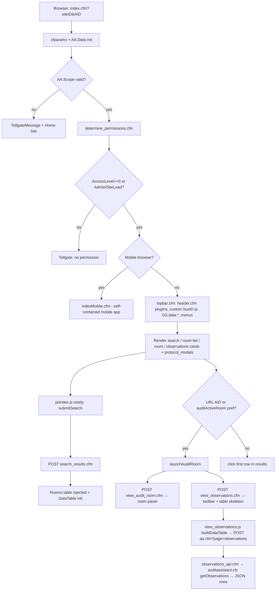
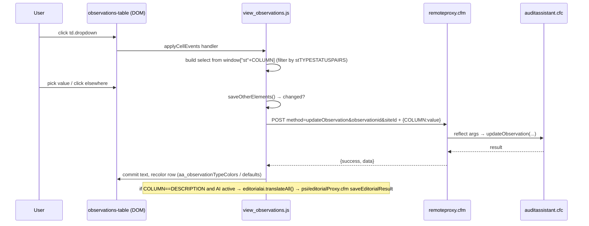
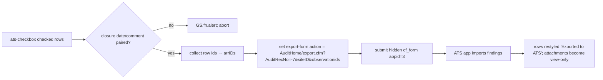
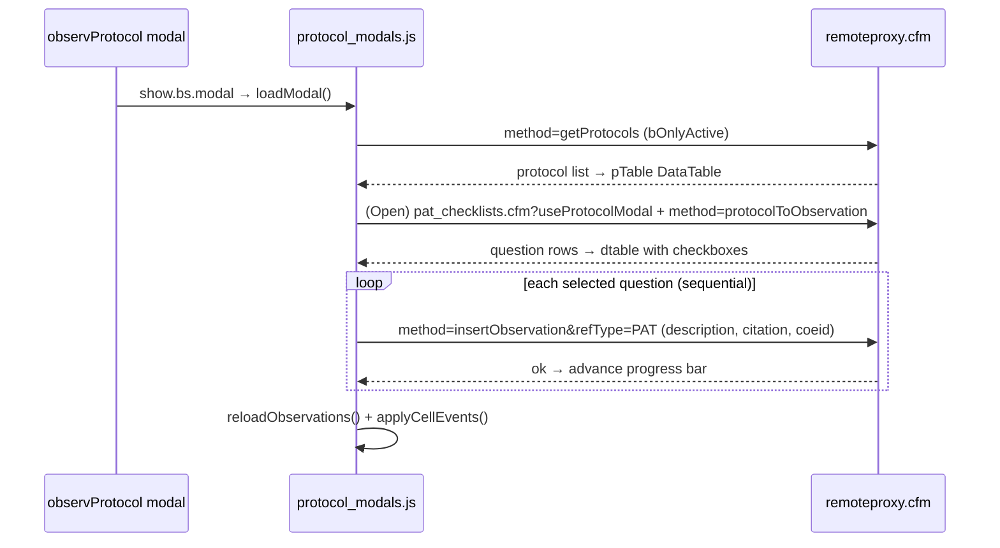
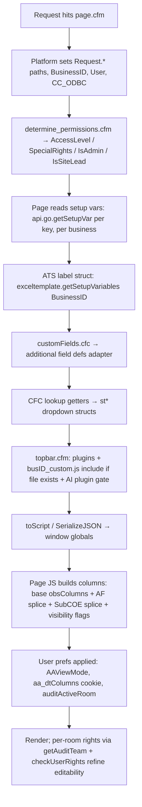

# Audit Assistant — Frontend Architecture Reference

> **Purpose:** Long-term architectural reference for the Audit Assistant (AA) frontend, written for AI-agent and engineering-lead consumption: technical requirement assessment, complexity estimation, developer assignment, and delivery planning.
>
> **Grounding:** Every claim below is based on the actual code in `auditassistant/` (frontend) and `library/cfc/apps/auditAssistant/` (backend CFCs referenced by the frontend). Assumptions are explicitly labeled **[ASSUMPTION]**.
>
> **Generated:** 2026-07-06 from the workspace `AA + CFC GIT`.

---

## Table of Contents

1. [Frontend Project Overview](#1-frontend-project-overview)
2. [Frontend Architecture](#2-frontend-architecture)
   - 2.1 [High-level architecture](#21-high-level-architecture)
   - 2.2 [Application startup and render flow](#22-application-startup-and-render-flow)
   - 2.3 [Feature and page flow mapping](#23-feature-and-page-flow-mapping)
   - 2.4 [Component and function architecture](#24-component-and-function-architecture)
   - 2.5 [State management architecture](#25-state-management-architecture)
   - 2.6 [Shared hooks and utilities](#26-shared-hooks-and-utilities)
3. [Backend Integration Map](#3-backend-integration-map)
   - 3.1 [API architecture overview](#31-api-architecture-overview)
   - 3.2 [Endpoint inventory](#32-endpoint-inventory)
   - 3.3 [Endpoint-to-feature mapping](#33-endpoint-to-feature-mapping)
   - 3.4 [Key request flow diagrams](#34-key-request-flow-diagrams)
4. [Configuration and Differentiation Architecture](#4-configuration-and-differentiation-architecture)
   - 4.1 [Configuration sources inventory](#41-configuration-sources-inventory)
   - 4.2 [Field differentiation](#42-field-differentiation)
   - 4.3 [Workflow differentiation](#43-workflow-differentiation)
   - 4.4 [Per-client / per-tenant differentiation](#44-per-client--per-tenant-differentiation)
   - 4.5 [Configuration resolution flow](#45-configuration-resolution-flow)
   - 4.6 [Configuration risks and maintainability issues](#46-configuration-risks-and-maintainability-issues)
5. [Technical Assessment Support Layer](#5-technical-assessment-support-layer)
   - 5.1 [Change surface map](#51-change-surface-map)
   - 5.2 [Complexity signals](#52-complexity-signals)
   - 5.3 [Change risk indicators](#53-change-risk-indicators)
   - 5.4 [Requirement assessment guidance](#54-requirement-assessment-guidance)
6. [Suggested Ownership by Developer Level](#6-suggested-ownership-by-developer-level)
7. [Developer Execution Guide](#7-developer-execution-guide)
8. [Appendices](#8-appendices)

---

# 1. Frontend Project Overview

## 1.1 Tech stack summary

This is **not** a SPA. Audit Assistant is a classic **server-rendered ColdFusion (CFML) application** with jQuery-based page enhancement, running inside the Gensuite/Benchmark "PowerSuite" platform shell.

| Concern | Technology | Evidence |
|---|---|---|
| Server templating | Adobe ColdFusion (`.cfm` templates, `<cfoutput>`, `<cfmodule>`, `cfscript`) | every page file |
| Business/data layer | ColdFusion Components (CFCs): `auditassistant.cfc`, `datamining.cfc`, `customFields.cfc` | `library/cfc/apps/auditAssistant/` |
| Client scripting | jQuery + plain JS (no module system, global functions/vars) | `auditassistant/js/*.js` |
| UI framework | Bootstrap 4-style (cards, collapse, modal, `d-none` utilities) | markup in all `.cfm` pages |
| Data tables | DataTables (+ Scroller, Buttons, ColReorder, Select, FixedHeader extensions) | `view_observations.js`, `protocol_manage.js`, `protocol_modals.js`, `customReport.js`, `search_results.cfm` |
| Spreadsheet grid | Handsontable (protocol question editor) | `protocol_manage.js` `initHot()` |
| Selects/typeahead | Select2 + platform `gsContactSearch` contact picker | multiple files |
| Dates | flatpickr + moment.js | `view_audit_room.js` `editDate()`, `view_observations.js` |
| Utility lib | lodash (`_`) | throughout JS |
| Legacy dialog | jQuery UI `.dialog()` (Fast Forward window only) | `js/index.js` `initFastForwardWindow()` |
| Guided tour | Bootstrap Tour (`new Tour(...)`) | `protocol_manage.js` `selectProtocolAlert()` |
| Platform framework | Global `GS.*` namespace: `GS.fn.launchModal`, `GS.fn.alert/confirm`, `GS.fn.windowOpen`, `GS.fn.ajax`, `GS.fn.showMask/hideMask`, `GS.fn.translator`, `GS.data.*` (scope/user/app/paths), `GS.topbar`, `GS.fn.editorialai`, `GS.fn.initGennyAI` | `topbar.cfm`, all JS |
| i18n | Server: `AA["translate"].translate()`. Client: `new GS.fn.translator({appID:177})` | all pages; `js/index.js:1` |
| AI features | "editorial-ai" plugin (Describe-It / Writing Help / Data Summarizer, "Genny AI"), Reg Assistant AI panel | `topbar.cfm:44-68`, `view_observations.cfm:472-527`, `index.cfm:63-64` |
| Build/deploy | No frontend build step. Plain files; cache-busted with `?v=NN` query strings; GitLab CI delegates to shared `it/deploy` pipeline; `copyover.bat`/`isilon.bat` for file copy | `.gitlab-ci.yml`, script tags e.g. `index.cfm:87` |

**AppID = 177** identifies Audit Assistant across translation, permissions, and platform calls. **AppID 225** = Reg Auditor ("PAT"/auditor content), **AppID 3** = ATS (Action Tracking System) export target, **AppID 38** = Contacts.

## 1.2 Project structure summary

```
auditassistant/
├── index.cfm                 # Desktop home (entry point). Delegates to indexMobile.cfm on mobile.
├── indexMobile.cfm           # Entire mobile UI + its own JSON mini-API (ajaxPost=1)
├── determine_permissions.cfm # Shared include: user scope + permission resolution
├── topbar.cfm                # Shared include: header/plugins/menus/per-business JS injection
├── topbar_menus.cfm          # Dead code (commented out)
├── footer.cfm                # Trivial closing include
├── aa.cfm                    # Micro-router: ?page=observations → observations_api.cfm
├── observations_api.cfm      # Server-side DataTables JSON endpoint (getObservations)
├── remoteproxy.cfm           # Generic RPC bridge: ?method=X → CFC method by reflection
├── search_results.cfm        # AJAX fragment: audit room list table
├── view_audit_room.cfm       # AJAX fragment: audit room detail panel (inline editing)
├── add_audit_room.cfm        # AJAX fragment: create-room modal form
├── edit_audit_team.cfm       # AJAX fragment: team & rights editor (also embedded in add room)
├── view_observations.cfm     # AJAX fragment: observations toolbar + DataTable skeleton
├── protocol_manage.cfm       # Full page: Protocol Builder (Protocol Author only)
├── protocol_modals.cfm       # Shared modals: Use Protocol, Import Reg Auditor Qns, Add/Edit protocol
├── pat_checklists.cfm        # AJAX fragment(s): Reg Auditor checklist/question search & lists
├── customReport.cfm          # Full page: Data Mining report (filters + server-side DataTable)
├── audit_report.cfm          # Word-document audit report generator (download)
├── audit_scores.cfm          # Standalone "Amazing Audit" gamified scoreboard page
├── export_observations.cfm   # XLS export of one room + observations
├── AAXDownload.cfm           # Excel batch-edit template download (POI-style HTML→XLS)
├── AAXUpload.cfm             # Excel batch-edit upload/validation/apply
├── send_emails.cfm           # Email templates 1–5 (room created/closed/lead changed/member added/reminders)
├── fastforward_action.cfm    # Inbound endpoint: import Quick Notes (Fast Forward) records
├── aa_attachments.cfm        # AJAX fragment: observation attachments modal (platform CTs)
├── customReport.cfm / audit_scores.cfm  (see above)
├── test.cfm, test.getAuditRooms.cfm     # Dev scratch endpoints
├── outage/                   # Static outage/warning message fragments
├── css/                      # styles.css, protocol_manage.css, protocol_modals.css, audit_scores.css
└── js/
    ├── index.js              # Home page: search, room launch, fast-forward dialog
    ├── view_audit_room.js    # Room detail inline editing
    ├── view_observations.js  # Observations DataTable + inline cell editing engine (≈2,200 lines)
    ├── add_audit_room.js     # Room creation validation/submit
    ├── edit_audit_team.js    # Team member add/remove/rights
    ├── protocol_manage.js    # Protocol Builder (Handsontable + DataTables)
    ├── protocol_modals.js    # Use-Protocol modal + protocol→observation import loop
    ├── customReport.js       # Data Mining DataTable + column chooser + exports
    ├── audit_scores.js       # Scoreboard rendering
    ├── table_sorter.js       # Legacy generic table sorter (mostly superseded by DataTables)
    └── custom/busid_1457/custom.js  # Per-business override hooks (see §4.4)
library/cfc/apps/auditAssistant/
    ├── auditassistant.cfc    # Main data/service CFC (~75 methods; 15 access="remote")
    ├── datamining.cfc        # Data Mining/custom report CFC
    └── customFields.cfc      # Additional-fields (custom field) definitions
```

## 1.3 Directory responsibility map

| Path | Responsibility |
|---|---|
| `auditassistant/*.cfm` | Pages + AJAX-loaded fragments + service endpoints (all three roles mixed — see §4.6) |
| `auditassistant/js/` | One JS file per page, loaded via `<script src>` with manual `?v=` cache busting |
| `auditassistant/js/custom/busID_<n>/custom.js` | Per-business (tenant) JS behavior override, auto-included when file exists |
| `auditassistant/css/` | Page-scoped stylesheets; also large inline `<style>` blocks inside `.cfm` files |
| `library/cfc/apps/auditAssistant/` | All SQL/business logic the frontend calls (via `createObject` server-side or `remoteproxy.cfm` client-side) |
| Platform (outside repo) | `GS.*` JS framework, `header.cfm`, custom tags (`DeptSelect2.cfm`, `getattachments.cfm`, `attachdisplay.cfm`, `additionalFields.cfm`, `customize.cfm`, `scopeselect.cfm`, `smallurl.cfm`, `gsoHistory.cfm`, etc.), Contacts `Verification.cfm` |

## 1.4 Major entry points

| Entry | URL pattern | Who reaches it |
|---|---|---|
| Home | `index.cfm?siteID=&AID=|AuditRoomID=` | Normal navigation; `AID` deep-links a room (GUID **or** numeric room number, converted via `getAuditRoomIDFromNumber`) |
| Mobile home | `index.cfm` on a mobile UA → `<cfinclude indexMobile.cfm>` (`index.cfm:66-67`) | Mobile browsers |
| Protocol Builder | `protocol_manage.cfm?siteid=` | "Protocol Author" special right only (`protocol_manage.cfm:90-97`) |
| Data Mining | `customreport.cfm?siteid=` | Reports menu (`topbar.cfm` links.customReport) |
| Audit Report (Word) | `audit_report.cfm?siteid=&auditroomid=&arHeader=..` | Report button in observations toolbar |
| Scoreboard | `audit_scores.cfm?auditTypeName=` | Standalone page ("The Amazing Audit") |
| RPC | `remoteproxy.cfm?method=<cfcMethod>` | All page JS |
| DataTables JSON | `aa.cfm?page=observations` (routes to `observations_api.cfm`) | `view_observations.js` server-side table |
| Inbound integration | `fastforward_action.cfm?siteID=&emailID=&ARID=&ID=` | Quick Notes (mobile app) export |
| Scheduled task | `send_emails.cfm?EmailType=5` | Platform scheduler (`Scheduler_Log.cfm` wrapper) |

---

# 2. Frontend Architecture

## 2.1 High-level architecture

Layers, top to bottom:

1. **Platform shell** — `topbar.cfm` calls the platform `header.cfm` custom tag with a plugin list, then builds the app menu into `GS.topbar.app.data.menu` (`topbar.cfm:73-77, 219-295`). The shell provides `GS.data` (scope, user, paths, template), the translator, and all shared jQuery plugins.
2. **Permission gate** — `determine_permissions.cfm` is `<cfinclude>`d by every page that needs auth (index, view_audit_room, view_observations, protocol_manage, customReport). It resolves `Request.User.AccessLevel / AccessRights / IsAdmin / IsSiteLead` from `ltbcontact_permissions` and tollgates unauthorized users.
3. **Page templates (.cfm)** — render HTML server-side, embed configuration into JS globals via `toScript()` / `SerializeJSON()` (e.g. `view_observations.cfm:554-577` emits `stASSIGNEDAUDITOR`, `stBLDG`, `stFINDINGCATEGORY`… lookup structs).
4. **Fragment templates (.cfm loaded by AJAX)** — `search_results.cfm`, `view_audit_room.cfm`, `view_observations.cfm`, `add_audit_room.cfm`, `edit_audit_team.cfm`, `pat_checklists.cfm`, `aa_attachments.cfm` are fetched with `$.ajax(...).html(data)` and re-execute their own `<script>` blocks on injection.
5. **Page JS** — one global-scope file per page wiring events, building DataTables/Handsontable, and doing inline cell editing.
6. **Service endpoints (.cfm)** — `remoteproxy.cfm` (generic RPC), `aa.cfm`/`observations_api.cfm` (DataTables server-side), plus purpose-built endpoints (AAX*, export, emails, fastforward).
7. **CFC layer** — `auditassistant.cfc` (~75 methods), `datamining.cfc`, `customFields.cfc`. All SQL lives here (plus some raw `<cfquery>` in `audit_report.cfm`, `AAXDownload.cfm`, `pat_checklists.cfm`, `determine_permissions.cfm` — see §4.6).

There is no client router, no client store, no component tree: "components" are CFM fragments + the jQuery code that hydrates them.

## 2.2 Application startup and render flow

`index.cfm` (desktop):

1. Params (`URL.AID`→`URL.AuditRoomID` aliasing, `SiteID` numeric guard) — `index.cfm:16-39`.
2. Instantiates `AA.Data = createObject("…apps/auditassistant/auditassistant").init(ODBC=CC_ODBC, utils=…)` — `index.cfm:42-45`. (This exact 4-line init block is copy-pasted into ~12 files.)
3. Scope validation → tollgate if `AA.Scope` empty or `SiteID eq 0` — `index.cfm:47-54`.
4. `<cfinclude determine_permissions.cfm>` → tollgate if no access.
5. Mobile check → `indexMobile.cfm` and stop, else desktop continues — `index.cfm:66-68`.
6. Resolve `topbarRoomID` from URL or the `auditActiveRoom` user-preference (via platform `customize.cfm` tag) — `index.cfm:72-77`.
7. `<cfinclude topbar.cfm>`: appends `css/styles.css` and (if it exists) `js/custom/busID_<businessID>/custom.js` to header includes; merges plugin list; conditionally adds `editorial-ai` plugin; emits `GS.data.user.SR`, `GS.data.user.accessLevel`, `GS.data.app.pagekey`, `activeRoom`, `isMobileView` via `toScript`; builds topbar menu (Manage/Add Audit Room gated to AccessLevel 3 or Business Administrator; Protocol Builder gated to "Protocol Author").
8. Emits page JS globals (`CFCID = CreateUUID()`, `createdBy`, `siteID`, feature flags) and `$(document).ready` boot logic: auto-launch room from URL AID → else from `auditActiveRoom` cookie → else first search result — `index.cfm:89-137`.
9. Renders announcement banner (`AA.Data.announce(...)` with `AAAnnounce*` setup vars), search filter card, results card, room card, observations card placeholder, and includes `protocol_modals.cfm` + hidden ATS `export-form` (`cf_form appid="3"`).
10. `js/index.js` `$(document).ready` runs `submitSearch(1)` → POST `search_results.cfm` → injects results table.



## 2.3 Feature and page flow mapping

### Home / Audit Room search (`index.cfm` + `js/index.js`)
- **Route:** `index.cfm?siteID=…[&AID=…][&FF=1]`
- **Key functions:** `submitSearch()` (`index.js:3-45`), `launchAuditRoom()` (`index.js:59-107`), `loadObservations()` (`index.js:110-133`), `openAuditRoom()` (`index.js:445-466` — reloads page with `AID=` param), `openAddRoomModal()` (`index.js:327-346`), `getCurrentSiteID()` (`index.js:48-56`).
- **Flow:** filter form → POST `search_results.cfm` (status/team/limitToCurrentSite) → clickable rows → `openAuditRoom` full reload with `AID` → boot logic calls `launchAuditRoom` → two parallel fragment loads (`view_audit_room.cfm`, `view_observations.cfm`).
- **Fast Forward:** `?FF=1` + hidden `#gHFFRecordID` → `initFastForwardWindow()` loads `fastforward_form.cfm` in a jQuery-UI dialog → `addFastForwardObservation()` → `remoteProxy.cfm?method=getFastForwardData`. **[ASSUMPTION]** `fastforward_form.cfm` lives outside this folder (not present in repo); the inbound variant is `fastforward_action.cfm`.

### Audit Room detail (`view_audit_room.cfm` + `js/view_audit_room.js`)
- Loaded with `?bootstrap=true&auditroomid=&siteid=&onlycontent=1`.
- Server computes `isAdmin` (creator, IsAdmin, or team "Manage" right — `view_audit_room.cfm:133-137`) and `canEditAuditComments`; renders room fields with edit affordances only for admins.
- Inline editing: room name (`.ard-input` + `#editName`), audit lead (`editAuditLead` → `confirmAuditLead` → `submitAuditLead` → `remoteProxy?method=updateAuditLead`), type/status dropdowns (`renderSelects`/`renderHTML` → `updateAuditRoomDetails` → `method=updateAuditRoom`), dates (`editDate` with flatpickr, start/end cross-validation), dept/sub-dept (`editDept` → `updateAuditRoomDetails('deptid'|'subcoeid')` then cascades `updateObservations` to re-stamp observations' COE), audit comments (`updateAuditComments`, 1500-char cap).
- Fast-Forward notice banner driven by per-user `AAFFMaxSeen<roomNumber>` preference (`customize.cfm` get/update — `view_audit_room.cfm:162-186`).
- Attachments via platform `getattachments.cfm` + `attachdisplay.cfm` (RefType `AuditRoom`).

### Observations table (`view_observations.cfm` + `js/view_observations.js`) — **the core feature**
- Server side: computes per-user CRUD/export booleans from team rights + lead/admin override + lockdown rule (`view_observations.cfm:116-145`); emits ~14 `st*` lookup structs, `observationTableLabels` (labels come from ATS setup variables), additional-field structures, view modes, AI config; renders toolbar (Add / Batch Upload / Lookup Question / Use Protocol / Report / Export to ATS / print / excel / refresh / Hide Deleted) and an empty `#observations-table`.
- Client side: `buildDataTable()` (`view_observations.js:1361-1651`) creates a **server-side processed** DataTable → POST `aa.cfm?page=observations` (`action=getObservations, auditroomid, siteid, hideDeleted, bCanEdit`). `observations_api.cfm` returns `{draw, recordsTotal, recordsFiltered, data}` with pre-rendered HTML for lock/ats/attachments/history cells.
- Inline cell editing engine: `applyCellEvents()` (`view_observations.js:719-1033`) turns each `td` class (`textbox`, `dropdown`, `datetime`, `contact`, `checkbox`) into an editor on click; `saveOtherElements()` (`:338-575`) commits open editors → `updateObservation()` → `remoteProxy?method=updateObservation` (single column via `extraData`). Type/status coupling enforced via `stTYPESTATUSPAIRS`; Risk→Closure category cascade via `data-closure` attributes.
- Export to ATS: checkbox column (rendered only for status `Pending Export to ATS` or `Draft`+type∈`observationTypesForExport`) → `#export-to-ats-button` / `#export-all-to-ats-button` handlers validate closure date/comment pairing, then submit the hidden `export-form` to the **ATS app's** `export.cfm?AuditRecNo=-7&observationids=…` (`view_observations.js:1913-2046`).
- Batch Excel: `#editBatch` modal (built from `editObservationModal` HTML string in `view_observations.cfm:627-638`) → `AAXDownload.cfm` link and `submitUpload()` (defined in `view_audit_room.cfm:84-106`) posting `AAXUpload.cfm`; result redirects to `index.cfm?...&xlsSuccess=true` or re-downloads a "failed rows" XLS.
- Reports: `#generate-report-button` → section-picker modal (`#reportSelectionModal`) → `audit_report.cfm` download (Word). `#export-to-excel-button` → `export_observations.cfm`.
- History: per-row search icon → `historyUpdate()` → `remoteProxy?method=returnRecordHistory` → modal table.
- Views: `#view-mode-select` (Select2) hides column sets — either hardcoded `simpleViewOmitColumns` (`view_observations.js:1241-1257`) or config-driven `auditAssistantViewModes` setup var; persisted via `setGScookie('AAViewMode', …)`.

### Add Audit Room (`add_audit_room.cfm` + `js/add_audit_room.js`)
- Opened by `openAddRoomModal()` into `GS.fn.launchModal`; embeds `edit_audit_team.cfm` in `NewMode` (no immediate saves).
- `submitRoom()` → `validateRoom()` (name ≤250, dates ordered, dept required per `variables.deptRequired`) → serializes form + `members`/`rights` hidden fields → `remoteProxy?method=createAuditRoom` → `openAuditRoom(false, newid)` reload.

### Team & rights (`edit_audit_team.cfm` + `js/edit_audit_team.js`)
- Rights matrix table: columns from `getAuditRights()`, cell checkboxes carry the right's numeric value in the header `id`; `getRights()` sums them per member (bitmask-style).
- Live mode (`saveMode == "YES"`): every toggle → `method=updateRights` (±value); add → `method=addTeamMember`; remove → `method=removeTeamMember`. New mode: values only serialized into the create-room form.

### Protocol Builder (`protocol_manage.cfm` + `js/protocol_manage.js`)
- Gated: `Protocol Author` right, else `DenySignOn.cfm` abort (`protocol_manage.cfm:90-97`).
- Saved protocols DataTable (`loadProtocols()` → `method=getProtocols`, `drawDatatable()`); per-row `qEdit` (load questions) / `pEdit` (edit metadata modal).
- Question editing: Handsontable `initHot()` with `dataSchema {indexno, sectionname, question, reference, regcit, qntext(guidance), active, lastupdateby, updatedate, qnMod}`; hidden cols `[0,9]`; custom `beforePaste` column mapping (7-col legacy vs 8-col with guidance — `protocol_manage.js:953-978`); auto-stamps user/date on edit; save → `objData()` JSON → `method=saveProtocolQuestions`. Mobile gets a DataTable+modal editing equivalent (`updateDataTable()`).
- Reg Auditor import: `searchQns()` → `pat_checklists.cfm?isProtocolBuilder&searchCheckList` fragment in `#import_questionsModal`; selected questions merged into the grid by `loadQs()` preserving `qnMod` import markers.

### Use Protocol → observations (`protocol_modals.cfm` + `js/protocol_modals.js`)
- `#observProtocol` modal (available on home + mobile): `loadModal()` → `method=getProtocols (bOnlyActive)` → protocols DataTable with name/desc/user/date filters → `Open` → parallel `pat_checklists.cfm?useProtocolModal` (HTML shell) + `method=protocolToObservation` (question rows) → selectable questions DataTable → `#pQuestionAdd` runs a **sequential AJAX loop** of `method=insertObservation&refType=PAT` per question with a progress bar (`protocol_modals.js:43-135`), then reloads the observations table.

### Data Mining (`customReport.cfm` + `js/customReport.js`)
- Filters: scope selector custom tag, room/lead/team/assigned auditor/audit type/obs type/status/date range/dept/finding type/category/category-group/building/workstation + **additional fields** search fragment via `additionalFields.cfm type="SEARCHFIELDS"`.
- `#show_data_btn` → server-side DataTable → `remoteproxy.cfm?getCustomReport&cfcid=customReport&method=getCustomReport` (routes to `datamining.cfc` per `remoteproxy.cfm:69-84`). Column chooser checkboxes persist to cookie `aa_dtColumns_<accessID>`. Excel/CSV export buttons re-query with `length=-1` via an overridden `buttons.exportData()` (`customReport.js:53-117`).

### Word Audit Report (`audit_report.cfm`)
- Server-only: 5 inline `<cfquery>`s (counts by finding type/category, high-priority findings, full observation list), S3 image → Base64 embedding (`convertS3ImageToBase64`, `audit_report.cfm:255-314`), builds an MSO-Word HTML document (WordSection0/1/2, custom header/footer) and streams it as `Audit_Report_<name>.doc` via `attachmentname.cfm`. Section toggles come from `url.arHeader/arSummary/arParticipants/arOverview` (fed by the report modal). Heavy label/branding config (see §4.4).

### Batch Excel (`AAXDownload.cfm` / `AAXUpload.cfm`)
- Download: builds a 3-header-row XLS (max 203 data rows) with hidden lookup row(s) of valid values from CFC lookups; scoped by site/dept queries.
- Upload: `variables.columnsToUpdate` JSON config (`AAXUpload.cfm:56-141`) drives per-column validation (`required`, `lookup`, `charLimit`, `date`, `skipUpdate`); failures produce a failed-rows XLS re-download (via `AAXDownload.cfm getFailedXLS=true`); success redirects to `index.cfm?...&xlsSuccess=true`.

### Emails (`send_emails.cfm`)
- `URL.EmailType` 1=room created, 2=room closed, 3=lead changed, 4=member added, 5=scheduled reminders (ATS export reminder + lockdown reminder). Wrapped in `Scheduler_Log.cfm`. Triggered server-side and via `remoteProxy?method=SendEmail`. **[ASSUMPTION]** callers pass `EmailType` from CFC events; only type 5 runs on the scheduler (`URL.Skip` logic `send_emails.cfm:34-36`).

### Mobile (`indexMobile.cfm`)
- Single 102 KB file containing: a JSON mini-API (POST body `{action: getDeptSelect | getRoomdetails | attachmentRec | viewObservation | …}` handled at top of file, `indexMobile.cfm:1-120+`), plus the full mobile HTML/JS UI (room list, room details, observation add/edit forms, team management) calling both `indexMobile.cfm?ajaxPost=1` and `remoteProxy.cfm`. It duplicates desktop logic (permissions per member, observation CRUD) in mobile-specific form.

### Scoreboard (`audit_scores.cfm` + `js/audit_scores.js`)
- Standalone page (own `gstopbar.cfm` invocation, `forcedesktop=true`) ranking audit rooms by points; `audit_scores.js` fetches via `remoteProxy` (`getObservationScores` / `insertAuditScores` exist in the CFC). Used for "Customer Conference" audit type events.

## 2.4 Component and function architecture

Business-critical units (name → file → role):

| Unit | File | Purpose / notable functions |
|---|---|---|
| Permission resolver | [determine_permissions.cfm](../auditassistant/determine_permissions.cfm) | `qGetUserPermissions` query with org/suborg/location precedence ladder; sets `Request.User.{AccessLevel, AccessRights, IsAdmin, IsSiteLead}`; LMI ("I am really") impersonation override; tollgate |
| Topbar/menu builder | [topbar.cfm](../auditassistant/topbar.cfm) | plugin list merge; per-business `custom.js` injection (`:31-36`); editorial-AI plugin gate (`:44-68`); `loadMenu()` menu assembly with permission gates; `manageProtocols()` opener with Protocol Author tooltip-denial |
| Observation table engine | [js/view_observations.js](../auditassistant/js/view_observations.js) | `obsColumns` (23 base columns `:9-34`) + additional-field splice (`:41-56`) + SubCOE splice (`:60-63`); `buildDataTable`, `applyCellEvents`, `saveOtherElements`, `updateObservation`, `reloadObservations`, `convertFindings`, `openAttachmentsWindow`, `historyUpdate`, ATS export handlers, view-mode logic, responsive header layout (`applyObservationHeaderLayout`) |
| DataTables JSON adapter | [observations_api.cfm](../auditassistant/observations_api.cfm) | `queryToArray()` converts CF query → row objects; injects `atsexport`/`historyupdate` computed columns and lock/attachment HTML; `formatedData()` is dead ("WILL DELETE SHORTLY"); `sendEmail()` debug helper mails a dump to a developer (leftover) |
| RPC bridge | [remoteproxy.cfm](../auditassistant/remoteproxy.cfm) | normalizes URL+FORM into `stAttributes`; cfc registry `{default: auditassistant, customReport: datamining}`; reflection over `GetMetaData(cfc).functions` to map args; wraps result in `{success,timestamp,message,data}`; `debugMode` dumps; on error → `CFCatchEmail.cfm` (silent-to-user failure, `success:false`) |
| Room detail editor | [js/view_audit_room.js](../auditassistant/js/view_audit_room.js) | `updateDetail`/`updateAuditRoomDetails`, `updateAuditComments` (+counter/renderer), `submitAuditLead`, `editDept` (dept→observations cascade via `updateObservations`), `editDate` (flatpickr + 5s auto-revert timeouts), `launchSettings` (team modal) |
| Team rights editor | [js/edit_audit_team.js](../auditassistant/js/edit_audit_team.js) | `getRights()` bitmask sum from header ids; `updatePermissions(member, ±value)`; `addTeamMember`/`submitTeamMember` (deactivated-user rejection), `removeTeamMember` |
| Protocol grid | [js/protocol_manage.js](../auditassistant/js/protocol_manage.js) | `initHot` (Handsontable schema/renderer/paste mapping), `objData` (grid→JSON), `loadProtocols`/`drawDatatable`, `loadTable`, `updateqnNumbers`, guidance-note render/sanitize helpers, `validateForm` (jQuery Validate), mobile fallback `updateDataTable` |
| Protocol→observation importer | [js/protocol_modals.js](../auditassistant/js/protocol_modals.js) | `loadModal` (protocol list + filters), `initBtns` (question table with ColReorder/Select), `#pQuestionAdd` sequential insert loop with progress; `toggleCollapse`/ellipsis-tooltip helpers |
| Data Mining table | [js/customReport.js](../auditassistant/js/customReport.js) | `_dtColumns` (30 columns + additional fields), `prepJson` form serializer, server-side ajax, export override, cookie-persisted column chooser |
| Report generator | [audit_report.cfm](../auditassistant/audit_report.cfm) | inline queries; `convertS3ImageToBase64`; Word-HTML assembly; section toggles; branding via ~12 setup vars |
| Excel round-trip | [AAXDownload.cfm](../auditassistant/AAXDownload.cfm) / [AAXUpload.cfm](../auditassistant/AAXUpload.cfm) | template generation with lookup sheets; `columnsToUpdate` validation config; failed-row re-export |
| Mobile app | [indexMobile.cfm](../auditassistant/indexMobile.cfm) | embedded JSON actions + full mobile UI (`viewObservation`, `editObservation`, `addObservation`, `addRoom`, team row builders `addFullRow*`, `roomDetailsActions`) |

## 2.5 State management architecture

There is no store. State lives in five places:

1. **Server request state** — `Request.User.*` (permissions), `AA` struct (`AA.Data`, `AA.Scope`, `AA.translate`, `AA.AppName`), `variables.*` per template. Rebuilt every request.
2. **JS globals emitted by CFML** — each page writes config/lookup state into `window` (`var stSTATUS = #SerializeJSON(...)#`, `toScript(...)`). The observation editor *reads dropdown options via `window["st"+column]`*, which is the load-bearing convention connecting server lookups to client editors (`view_observations.js:922-994`).
3. **DOM as state** — permissions (`bCanEdit`, `bIsSiteLead`), open-editor counters (`nOpenCells`, `nOpenDetails`), row ids (`tr#<observationid>`), hidden inputs (`#siteID`, `#auditroom_id`, `#gHFFRecordID`, `#fastForward`). Mutations write straight to the DOM then POST.
4. **Platform user preferences** — `customize.cfm` module fields: `auditActiveRoom` (last opened room), `AAViewMode` (table view), `AAFFMaxSeen<roomNo>` (fast-forward high-water mark). Cookies: `AAViewMode` (`setGScookie`), `aa_dtColumns_<accessID>` (Data Mining column picks), plus `localStorage` key `DataTables_ScrollLocationcustomReport`.
5. **DataTables internal state** — server-side paging/sort state per table; `stateSave` only on the Data Mining table.

Async pattern: bare `$.ajax` / `GS.fn.ajax` with success callbacks; no promise chaining discipline; several places rely on `setTimeout` for sequencing (e.g. `view_audit_room.js editDate` 5-second revert timers; `protocol_manage.js loadQs` 250 ms delay).

## 2.6 Shared hooks and utilities

| Utility | Source | Used by |
|---|---|---|
| `AA["translate"].translate(text[, args])` | platform `translationpage` CFC | every template (server-side i18n, appID 177) |
| `oJSTranslator = new GS.fn.translator({appID:177})` | platform | `index.js`, `topbar.cfm`, `view_observations.js`, `protocol_manage.js`, `customReport.js` |
| `GS.fn.launchModal / alert / confirm / showMask / hideMask / windowOpen / makeURLMYGFriendly / initTooltips / initComponents / initContactSearch / initGennyAI / createDataTitles / dateRangeLinks / setCookie / getCookie` | platform framework | all page JS |
| `gsContactSearch()` (select2-based contact picker) | platform plugin (`contactSearch` plugin key) | team search, audit lead, assigned auditor, Data Mining filters |
| `checkUserRights(right, rightsValue)` | `auditassistant.cfc` | `view_audit_room.cfm`, `view_observations.cfm`, `edit_audit_team.cfm`, `indexMobile.cfm` — the per-room rights decoder |
| `api.go.getSetupVar(var=, default=[, appid=])` | platform "go" service | ~40 call sites; primary config mechanism (§4.1) |
| `api.go.getAIconfig(type='Generate'|'Summarize')` | platform | `topbar.cfm`, `view_observations.cfm` AI feature gating |
| `customize.cfm` custom tag (mode=get/update/init) | platform | user-preference persistence (active room, view mode, FF max seen) |
| `additionalFields.cfm` custom tag | platform | renders custom-field form/search fragments (`view_observations.cfm:652-662`, `customReport.cfm:372-387`) |
| `DeptSelect2.cfm`, `buildingSelect.cfm`, `workstationSelect.cfm`, `scopeselect.cfm` | platform custom tags | dept/building/workstation/scope pickers |
| `getattachments.cfm` + `attachdisplay.cfm` | platform custom tags | room & observation attachments (`view_audit_room.cfm:427-453`, `aa_attachments.cfm`) |
| `stripHTML()` / regex script-strip | `view_observations.cfm:44-46`, repeated inline in `observations_api.cfm`, `protocol_modals.js`, `customReport.js`, `protocol_manage.js` | XSS/noise scrubbing of description/citation fields (duplicated logic — §4.6) |
| `formatYesNo`, `decodeHTMLEntities`, `replaceNull`, `GetCustomDate` | `view_observations.js` / `protocol_modals.js` | cell rendering |
| Per-business hook points | `js/custom/busID_<n>/custom.js` | `window['<field>render']` (DataTables cell renderer for an additional field, consumed at `view_observations.js:1341-1343`) and `afterDropdownUpdate(...)` (post-save hook, consumed at `view_observations.js:467-469`) |

---

# 3. Backend Integration Map

## 3.1 API architecture overview

- **No REST layer.** Three transport styles:
  1. **Server-side composition** — templates instantiate CFCs directly (`createObject(...auditassistant).init(ODBC=CC_ODBC, utils=…)`) and render results into HTML. Most read paths work this way.
  2. **Generic RPC** — `remoteproxy.cfm?method=<name>`: merges URL+FORM params, reflects over the target CFC's method signature, invokes with matched args, returns `{"success":bool,"timestamp":…,"message":"","data":<methodResult>}` as JSON. CFC selection via `cfcID` (`default` → `auditassistant.cfc`, `customReport` → `datamining.cfc`). The ubiquitous `cfcid=CFCID` (a page-generated UUID from `index.cfm:96`) sent by most JS calls **does not select a CFC** — unknown ids fall back to `default` (`remoteproxy.cfm:97-99`); it is effectively a no-op session marker. Errors are caught, emailed via `CFCatchEmail.cfm`, and returned as `success:false` with a generic message.
  3. **Purpose-built endpoints** — `aa.cfm?page=observations` (DataTables protocol), `indexMobile.cfm?ajaxPost=1` (JSON body with `action`), `AAXUpload.cfm` (multipart form), `export_observations.cfm`/`AAXDownload.cfm`/`audit_report.cfm` (file downloads), `fastforward_action.cfm` (plain-text boolean response), cross-app ATS `…/export.cfm` (form POST).
- **Auth:** platform session (`Request.User.*`); `remoteproxy.cfm` itself has a TODO admitting no verification include (`remoteproxy.cfm:1`). Page fragments re-include `determine_permissions.cfm`; RPC relies on CFC-level checks. **Client-side** permission flags (`bCanEdit` etc.) are UX-only.
- **Base URL:** relative paths within the app folder; cross-app URLs built from `Request.DomainProtocol + Request.DomainURL + <AppHome>` variables (`AuditAssistantHome`, `AuditHome`, `auditorhome`, `EHSPowerHome`, `ContactsHome`).
- **No retry/interceptor layer.** `GS.fn.ajax` is a thin wrapper; most calls are raw `$.ajax` with `type:"POST"` and querystring args.

## 3.2 Endpoint inventory

### A. `remoteproxy.cfm?method=…` (all HTTP POST; JSON envelope response)

| Method (CFC) | Service file | Triggered from | Key params | Effect / response usage |
|---|---|---|---|---|
| `getObservations` | `auditassistant.cfc` | (mostly via `observations_api.cfm`; direct in mobile) | auditroomid, siteid, getCount, pagination | observation rows |
| `insertObservation` | 〃 | `view_observations.js addObservation()`, `protocol_modals.js` loop, `indexMobile.cfm` | auditroomid, createdby, siteId, coeId, subcoeid, `refType=PAT` (+description/citation for protocol import) | new row; table reload |
| `updateObservation` | 〃 | `view_observations.js updateObservation()`, mobile `editObservation()` | observationid, siteId, `{COLUMN:value}` in body (extraData) | single-field save; row restyle |
| `updateObservations` | 〃 | `view_audit_room.js updateObservations()` | auditroomnumber, fieldtoupdate, fieldvaluetoupdate | bulk re-stamp COE/SubCOE on room dept change |
| `convertFindings` | 〃 | `view_observations.js convertFindings()` ("Update All" header link) | auditroomid, createdby, siteId | converts all obs to default export type; reload |
| `updateAuditRoom` | 〃 | `view_audit_room.js updateDetail/updateAuditRoomDetails` | auditroomid, `<COLUMN>=value` (NAME/TYPE/STATUS/STARTDATE/ENDDATE/deptid/subcoeid), siteId | field save; `data:true/false` |
| `updateAuditComments` | 〃 | `view_audit_room.js updateAuditComments()` | auditroomid, auditcomments | `{success,message}` nested packet |
| `updateAuditLead` | 〃 | `view_audit_room.js submitAuditLead()` | auditroomid, member | lead change (+email #3 server-side **[ASSUMPTION]**) |
| `createAuditRoom` | 〃 | `add_audit_room.js submitRoom()` | full form serialize + members, rights, getids=false, JSONFormat=true | returns new auditroomid (double-JSON-parsed) |
| `addTeamMember` | 〃 | `edit_audit_team.js submitTeamMember()`, `add_audit_room.js getContactList()` (validate mode) | auditroomid, member, orgName, location, savemode | `data:true` → append row; false → "deactivated user" alert |
| `removeTeamMember` | 〃 | `edit_audit_team.js removeTeamMember()` | auditroomid, member, orgName, location | row removal |
| `updateRights` | 〃 | `edit_audit_team.js updatePermissions()` | auditroomid, member, value (± right weight) | rights bitmask adjust |
| `validateContacts` | 〃 | `view_observations.js` contact-cell save | contact | true/false gate before saving Responsible Person |
| `getFastForwardData` | 〃 | `index.js addFastForwardObservation()` | siteID, auditroomid, ffIDs | imports Quick Notes as observations |
| `returnRecordHistory` | 〃 | `view_observations.js historyUpdate()` | observationid, jsonformat=true | history modal rows `data.DATA[]` |
| `getProtocols` | 〃 | `protocol_manage.js loadProtocols()`, `protocol_modals.js loadModal()` | sAuditRoomID / bOnlyActive | protocol list (CF query JSON → `_.queryToArray`) |
| `saveProtocol` | 〃 | `protocol_manage.js #submitNew` | protocolID, protocolName, protocolDesc, protocolActive, aRoomID, PsiteID, updateUser/Date | create/update protocol meta; returns id |
| `loadProtocolQuestions` | 〃 | `protocol_manage.js loadTable()` | id | question rows for Handsontable |
| `saveProtocolQuestions` | 〃 | `protocol_manage.js $save` | data (JSON array), id | persists grid |
| `protocolToObservation` | 〃 | `protocol_modals.js initBtns()` | id | question rows for selection table |
| `getContactRecords` | 〃 | `add_audit_room.js getContactList()` (legacy path) | contactname, exactmatch, ignorecontacts | contact suggestions |
| `SendEmail` | 〃 | server/CFC-triggered (remote-enabled) | — | email dispatch |
| `grantSiteLead` | 〃 | *(no frontend caller found in this folder)* | — | **[ASSUMPTION]** used by admin tooling elsewhere |
| `getCustomReport` (`cfcid=customReport`) | `datamining.cfc` | `customReport.js` (table ajax + export) | filter form fields + DataTables paging + orderData + scopeValue/LevelCrit | `{draw, recordsTotal, recordsFiltered, data(query)}` |
| `getObservationScores` / `insertAuditScores` | `auditassistant.cfc` | `audit_scores.js` **[ASSUMPTION — file lists them; verify call sites]** | siteId, auditTypeName | scoreboard data |

### B. Non-proxy endpoints

| Endpoint | Method | Caller | Purpose |
|---|---|---|---|
| `aa.cfm?page=observations` → `observations_api.cfm` | POST | `view_observations.js` DataTable ajax | server-side paged observation rows (`action=getObservations`) |
| `search_results.cfm?langindex&siteid&isdemosite` | POST (form serialize) | `index.js submitSearch()` | rooms list HTML fragment |
| `view_audit_room.cfm?bootstrap=true&auditroomid&siteid&onlycontent=1` | POST | `index.js launchAuditRoom()` | room panel HTML |
| `view_observations.cfm?auditroomid&siteid&onlycontent=1` | POST | `index.js loadObservations()` | observations toolbar/table HTML |
| `add_audit_room.cfm?orgname&suborg&location&siteId` | POST | `index.js openAddRoomModal()` | create form HTML |
| `edit_audit_team.cfm?auditroomid&siteid&onlycontent=1` | POST | `view_audit_room.js launchSettings()` | team editor HTML |
| `pat_checklists.cfm?searchCheckList | launchCheckList | isProtocolBuilder | useProtocolModal | showResults` | POST | `view_observations.js`, `protocol_manage.js`, `protocol_modals.js` | Reg Auditor question/checklist search fragments (queries `#auditortbl#AuditModule/AuditQn` directly) |
| `aa_attachments.cfm?refId&siteID&viewOnly&bootstrap=true` | GET (`.load`) | `view_observations.js openAttachmentsWindow()` | attachments modal (RefType `AA: Observation`) |
| `AAXDownload.cfm?auditroomid&siteID&deptid` | GET (link) | batch modal | XLS template download |
| `AAXUpload.cfm?siteID` | POST multipart | `submitUpload()` (form action swap in `view_audit_room.cfm:103`) | batch apply; redirect w/ `xlsSuccess` or failed XLS |
| `export_observations.cfm?auditroomid` | GET | excel button | full-room XLS |
| `audit_report.cfm?siteid&auditroomid&arHeader…` | GET (windowOpen download) | report button / section modal | Word .doc |
| ATS `#AuditHome#export.cfm?AuditRecNo=-7&siteID=…&observationids=…` | POST (hidden `#export-form`, appid=3) | ATS export buttons | pushes findings into Action Tracking System |
| `indexMobile.cfm?ajaxPost=1` | POST JSON body | mobile JS | mobile mini-API (`action` field) |
| `fastforward_action.cfm?siteID&emailID&ARID&ID` | GET | external (Quick Notes flow) | imports FF records; prints `true/false` |
| `send_emails.cfm?EmailType=1..5&AuditRoomID…` | GET | server events + scheduler | notification emails |
| `remoteProxy.cfm?method=…&debugMode=1` | — | developers | dumps attributes/result (debug backdoor) |

## 3.3 Endpoint-to-feature mapping

| Feature/Page | UI Entry Files | Hook/Service | Backend Endpoint | Resulting UI Behavior | Notes |
|---|---|---|---|---|---|
| Room search | `index.cfm`, `js/index.js` | `submitSearch` | `search_results.cfm` → `getAuditRooms` | rooms DataTable; first row auto-clicked | `limitToCurrentSite` toggles SiteID filter |
| Open room | `js/index.js` | `launchAuditRoom`/`loadObservations` | `view_audit_room.cfm`, `view_observations.cfm` | two cards populate | active room persisted (`auditActiveRoom`) |
| Observation grid | `view_observations.cfm/js` | `buildDataTable` | `aa.cfm?page=observations` | paged editable grid | serverSide:true, pageLength 50 |
| Cell edit | `view_observations.js` | `saveOtherElements`→`updateObservation` | `remoteProxy?method=updateObservation` | cell commits, row recolors | type/status pairs + risk→closure cascade |
| Add observation | 〃 | `addObservation` | `method=insertObservation` | new top row focused | pulls deptid/subcoeid from room panel DOM |
| ATS export | 〃 | export buttons | ATS `export.cfm` (form POST) | rows marked "Exported to ATS", disabled | closure date/comment pairing validated client-side |
| Batch Excel | `view_observations.cfm`, `view_audit_room.cfm` (submitUpload), AAX* | modal | `AAXDownload` / `AAXUpload` | round-trip edit; failed-row XLS | 203-row cap; `columnsToUpdate` validation |
| Update history | `view_observations.js` | `historyUpdate` | `method=returnRecordHistory` | modal audit trail | |
| Room create | `add_audit_room.cfm/js` | `submitRoom` | `method=createAuditRoom` | reload with new AID | email #1 sent server-side **[ASSUMPTION]** |
| Team & rights | `edit_audit_team.cfm/js` | matrix handlers | `addTeamMember`/`removeTeamMember`/`updateRights` | live-saving matrix | rights encoded as summed weights |
| Room fields | `view_audit_room.cfm/js` | inline editors | `updateAuditRoom`/`updateAuditLead`/`updateAuditComments`/`updateObservations` | in-place updates; dept cascades to observations | |
| Protocol Builder | `protocol_manage.cfm/js` | grid + modals | `getProtocols`/`saveProtocol`/`loadProtocolQuestions`/`saveProtocolQuestions` | Handsontable editing | Protocol Author only |
| Reg Auditor import | `pat_checklists.cfm`, `protocol_modals.cfm` | `searchQns`/`loadQs` | `pat_checklists.cfm` (direct auditor DB SQL) | questions merged to grid | depends on `auditordb` setup var + Reg Auditor app |
| Use Protocol | `protocol_modals.cfm/js` | `loadModal`/`#pQuestionAdd` | `getProtocols`/`protocolToObservation`/N× `insertObservation` | progress bar; observations added as Draft | sequential AJAX loop |
| Data Mining | `customReport.cfm/js` | `#show_data_btn` | `method=getCustomReport (cfcid=customReport)` | server-side results grid + XLS/CSV | column chooser cookie |
| Word report | `view_observations.js` `#dlReport` | section modal | `audit_report.cfm` | .doc download | S3 images embedded Base64 |
| Fast Forward | `js/index.js` | FF dialog | `method=getFastForwardData` / `fastforward_action.cfm` | Quick Notes become observations | banner high-water mark per user |
| Emails | server flows | — | `send_emails.cfm` | notifications | type 5 = scheduler |
| Mobile | `indexMobile.cfm` | embedded JS | `indexMobile.cfm?ajaxPost=1` + `remoteProxy` | parallel mobile UI | duplicates desktop rules |

## 3.4 Key request flow diagrams

**Observation inline edit & save**



**Export to ATS (cross-app)**



**Use Protocol → observations**



---

# 4. Configuration and Differentiation Architecture

## 4.1 Configuration sources inventory

| # | Source | Type | Controls | Consumed in |
|---|---|---|---|---|
| 1 | **Setup variables** — `api.go.getSetupVar(var=,default=[,appid])` | runtime config service (per business/tenant) **[ASSUMPTION: stored server-side per business; mechanism external to repo]** | feature flags, labels, lists, JSON blobs (~40 distinct vars, see below) | nearly every template |
| 2 | **ATS label set** — `apps/ats/exceltemplate.getSetupVariables(BusinessID, LangIndex)` | CFC-provided label struct | field labels shared with ATS: `COE, SUBCOENAME, FINDINGTYPE, CITATION, CLASSIFICATION, BLDG, WORKSTATION, CATEGORY, RESPONPERSON, CORRECTIVEACTION, CLOSEDATE, NUMITEMS, location, riskcategory…` | `topbar.cfm:88`, `view_observations.cfm:30,593-617`, `customReport.cfm/js`, `export_observations.cfm`, `send_emails.cfm` |
| 3 | **Additional fields (custom fields)** — `customfields.cfc getAdditionalFieldRecords()` + `additionalFieldsAdapter()`; rendered by platform `additionalFields.cfm` tag | DB-driven field definitions | extra observation columns: name, label, type (`select`), options map (`data`), position (`itemposition`) | `view_observations.cfm:88-103,525-551`, `view_observations.js:41-56,1332-1357`, `customReport.cfm:94-124`, `customReport.js:36-47`, `remoteproxy.cfm:105-112`, `AAXUpload` (indirectly) |
| 4 | **Per-business JS override** — `js/custom/busID_<businessID>/custom.js` auto-included if the file exists (`topbar.cfm:31-36`) | tenant-specific JS file | cell renderers (`<field>render`), post-save hooks (`afterDropdownUpdate`) | e.g. `busid_1457/custom.js` computes Priority from EHS/Regulatory risk additional fields |
| 5 | **Lookup tables via CFC getters** — `getAuditTypes, getAuditStatuses, getObservationTypes, getObservationStatuses, getTypeStatusPairs, getFindingTypes, getFindingCategories, getClosureCategories, getRiskCategories, getBuildingOptions, getCOEOptions, getWorkstations, getNumItemsOptions, getRepeatFindingOptions, getObservationViews, getAuditRights` | DB lookup tables | dropdown contents, type↔status workflow pairs, rights definitions | serialized into `st*` JS globals |
| 6 | **User preferences** — `customize.cfm` fields (`auditActiveRoom`, `AAViewMode`, `AAFFMaxSeen<n>`); cookies (`AAViewMode`, `aa_dtColumns_<accessID>`); localStorage (Data Mining scroll) | per-user | last room, view mode, column picks | `index.cfm`, `view_audit_room.cfm`, `view_observations.js`, `customReport.js` |
| 7 | **Permission data** — `ltbcontact_permissions` (app-level) + `AA_AuditTeam` rights (room-level, via `getAuditTeam`/`checkUserRights`) + special rights strings (`Business Administrator`, `Site Lead`, `Protocol Author`) | DB | menu items, edit affordances, page access | `determine_permissions.cfm`, `topbar.cfm`, fragments |
| 8 | **Environment/path variables** — `Request.DomainProtocol/DomainURL`, `AuditAssistantHome/MasterPath`, `AuditHome` (ATS), `auditorhome`/`EHSPowerHome` (Reg Auditor), `ContactsHome`, `CC_ODBC` | platform request scope **[ASSUMPTION: set by platform Application/host config]** | cross-app links, script srcs, datasource | all templates |
| 9 | **AAX upload validation** — `variables.columnsToUpdate` JSON param | in-file JSON default (overridable param) | Excel batch column rules | `AAXUpload.cfm:56-141` |
| 10 | **AI config** — `api.go.getAIconfig(type)` + setup vars `describeit-active`, `describeit-appconfig` (JSON with `enabledFields`) | runtime | Describe-It / Writing Help / Summarizer visibility & activation | `topbar.cfm:44-68`, `view_observations.cfm:472-527`, `view_observations.js:592-607,629-652` |
| 11 | **Conditional code acting as config** — mobile vs desktop branch (`request.browsercheck.isMobile()`), `isDemoSite` filtering, hardcoded announcement default text (`index.cfm:150`), hardcoded scoreboard default `auditTypeName='Customer Conference'` (`audit_scores.cfm:10`) | code | behavior differences | listed files |

**Setup variables observed (defaults in parentheses):** `aa_bShowRiskCategory(false)`, `aa_bShowClosureCategory(true)`, `hasRegAssistant(0, appid 225)`, `AuditLeadLabel(Lead)`, `TeamLabel(Team)`, `AA_enable_AuditComments(true)`, `AA_enable_SubDept(false)`, `aa_enableAdditionalFields(true)`, `AA_descriptionLabel(Description)`, `auditAssistantViewModes('' | JSON)`, `aa_observationTypeColors('' | JSON)`, `obsReportTypeList(Finding)`, `observationTypesForExport(Finding)`, `defaultObservationTypeForExport(first of previous)`, `isAuditReportEnabled(false)`, `aa_showAuditReport(false)`, `describeit-active(false)`, `describeit-appconfig({})`, `AA_approvedExtensions('')`, `protocolDefaultSelectAll(false)`, `AAAnnounceEndDate/AAAnnouceMessage/AAAnnouceLink/AAAnnouceLinkName/AAAnnouceType`, `auditordb('', appid 225)`, `lbl_customBusiness(#gebusiness#)`, `AA_customDocName('')`, `AA_customDocNameTitle(HSE)`, `AA_CustomDocReportStyles('')`, `AA_customFooterAuditReport(false)`, `AA_lbl_HSE(Health, Safety & Environmental)`, `nLogoWidth(300)`, `RegFindingType(Regulatory)`, `NonRegFindingType(Non-Regulatory)`, `HideDeleteButton(0)`.

## 4.2 Field differentiation

How observation-table fields vary today (mechanisms in order of precedence):

1. **Hardcoded base schema** — `obsColumns` array in `view_observations.js:9-34` defines the 23 standard columns, their cell-editor class (`textbox|dropdown|datetime|contact|checkbox|static`), data key, and orderability. The matching `<td>` classes are re-emitted server-side in the `obsReload` branch of `view_observations.cfm:220-280`. **Any new standard column touches both.**
2. **Labels are config-driven** — `observationTableLabels` (`view_observations.cfm:593-617`) mixes literal labels with ATS setup-variable labels and `AA_descriptionLabel`; all pass through `AA.translate`.
3. **Visibility flags** — `aa_bShowRiskCategory` / `aa_bShowClosureCategory` toggle those two columns via injected `d-none` class (`view_observations.js:6-7`, `view_observations.cfm:20-21`); `AA_enable_SubDept` splices the SubCOE column in three places (`view_observations.js:60-63`, `observations_api.cfm:169-171`, server row loop).
4. **View modes** — column sets per view: hardcoded `simpleViewOmitColumns` (`view_observations.js:1241-1257`) or tenant JSON `auditAssistantViewModes` mapping viewName→column list (`view_observations.js:1592-1612`).
5. **Additional fields (schema-driven)** — `customfields.cfc` records spliced into `obsColumns` at `itemposition` with class `custom_dropdown af_<name>`; options exposed as `st<NAME>` structs; rendering overridable per business via `window['<name>render']`.
6. **Editability** — driven by `bCanEdit`/`bIsSiteLead` (+ `sitelead` class marking site-lead-editable columns), row lock checkbox (`locked-checkbox` blocks other editors), `Exported to ATS` status (row `no-edit`), lockdown mode (`REQUEST.bLockDownEnabled` + room `lockedDown` + zero open observations → all editing off, `view_observations.cfm:137-145`).
7. **Validation** — sparse and client-side: textarea `maxlength` (4000; 500 for corrective action — `view_observations.js:900-903`), contact validation via `method=validateContacts`, closure date/comment pairing at export, type↔status legality via `stTYPESTATUSPAIRS`. Batch path has its own server-side rules (`AAXUpload columnsToUpdate`).

Room-detail fields (`view_audit_room.cfm`) follow the same pattern: labels via setup vars (`AuditLeadLabel`, `TeamLabel`, ATS `COE`), visibility via flags (`AA_enable_AuditComments`, `AA_enable_SubDept`), editability via `isAdmin`/date rules.

## 4.3 Workflow differentiation

- **Observation lifecycle** is data-driven at the pair level: `getTypeStatusPairs()` returns legal (Type, Status) combinations; the UI disables illegal options (`view_observations.js:940-963,446-465`). Status names themselves (`Draft`, `Pending Review`, `Pending Export to ATS`, `Exported to ATS`, `Deleted`) are **hardcoded strings** compared throughout JS and CFML (row coloring, ats-checkbox eligibility, lockdown open-count query `view_observations.cfm:139`).
- **Export eligibility** is config-driven: `observationTypesForExport` + `defaultObservationTypeForExport` decide which types get the ATS checkbox and what "Update All" converts to.
- **Room lifecycle**: statuses from `getAuditStatuses()`; "Active (Expired)" is computed client/server-side from EndDate (`search_results.cfm:111-119`, `view_audit_room.cfm:303-322`); closing a room removes the `clickable` affordance (`view_audit_room.js renderHTML`). Lockdown workflow adds `bLockDownEnabled` gates.
- **Protocol workflow**: Protocol Author right gates the whole builder; protocols/questions are plain CRUD (no state machine); active flag drives availability in Use-Protocol modal (`bOnlyActive`).
- **Route/module differences**: desktop vs mobile is a full template fork (`indexMobile.cfm`); Reg Auditor integration only active when `auditorhome`/`AAPowerIntegration` present (`view_observations.cfm:709-713`, `topbar.cfm:152-161`).

Where configured vs hardcoded, in one line: **states & pairs = DB lookup tables; state *semantics* (what each status means for UI) = hardcoded string comparisons in JS/CFML.**

## 4.4 Per-client / per-tenant differentiation

Client identity = **BusinessID** (platform scope; `request.businessID`), plus Org/SubOrg/Location scope inside a business.

| Mechanism | Where | What differs |
|---|---|---|
| Setup variables per business | `api.go.getSetupVar` everywhere | feature on/off (SubDept, AuditComments, RiskCategory, report type), labels (Lead/Team/Description/HSE/finding types), lists (export types), JSON (view modes, type colors), branding (logo width, custom doc name/footer) |
| ATS label set per business | `exceltemplate.getSetupVariables(BusinessID…)` | most column labels (COE/Dept, Citation, Category…) |
| Additional fields per business | `customFields.cfc` records | extra columns + options (+report filters) |
| Per-business JS file | `js/custom/busID_<n>/custom.js` (`topbar.cfm:31-36`) | arbitrary client behavior; today: Priority auto-calc for business 1457 |
| Permission scope ladder | `determine_permissions.cfm:19-42` | org → suborg → location permission resolution |
| Branding in Word report | `audit_report.cfm:28-38,441-513` | logo file `companylogo_<companyID>.png` (fallback `companylogo_101.png`), custom business name, footer legal text variant, doc title, header style |
| Environment-based | `Request.Domain*`, `*Home` paths, `CC_ODBC` | deploy-target differences (env, not tenant) |
| Demo-site logic | `isdemosite` param through search/data mining (`search_results.cfm`, `customReport.cfm:68`) | demo rooms hidden from live sites |
| Hardcoded client branches | none found in this folder besides the busID file convention — differentiation is config/file-convention based, not `if business == X` in shared code | — |

Separation summary: **env-based** = request paths/ODBC; **runtime-config** = setup vars + ATS labels + additional fields (all per-BusinessID); **tenant-ID-based file** = `busID_<n>/custom.js`; **backend-controlled** = lookup tables and permissions; **hardcoded** = status semantics and the base column schema.

## 4.5 Configuration resolution flow



## 4.6 Configuration risks and maintainability issues (evidence-backed)

1. **Column schema duplicated in 3+ places** — base observation columns exist in `view_observations.js obsColumns`, the server-rendered row loop in `view_observations.cfm:220-280`, `observations_api.cfm` (computed columns + dead `formatedData` column list `:161-167`), `AAXDownload/AAXUpload` column configs, and `customReport.js _dtColumns`. A new field requires synchronized edits in all.
2. **`AA.Data` init block copy-pasted** into ~12 templates (`createObject(...auditassistant).init(...)`), rather than one shared include.
3. **Status/type semantics as magic strings** — `"Pending Export to ATS"`, `"Draft"`, `"Deleted"`, `"Exported to ATS"`, `"Note"`, `"Finding"` compared literally in `view_observations.js`, `view_observations.cfm`, `observations_api.cfm`. Renaming a status in the DB breaks UI logic silently.
4. **Dead/duplicate endpoint code** — `observations_api.cfm formatedData()` marked "REPLACED … WILL DELETE SHORTLY"; `sendEmail()` there mails debug dumps to a personal address (`loli.delgado@gensuitellc.com`). `topbar_menus.cfm` fully commented out. Large commented blocks throughout (`index.js:352-413`, `audit_report.cfm:844-874`).
5. **remoteproxy has no auth include** — the file's first line is `<!--- TODO: include verification and te_verification? --->`; any remote-enabled CFC method is callable with page session; `debugMode=1` dumps internals.
6. **SQL in view files** — `audit_report.cfm` (5 queries), `AAXDownload.cfm`, `pat_checklists.cfm`, `determine_permissions.cfm` embed `<cfquery>` with string-interpolated values in places (e.g. `determine_permissions.cfm:29` interpolates `contact_name`; `audit_report.cfm` interpolates `url.AuditRoomID` into WHERE clauses while using `cfqueryparam` only for the type list).
7. **Config mixed with business logic** — AI gating logic (parse `class` string for `"ai-show"`/`"ai-active"`) duplicated in `topbar.cfm:62` and `view_observations.js:599-607`; script-strip regex duplicated in 4 files.
8. **DOM-coupled data flow** — dept/subcoe for new observations read from another fragment's DOM (`$('div#deptidView').data('deptid')`, `view_observations.js:154-160`); export flow mutates and re-uses a hidden cross-app form. Fragile under markup changes.
9. **Sequencing by timeout** — 1000 ms `loadroom` guard (`index.js:61-77`), 5 s date-editor auto-revert (`view_audit_room.js:510-517`), 200–500 ms `setTimeout` chains in protocol code; race-prone.
10. **Cache busting is manual and inconsistent** — `?v=13`, `?v=1.2.2`, `?v=15.2`, and `?v=#rand()#` (customReport — defeats caching entirely each request).
11. **indexMobile.cfm monolith** — 102 KB single file duplicating desktop permission and CRUD logic; any workflow change must be re-implemented there.
12. **Typo'd/global JS state** — globals without `var` (`nOpenCells`, `changed`), `escape()` (deprecated) for encoding, IE-era polyfills; consistent with the codebase but raises regression risk on refactors.

---

# 5. Technical Assessment Support Layer

## 5.1 Change surface map

| Area | Primary Files | Secondary Files | Endpoint Impact | Config Impact | Risk Notes |
|---|---|---|---|---|---|
| Observation grid (columns/editing) | `js/view_observations.js`, `view_observations.cfm` | `observations_api.cfm`, `remoteproxy.cfm`, `AAXDownload/Upload.cfm`, `export_observations.cfm`, `customReport.js`, `indexMobile.cfm` | `getObservations`, `updateObservation` | st* lookups, additional fields, view modes, labels | Highest coupling in app; column indexes via `dtIndexArr` are order-sensitive |
| Room details | `view_audit_room.cfm`, `js/view_audit_room.js` | `view_observations.js` (reload btn), `send_emails.cfm` | `updateAuditRoom/Lead/Comments`, `updateObservations` | AuditLeadLabel, TeamLabel, AA_enable_* | Dept change cascades into observations |
| Room search/home | `index.cfm`, `js/index.js`, `search_results.cfm` | `topbar.cfm` | `getAuditRooms` | statuses, SiteLabel | AID deep-link + cookie interplay |
| Room create | `add_audit_room.cfm/js`, `edit_audit_team.cfm/js` | `send_emails.cfm` | `createAuditRoom`, `addTeamMember` | deptRequired, DeptSelect2 | Team editor dual-mode (NewMode) |
| Team/rights | `edit_audit_team.cfm/js` | `view_audit_room.js` | `updateRights/add/removeTeamMember` | getAuditRights weights | Rights math from header ids |
| ATS export | `view_observations.js` (2 near-duplicate handlers), `view_observations.cfm` toolbar | ATS app `export.cfm` (external) | cross-app form POST | observationTypesForExport | Contract owned by ATS team |
| Protocol Builder | `protocol_manage.cfm/js`, `protocol_modals.cfm` | `pat_checklists.cfm`, css files | `getProtocols/saveProtocol/loadProtocolQuestions/saveProtocolQuestions` | protocol_* labels, guidance config | Handsontable column indexes hard-coded incl. paste mapping |
| Use Protocol import | `protocol_modals.js` | `view_observations.js` (reload) | `protocolToObservation`, N×`insertObservation` | protocolDefaultSelectAll, AA_enable_SubDept | Sequential loop = slow for big protocols |
| Reg Auditor search | `pat_checklists.cfm` | `protocol_manage.js`, `view_observations.js` launchers | direct SQL on `#auditortbl#` tables | auditordb, auditorhome | External schema dependency (appid 225) |
| Data Mining | `customReport.cfm`, `js/customReport.js` | `remoteproxy.cfm` (cfcid registry), `datamining.cfc` | `getCustomReport` | additional fields (report mode), ATS labels | Export path re-queries with length=-1 |
| Word report | `audit_report.cfm` | `view_observations.js` (modal params) | inline SQL; S3 service | ~12 branding setup vars | MSO-HTML fragile; S3/Base64 failure modes |
| Batch Excel | `AAXDownload.cfm`, `AAXUpload.cfm` | `view_audit_room.cfm submitUpload`, `index.cfm` result banners | own upload pipeline | columnsToUpdate JSON | 203-row cap; header row math |
| Emails | `send_emails.cfm` | CFC callers | n/a | labels, ATSLabel | Scheduler type 5 |
| Mobile | `indexMobile.cfm` | everything it mirrors | own ajaxPost API + remoteProxy | same flags | Must mirror any workflow change |
| Permissions/menu | `determine_permissions.cfm`, `topbar.cfm` | all pages | ltbcontact_permissions | special rights strings | Shared by every page; change = app-wide regression surface |

## 5.2 Complexity signals

| Area | Files | Cross-module deps | Config branching | Structural complexity |
|---|---|---|---|---|
| Observation grid & inline editing | 3 core + 6 secondary | ATS, attachments, AI, custom fields, mobile | very high (flags, labels, view modes, AF, colors, AI) | **Very High** |
| indexMobile.cfm | 1 (huge) | mirrors 6 desktop flows | high | **Very High** (monolith, duplicated rules) |
| Batch Excel (AAX*) | 2 | observation schema, lookups | medium (columnsToUpdate) | **High** |
| Protocol Builder | 3 + css | Reg Auditor, Handsontable | medium | **High** |
| Data Mining | 2 + datamining.cfc | additional fields, scope select | medium | **High** |
| Word report | 1 | S3, site/logo assets, ATS labels | high (branding vars) | **High** |
| Room details editor | 2 | observations cascade, emails | medium | **Medium** |
| Use Protocol import | 2 | observations reload | low | **Medium** |
| Team/rights | 2 | room create embed | low | **Medium** |
| Home/search | 3 | topbar, cookie prefs | low | **Medium** |
| ATS export UI | 1 (2 duplicated handlers) | external ATS contract | low | **Medium** (duplication + external contract) |
| Emails | 1 | CFC triggers, scheduler | low | **Medium** |
| Room create | 2 | team editor, emails | low | **Low–Medium** |
| Attachments fragment | 1 | platform CTs | low | **Low** |
| Scoreboard | 2 | remoteProxy | low | **Low** |
| Exports (XLS single room) | 1 | lookups/labels | low | **Low** |

## 5.3 Change risk indicators

- **`determine_permissions.cfm` and `topbar.cfm` are included everywhere** — a defect there breaks every page.
- **Column-order sensitivity** — `dtIndexArr.indexOf(...)` and `th` `id` assignment at `initComplete` (`view_observations.js:1555-1557`) mean column insertion in the wrong place silently breaks editors, ATS checkbox placement, and view modes.
- **Server/client schema mirroring** — `observations_api.cfm` row shape must match `obsColumns` `data` keys exactly (lowercased CF column names).
- **Cross-app contracts**: ATS `export.cfm?AuditRecNo=-7&observationids=`, Reg Auditor `AuditModule/AuditQn` schema, Contacts `Verification.cfm`, platform custom tags. None are versioned in this repo.
- **Additional-field pipeline spans 6 files** (customFields.cfc → view_observations.cfm → view_observations.js → observations_api/remoteproxy → customReport.* → busID custom.js renderers).
- **Status strings are load-bearing** (§4.6 item 3).
- **remoteproxy reflection** — adding an argument name to a CFC method silently starts accepting that URL/FORM param app-wide; conversely renaming one breaks callers with no compile-time signal.
- **Session/cookie interplay on the home page** — AID param vs `auditActiveRoom` pref vs first-row auto-click (`index.js:16-22`) has caused guard-flag workarounds (`isCookie`, `loadroom` timeouts); changes here regress deep links.
- **Mobile mirror** — any observation/room workflow change is incomplete until re-implemented in `indexMobile.cfm`.

## 5.4 Requirement assessment guidance

Evaluate each incoming requirement on these axes:

| Dimension | Cheap signal in this codebase |
|---|---|
| **UI-only vs UI+API** | If data shape changes → CFC + `observations_api.cfm` + possibly AAX*/customReport touch. Pure label/visibility → often a setup var already exists (check §4.1 list first). |
| **Single-screen vs cross-workflow** | Anything touching observations propagates to: batch Excel, single-room XLS export, Data Mining, Word report, mobile, ATS export. Assume 5–6 surfaces unless proven otherwise. |
| **Config-only vs code** | New label/flag/list value → setup var change, zero deploy. New column/behavior → multi-file code change (see §7.1). Per-client behavior → consider `busID_<n>/custom.js` hook before touching shared code. |
| **Client-specific vs platform-wide** | If only one business needs it: additional field + custom.js renderer/hook is the established pattern (evidence: busid_1457 Priority). If several: promote to setup var. |
| **Existing pattern vs net-new** | Existing patterns: AJAX CFM fragment + page JS; remoteproxy method; DataTables server-side; setup-var gate. Net-new (e.g., SPA component, REST API, websocket) has zero precedent → architecture decision required. |
| **Low-risk vs regression-prone** | Regression-prone: view_observations.* (column indexes), determine_permissions/topbar, index.js room-launch logic, ATS export handlers. Low-risk: audit_scores, export_observations, aa_attachments, send_emails content edits. |

---

# 6. Suggested Ownership by Developer Level

## 6.1 Ownership model (in this codebase's terms)

- **Associate Developer** — isolated presentational work: CSS files, inline styles, label/translation text, single-fragment markup (e.g., `export_observations.cfm` columns, email body copy in `send_emails.cfm`), adding a setup-var-driven label where the pattern already exists on the same page. Should not edit `view_observations.js` column arrays or permission files unsupervised.
- **Developer / Mid-level** — standard enhancements following existing patterns: a new `remoteproxy` method call + button; new filter in `customReport.cfm` mirroring an existing one; new field on `add_audit_room.cfm`; changes to `view_audit_room.js` editors; AAX validation-rule tweaks inside `columnsToUpdate`; a new busID custom.js for a client using existing hook points.
- **Senior Developer** — multi-surface changes: new observation column end-to-end (§7.1's six files), view-mode/AF pipeline changes, ATS export behavior, protocol grid changes (Handsontable index maps + paste mapping), mobile parity work, performance work on the observations table, de-duplicating the export handlers.
- **Lead Developer** — architecture-sensitive: remoteproxy auth hardening, status-string → id refactor, extracting the shared AA.Data init/include, consolidating the column schema into one definition consumed by JS+API+AAX, replacing the manual `?v=` cache scheme, any plan to reduce `indexMobile.cfm` duplication.
- **Director / EM / Principal Architect** — cross-team contracts (ATS export format, Reg Auditor schema, platform custom-tag changes), decisions to migrate off server-rendered CFML or introduce a build system, tenant-customization strategy (custom.js vs config service), security posture of the RPC layer.

## 6.2 Codebase-specific ownership recommendations

| Area / Change Type | Recommended Owner | Why | Escalate When |
|---|---|---|---|
| CSS / static copy / email text | Associate | isolated, no data flow | markup is shared (topbar, cards used by collapse logic) |
| New Data Mining filter/column | Mid | strong existing pattern (`_dtColumns`, `prepJson`) | requires new datamining.cfc SQL semantics |
| Room-detail field edit behavior | Mid | contained in 2 files | it must cascade to observations (like deptid) |
| Team rights matrix changes | Mid–Senior | bitmask math + dual mode | rights *definitions* change (DB + all consumers) |
| New observation column | **Senior** | 5–6 file synchronized change, order-sensitive | column must appear in ATS export payload (cross-team) |
| View modes / additional fields | Senior | pipeline spans server+client+report | schema of customFields.cfc itself changes |
| ATS export flow | Senior | duplicated handlers + external contract | export.cfm contract changes (Lead + ATS team) |
| Protocol Builder / Handsontable | Senior | index-mapped grid, paste logic, mobile fork | data model changes (qnMod semantics) |
| indexMobile.cfm anything | Senior | monolith, duplicated rules | proposal to unify with desktop (Lead/Architect) |
| determine_permissions / topbar | Lead | app-wide blast radius | new permission concepts (Architect + platform) |
| remoteproxy.cfm | Lead | security-sensitive reflection bridge | auth model change (Architect + security review) |
| Word report (audit_report.cfm) | Senior | MSO-HTML + S3 + branding matrix | new per-client branding scheme (Lead) |
| Client customization (busID js, setup vars) | Mid (execution) / Lead (pattern decisions) | file-convention hooks are simple; policy is not | hooks insufficient → shared-code branching proposed |

## 6.3 Speed vs quality assignment guidance

- **Parallelizable:** Data Mining, scoreboard, emails, exports, protocol builder, and room-create are largely independent of the observation grid — separate developers can work these concurrently with low merge risk.
- **Serialize (single owner):** anything inside `view_observations.js` — its global-state editing engine makes concurrent edits hazardous; batch column work with mobile-parity work under one senior owner.
- **Juniors can safely support:** translations/labels, CSS, `export_observations.cfm`, email templates, adding options to existing lookup-driven dropdowns (DB-side), QA of view modes per tenant config.
- **Design review before coding:** new observation columns, ATS export changes, anything in remoteproxy/permissions, AF pipeline changes, mobile-affecting workflow changes.
- **Oversight due to risk concentration:** releases touching `view_observations.*`, `determine_permissions.cfm`, `topbar.cfm`, or the ATS contract should get a second reviewer and a tenant-config regression pass (flags on/off: SubDept, RiskCategory, view modes JSON, additional fields present/absent, AI on/off).

---

# 7. Developer Execution Guide

## 7.1 Adding a new observation field (standard column)

1. **DB/CFC:** add column to `getObservations` select and to `updateObservation` allowed columns in `library/cfc/apps/auditAssistant/auditassistant.cfc`; add lookup getter if dropdown.
2. `auditassistant/view_observations.cfm`: emit `st<NAME>` struct (`:554-577` block), add label to `observationTableLabels`, add `<td>` to the `obsReload` server row loop with the correct cell class.
3. `auditassistant/js/view_observations.js`: insert into `obsColumns` (position matters — after existing index users check `dtIndexArr` usages), add to `simpleViewOmitColumns` if hidden in Simple View.
4. `observations_api.cfm`: verify the column flows through `queryToArray` (dates auto-formatted; add special HTML rendering there only if the cell is non-editable rich content).
5. **Batch path:** `AAXDownload.cfm` (template column + lookup sheet) and `AAXUpload.cfm` (`columnsToUpdate` entry).
6. **Reports:** `export_observations.cfm` row + header; `customReport.js _dtColumns` + `datamining.cfc`; consider `audit_report.cfm` if report-visible.
7. **Mobile:** add to `indexMobile.cfm` view/edit forms.
8. If it's tenant-specific instead → prefer an **additional field** (customFields record) + optional `busID_<n>/custom.js` renderer; steps 2–7 then come free via the AF pipeline (report filter included).

## 7.2 Adding a workflow branch (new status/type behavior)

- Add rows to the status/type lookup tables and to the **TypeStatusPairs** table (consumed via `getTypeStatusPairs`).
- Grep for existing status literals (`"Pending Export to ATS"`, `"Draft"`, `"Deleted"`, `"Exported to ATS"`, `"Note"`) across `view_observations.js`, `view_observations.cfm`, `observations_api.cfm`, `indexMobile.cfm` and extend each comparison branch; row coloring via `aa_observationTypeColors` setup var (JSON `{typename: cssClass}`) avoids code for color-only needs.
- Export eligibility: adjust `observationTypesForExport` / `defaultObservationTypeForExport` setup vars before writing code.
- Room-level workflow (lockdown, expiry) lives in `view_observations.cfm:137-145` and `view_audit_room.cfm:303-322`.

## 7.3 Adding a client-specific customization

Order of preference (all evidenced in-code):
1. **Setup variable** (label/flag/list/JSON) read via `api.go.getSetupVar` — zero code if the read already exists; else add the read with a safe default.
2. **Additional field** via customFields for extra data capture (auto-appears in grid + Data Mining).
3. **`js/custom/busID_<businessID>/custom.js`** for client behavior: implement `window['<afFieldName>render'](data,type,row,meta,column)` for cell rendering and/or `afterDropdownUpdate(observationid, column, value, type, parent, extraData)` for post-save logic (hook sites: `view_observations.js:1341,467`).
4. Only then consider shared-code changes gated by config (never `if businessID == n` in shared files — no precedent exists and it would be a new anti-pattern).

## 7.4 Wiring a new backend endpoint

- **Preferred:** add a method to `auditassistant.cfc` (set `access="remote"` if called from JS) and call `remoteproxy.cfm?method=<name>` with POST params matching the method's argument names exactly (reflection does the mapping). Response arrives as `{success, data}`; CF queries serialize as `{COLUMNS, DATA, ROWCOUNT}` — convert with `_.queryToArray` client-side.
- For a second CFC, register it in the `variables.cfcStruct` map in `remoteproxy.cfm:69-84` and pass `cfcid=<key>` (pattern: `customReport` → datamining).
- For DataTables server-side lists, follow `observations_api.cfm`: accept `draw/start/length`, return `{draw, recordsTotal, recordsFiltered, data}`; route through `aa.cfm` by adding to its `linkArray` (`aa.cfm:2-5`).

## 7.5 Tracing a bug from UI to backend

1. Identify the page fragment: home cards load `search_results.cfm` / `view_audit_room.cfm` / `view_observations.cfm` — check the network tab for which fragment/endpoint fired.
2. For grid data issues: `aa.cfm?page=observations` → `observations_api.cfm` → `auditassistant.cfc getObservations`. Compare the JSON row keys with `obsColumns[].data`.
3. For save issues: find the `remoteProxy.cfm?method=` call in the page JS (grep the method name), then the same-named `cffunction` in `auditassistant.cfc`. Append `&debugMode=1` to the proxy call in a dev environment to dump matched arguments and raw result (`remoteproxy.cfm:163-172`).
4. Silent failures: remoteproxy catches all errors, emails via `CFCatchEmail.cfm`, and returns `success:false` — check that mailbox/log; the UI often ignores `success`.
5. Permission oddities: log `Request.User.AccessLevel/AccessRights` from `determine_permissions.cfm`, then per-room rights via `getAuditTeam(..., ContactName=user)` + `checkUserRights`.
6. Tenant-specific oddities: diff setup vars between businesses, check for a `js/custom/busID_<n>/custom.js`, and check additional-field records.

---

# 8. Appendices

## 8.1 File-to-responsibility map

| File | Responsibility (one line) |
|---|---|
| `index.cfm` | Desktop home: validation, boot logic, cards, announcement, modals |
| `indexMobile.cfm` | Entire mobile UI + JSON mini-API |
| `determine_permissions.cfm` | App-level permission resolution + tollgate |
| `topbar.cfm` | Header/plugins/menus + per-business JS + AI plugin gate |
| `aa.cfm` | Page router for API fragments (currently: observations, test) |
| `observations_api.cfm` | DataTables server-side JSON for observations |
| `remoteproxy.cfm` | Reflection RPC bridge to CFCs |
| `search_results.cfm` | Rooms list fragment |
| `view_audit_room.cfm` | Room detail fragment (inline-editable) |
| `view_observations.cfm` | Observations toolbar + table skeleton + config emission |
| `add_audit_room.cfm` | Create-room modal form |
| `edit_audit_team.cfm` | Team & rights matrix (live or embedded mode) |
| `protocol_manage.cfm` | Protocol Builder page |
| `protocol_modals.cfm` | Use-Protocol / import / add-edit protocol modals |
| `pat_checklists.cfm` | Reg Auditor question & checklist search fragments |
| `customReport.cfm` | Data Mining filters + results shell |
| `audit_report.cfm` | Word .doc audit report generator |
| `audit_scores.cfm` | Gamified scoreboard page |
| `export_observations.cfm` | Single-room XLS export |
| `AAXDownload.cfm` / `AAXUpload.cfm` | Excel batch template / upload pipeline |
| `send_emails.cfm` | Email types 1–5 |
| `fastforward_action.cfm` | Inbound Quick Notes import endpoint |
| `aa_attachments.cfm` | Observation attachments fragment |
| `footer.cfm` / `topbar_menus.cfm` / `test*.cfm` | trivial / dead / dev files |
| `js/*` | see §1.2 tree annotations |

## 8.2 Feature-to-files map

| Feature | Files |
|---|---|
| Room search & open | index.cfm, js/index.js, search_results.cfm, topbar.cfm |
| Room detail & edit | view_audit_room.cfm, js/view_audit_room.js |
| Room create | add_audit_room.cfm, js/add_audit_room.js, edit_audit_team.cfm/js |
| Team & rights | edit_audit_team.cfm, js/edit_audit_team.js |
| Observations CRUD | view_observations.cfm, js/view_observations.js, observations_api.cfm, aa.cfm, remoteproxy.cfm |
| Attachments | aa_attachments.cfm, openAttachmentsWindow (view_observations.js) |
| ATS export | view_observations.js, view_observations.cfm, index.cfm export-form |
| Batch Excel | AAXDownload.cfm, AAXUpload.cfm, view_audit_room.cfm (submitUpload), view_observations.cfm (modal) |
| Protocols | protocol_manage.cfm/js, protocol_modals.cfm/js, pat_checklists.cfm, css/protocol_*.css |
| Reg Auditor | pat_checklists.cfm, topbar.cfm (searchQns link), view_observations.js (launch/search handlers) |
| Data Mining | customReport.cfm, js/customReport.js, remoteproxy.cfm (cfcid registry), datamining.cfc |
| Word report | audit_report.cfm, view_observations.js (#reportSelectionModal, #dlReport) |
| Emails | send_emails.cfm |
| Fast Forward | js/index.js, fastforward_action.cfm, view_audit_room.cfm (banner) |
| Mobile | indexMobile.cfm |
| Scores | audit_scores.cfm, js/audit_scores.js, css/audit_scores.css |

## 8.3 Endpoint-to-files map

See §3.2 tables; inverse quick index:

| Endpoint | Defined in | Called from |
|---|---|---|
| remoteproxy.cfm | remoteproxy.cfm | index.js, view_audit_room.js, view_observations.js, add_audit_room.js, edit_audit_team.js, protocol_manage.js, protocol_modals.js, customReport.js, indexMobile.cfm, audit_scores.js |
| aa.cfm?page=observations | aa.cfm + observations_api.cfm | view_observations.js (DataTable ajax) |
| indexMobile.cfm?ajaxPost=1 | indexMobile.cfm (top) | indexMobile.cfm (embedded JS) |
| ATS export.cfm | external (AuditHome) | view_observations.js via #export-form |
| psi/editorialProxy.cfm | external (busPath) | view_observations.js (AI description save) |
| fragments (search_results / view_* / add_* / edit_* / pat_checklists / aa_attachments) | same-named files | index.js / view_audit_room.js / view_observations.js / protocol_*.js |

## 8.4 Config-to-files map

| Config | Read in |
|---|---|
| aa_bShowRiskCategory / aa_bShowClosureCategory | index.cfm, view_observations.cfm/js |
| AA_enable_SubDept | view_audit_room.cfm, view_observations.cfm/js, observations_api.cfm, export_observations.cfm, protocol_modals.js, add_audit_room.cfm |
| observationTypesForExport / defaultObservationTypeForExport / obsReportTypeList | view_observations.cfm/js, observations_api.cfm, audit_report.cfm, export_observations.cfm |
| auditAssistantViewModes / aa_observationTypeColors | view_observations.cfm/js |
| AuditLeadLabel / TeamLabel / AA_descriptionLabel | view_audit_room.cfm, add_audit_room.cfm, edit_audit_team.cfm, customReport.cfm/js, export_observations.cfm, send_emails.cfm, view_observations.cfm |
| aa_enableAdditionalFields (+customFields.cfc) | view_observations.cfm, customReport.cfm, remoteproxy.cfm |
| describeit-active / describeit-appconfig / getAIconfig | topbar.cfm, view_observations.cfm/js |
| isAuditReportEnabled / aa_showAuditReport | view_observations.cfm/js, audit_report.cfm |
| AAAnnounce* | index.cfm |
| auditordb / auditorhome / hasRegAssistant | pat_checklists.cfm, index.cfm, topbar.cfm |
| Branding set (lbl_customBusiness, AA_customDocName*, AA_customFooterAuditReport, AA_lbl_HSE, nLogoWidth, Reg/NonRegFindingType, HideDeleteButton) | audit_report.cfm |
| AA_approvedExtensions | view_audit_room.cfm, aa_attachments.cfm |
| protocolDefaultSelectAll | pat_checklists.cfm → protocol_modals.js |
| AA_enable_AuditComments | view_audit_room.cfm/js |
| deptRequired | add_audit_room.cfm/js |

## 8.5 Assumptions and uncertain areas

1. **[ASSUMPTION]** Setup variables are stored per BusinessID in a platform table managed outside this repo; only the read API (`api.go.getSetupVar`) is visible here.
2. **[ASSUMPTION]** `fastforward_form.cfm` (loaded by `index.js:164`) exists in a parent/platform path; it is not in this folder.
3. **[ASSUMPTION]** Emails 1–4 are triggered from CFC methods (`createAuditRoom`, `updateAuditLead`, `addTeamMember`, room close) — the frontend never calls `send_emails.cfm` directly except via scheduler semantics.
4. **[ASSUMPTION]** `audit_scores.js` calls `getObservationScores`/`insertAuditScores` via remoteProxy — inferred from CFC method names and page structure; call sites not read line-by-line.
5. `grantSiteLead` (remote CFC method) has no caller in this folder — likely used by an admin surface elsewhere.
6. Platform internals (`GS.*` implementations, header.cfm plugin loading, custom tags) are treated as black boxes per their observed call signatures.
7. `AA.Scope` population happens before `index.cfm` runs (platform bootstrap) — not visible in this repo.

## 8.6 Gaps where code intent is unclear

1. `observations_api.cfm:293-306` `sendEmail()` mails `writedump` output to a personal address — debug leftover; intent unclear whether still used.
2. `remoteproxy.cfm` `cfcid=CFCID` (UUID) convention — every page sends it, the proxy ignores it (falls back to `default`); original intent (per-instance CFC caching?) is lost.
3. `renderTable()` in `view_observations.js:708-716` sets an interval that only clears itself (`applyFilters()` call commented out) — effectively a no-op kept for call-site compatibility.
4. `view_observations.js` `applyFilters()` (`:1036-1207`) manipulates a `#filter-row`/pagination UI that no longer exists in the rendered markup — legacy pre-DataTables path, likely dead.
5. Duplicate `#export-to-ats-button` vs `#export-all-to-ats-button` handlers differ only by pre-checking all boxes — unclear why not one function.
6. `AA_BASE.xls`, `Audit_Report.rtf`, `copyover.bat`, `isilon.bat` — deployment/report artifacts with no in-repo documentation.
7. `test.cfm` / `test.getAuditRooms.cfm` — dev scratch pages reachable through `aa.cfm` router (`linkArray` includes `test`); unclear if intentionally exposed.
