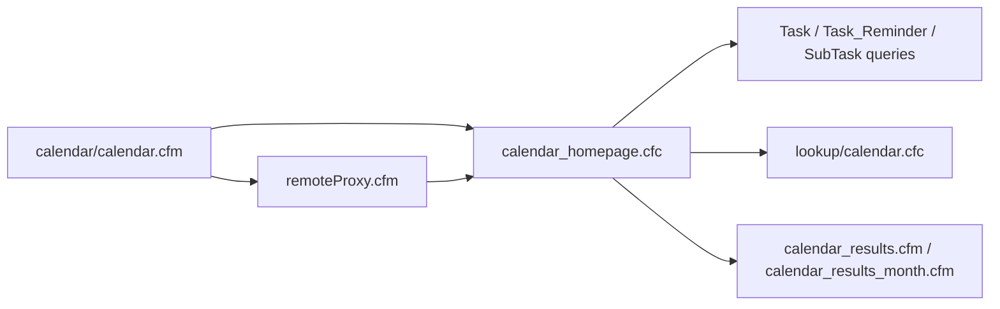
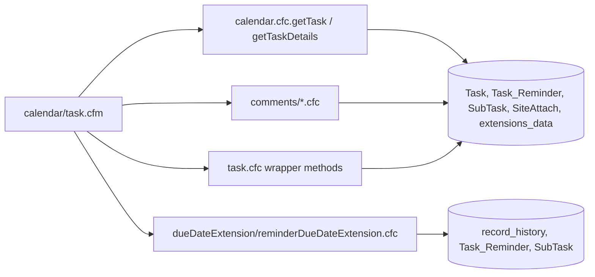
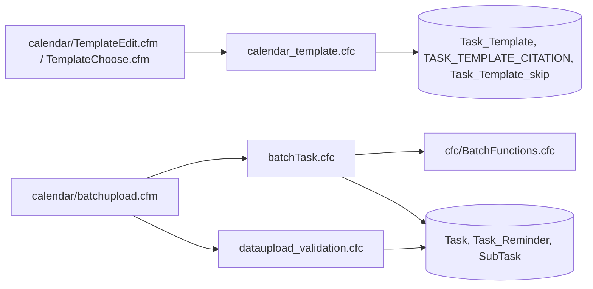

# Backend Architecture

This repository is a server-rendered CFML calendar application with a component-based backend and inline SQL. It is not a service-oriented app or an ORM-driven app. The backend lives mainly under `cfc/apps/calendar/`, with direct `.cfm` page routes under `calendar/` calling into those components through page includes, direct component instantiation, and the shared `remoteProxy.cfm` dispatch pattern.

The notes below are grounded in the code under `cfc/apps/calendar/`, `cfc/lookup/calendar.cfc`, `cfc/BatchFunctions.cfc`, and the frontend architecture doc at `docs/frontend-architecture.md` as the only extra reference.

## Table of Contents

- [Backend Project Overview](#backend-project-overview)
- [Backend Architecture](#backend-architecture)
  - [2.1 High-level architecture](#21-high-level-architecture)
  - [2.2 Backend module inventory](#22-backend-module-inventory)
  - [2.3 Core read and write surfaces](#23-core-read-and-write-surfaces)
  - [2.4 Request flow diagrams](#24-request-flow-diagrams)
- [Database Architecture](#database-architecture)
  - [3.1 Schema source and caveats](#31-schema-source-and-caveats)
  - [3.2 Core operational tables](#32-core-operational-tables)
  - [3.3 Template and library tables](#33-template-and-library-tables)
  - [3.4 Custom calendar tables](#34-custom-calendar-tables)
  - [3.5 Lookup and scope tables](#35-lookup-and-scope-tables)
  - [3.6 SQL patterns and risk areas](#36-sql-patterns-and-risk-areas)
- [API Architecture](#api-architecture)
  - [4.1 API entry points](#41-api-entry-points)
  - [4.2 Endpoint inventory](#42-endpoint-inventory)
  - [4.3 Response conventions](#43-response-conventions)
  - [4.4 Scheduler and direct page handlers](#44-scheduler-and-direct-page-handlers)
- [Configuration and Differentiation Architecture](#configuration-and-differentiation-architecture)
  - [5.1 Configuration sources](#51-configuration-sources)
  - [5.2 Tenant and site scoping](#52-tenant-and-site-scoping)
  - [5.3 Feature flags and branch switches](#53-feature-flags-and-branch-switches)
  - [5.4 Differentiation risks](#54-differentiation-risks)
- [Technical Assessment Support Layer](#technical-assessment-support-layer)
  - [6.1 Change surface map](#61-change-surface-map)
  - [6.2 Assessment questions this backend can answer](#62-assessment-questions-this-backend-can-answer)
  - [6.3 Evidence checklist](#63-evidence-checklist)
- [Suggested Ownership by Developer Level](#suggested-ownership-by-developer-level)
  - [7.1 Ownership model](#71-ownership-model)
  - [7.2 Codebase-specific recommendations](#72-codebase-specific-recommendations)
- [Developer Execution Guide](#developer-execution-guide)
  - [8.1 Safe change sequence](#81-safe-change-sequence)
  - [8.2 File-first starting points](#82-file-first-starting-points)
- [Appendices](#appendices)
  - [A. Primary backend file inventory](#a-primary-backend-file-inventory)
  - [B. Core table inventory](#b-core-table-inventory)
  - [C. High-risk methods](#c-high-risk-methods)
  - [D. Legacy and adjacent surfaces](#d-legacy-and-adjacent-surfaces)
  - [A. Primary backend file inventory](#a-primary-backend-file-inventory)
  - [B. Core table inventory](#b-core-table-inventory)
  - [C. High-risk methods](#c-high-risk-methods)

## Backend Project Overview

The calendar backend is a modular CFML monolith built around a task-centric data model.

The main backend responsibilities are:

- Task lifecycle management in `cfc/apps/calendar/calendar.cfc`
- Homepage browse, search, and reporting queries in `cfc/apps/calendar/calendar_homepage.cfc`
- Template management and copying in `cfc/apps/calendar/calendar_template.cfc`
- Conditional task creation and linkage in `cfc/apps/calendar/calendar_conditional.cfc`
- Comment CRUD in `cfc/apps/calendar/comments/*.cfc`
- Due date extension requests, approvals, and denials in `cfc/apps/calendar/dueDateExtension/*.cfc`
- Batch upload parsing and validation in `cfc/apps/calendar/batchTask.cfc`, `cfc/apps/calendar/batchTaskTemplate.cfc`, `cfc/apps/calendar/dataupload_validation.cfc`, and `cfc/BatchFunctions.cfc`
- Custom calendar event management in `cfc/apps/calendar/customCal.cfc`
- Cross-app reference reporting in `cfc/apps/calendar/calRef.cfc`
- Reminder and summary email/report jobs in `cfc/apps/calendar/calendaremail.cfc`
- REST-style JSON wrappers in `cfc/apps/calendar/restapi.cfc`
- Task-specific helper wrappers in `cfc/apps/calendar/task.cfc`
- Shared lookup data in `cfc/lookup/calendar.cfc`
- Export/import setup-variable helpers in `cfc/apps/calendar/exceltemplate.cfc`

The app is not built on a formal service framework. Instead, the same business concepts are exposed through three overlapping surfaces:

- Direct `.cfm` page requests under `calendar/`
- `remoteProxy.cfm` dispatch calls for AJAX-style access
- Scheduled or maintenance pages such as `calendar/UpdateCode.cfm`, `calendar/updatecalrem.cfm`, `calendar/updatecalemail.cfm`, and `calendar/updquery.cfm`

## Backend Architecture

### 2.1 High-level architecture

```mermaid
flowchart TB
    Browser[Browser / user request]
    Pages[calendar/*.cfm pages]
    RP[shared remoteProxy.cfm dispatcher]

    Core[cfc/apps/calendar/calendar.cfc]
    Home[cfc/apps/calendar/calendar_homepage.cfc]
    Template[cfc/apps/calendar/calendar_template.cfc]
    Conditional[cfc/apps/calendar/calendar_conditional.cfc]
    CustomCal[cfc/apps/calendar/customCal.cfc]
    Comments[cfc/apps/calendar/comments/*.cfc]
    DDE[cfc/apps/calendar/dueDateExtension/*.cfc]
    Batch[cfc/apps/calendar/batchTask.cfc]
    BatchTpl[cfc/apps/calendar/batchTaskTemplate.cfc]
    Validate[cfc/apps/calendar/dataupload_validation.cfc]
    CalRef[cfc/apps/calendar/calRef.cfc]
    Email[cfc/apps/calendar/calendaremail.cfc]
    Rest[cfc/apps/calendar/restapi.cfc]
    TaskApi[cfc/apps/calendar/task.cfc]
    Lookup[cfc/lookup/calendar.cfc]
    BatchFns[cfc/BatchFunctions.cfc]
    Setup[api.go.getSetupVar / varDefinitions.cfm / setup vars]
    SharedInc[customize.cfm / additionalFields.cfm]
    DB[(SQL Server tables)]

    Browser --> Pages
    Browser --> RP

    Pages --> Core
    Pages --> Home
    Pages --> Template
    Pages --> Conditional
    Pages --> CustomCal
    Pages --> Comments
    Pages --> DDE
    Pages --> Batch
    Pages --> BatchTpl
    Pages --> Validate
    Pages --> CalRef
    Pages --> Email
    Pages --> Rest
    Pages --> TaskApi

    RP --> Core
    RP --> Home
    RP --> Template
    RP --> Conditional
    RP --> CustomCal
    RP --> Comments
    RP --> DDE
    RP --> CalRef
    RP --> Rest
    RP --> TaskApi

    Core --> Lookup
    Home --> Lookup
    Template --> Lookup
    Conditional --> Lookup
    Batch --> Lookup
    BatchTpl --> Lookup
    Validate --> Lookup
    Rest --> Lookup
    TaskApi --> Lookup

    Core --> Setup
    Home --> Setup
    Template --> Setup
    Conditional --> Setup
    CustomCal --> Setup
    Email --> Setup
    Rest --> Setup
    TaskApi --> Setup

    Pages --> SharedInc
    Core --> DB
    Home --> DB
    Template --> DB
    Conditional --> DB
    CustomCal --> DB
    Comments --> DB
    DDE --> DB
    Batch --> DB
    BatchTpl --> DB
    Validate --> DB
    CalRef --> DB
    Email --> DB
    Rest --> DB
    TaskApi --> DB
    BatchFns --> DB
```

The backend is organized as a task-centric core with specialized adapters around it:

- `calendar.cfc` owns the canonical create/update/close flows and most SQL-heavy read paths
- `calendar_homepage.cfc` owns browse, search, day/week/month/year aggregation, and homepage task details
- `calendar_template.cfc` owns template creation, editing, copying, hiding, and reporting
- `calendar_conditional.cfc` owns conditional-task launch and unlink behavior
- `customCal.cfc` owns a smaller event/schedule model separate from the core task tables
- `comments/*.cfc` and `dueDateExtension/*.cfc` isolate closures and approval workflows so task pages do not have to embed all state transitions in one file

### 2.2 Backend module inventory

| File | Role | Representative methods | Main data surfaces |
| --- | --- | --- | --- |
| `cfc/apps/calendar/calendar.cfc` | Core task lifecycle, reporting helpers, email helpers, attachment helpers, AI/report utilities | `insertTask`, `insertCompactTask`, `updateCompactTask`, `insertTaskReminder`, `updateTaskReminder`, `getTask`, `getTaskDetails`, `getReminderDetails`, `getSubTasks`, `getTaskCitation`, `getTaskSources`, `sendQuickEmail`, `closeTaskEmail`, `getCalendarHomepageStatsForOpenAI` | `Task`, `Task_Reminder`, `SubTask`, `Task_Linker`, `Task_Conditional`, `Task_Citation`, `Frequency`, `SiteAttach`, `extensions_data` |
| `cfc/apps/calendar/calendar_homepage.cfc` | Homepage browse/search/day-week-month-year reporting | `getTaskCount`, `getDayTasks`, `getDayTasks2`, `getWeekTasks`, `getMyTasks`, `getMonthTasks`, `getThreeMonthTasks`, `getYearTasks`, `getTask`, `getRemAttach`, `keywordSearch`, `taskNameLookup` | `Task`, `Task_Reminder`, `SubTask`, `site`, `org`, `ltbCOE`, `ltbCOE_Sub`, `ltbBuilding`, `ltbWorkstation`, `ltbCalendarMedia`, `SiteAttach`, `extensions_data`, `task_citation` |
| `cfc/apps/calendar/calendar_template.cfc` | Template CRUD, template browsing, history, hiding/skipping, revision handling | `addTemplate`, `editTemplate`, `getTemplate`, `getTaskTemplates`, `getTaskTemplatesView`, `getAssTasks`, `getReference`, `getCitations`, `getCountries`, `getOrgName`, `getSubOrg`, `getTemplateHistory`, `updateTaskRevDate`, `templateHide` | `Task_Template`, `TASK_TEMPLATE_CITATION`, `Task_Template_skip`, `task_template_country`, `task_template_state`, `Task`, `Task_Reminder`, `site`, `org`, `SubOrg`, `ltbCalendarMedia`, `ltbStates`, `ltbCountry` |
| `cfc/apps/calendar/calendar_conditional.cfc` | Conditional task launch and linkage | `launchTask`, `listTasks`, `deleteConditionalTask`, `updateTaskLinker`, `getConditionalTasks` | `Task_Conditional`, `Task_Linker`, `Task`, `Task_Reminder`, `site`, `org` |
| `cfc/apps/calendar/customCal.cfc` | Custom calendar events and recurring schedule entries | `getScheduleEvents`, `getEvents`, `removeScheduleEvent`, `addEditEvent` | `customCalendar_events`, `customCalendar_schedule`, `customCalendar_scope`, `customCalendar_frequency` |
| `cfc/apps/calendar/calRef.cfc` | Cross-app report/reference proxy | `functionProxy`, `calendarRefReportQuery`, `getCalendarRefReport` | `Task`, `Task_Reminder`, `SubTask`, `Task_Citation`, `site`, `org` |
| `cfc/apps/calendar/calendaremail.cfc` | Open-task reporting and summary data for email jobs | `qOpenTasks`, `qRPStats`, `qSiteStats`, `formatOpenTaskData`, `getPDTableData`, `getMainTasksForDateRange`, `getSubTasksForDateRange` | `Task`, `Task_Reminder`, `SubTask`, `site`, `org`, `ltbCOE`, `ltbCOE_Sub`, `ltbCalendarMedia` |
| `cfc/apps/calendar/restapi.cfc` | REST-style wrapper over the calendar core | `getStats`, `insertTask`, `updateTask`, `getTask`, `getTaskCitation`, `getTaskSources`, `updateReminder`, `getReminder` | Same as `calendar.cfc`, plus API request validation and response shaping |
| `cfc/apps/calendar/task.cfc` | Task-specific wrapper around the core calendar service | `getLinkedTasksAndLinks`, `insertLinkedTask`, `insertOneTaskReminder`, `closeTaskReminder`, `closeAllTaskReminders`, `removeCalendarRef`, `updateTask` | `Task`, `Task_Reminder`, `Task_Linker`, `Task_Conditional`, `site`, `org` |
| `cfc/apps/calendar/batchTask.cfc` | Batch upload validation and row insertion for task imports | `parseHOTTableData`, `validateData`, `insertData` | `Task`, `Task_Reminder`, `SubTask`, `Frequency`, `site`, `org`, `ltbCOE`, `ltbCOE_Sub`, `ltbBuilding`, `ltbWorkstation`, `ltbContact` |
| `cfc/apps/calendar/batchTaskTemplate.cfc` | Batch upload validation and row insertion for template imports | `validateData`, `insertData` | `Task_Template`, `TASK_TEMPLATE_CITATION`, `site`, `org`, `SubOrg`, `ltbCalendarMedia`, `ltbStates`, `ltbCountry` |
| `cfc/apps/calendar/dataupload_validation.cfc` | Structured validation/transform layer for upload payloads | `transform`, `validate`, `insertData`, `normalizeNameDTI` | `Task`, `Task_Reminder`, `Task_Template`, `ltbCOE`, `ltbCOE_Sub`, `Frequency`, `site`, `org` |
| `cfc/apps/calendar/comments/comments.cfc` | Shared base comment formatting and serialization helper | private `getComment`, `addComment`, `editComment`, `removeComment`, `getFormattedComment`, `getSpecificComment`, `addCommentLink` | No direct DB access; the child wrappers do the persistence |
| `cfc/apps/calendar/comments/reminderComments.cfc` | Reminder comment wrapper | `getComment`, `addComment`, `editComment`, `removeComment`, `getFormattedComment`, `getSpecificComment`, `addCommentLink`, `includeJS` | `Task_Reminder` |
| `cfc/apps/calendar/comments/subTaskComments.cfc` | Sub-task comment wrapper | Same public surface as reminder comments | `SubTask` |
| `cfc/apps/calendar/dueDateExtension/dueDateExtension.cfc` | Shared due-date-extension helper | `generateLink`, `includeJS`, `modalInitCheck`, `getDetails` | `Task_Reminder`, `record_history` |
| `cfc/apps/calendar/dueDateExtension/reminderDueDateExtension.cfc` | Reminder due-date extension workflow | `userHasPermission`, `isExtensionAllowed`, `generateLink`, `includeJS`, `modalInitCheck`, `getDetails`, `extendDueDate`, `requestExtendDueDate`, `approveExtendDueDate`, `denyExtendDueDate`, `getDueDateUpdateHistory` | `Task_Reminder`, `SubTask`, `record_history` |
| `cfc/apps/calendar/exceltemplate.cfc` | Export/import setup-variable resolver | `getSetupVariables` | Setup vars, labels, and calendar lookup data |
| `cfc/lookup/calendar.cfc` | Shared calendar lookup provider | `getFrequency`, `getLtbCalendarMedia`, `getSubTask`, `getTaskReminder`, `getTaskTemplate`, `getOpenTaskReminder` | `Frequency`, `ltbCalendarMedia`, `Task`, `Task_Reminder`, `SubTask`, `Task_Template`, `site`, `org`, `SubOrg` |
| `cfc/BatchFunctions.cfc` | Batch parsing and generic import helpers | `parseHOTTableData`, `validateHOTRow`, `getTaskReminder`, `getTaskTemplate`, `getOpenTaskReminder` and related batch helpers | Batch import paths, `Task`, `Task_Reminder`, `Task_Template`, `site`, `org` |

### 2.3 Core read and write surfaces

The backend splits naturally into read-heavy and write-heavy surfaces.

Read-heavy surfaces:

- `calendar_homepage.cfc` for browse/search/day/week/month/year views
- `calRef.cfc` for reference reporting
- `calendaremail.cfc` for reporting and email summaries
- `calendar_template.cfc` for template browsing and assignment views
- `lookup/calendar.cfc` for lookup lists and selection support

Write-heavy surfaces:

- `calendar.cfc` for task insert/update/close and reminder mutation
- `calendar_template.cfc` for template CRUD and hide/unhide behavior
- `calendar_conditional.cfc` for conditional task creation and unlinking
- `customCal.cfc` for custom calendar event mutation
- `comments/*.cfc` for comment CRUD
- `dueDateExtension/*.cfc` for due date approval workflows
- `batchTask.cfc`, `batchTaskTemplate.cfc`, and `dataupload_validation.cfc` for bulk imports
- `restapi.cfc` and `task.cfc` as wrappers around the same write paths

The highest-risk methods are the ones that mutate multiple tables or trigger downstream emails:

- `calendar.cfc.insertTask`
- `calendar.cfc.insertCompactTask`
- `calendar.cfc.updateCompactTask`
- `calendar.cfc.insertTaskReminder`
- `calendar.cfc.updateTaskReminder`
- `calendar.cfc.updateTaskReminderBatch`
- `calendar.cfc.sendQuickEmail`
- `calendar.cfc.sendInitalTaskEmail`
- `calendar.cfc.closeTaskEmail`
- `calendar_template.cfc.addTemplate`
- `calendar_template.cfc.editTemplate`
- `calendar_template.cfc.templateHide`
- `calendar_conditional.cfc.launchTask`
- `calendar_conditional.cfc.deleteConditionalTask`
- `calendar_conditional.cfc.updateTaskLinker`
- `customCal.cfc.addEditEvent`
- `customCal.cfc.removeScheduleEvent`
- `reminderDueDateExtension.cfc.extendDueDate`
- `reminderDueDateExtension.cfc.requestExtendDueDate`
- `reminderDueDateExtension.cfc.approveExtendDueDate`
- `reminderDueDateExtension.cfc.denyExtendDueDate`

### 2.4 Request flow diagrams

Homepage browse/search flow:

Task detail and closure flow:

Template and import flow:

## Database Architecture

### 3.1 Schema source and caveats

I did not find schema DDL or migration files in this repository. The database model below is therefore query-derived from the CFML components.

That matters because:

- Some objects are referenced only in SELECT/INSERT/UPDATE statements
- Some names appear in mixed casing, for example `Task_Citation` and `task_citation`
- Several queries rely on temp tables or table variables rather than permanent DDL in the repo
- Foreign keys are not formally documented here, so relationships below are logical, not guaranteed physical FK constraints

The backend uses SQL Server-style SQL heavily:

- `WITH (NOLOCK)`
- `TOP`
- `ROW_NUMBER()`
- `DATEADD` / `DATEDIFF`
- `STRING_SPLIT`
- table variables and temp tables such as `@dateTbl`, `##idquery`, and `##pageQuery`

### 3.2 Core operational tables

These are the primary runtime tables for calendar tasks.

| Table | Role in the backend | Main consumers |
| --- | --- | --- |
| `Task` | Canonical task record, including task name, owner, plan, ref type, ref ID, priority, and status fields | `calendar.cfc`, `calendar_homepage.cfc`, `task.cfc`, `calendar_conditional.cfc`, `restapi.cfc`, `calendaremail.cfc`, `calRef.cfc` |
| `Task_Reminder` | Reminder instances tied to a task, including reminder dates, completion state, verification, and comments | `calendar.cfc`, `calendar_homepage.cfc`, `task.cfc`, `dueDateExtension/*.cfc`, `comments/*.cfc`, `calendaremail.cfc`, `restapi.cfc` |
| `SubTask` | Sub-task rows attached to a task/reminder, including close-by date, instructions, comments, and completion state | `calendar.cfc`, `calendar_homepage.cfc`, `task.cfc`, `calendar_conditional.cfc`, `comments/*.cfc`, `calendaremail.cfc` |
| `Task_Linker` | Cross-reference rows that link tasks to other records or to conditional task flows | `calendar.cfc`, `task.cfc`, `calendar_conditional.cfc` |
| `Task_Conditional` | Source records used when conditional tasks are launched or listed | `calendar.cfc`, `calendar_conditional.cfc`, `task.cfc` |
| `Task_Citation` / `task_citation` | Task citation or reference rows | `calendar.cfc`, `calendar_homepage.cfc`, `calRef.cfc`, `restapi.cfc` |
| `extensions_data` | Stored additional-field payloads and extension metadata | `calendar.cfc`, `calendar_homepage.cfc` |
| `record_history` | Audit history for due-date extension requests and approvals | `dueDateExtension/reminderDueDateExtension.cfc`, `comments/*.cfc` |
| `SiteAttach` | Attachment metadata tied to tasks or reminders | `calendar.cfc`, `calendar_homepage.cfc` |

The task lifecycle is anchored on `Task` and `Task_Reminder`. Most read views join them back to:

- `site` and `org` for scope and labels
- `SubTask` for nested completion counts and sub-task details
- `Task_Citation` for citation/reference display
- `extensions_data` for additional fields
- `SiteAttach` for attachment indicators

### 3.3 Template and library tables

Template management has its own data model separate from the live task tables.

| Table | Role in the backend | Main consumers |
| --- | --- | --- |
| `Task_Template` / `TASK_TEMPLATE` | Template master records | `calendar_template.cfc`, `batchTaskTemplate.cfc`, `dataupload_validation.cfc`, `calendaremail.cfc`, `lookup/calendar.cfc` |
| `TASK_TEMPLATE_CITATION` | Template citation/reference rows | `calendar_template.cfc`, `batchTaskTemplate.cfc` |
| `Task_Template_skip` | Marks template items as skipped/hidden for a site or org scope | `calendar_template.cfc` |
| `task_template_country` | Country scoping for templates | `calendar_template.cfc`, `dataupload_validation.cfc` |
| `task_template_state` | State scoping for templates | `calendar_template.cfc`, `dataupload_validation.cfc` |

Template scope is not flat. The code applies:

- Org-level and sub-org-level rules
- Site country and site state filtering
- Skip/hide state for library tasks
- Revision-date handling for template copies

### 3.4 Custom calendar tables

The custom calendar feature is separate from the core task/reminder model.

| Table | Role in the backend | Main consumers |
| --- | --- | --- |
| `customCalendar_events` | Event master records | `customCal.cfc` |
| `customCalendar_schedule` | Recurrence/schedule rows for events | `customCal.cfc` |
| `customCalendar_scope` | Event scope records, including business scope and archive state | `customCal.cfc` |
| `customCalendar_frequency` | Recurrence frequency lookup for custom events | `customCal.cfc` |

### 3.5 Lookup and scope tables

The code relies on a set of shared lookup tables for tenant scoping, labels, and chooser lists.

| Table | Role in the backend | Main consumers |
| --- | --- | --- |
| `site` | Site/location scope and site metadata | `calendar.cfc`, `calendar_homepage.cfc`, `calendar_template.cfc`, `calendar_conditional.cfc`, `calRef.cfc`, `restapi.cfc`, `task.cfc`, `batchTask.cfc`, `batchTaskTemplate.cfc`, `dataupload_validation.cfc` |
| `org` | Organization master data | Same as `site`, plus reporting and template filtering |
| `SubOrg` | Sub-organization scope | `calendar_template.cfc`, `dataupload_validation.cfc`, `calendar_homepage.cfc` |
| `ltbCOE` | Department or center-of-expertise lookup | `calendar.cfc`, `calendar_homepage.cfc`, `calendar_template.cfc`, `dataupload_validation.cfc`, `calendaremail.cfc` |
| `ltbCOE_Sub` | Sub-department lookup and validation | Same as `ltbCOE` |
| `ltbBuilding` | Building lookup for task scope | `calendar.cfc`, `calendar_homepage.cfc`, `batchTask.cfc`, `dataupload_validation.cfc` |
| `ltbWorkstation` | Workstation lookup for task scope | `calendar.cfc`, `calendar_homepage.cfc`, `batchTask.cfc`, `dataupload_validation.cfc` |
| `ltbContact` | Contact and responsible-person lookup | `calendar.cfc`, `calendar_homepage.cfc`, `calendaremail.cfc`, `task.cfc`, `batchTask.cfc` |
| `ltbCalendarMedia` | Task category/media lookup | `calendar.cfc`, `calendar_homepage.cfc`, `calendar_template.cfc`, `calendaremail.cfc`, `dataupload_validation.cfc`, `lookup/calendar.cfc` |
| `Frequency` | Reminder frequency lookup | `calendar.cfc`, `calendar_homepage.cfc`, `calendar_template.cfc`, `batchTask.cfc`, `batchTaskTemplate.cfc`, `dataupload_validation.cfc`, `lookup/calendar.cfc` |
| `ltbStates` | State lookup for template scoping | `calendar_template.cfc` |
| `ltbCountry` | Country lookup for template scoping | `calendar_template.cfc` |
| `roleAssign` | Role assignment lookup for reporting/search joins | `calendar.cfc`, `calendar_homepage.cfc` |
| `ltbroles` | Role definitions used in browse/report joins | `calendar.cfc` |
| `profile_data` | Shared profile data used for equipment/plant joins | `calendar.cfc`, `calendar_homepage.cfc` |

### 3.6 SQL patterns and risk areas

The data layer is inline SQL, not a repository of separate SQL procedures.

Important patterns:

- Most queries live directly inside CFML methods
- `cfqueryparam` is used in newer or safer paths, but older code still has string interpolation
- Temporary tables are common for paging and aggregation
- Many browse queries join several lookup tables at once and are sensitive to `site` and `org` scope
- `NOLOCK` is pervasive, which makes reads cheap but allows dirty or inconsistent reads

Main risks:

- Schema assumptions are spread across many files instead of being centralized
- A field added in one write path may not be reflected in browse, batch upload, export, and REST layers
- The same business concept can appear under different names in different components, especially `orgName`/`orgid`, `siteID`/`location`, and `Task`/`Task_Reminder`

## API Architecture

### 4.1 API entry points

The backend API surface is broader than a single REST controller. It is a mixture of:

- Direct CFML pages that own a workflow
- Shared `remoteProxy.cfm` calls for AJAX and modal actions
- CFC wrappers that normalize parameters and return shapes

The important API-style components are:

- `cfc/apps/calendar/calendar.cfc`
- `cfc/apps/calendar/calendar_homepage.cfc`
- `cfc/apps/calendar/calendar_template.cfc`
- `cfc/apps/calendar/calendar_conditional.cfc`
- `cfc/apps/calendar/customCal.cfc`
- `cfc/apps/calendar/comments/reminderComments.cfc`
- `cfc/apps/calendar/comments/subTaskComments.cfc`
- `cfc/apps/calendar/dueDateExtension/reminderDueDateExtension.cfc`
- `cfc/apps/calendar/calRef.cfc`
- `cfc/apps/calendar/restapi.cfc`
- `cfc/apps/calendar/task.cfc`

The REST wrapper is useful, but it is not the only API. Most of the app still behaves like a CFML application with method dispatch rather than a canonical JSON service layer.

### 4.2 Endpoint inventory

#### Homepage and browse endpoints

| Component | Methods | Typical callers | Notes |
| --- | --- | --- | --- |
| `calendar_homepage.cfc` | `getDayTasks`, `getDayTasks2`, `getWeekTasks`, `getMyTasks`, `getMonthTasks`, `getThreeMonthTasks`, `getYearTasks`, `getTaskCount`, `getTaskDetails`, `getTask`, `getRemAttach`, `getMultiday`, `keywordSearch`, `taskNameLookup` | `calendar/calendar.cfm`, `calendar/calendar_results.cfm`, `calendar/calendar_results_month.cfm`, `calendar/report.cfm` | Core browse/search surface |

#### Task lifecycle endpoints

| Component | Methods | Typical callers | Notes |
| --- | --- | --- | --- |
| `calendar.cfc` | `insertTask`, `insertCompactTask`, `updateCompactTask`, `insertTaskReminder`, `updateTaskReminder`, `updateTaskReminderBatch`, `removeTaskRef`, `getTask`, `getTaskDetails`, `getReminderDetails`, `getSubTasks`, `getMetrics`, `closeTaskEmail`, `sendQuickEmail`, `sendInitalTaskEmail`, `closeAllSubtasksForAllReminders`, `closeAllSubtasksForAllRemindersForMultipleTasks`, `getTaskCitation`, `getTaskSources`, `getCalendarHomepageStatsForOpenAI` | `calendar/admtask.cfm`, `calendar/task.cfm`, `calendar/quickClose.cfm`, `calendar/action.cfm`, `calendar/receiver.cfm`, `remoteProxy.cfm` | Primary mutation layer |
| `task.cfc` | `getLinkedTasksAndLinks`, `insertLinkedTask`, `insertOneTaskReminder`, `closeTaskReminder`, `closeAllTaskReminders`, `removeCalendarRef`, `updateTask` | `calendar/task.cfm`, `calendar/admtask.cfm`, `remoteProxy.cfm` | Task-focused wrapper around the core component |

#### Template and conditional endpoints

| Component | Methods | Typical callers | Notes |
| --- | --- | --- | --- |
| `calendar_template.cfc` | `addTemplate`, `editTemplate`, `getTemplate`, `getTaskTemplates`, `getTaskTemplatesView`, `getApplicTemplates`, `getRefTypes`, `getTemplateCounts`, `getAssTasks`, `getReference`, `getCitations`, `getCountries`, `getOrgName`, `getSubOrg`, `getPriority`, `getActive`, `getSkippedTemplates`, `getTemplateHistory`, `addTemplateHistory`, `getFormattedHistory`, `updateTaskRevDate`, `templateHide` | `calendar/TemplateChoose.cfm`, `calendar/TemplateEdit.cfm`, `calendar/TemplateView.cfm`, `calendar/TemplateDetails.cfm`, `remoteProxy.cfm` | Template CRUD and reporting |
| `calendar_conditional.cfc` | `launchTask`, `listTasks`, `getFirstRemDays`, `getFirstRemDate`, `getInitialStartDate`, `removeTag`, `createClass`, `queryStringDeleteVar`, `deleteConditionalTask`, `updateTaskLinker`, `getRefTypes`, `getConditionalTasks` | `calendar/ConditionalTasks.cfm`, `calendar/action.cfm`, `remoteProxy.cfm` | Conditional-task creation and linkage |

#### Comment, extension, and custom event endpoints

| Component | Methods | Typical callers | Notes |
| --- | --- | --- | --- |
| `comments/reminderComments.cfc` | `getComment`, `addComment`, `editComment`, `removeComment`, `getFormattedComment`, `getSpecificComment`, `addCommentLink`, `includeJS` | `calendar/task.cfm`, `calendar/quickClose.cfm`, `remoteProxy.cfm` | Reminder comments |
| `comments/subTaskComments.cfc` | Same surface as reminder comments | `calendar/task.cfm`, `remoteProxy.cfm` | Sub-task notes |
| `dueDateExtension/reminderDueDateExtension.cfc` | `userHasPermission`, `isExtensionAllowed`, `generateLink`, `includeJS`, `modalInitCheck`, `getDetails`, `extendDueDate`, `requestExtendDueDate`, `approveExtendDueDate`, `denyExtendDueDate`, `getDueDateUpdateHistory` | `calendar/task.cfm`, `calendar/quickClose.cfm`, `remoteProxy.cfm` | Permission-sensitive due-date workflow |
| `customCal.cfc` | `getScheduleEvents`, `getEvents`, `removeScheduleEvent`, `addEditEvent` | `calendar/customCalendar.cfm`, `remoteProxy.cfm` | Custom schedule/event CRUD |

#### Reporting and REST endpoints

| Component | Methods | Typical callers | Notes |
| --- | --- | --- | --- |
| `calRef.cfc` | `functionProxy`, `calendarRefReportQuery`, `getCalendarRefReport` | `calendar/RefLink.cfm`, `remoteProxy.cfm` | Report/reference bridge |
| `calendaremail.cfc` | `qOpenTasks`, `qRPStats`, `qSiteStats`, `formatOpenTaskData`, `getPDTableData`, `getMainTasksForDateRange`, `getSubTasksForDateRange` | `calendar/updatecalemail.cfm`, summary/report jobs | Email/report data feeds |
| `restapi.cfc` | `getStats`, `insertTask`, `updateTask`, `getTask`, `getTaskCitation`, `getTaskSources`, `updateReminder`, `getReminder` | API callers, integration code, direct service calls | JSON-friendly wrapper over the core component |

### 4.3 Response conventions

The response shapes are inconsistent because the code evolved over time.

Common patterns:

- Query objects returned directly from a method
- Arrays of structs built from query rows
- Structs with `success`, `message`, and `data`
- Structs with `responsecode` and `data` in `restapi.cfc`
- Raw strings for certain helper or HTML-producing methods

The REST wrapper normalizes this somewhat:

- `insertTask` and `updateTask` map request fields to a smaller allowed field list
- `getTask` returns `totalrecords`, `totalRecordsPerPage`, and `data`
- Validation failures are returned as structured error messages rather than exceptions where practical

The task and template wrappers also allow either `orgid` or `orgname` in some flows, which means the same API method can be called with different tenant identifiers.

### 4.4 Scheduler and direct page handlers

These are not pure APIs, but they are important backend entry points:

| Page | Role | Notes |
| --- | --- | --- |
| `calendar/UpdateCode.cfm` | Job orchestrator | Central scheduler entry point for reminder and email jobs |
| `calendar/updatecalrem.cfm` | Reminder recalculation and reminder email job | Contains business-specific control flow and setup-var switches |
| `calendar/updatecalemail.cfm` | Summary email job | Produces site and organization summary output |
| `calendar/updquery.cfm` | Latest reminder date repair job | Repairs stale `LATEST_REM_DATE`-style data |
| `calendar/receiver.cfm` | Upload receiver | Handles batch upload row submission and attachment-style payloads |
| `calendar/action.cfm` | Main mutation page | Handles task create/edit/close flows and many auxiliary modal actions |

## Configuration and Differentiation Architecture

### 5.1 Configuration sources

Configuration is distributed, not centralized.

The key sources are:

- `calendar/varDefinitions.cfm`
- `api.go.getSetupVar(...)`
- `request.businessID`
- `request.app.appID`
- `REQUEST` flags and page variables
- Shared includes such as `customize.cfm` and `additionalFields.cfm`
- Setup objects created in CFC `init()` methods

Examples of setup vars that directly change backend behavior:

- `calAdditionalFields`
- `calRemAdditionalFields`
- `includeFrequencies`
- `isTaskPlanEnabledForKeywordSeach`
- `useNewExtensionsRefFields`
- `limitCalendarViewRecords`
- `keywordSearchTaskPlanLength`
- `showCitation`
- `templateRevDates_Enable`
- `recordsignature_quickclose`
- `showSubTask`
- `isBuildingFieldEnabled`
- `isWorkstationFieldEnabled`
- `enableRegAssistantAI`
- `showETIntegration`
- `calSourceRefModule_limitManageToPermissions`
- `CC_enableFloatingFilters`

The backend also depends on translated labels and local naming controls:

- Org label
- Site label
- Center/Dept label
- Sub-Dept label
- Responsible CC label
- Task Plan label
- Business Priority label

### 5.2 Tenant and site scoping

The app is heavily scoped by business, org, site, and sub-org context.

Common identifiers:

- `businessID`
- `siteID`
- `orgID`
- `orgName`
- `location`
- `SubOrg`
- `COE`
- `SubCOEID`

How scoping is resolved:

- `lookup/calendar.cfc` resolves frequency, media, site, org, contact, and template lists
- `dataupload_validation.cfc` resolves `siteID` from `orgName` and `location` using the shared site lookup service
- `calendar_template.cfc` filters template availability by org, sub-org, country, and state
- `calendar_homepage.cfc` filters browse results by org/site and can apply view-specific limits
- `calendaremail.cfc` and `calRef.cfc` group data by org/site/report scope

This is not just presentation logic. The same identifiers control which rows can be created, validated, displayed, or emailed.

### 5.3 Feature flags and branch switches

The code uses setup vars as branch switches for behavior that varies by tenant or deployment.

Examples:

- `useNewExtensionsRefFields` changes how extension reference fields are selected and displayed
- `showCitation` and `citationLabelEnd` control citation sections and labels
- `templateRevDates_Enable` controls template revision-date behavior
- `isTaskPlanEnabledForKeywordSeach` controls whether task plans participate in homepage search
- `limitCalendarViewRecords` changes browse query ceilings
- `isBuildingFieldEnabled` and `isWorkstationFieldEnabled` turn scope fields on or off in batch and edit flows
- `showSubTask` controls task-page sub-task display
- `cc_readAcrossEnabled` enables read-across workflows in the task page
- `recordsignature_quickclose` changes quick-close behavior
- `showETIntegration` controls equipment/tooling integration

### 5.4 Differentiation risks

The main differentiation risks are:

- One tenant may have a field enabled that another tenant does not, which means the same method can return different shapes
- A label change can alter export output, validation text, and page rendering
- Missing setup vars can silently fall back to defaults, which is safe for availability but risky for behavior parity
- Shared includes such as `additionalFields.cfm` and `customize.cfm` are referenced in the page layer but are not local backend modules, so they are easy to overlook when tracking a behavior change

## Technical Assessment Support Layer

### 6.1 Change surface map

If you need to assess impact, the backend can answer these questions quickly:

| Change type | Start here | Why |
| --- | --- | --- |
| Add or modify a task field | `calendar.cfc`, `calendar_homepage.cfc`, `dataupload_validation.cfc`, `restapi.cfc`, `exceltemplate.cfc`, `calendar/varDefinitions.cfm` | The field has to be accepted, persisted, displayed, and possibly exported |
| Add or modify a template field | `calendar_template.cfc`, `batchTaskTemplate.cfc`, `dataupload_validation.cfc`, `calendar/Template*.cfm` | Templates have their own CRUD and scope rules |
| Add or modify a comment flow | `comments/comments.cfc`, `comments/reminderComments.cfc`, `comments/subTaskComments.cfc`, `calendar/task.cfm` | Comment CRUD is isolated but still tied to closure and history views |
| Add or modify due-date extension logic | `dueDateExtension/*.cfc`, `calendar/task.cfm`, `calendar/quickClose.cfm` | Approval logic touches history and reminder state |
| Add or modify batch import behavior | `batchTask.cfc`, `batchTaskTemplate.cfc`, `dataupload_validation.cfc`, `BatchFunctions.cfc`, `calendar/receiver.cfm` | Import flows are schema- and validation-heavy |
| Add or modify custom calendar behavior | `customCal.cfc`, `calendar/customCalendar.cfm` | Separate event model and recurrence model |
| Add or modify a report | `calRef.cfc`, `calendaremail.cfc`, `calendar/report.cfm`, `calendar_homepage.cfc` | Reporting code often reuses the same joins but presents them differently |
| Add or modify API behavior | `restapi.cfc`, `task.cfc`, `calendar.cfc` | Same business logic, different response contract |

### 6.2 Assessment questions this backend can answer

When assessing a change or a project request, the backend can usually answer:

- Which page or API method owns the workflow?
- Which tables are read and which tables are written?
- Which setup vars or tenant-specific labels change the behavior?
- Which methods are read-only and which are side-effectful?
- Does the change need to be reflected in the homepage, task page, batch import, export, and REST layers?
- Does the change trigger email or job pages?
- Is the behavior based on org/site scope, sub-org scope, or global scope?

### 6.3 Evidence checklist

For a reliable backend assessment, capture:

- Exact `.cfm` page or CFC method name
- `businessID`, `siteID`, `orgName`, `location`, and any other scope inputs
- Relevant setup vars from `api.go.getSetupVar`
- Tables touched, including lookup tables
- Whether the call path is direct page load, `remoteProxy.cfm`, or a scheduler page
- Whether a response shape change affects AJAX callers or exports

## Suggested Ownership by Developer Level

### 7.1 Ownership model

| Level | Best fit | Why |
| --- | --- | --- |
| Developer / Mid-level Developer | Read-only queries, labels, small mapping changes, isolated helper updates | Lower blast radius and easier to verify |
| Senior Developer | Core task lifecycle, imports, due-date extension, template CRUD, scheduler pages | These surfaces are multi-table and side-effect heavy |
| Lead Developer | Cross-module refactors, schema-shaping changes, response-contract changes, high-volume browse/query rewrites | These changes affect several pages and components at once |

### 7.2 Codebase-specific recommendations

Give junior or mid-level ownership to:

- `cfc/apps/calendar/exceltemplate.cfc`
- Small browse-query adjustments in `calendar_homepage.cfc`
- Label or setup-var wiring that does not change stored data
- `customCal.cfc` event label changes if the data model stays intact

Give senior ownership to:

- `calendar.cfc`
- `calendar_homepage.cfc` when it changes the core browse or task-detail query shape
- `calendar_template.cfc`
- `batchTask.cfc`, `batchTaskTemplate.cfc`, and `dataupload_validation.cfc`
- `dueDateExtension/*.cfc`
- `comments/*.cfc`
- `calendar/UpdateCode.cfm`, `calendar/updatecalrem.cfm`, `calendar/updatecalemail.cfm`, `calendar/updquery.cfm`

Give lead ownership to:

- Any refactor that crosses `calendar.cfc`, `calendar_homepage.cfc`, `calendar_template.cfc`, and `restapi.cfc`
- Any change that affects both page rendering and API response shape
- Any change that modifies how org/site/scope resolution works
- Any change that touches the scheduler pages and the core task lifecycle together

## Developer Execution Guide

### 8.1 Safe change sequence

When you need to make a backend change, use this order:

1. Identify the page or API entry point that the user actually hits.
2. Trace that entry point into the CFC method or scheduler page.
3. Find the tables read and written by that method.
4. Check whether setup vars or tenant-specific labels change the code path.
5. Make the smallest change in the most central backend file that owns the behavior.
6. Verify any companion surfaces that need the same behavior, such as the homepage, task page, batch import, report, or REST wrapper.
7. If the change writes data or triggers email, test the scheduler or job path too.

### 8.2 File-first starting points

If the task is about:

- Core task CRUD: start with `cfc/apps/calendar/calendar.cfc`
- Homepage browsing/search: start with `cfc/apps/calendar/calendar_homepage.cfc`
- Template behavior: start with `cfc/apps/calendar/calendar_template.cfc`
- Conditional task launch: start with `cfc/apps/calendar/calendar_conditional.cfc`
- Custom event scheduling: start with `cfc/apps/calendar/customCal.cfc`
- Reminder comments: start with `cfc/apps/calendar/comments/reminderComments.cfc`
- Sub-task comments: start with `cfc/apps/calendar/comments/subTaskComments.cfc`
- Due-date extension: start with `cfc/apps/calendar/dueDateExtension/reminderDueDateExtension.cfc`
- Batch task import: start with `cfc/apps/calendar/batchTask.cfc`
- Batch template import: start with `cfc/apps/calendar/batchTaskTemplate.cfc`
- Upload validation: start with `cfc/apps/calendar/dataupload_validation.cfc`
- REST integration: start with `cfc/apps/calendar/restapi.cfc`
- Task wrapper integration: start with `cfc/apps/calendar/task.cfc`
- Reference reporting: start with `cfc/apps/calendar/calRef.cfc`
- Email/report jobs: start with `cfc/apps/calendar/calendaremail.cfc`
- Lookup data: start with `cfc/lookup/calendar.cfc`
- Shared batch helpers: start with `cfc/BatchFunctions.cfc`

## Appendices

### A. Primary backend file inventory

| File | Summary |
| --- | --- |
| `cfc/apps/calendar/calendar.cfc` | Main business logic and core SQL-heavy task service |
| `cfc/apps/calendar/calendar_homepage.cfc` | Homepage browse and search service |
| `cfc/apps/calendar/calendar_template.cfc` | Template management service |
| `cfc/apps/calendar/calendar_conditional.cfc` | Conditional task service |
| `cfc/apps/calendar/customCal.cfc` | Custom calendar event service |
| `cfc/apps/calendar/calRef.cfc` | Reference/report bridge |
| `cfc/apps/calendar/calendaremail.cfc` | Email/report support service |
| `cfc/apps/calendar/restapi.cfc` | REST wrapper around calendar operations |
| `cfc/apps/calendar/task.cfc` | Task-specific wrapper around the calendar core |
| `cfc/apps/calendar/batchTask.cfc` | Batch task import validation and insert |
| `cfc/apps/calendar/batchTaskTemplate.cfc` | Batch template import validation and insert |
| `cfc/apps/calendar/dataupload_validation.cfc` | Upload transform and validation engine |
| `cfc/apps/calendar/comments/comments.cfc` | Shared comment CRUD base |
| `cfc/apps/calendar/comments/reminderComments.cfc` | Reminder comment wrapper |
| `cfc/apps/calendar/comments/subTaskComments.cfc` | Sub-task comment wrapper |
| `cfc/apps/calendar/dueDateExtension/dueDateExtension.cfc` | Shared due-date-extension helper |
| `cfc/apps/calendar/dueDateExtension/reminderDueDateExtension.cfc` | Reminder due-date-extension workflow |
| `cfc/apps/calendar/exceltemplate.cfc` | Export/import setup-variable helper |
| `cfc/lookup/calendar.cfc` | Shared lookup provider |
| `cfc/BatchFunctions.cfc` | Generic batch parser/helper library |

### B. Core table inventory

| Table | Main use |
| --- | --- |
| `Task` | Core task master |
| `Task_Reminder` | Reminder instances |
| `SubTask` | Child reminders or sub-task rows |
| `Task_Linker` | Cross-task / cross-app linking |
| `Task_Conditional` | Conditional task source rows |
| `Task_Citation` / `task_citation` | Task citations and references |
| `extensions_data` | Additional-field payloads |
| `record_history` | Due-date extension audit trail |
| `SiteAttach` | Attachments |
| `Task_Template` / `TASK_TEMPLATE` | Template master |
| `TASK_TEMPLATE_CITATION` | Template citations |
| `Task_Template_skip` | Skipped/hidden templates |
| `task_template_country` | Template country scope |
| `task_template_state` | Template state scope |
| `customCalendar_events` | Custom calendar events |
| `customCalendar_schedule` | Custom calendar recurrence schedule |
| `customCalendar_scope` | Custom calendar scope |
| `customCalendar_frequency` | Custom calendar frequency lookup |
| `site` | Site scope and metadata |
| `org` | Organization scope and metadata |
| `SubOrg` | Sub-organization scope |
| `ltbCOE` | COE lookup |
| `ltbCOE_Sub` | Sub-COE lookup |
| `ltbContact` | Contact lookup |
| `ltbBuilding` | Building lookup |
| `ltbWorkstation` | Workstation lookup |
| `ltbCalendarMedia` | Category/media lookup |
| `Frequency` | Reminder frequency lookup |
| `ltbStates` | State lookup |
| `ltbCountry` | Country lookup |
| `roleAssign` | Role assignment lookup |
| `ltbroles` | Role definitions |
| `profile_data` | Shared profile data used in reporting and equipment joins |

### C. High-risk methods

| File | Methods |
| --- | --- |
| `cfc/apps/calendar/calendar.cfc` | `insertTask`, `insertCompactTask`, `updateCompactTask`, `insertTaskReminder`, `updateTaskReminder`, `updateTaskReminderBatch`, `sendQuickEmail`, `sendInitalTaskEmail`, `closeTaskEmail`, `closeAllSubtasksForAllReminders`, `closeAllSubtasksForAllRemindersForMultipleTasks`, `getTaskCitation`, `getTaskSources` |
| `cfc/apps/calendar/calendar_template.cfc` | `addTemplate`, `editTemplate`, `templateHide`, `updateTaskRevDate` |
| `cfc/apps/calendar/calendar_conditional.cfc` | `launchTask`, `deleteConditionalTask`, `updateTaskLinker` |
| `cfc/apps/calendar/customCal.cfc` | `addEditEvent`, `removeScheduleEvent` |
| `cfc/apps/calendar/comments/*.cfc` | `addComment`, `editComment`, `removeComment` |
| `cfc/apps/calendar/dueDateExtension/reminderDueDateExtension.cfc` | `extendDueDate`, `requestExtendDueDate`, `approveExtendDueDate`, `denyExtendDueDate` |
| `cfc/apps/calendar/batchTask.cfc` | `validateData`, `insertData` |
| `cfc/apps/calendar/batchTaskTemplate.cfc` | `validateData`, `insertData` |
| `cfc/apps/calendar/dataupload_validation.cfc` | `transform`, `validate`, `insertData` |
| `cfc/apps/calendar/restapi.cfc` | `insertTask`, `updateTask`, `getTask`, `getTaskCitation`, `getTaskSources`, `updateReminder`, `getReminder` |
| `cfc/apps/calendar/task.cfc` | `insertLinkedTask`, `insertOneTaskReminder`, `closeTaskReminder`, `closeAllTaskReminders`, `removeCalendarRef`, `updateTask` |

### D. Legacy and adjacent surfaces

The repository also contains legacy or adjacent calendar pages such as:

- `calendar/projecttask.cfm`
- `calendar/projectadmtask.cfm`
- `calendar/projectaction.cfm`
- `calendar/projectreport.cfm`
- `calendar/calendarPDA.cfm`
- `calendar/calendarPDA_results.cfm`
- `calendar/calendarPDA_Details.cfm`

Those are related to the same domain, but the primary backend architecture is still the base calendar task, template, report, and import stack described above.
