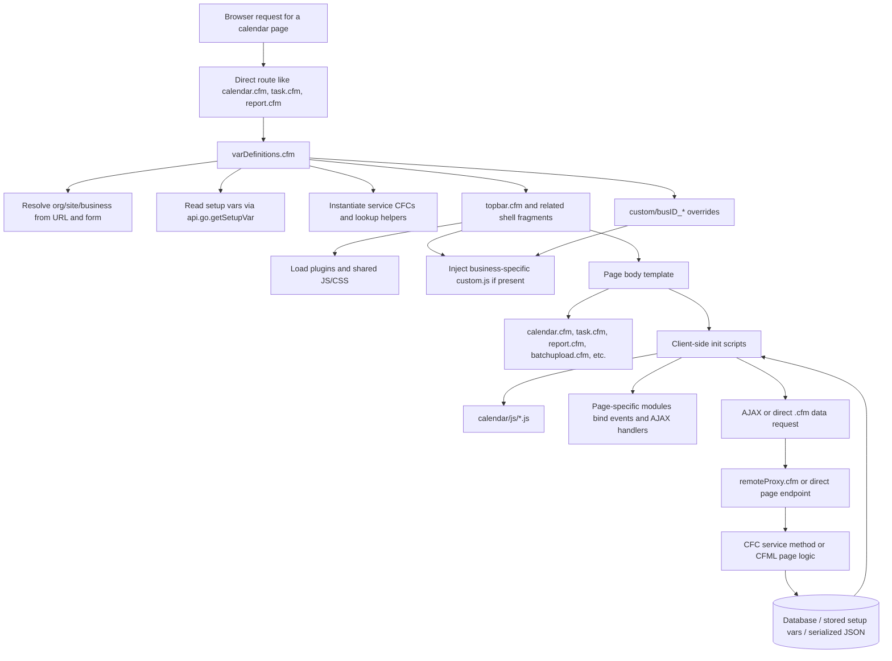
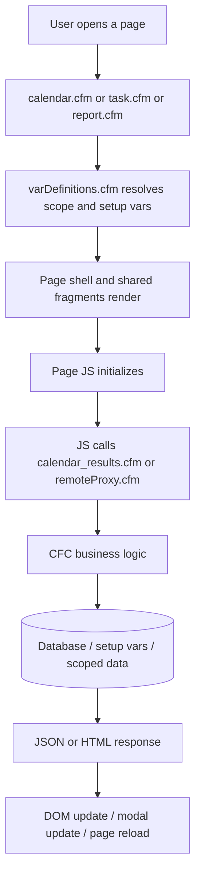
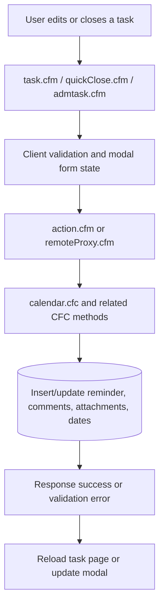
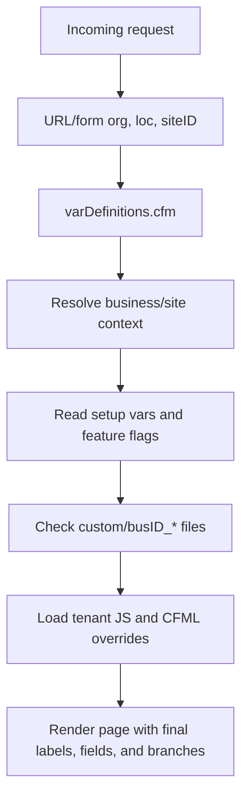
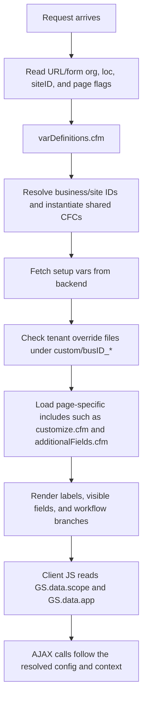

# Frontend Architecture

This repository is a server-rendered CFML calendar application with jQuery-enhanced pages and CFC-backed business logic. It is not a SPA. Routing is page-based, state is split between server request variables and client globals, and most feature behavior is controlled through setup vars, tenant overrides, and direct page includes.

## Table of Contents

- [Frontend Project Overview](#frontend-project-overview)
- [Frontend Architecture](#frontend-architecture)
  - [2.1 High-level architecture](#21-high-level-architecture)
  - [2.2 Application startup and render flow](#22-application-startup-and-render-flow)
  - [2.3 Feature and page flow mapping](#23-feature-and-page-flow-mapping)
  - [2.4 Component and function architecture](#24-component-and-function-architecture)
  - [2.5 State management architecture](#25-state-management-architecture)
  - [2.6 Shared hooks and utilities](#26-shared-hooks-and-utilities)
- [Backend Integration Map](#backend-integration-map)
  - [3.1 API architecture overview](#31-api-architecture-overview)
  - [3.2 Endpoint inventory](#32-endpoint-inventory)
  - [3.3 Endpoint-to-feature mapping](#33-endpoint-to-feature-mapping)
  - [3.4 Key request flow diagrams](#34-key-request-flow-diagrams)
- [Configuration and Differentiation Architecture](#configuration-and-differentiation-architecture)
  - [4.1 Configuration sources inventory](#41-configuration-sources-inventory)
  - [4.2 Field differentiation](#42-field-differentiation)
  - [4.3 Workflow differentiation](#43-workflow-differentiation)
  - [4.4 Per-client / per-tenant differentiation](#44-per-client--per-tenant-differentiation)
  - [4.5 Configuration resolution flow](#45-configuration-resolution-flow)
  - [4.6 Configuration risks and maintainability issues](#46-configuration-risks-and-maintainability-issues)
- [Technical Assessment Support Layer](#technical-assessment-support-layer)
  - [5.1 Change surface map](#51-change-surface-map)
  - [5.2 Complexity signals](#52-complexity-signals)
  - [5.3 Change risk indicators](#53-change-risk-indicators)
  - [5.4 Requirement assessment guidance](#54-requirement-assessment-guidance)
- [Suggested Ownership by Developer Level](#suggested-ownership-by-developer-level)
  - [6.1 Ownership model](#61-ownership-model)
  - [6.2 Codebase-specific ownership recommendations](#62-codebase-specific-ownership-recommendations)
  - [6.3 Speed vs quality assignment guidance](#63-speed-vs-quality-assignment-guidance)
- [Developer Execution Guide](#developer-execution-guide)
  - [7.1 If adding a new field](#71-if-adding-a-new-field)
  - [7.2 If adding a new workflow or workflow branch](#72-if-adding-a-new-workflow-or-workflow-branch)
  - [7.3 If adding a new client-specific customization](#73-if-adding-a-new-client-specific-customization)
  - [7.4 If wiring a new backend endpoint](#74-if-wiring-a-new-backend-endpoint)
  - [7.5 If tracing a bug from UI to backend](#75-if-tracing-a-bug-from-ui-to-backend)
- [Appendices](#appendices)
  - [8.1 File-to-responsibility map](#81-file-to-responsibility-map)
  - [8.2 Feature-to-files map](#82-feature-to-files-map)
  - [8.3 Endpoint-to-files map](#83-endpoint-to-files-map)
  - [8.4 Config-to-files map](#84-config-to-files-map)
  - [8.5 Assumptions and uncertain areas](#85-assumptions-and-uncertain-areas)
  - [8.6 Gaps where code intent is unclear](#86-gaps-where-code-intent-is-unclear)

## Frontend Project Overview

| Area | Findings |
|---|---|
| Framework / language | CFML / ColdFusion server-rendered pages, backed by CF components under `cfc/` |
| Routing | Direct `.cfm` page routing with query-string mode flags, not a client-side router |
| State management | Server request variables, `GS.data.scope`, `GS.data.app`, persisted user preferences, DOM state, DataTables state |
| API/data fetching | `GS.fn.ajax`, `$.ajax`, direct `.cfm` requests, shared `remoteProxy.cfm` dispatch pattern |
| Form libraries | Native CFML forms plus jQuery-enhanced widgets, Select2, Handsontable, Summernote, flatpickr |
| Validation | Mixed client and server validation; strong server-side validation in `dataupload_validation.cfc`, `action.cfm`, `calendar.cfc` |
| Component/UI libraries | jQuery, DataTables, Select2, flatpickr, Handsontable, Summernote, Lodash templates, Font Awesome |
| Auth handling | No explicit front-end token/auth layer found in the scanned tree; access appears to rely on server-side session and request context |
| Environment/config setup | `varDefinitions.cfm`, setup vars via `api.go.getSetupVar`, URL/form scope resolution, tenant override folders, `customize.cfm` preferences (referenced shared include) |
| Build system | Assumption: no client bundler metadata such as `package.json`, Vite, Webpack, or TypeScript config was found in the scanned tree; assets appear checked in |
| CI/CD | `.gitlab-ci.yml` delegates deployment to shared pipeline config |

### Project Structure Summary

| Directory / file area | Responsibility |
|---|---|
| `calendar/` | Main app pages, page fragments, client JS, CSS, images, tenant overrides, help content, and legacy backup pages |
| `calendar/js/` | Feature-specific client modules, page init logic, AJAX calls, modal flows, DataTables setup |
| `calendar/include/` | Shared CFML fragments and client-side Lodash templates |
| `calendar/custom/busID_*` | Tenant-specific override JS and CFML fragments selected by business ID |
| `calendar/css/` | Page and module styles |
| `calendar/images/` | Static image assets and icons |
| `cfc/apps/calendar/` | Main business logic CFCs for homepage, task CRUD, templates, conditional tasks, custom calendar, comments, due-date extension, batch import |
| `cfc/BatchFunctions.cfc` | Batch hot-table row serialization and insert helper used by `action_batchUpload.cfm` |
| `cfc/lookup/` | Shared lookup and scope-resolution helpers used by multiple apps |
| `cfc/apps/GPS/remoteProxy.cfm` | Shared AJAX dispatcher path that calendar JS references as `remoteProxy.cfm` at runtime |
| `calendar/Backup/` | Legacy copies and backups, not the primary code path |
| `calendar/Calendarhelp`, `calendar/CCenterhelp` | Help and documentation assets |

### Major Entry Points

| Entry point | Purpose |
|---|---|
| `calendar/Index.cfm` | App-center landing and redirect logic |
| `calendar/calendar.cfm` | Main calendar homepage shell |
| `calendar/calendar_results.cfm` | Day/task data endpoint and print-friendly render path |
| `calendar/calendar_results_month.cfm` | Month/day rendering and popover data path |
| `calendar/task.cfm` | Task detail and closure flow |
| `calendar/admtask.cfm` | Add/edit task editor |
| `calendar/batchupload.cfm` | Batch upload template and data-entry form |
| `calendar/batchEditUpload.cfm` | Batch edit grid flow |
| `calendar/report.cfm` | Report and data-mining grid |
| `calendar/customCalendar.cfm` | Custom calendar / holiday scheduling |
| `calendar/ConditionalTasks.cfm` | Conditional task management |
| `calendar/TemplateChoose.cfm` | Template selection / task library flow |
| `calendar/TemplateEdit.cfm` | Template editing flow |
| `calendar/TemplateView.cfm` | Template browsing and view flow |
| `calendar/TemplateDetails.cfm` | Template details page |
| `calendar/quickClose.cfm` | Quick close modal and closure workflow |
| `calendar/action.cfm` | Main save / mutation endpoint |
| `calendar/action_batchUpload.cfm` | Batch upload submit handler |
| `calendar/receiver.cfm` | Batch row upload / attachment receiver |
| `calendar/UpdateCode.cfm` | Scheduled maintenance / email orchestration |
| `calendar/updatecalrem.cfm` | Reminder email and reminder recalculation job |
| `calendar/updatecalemail.cfm` | Summary/report email job |
| `calendar/updquery.cfm` | Latest reminder date repair job |
| `calendar/RefLink.cfm` | Cross-app reference resolution and navigation |

## Frontend Architecture

### 2.1 High-level architecture

The app is layered, but the layers are CFML-oriented rather than framework-oriented. Pages act as screens, CF modules and CFCs act as services, and client JS files attach behavior to server-rendered markup.

| Layer | Purpose | Key files / folders | Connection pattern |
|---|---|---|---|
| App bootstrap and routing | Resolve request context and choose page flow | `calendar/Index.cfm`, `calendar/calendar.cfm`, direct `.cfm` routes | URL/query params pick page mode and business context |
| Layout shell | Shared header, plugin loading, business JS injection, legend/status rendering | `calendar/topbar.cfm`, `calendar/bustopbar.cfm`, `calendar/pstopbar.cfm`, `calendar/statusIcons.cfm` | Included by most pages before body render |
| Page screens | User-facing workflows for browsing, editing, reporting, admin, and batch flows | `calendar/calendar.cfm`, `calendar/task.cfm`, `calendar/admtask.cfm`, `calendar/report.cfm`, `calendar/batchupload.cfm`, `calendar/batchEditUpload.cfm`, `calendar/customCalendar.cfm`, `calendar/ConditionalTasks.cfm`, `calendar/Template*.cfm` | Each screen owns its own server-side mode flags and client bootstrap |
| Shared fragments | Reusable page fragments and templates | `calendar/include/lodash_templates.cfm`, `calendar/quickClose.cfm`, `additionalFields.cfm` (referenced shared include), `customize.cfm` (referenced shared include) | Included into multiple pages to render modals, cards, and extra fields |
| Feature modules | Client-side behavior and AJAX wiring | `calendar/js/*.js` | jQuery and `GS.fn.ajax` bind behavior to page markup |
| Service layer | Business logic, query assembly, update operations, search, templates, comments, due date extension | `cfc/apps/calendar/*.cfc`, `cfc/apps/calendar/comments/*.cfc`, `cfc/apps/calendar/dueDateExtension/*.cfc` | Called through `remoteProxy.cfm` or direct CFML page includes |
| Lookup and scoping | Org/site/frequency/building/workstation/verifier resolution and scope filters | `cfc/lookup/calendar.cfc` | Used by pages and services to resolve accessible data |
| Configuration layer | Setup vars, tenant overrides, feature toggles, labels, persisted user preferences | `calendar/varDefinitions.cfm`, `calendar/custom/busID_*`, `customize.cfm` (referenced shared include), `additionalFields.cfm` (referenced shared include) | Sets globals used by CFML pages and JS bootstrap |
| Scheduled jobs | Reminder recalculation, email sends, cleanup | `calendar/UpdateCode.cfm`, `calendar/updatecalrem.cfm`, `calendar/updatecalemail.cfm`, `calendar/updquery.cfm`, `calendar/emailrem.cfm` | Runs outside normal user flow but shares the same business logic |

The main architectural point is that the app has no framework router, no centralized client store, and no hook-based component tree. Instead, each `.cfm` page is a screen boundary and each JS file is an event-binding module tied to that screen.

### 2.2 Application startup and render flow

Startup is mostly request-scoped. `calendar/varDefinitions.cfm` resolves the business and site context, loads setup vars, and builds reusable CFC instances. `calendar/topbar.cfm` then loads the shared shell and any tenant-specific JS override. The page body renders markup, and the page-level JS attaches behavior and fetches follow-up data.

### 2.3 Feature and page flow mapping

| Route / page | Entry files | Important child components | JS init / handlers | Backend calls | State dependencies | Main behavior |
|---|---|---|---|---|---|---|
| Homepage browse and search | `calendar/calendar.cfm` | `calendar/statusIcons.cfm`, `calendar/include/lodash_templates.cfm`, `calendar/quickClose.cfm`, `additionalFields.cfm` (referenced shared include), `customize.cfm` (referenced shared include) | `calendar/js/calendar.js` and page-ready handlers | `calendar/calendar_results.cfm?getTask=...`, `remoteproxy.cfm?cfcid=homepage&method=keyWordsearch`, `customize.cfm` preferences | `GS.data.scope`, `GS.data.app`, user preferences | Renders the main calendar shell, filters, keyword search, and result panels |
| Month/day rendering | `calendar/calendar_results_month.cfm` | Lodash templates, popover content, task cards | Month/day result handlers in the page script | `CalHomepage.getMonthTasks`, `calendar_results.cfm?getTask=...` | `GS.data.scope`, `GS.data.app` | Renders tasks into month/day views and returns day-task JSON when requested |
| Task detail and quick close | `calendar/task.cfm`, `calendar/quickClose.cfm` | Due date extension, comments, attachments, addl fields | `calendar/js/task.js`, due-date extension launcher, modal handlers | `remoteproxy.cfm?method=getTaskDetails`, `remoteproxy.cfm?method=getReminderDetails`, `remoteproxy.cfm?method=getSubTasks`, `calendar/calendar_results.cfm?getRemAttach=...`, `reminderDueDateExtension` methods | `taskID`, `taskReminderID`, `GS.data.scope` | Displays task details, history, attachments, close actions, and extension workflows |
| Task authoring and editing | `calendar/admtask.cfm`, `calendar/js/admtask_compact.js` | Template chooser, conditional task picker, editor widgets | `calendar/js/admtask.js`, `calendar/js/admtask_compact.js` | `remoteProxy.cfm` methods such as `getTasksInSite`, `insertCompactTask`, `updateCompactTask`, `getCVSelect` | `GS.data.scope`, task type, task IDs, access name | Creates or edits tasks, copies templates, and launches modals for task selection |
| Batch upload | `calendar/batchupload.cfm`, `calendar/action_batchUpload.cfm`, `calendar/receiver.cfm` | Column definitions, additional fields, upload template | Page-specific batch upload init and validation | `batchTask.cfc.parseHOTTableData`, `batchTask.cfc.validateData`, `batchTask.cfc.insertData`, `cfc/BatchFunctions.cfc.insertHOTRecords` | `calBatchInfo`, tenant fields, form rows | Parses uploaded rows, validates them, and inserts or updates records |
| Batch edit | `calendar/batchEditUpload.cfm`, `calendar/action_batchUpload.cfm` | Handsontable grid, Select2 editors | `calendar/js/report.js` links into batch edit, grid event wiring | `calendar.cfc.updateCompactTask`, `calendar.cfc.getTask`, `cfc/BatchFunctions.cfc.insertHOTRecords` | `taskIDList`, grid row state | Mass-edits existing tasks and returns updated task details |
| Conditional tasks | `calendar/ConditionalTasks.cfm`, `calendar/js/ConditionalTasks.js` | Conditional task lists, launch/delete controls | `ConditionalTasks.js` button handlers | `calendar_conditional.cfc.getRefTypes`, `getConditionalTasks`, `launchTask`, `deleteConditionalTask`, `updateTaskLinker`, plus `action.cfm` for launch/delete transitions | `org`, `loc`, task linker IDs | Manages event-triggered tasks and their launch/delete linkages |
| Template library | `calendar/TemplateChoose.cfm`, `calendar/TemplateEdit.cfm`, `calendar/TemplateView.cfm`, `calendar/TemplateDetails.cfm` | Template browser, edit modal, task list bindings | `calendar/js/TemplateChoose.js`, `calendar/js/TemplateEdit.js`, `calendar/js/TemplateView.js`, `calendar/js/TemplateDetails.js` | `remoteProxy.cfm?cfcid=template&method=templateHide`, `getAssTasks`, `updateTaskRevDate` | Template IDs, org/site context, modal state | Lets users browse, hide, copy, and edit template tasks |
| Custom calendar / holidays | `calendar/customCalendar.cfm` | Calendar event table and forms | `calendar/js/customCalendar.js` | `customCal.cfc.getScheduleEvents`, `getEvents`, `removeScheduleEvent`, `addEditEvent` | Business/site scope, event date ranges | Maintains custom schedule events and holiday-like calendar exceptions |
| Reporting and data mining | `calendar/report.cfm`, `calendar/report.dep.cfm` | DataTables grid, filters, batch edit integration | `calendar/js/report.js` | `calendar.cfc.qGetReportTasks`, `remoteproxy.cfm?cfcid=homepage&method=taskNameLookup` | Report filters, site context, visible columns | Returns large result sets, supports selection and follow-up batch edit |
| Scheduled jobs | `calendar/UpdateCode.cfm`, `calendar/updatecalrem.cfm`, `calendar/updatecalemail.cfm`, `calendar/updquery.cfm`, `calendar/emailrem.cfm` | Job orchestration and email summaries | N/A | `updquery.cfm`, `emailrem.cfm`, `updatecalemail.cfm` logic | Org list, setup vars, scheduler context | Recalculates reminder dates, sends reminder and summary emails, and repairs stale dates |

### 2.4 Component and function architecture

| Module | File path | Type | Purpose | Notable functions / entry points | Downstream effects |
|---|---|---|---|---|---|
| Homepage shell | `calendar/calendar.cfm` | CFML page | Renders the main calendar homepage and filter surface | Page-level filter assembly, `cfmodule customize.cfm` (referenced shared include), `cfmodule additionalFields.cfm` (referenced shared include) | Sets up `GS.data.app`, filter state, and lazy-loaded result requests |
| Calendar results | `calendar/calendar_results.cfm` | CFML endpoint | Returns task JSON, attachments, and printable result markup | `variables.CalHomepage.getTask`, `getRemAttach`, `getMonthTasks`, `getDayTasks`, `getDayTasks2`, `getTaskCount` | Feeds detail popovers, print views, and calendar cards |
| Month renderer | `calendar/calendar_results_month.cfm` | CFML renderer | Renders month/day content and popovers | `variables.CalHomepage.getMonthTasks`, `GS.fn.initComponents()`, `dayContent` templating | Drives the card layout in month/day views |
| Task detail | `calendar/task.cfm` | CFML page | Shows a single task and its actions | Quick close and due-date extension integration | Loads comments, attachments, and closure state |
| Quick close | `calendar/quickClose.cfm` | CFML fragment | Provides the close modal and related actions | Calls `getTaskDetails`, `getReminderDetails`, `getSubTasks`, attachment lookup | Can trigger close, extend, or attach workflows |
| Main task editor | `calendar/admtask.cfm` | CFML page | Adds or edits tasks | Uses `TemplateChoose.cfm`, `ConditionalTasks.cfm`, page mode flags | Writes task fields and launches auxiliary modals |
| Compact task editor | `calendar/js/admtask_compact.js` | JS module | Handles compact task creation and save | Calls `insertCompactTask` through `remoteProxy.cfm` | Emits a new task or returns validation errors |
| Conditional task admin | `calendar/ConditionalTasks.cfm` | CFML page | Lists and manages conditional tasks | `deleteConditionalTask`, `updateTaskLinker`, `getRefTypes`, `getConditionalTasks` | Launches, deletes, or relinks conditional workflows |
| Conditional task client | `calendar/js/ConditionalTasks.js` | JS module | Handles conditional task UI events | Open page, delete, update-link, and launch task actions | Navigates to `action.cfm` or reloads page state |
| Template chooser | `calendar/TemplateChoose.cfm` | CFML page | Presents template tasks for selection | Template hide and assigned-task fetch calls | Supports copying template tasks into active tasks |
| Template edit/view/details | `calendar/TemplateEdit.cfm`, `calendar/TemplateView.cfm`, `calendar/TemplateDetails.cfm` | CFML pages | Edit and inspect template tasks | `updateTaskRevDate`, `getAssTasks` and template navigation | Supports template lifecycle and copy operations |
| Report page | `calendar/report.cfm` | CFML page | Large reporting and data-mining grid | `qGetReportTasks`, `taskNameLookup` | Supports export, filtering, and batch edit handoff |
| Batch upload | `calendar/batchupload.cfm` | CFML page | Builds upload columns and field definitions | `calBatchInfo`, `actionPage = action_batchUpload.cfm` | Defines batch upload schema and user input UI |
| Batch functions | `cfc/BatchFunctions.cfc` | CFC service | Inserts and serializes batch hot-table rows | `insertHOTRecords` | Used by `action_batchUpload.cfm` to turn grid rows into submit payloads |
| Batch import logic | `cfc/apps/calendar/batchTask.cfc` | CFC service | Parses and validates hot-table rows, then inserts data | `parseHOTTableData`, `validateData`, `insertData` | Determines whether rows are accepted, rejected, or partially updated |
| Batch template validation | `cfc/apps/calendar/batchTaskTemplate.cfc` | CFC service | Validates template rows before import | `validateData`, `insertData` | Keeps template tasks consistent during import |
| Data validation | `cfc/apps/calendar/dataupload_validation.cfc` | CFC helper | Encodes validation response and error codes | `insertData` and row validation helpers | Central place for upload row diagnostics |
| Calendar business logic | `cfc/apps/calendar/calendar.cfc` | CFC service | Main task CRUD and task/report business logic | `qGetReportTasks`, `insertCompactTask`, `updateCompactTask`, `getTaskDetails`, `getReminderDetails`, `getSubTasks`, `getTask`, `getMetrics`, `runUpdQueryScript`, `closeTaskEmail` | Writes and reads the core task and reminder data model |
| Homepage business logic | `cfc/apps/calendar/calendar_homepage.cfc` | CFC service | Homepage search, browse, and detail retrieval | `getMonthTasks`, `getDayTasks`, `getDayTasks2`, `getTaskCount`, `getTask`, `getRemAttach`, `keywordSearch`, `taskNameLookup` | Powers the calendar homepage and report filter lookups |
| Template business logic | `cfc/apps/calendar/calendar_template.cfc` | CFC service | Template browsing, copy, and task transfer | `templateHide`, `getAssTasks`, `updateTaskRevDate` | Drives template library and template edit flows |
| Conditional task logic | `cfc/apps/calendar/calendar_conditional.cfc` | CFC service | Conditional task creation and management | `launchTask`, `listTasks`, `deleteConditionalTask`, `updateTaskLinker`, `getRefTypes`, `getConditionalTasks` | Launches tasks from triggers and maintains the linker table |
| Custom calendar service | `cfc/apps/calendar/customCal.cfc` | CFC service | Schedule event CRUD | `getScheduleEvents`, `getEvents`, `removeScheduleEvent`, `addEditEvent` | Updates the custom calendar UI and stored events |
| Due date extension service | `cfc/apps/calendar/dueDateExtension/reminderDueDateExtension.cfc` | CFC service | Extend, request, approve, or deny reminder due dates | `userHasPermission`, `isExtensionAllowed`, `generateLink`, `includeJS`, `modalInitCheck`, `getDetails`, `extendDueDate`, `requestExtendDueDate`, `approveExtendDueDate`, `denyExtendDueDate`, `getDueDateUpdateHistory` | Drives the due-date extension modal and approval flow |
| Reminder comments | `cfc/apps/calendar/comments/reminderComments.cfc` | CFC service | Reminder comment CRUD | `addComment`, `editComment`, `removeComment` | Persists reminder comment history |
| Sub-task comments | `cfc/apps/calendar/comments/subTaskComments.cfc` | CFC service | Sub-task comment CRUD | `addComment`, `editComment`, `removeComment` | Persists sub-task in-progress notes |
| Cross-app references | `cfc/apps/calendar/calRef.cfc` and `calendar/RefLink.cfm` | CFC + CFML page | Cross-app reference reporting and navigation | `calendarRefReportQuery`, `getCalendarRefReport`, `getTaskHistories`, `appCFCMap` | Connects calendar records to ATS, permit, profiler, and other modules |
| Lookup helpers | `cfc/lookup/calendar.cfc` | Shared CFC | Site/org/building/workstation/frequency and scope helpers | `getFrequency`, `getLtbCountry`, `getLtbStates`, `getSubOrgs`, `getTaskBuildings`, `getTaskWorkstation`, `getWhereScope`, `getTasksInSite`, `getAssVerifier`, `getAutoEscRecord` | Determines what the current user can see and how filters are scoped |

### 2.5 State management architecture

There is no Redux, no Context API, and no query cache library. State is split across CFML variables, page globals, request parameters, and DOM state.

| State mechanism | Source files | Purpose | Who consumes it | How data enters and leaves |
|---|---|---|---|---|
| `GS.data.scope` | `calendar/varDefinitions.cfm`, `calendar/calendar.cfm`, `calendar_results.cfm`, `topbar.cfm` | Carries org/site/business context, user access info, and page scope | JS modules and CFML pages | Set during page bootstrap, read by JS and server-side includes, then sent back to endpoints in query strings |
| `GS.data.app` | `calendar/calendar.cfm`, `calendar_results.cfm`, `calendar_results_month.cfm`, `statusIcons.cfm` | Holds page-specific flags like comment history and display options | Client templates and page modules | Populated during page render and consumed by JS templates and modal rendering |
| Server `variables.*` scope | `calendar/varDefinitions.cfm` and all included CFML pages | Holds instantiated CFCs, setup vars, and derived context | CFML page logic and includes | Created per request and discarded after response |
| Persisted user preferences | `customize.cfm` (referenced shared include) and related homepage code | Stores per-user page settings like tab view and filter persistence | Homepage render logic | Loaded before page render and written back through existing preference helpers |
| DOM and modal state | `calendar/js/*.js`, `calendar/include/lodash_templates.cfm` | Tracks selected rows, modal form values, and hidden inputs | Page modules and Bootstrap-style modal flows | Data is written to form fields and read back during submit or reload |
| DataTables local state | `calendar/js/report.js` and report pages | Pagination, search, row selection, and selected-task list | Report workflows and batch-edit handoff | Initialized from the server and fed back to batch edit or export actions |
| Tenant-specific JS and CFML overrides | `calendar/custom/busID_*` | Overrides page behavior and labels for specific business IDs | `topbar.cfm` and `varDefinitions.cfm` | Injected dynamically when the business-specific file exists |
| Setup vars and runtime flags | `api.go.getSetupVar` calls in `varDefinitions.cfm` | Feature toggles, field labels, workflow flags, and integration settings | Many pages and JS bootstrap values | Read from backend config at request time and used for branching during render |

### 2.6 Shared hooks and utilities

There are no React-style hooks. The closest equivalents are page init handlers, event attachment methods, and small reusable utilities. The following are the main shared client modules and helpers:

| Module / helper | File path | Purpose | Where used |
|---|---|---|---|
| Homepage client behavior | `calendar/js/calendar.js` | Homepage keyword search, shortcuts, color toggles, and filter persistence | `calendar/calendar.cfm` |
| Base comment module | `calendar/js/comments/comments.js` | Shared modal and event binding base class for comment CRUD | `task.cfm` and related comment areas |
| Reminder comments | `calendar/js/comments/reminderComments.js` | Add, edit, and remove reminder comments via `remoteProxy.cfm` | Reminder detail and quick close surfaces |
| Sub-task comments | `calendar/js/comments/subTaskComments.js` | Add, edit, and remove sub-task notes via `remoteProxy.cfm` | Sub-task and task history surfaces |
| Due date extension client | `calendar/js/dueDateExtension/reminderDueDateExtension.js` | Modal launch, submit, approve, and deny flows for due-date extensions | `task.cfm` and quick-close surfaces |
| Custom calendar client | `calendar/js/customCalendar.js` | Schedule-event table and edit flows | `calendar/customCalendar.cfm` |
| Conditional task client | `calendar/js/ConditionalTasks.js` | List, delete, relink, and launch conditional tasks | `calendar/ConditionalTasks.cfm` |
| Report client | `calendar/js/report.js` | Server-side DataTables grid and batch-edit selection | `calendar/report.cfm` |
| Task editor client | `calendar/js/admtask.js` | Template chooser, conditional task chooser, and edit/copy modals | `calendar/admtask.cfm` |
| Compact task client | `calendar/js/admtask_compact.js` | Compact create/edit submit path | `calendar/admtask.cfm` and compact task dialogs |
| Task detail client | `calendar/js/task.js` | Task page interactions and modal launchers | `calendar/task.cfm` |
| Template chooser client | `calendar/js/TemplateChoose.js` | Template filtering, hiding, and assigned-task retrieval | `calendar/TemplateChoose.cfm` |
| Template edit client | `calendar/js/TemplateEdit.js` | Copy-template modal and editor actions | `calendar/TemplateEdit.cfm` |
| Template view client | `calendar/js/TemplateView.js` | Template view and copy navigation | `calendar/TemplateView.cfm` |
| Template details client | `calendar/js/TemplateDetails.js` | Edit button navigation for template details | `calendar/TemplateDetails.cfm` |
| Year view client | `calendar/js/ViewYear.js` | Year-view interactions | year-view screen(s) |
| Read-across client | `calendar/js/readAcross/readAcross.js` | Optional read-across integration | Enabled only when `cc_readAcrossEnabled` is true |
| Lodash view templates | `calendar/include/lodash_templates.cfm` | Server-hosted Lodash templates for cards, popovers, and detail views | Month/day render paths and quick-view popovers |
| Lookup and scope helpers | `cfc/lookup/calendar.cfc` | Scope resolution, site lookup, frequency lookup, building/workstation lookup | Many pages and services |
| Batch validation helper | `cfc/apps/calendar/dataupload_validation.cfc` | Validates upload rows and emits structured errors | Batch upload/import flows |

## Backend Integration Map

### 3.1 API architecture overview

The app does not use a centralized REST client. Instead, it uses a small set of integration patterns:

1. Direct `.cfm` page requests for screen rendering and some JSON responses.
2. `GS.fn.ajax` and `$.ajax` calls from client JS.
3. Shared `remoteProxy.cfm` dispatch calls, where the request includes a `cfcID` and `method`.
4. CFML service calls through `cfinvoke` or direct CFC method invocation inside page templates.

There is no GraphQL layer, no Apollo client, and no external SDK abstraction in the scanned tree. Error handling is mostly page-local or module-local, with responses surfaced as JSON payloads, modal errors, or page reloads. Because requests are same-origin and server-rendered, auth is mostly inherited from the session and request context rather than injected bearer tokens.

### 3.2 Endpoint inventory

| Method | Endpoint / family | Defined in | Triggering files | Request shape / payload | Response usage |
|---|---|---|---|---|---|
| GET | `calendar/calendar.cfm` | `calendar/calendar.cfm` | Browser navigation from app shell or direct bookmark | Query params like `org`, `loc`, `siteID`, view flags, and filter state | Renders the main homepage shell |
| GET | `calendar/calendar_results.cfm?getTask=...` | `calendar/calendar_results.cfm` | `calendar/js/calendar.js`, `calendar/calendar_results_month.cfm`, quick-close flows | `getTask`, `siteid`, optional reminder/date params | Returns task JSON / fragment data used in popovers and detail views |
| GET | `calendar/calendar_results.cfm?getRemAttach=...` | `calendar/calendar_results.cfm` | `quickClose.cfm`, task detail flows | `getRemAttach`, `siteID`, optional `remDate` | Returns attachment content or attachment markup |
| GET | `calendar/calendar_results_month.cfm?getDayTasks=true` | `calendar/calendar_results_month.cfm` | Month/day render path | Date range, site, RP, keyword search, view flags | Returns day task JSON for the month/day UI |
| GET / POST | `calendar/calendar_results_month.cfm` | `calendar/calendar_results_month.cfm` | Calendar homepage render | Filter args and view args | Renders month or day view markup |
| POST | `calendar/action.cfm` | `calendar/action.cfm` | `ConditionalTasks.js`, task editor, quick-close, task lifecycle flows | Form data for task save, delete, launch, replicate, reminder edits, and external submit | Performs create/update/delete style mutations and often redirects or returns status text |
| POST | `calendar/action_batchUpload.cfm` | `calendar/action_batchUpload.cfm` | Batch upload and batch edit pages | Handsontable row data, task IDs, upload template fields | Inserts or updates tasks, then returns JSON / follow-up task data |
| GET / POST | `calendar/report.cfm?ajax=true` | `calendar/report.cfm` | `calendar/js/report.js` | DataTables filters, search terms, paging, sort, and site context | Returns report rows and supports batch-edit selection |
| GET / POST | `calendar/ConditionalTasks.cfm` | `calendar/ConditionalTasks.cfm` | `calendar/js/ConditionalTasks.js`, direct navigation | `org`, `loc`, `taskLinkerID`, `condTaskID` | Returns conditional-task lists and action controls |
| GET / POST | `calendar/customCalendar.cfm` | `calendar/customCalendar.cfm` | `calendar/js/customCalendar.js` | Site scope, date ranges, event IDs | Returns custom calendar event rows and forms |
| GET / POST | `calendar/TemplateChoose.cfm` | `calendar/TemplateChoose.cfm` | `calendar/js/TemplateChoose.js`, `calendar/js/admtask.js` | `org`, `loc`, modal flags, template IDs | Returns template browse results and assignable tasks |
| GET / POST | `calendar/TemplateEdit.cfm` | `calendar/TemplateEdit.cfm` | `calendar/js/TemplateEdit.js`, `calendar/js/TemplateView.js` | Template ID and copy flags | Returns editor, copy, and navigation payloads |
| GET / POST | `calendar/TemplateView.cfm` | `calendar/TemplateView.cfm` | `calendar/js/TemplateView.js` | Template ID and view flags | Returns template details and copy navigation |
| GET / POST | `calendar/TemplateDetails.cfm` | `calendar/TemplateDetails.cfm` | `calendar/js/TemplateDetails.js` | Template ID | Returns template detail content and edit button state |
| GET / POST | `calendar/task.cfm` | `calendar/task.cfm` | Task page navigation | `taskID`, `taskReminderID`, view flags, `launchddemodal` | Returns task detail page and action widgets |
| GET / POST | `calendar/quickClose.cfm` | `calendar/quickClose.cfm` | Task detail page | `taskID`, `reminderID`, site context | Returns modal markup and detail fragments for closure |
| GET / POST | `calendar/receiver.cfm` | `calendar/receiver.cfm` | Batch upload row submission and attachment handling | File IDs, row data, submit URLs | Returns upload template fragments or relays row submit responses |
| GET / POST | `calendar/updatecalrem.cfm` | `calendar/updatecalrem.cfm` | `calendar/UpdateCode.cfm` | Scheduler context and org list | Runs reminder recalculation and reminder email logic |
| GET / POST | `calendar/updatecalemail.cfm` | `calendar/updatecalemail.cfm` | `calendar/UpdateCode.cfm` | Scheduler context and org list | Returns summary email execution results |
| GET / POST | `calendar/updquery.cfm` | `calendar/updquery.cfm` | `calendar/updatecalrem.cfm`, `calendar/updatequery.cfm`, `calendar/UpdateCode.cfm` | Org and task scope | Repairs `LATEST_REM_DATE` from reminder data |
| GET / POST | `calendar/UpdateCode.cfm` | `calendar/UpdateCode.cfm` | Scheduler entry | Org list or global job context | Orchestrates update email and reminder jobs |
| POST | `remoteProxy.cfm?cfcid=homepage&method=keyWordsearch` | shared `remoteProxy.cfm` path, implemented through shared dispatcher | `calendar/js/calendar.js` | Search text, site ID, view, RP | Returns autocomplete/search options |
| POST | `remoteProxy.cfm?cfcid=homepage&method=getMonthTasks` | shared `remoteProxy.cfm` path | `calendar/calendar_results_month.cfm` | Date range, site, RP, keyword search | Returns month/day task data |
| POST | `remoteProxy.cfm?cfcid=homepage&method=getDayTasks`, `getDayTasks2`, `getTaskCount`, `getTask`, `getRemAttach`, `taskNameLookup` | shared `remoteProxy.cfm` path | `calendar_results.cfm`, `calendar/report.cfm` | Date range, task IDs, attachment IDs, report filters | Returns detail queries and report filter suggestions |
| POST | `remoteProxy.cfm` default calendar methods | shared `remoteProxy.cfm` path | `calendar/js/admtask.js`, `admtask_compact.js`, `quickClose.cfm`, `RefLink.cfm` | Task forms, task IDs, reminder IDs, citation data | Handles core task CRUD, details, and reporting methods |
| POST | `remoteProxy.cfm?cfcid=template&method=templateHide, getAssTasks, updateTaskRevDate` | shared `remoteProxy.cfm` path | `calendar/js/TemplateChoose.js`, `TemplateEdit.js`, `RefLink.cfm` | Template ID and task arrays | Hides template entries, returns assigned tasks, updates revision dates |
| POST | `remoteProxy.cfm?cfcid=customCal&method=getScheduleEvents, getEvents, removeScheduleEvent, addEditEvent` | shared `remoteProxy.cfm` path | `calendar/js/customCalendar.js` | Event ID, date, schedule payload | Returns or mutates custom calendar events |
| POST | `remoteProxy.cfm?cfcid=reminderComments&method=addComment, editComment, removeComment` | shared `remoteProxy.cfm` path | `calendar/js/comments/reminderComments.js` | Reminder ID, comment ID, comment text | Persists reminder history comments |
| POST | `remoteProxy.cfm?cfcid=subTaskComments&method=addComment, editComment, removeComment` | shared `remoteProxy.cfm` path | `calendar/js/comments/subTaskComments.js` | Sub-task ID, comment ID, comment text | Persists sub-task notes |
| POST | `remoteProxy.cfm?cfcid=reminderDueDateExtension&method=modalInitCheck, getDetails, extendDueDate, requestExtendDueDate, approveExtendDueDate, denyExtendDueDate, getDueDateUpdateHistory` | shared `remoteProxy.cfm` path | `calendar/js/dueDateExtension/reminderDueDateExtension.js` | Reminder ID, due date, approval metadata | Drives the due-date extension modal and state transitions |
| POST | `remoteProxy.cfm?cfcid=calRef` methods | shared `remoteProxy.cfm` path | `calendar/RefLink.cfm` | Reference IDs, task history request data | Returns cross-app report and task history data |
| POST | `remoteProxy.cfm?cfcid=lookup` methods | shared `remoteProxy.cfm` path | `calendar/js/admtask.js`, `calendar/js/TemplateChoose.js` | Scope and lookup criteria | Returns supporting lookup lists |
| POST | `remoteProxy.cfm?cfcid=calendar` methods | shared `remoteProxy.cfm` path | `calendar/js/admtask_compact.js`, `calendar/task.cfm`, `calendar/quickClose.cfm` | Task form data, reminder IDs, task IDs | Executes core task CRUD and detail methods such as `insertCompactTask`, `updateCompactTask`, `getTaskDetails`, `getReminderDetails`, `getSubTasks`, `getTask`, and report helpers |

### 3.3 Endpoint-to-feature mapping

| Feature / Page | UI Entry Files | Hook / Service | Backend Endpoint | Resulting UI Behavior | Notes |
|---|---|---|---|---|---|
| Calendar homepage | `calendar/calendar.cfm`, `calendar/js/calendar.js` | Homepage search and filter handlers | `calendar_results.cfm`, `remoteProxy.cfm?cfcid=homepage&method=keyWordsearch` | Search results, filter cards, month/day loading | Central browse experience |
| Month/day calendar | `calendar/calendar_results_month.cfm` | Month/day renderer and popover handlers | `remoteProxy.cfm?cfcid=homepage&method=getMonthTasks` | Card rendering, popover contents, day drill-down | Uses Lodash templates |
| Task detail / close | `calendar/task.cfm`, `calendar/quickClose.cfm`, `calendar/js/task.js` | Detail page handlers and modal launchers | `remoteProxy.cfm?method=getTaskDetails`, `getReminderDetails`, `getSubTasks`, `calendar_results.cfm?getRemAttach=...` | Task details, attachments, close dialog, due-date extension link | High-risk workflow |
| Task authoring | `calendar/admtask.cfm`, `calendar/js/admtask.js`, `calendar/js/admtask_compact.js` | Template chooser and compact save handlers | `remoteProxy.cfm?cfcid=calendar`, `remoteProxy.cfm?cfcid=lookup`, `TemplateChoose.cfm` | Creates or edits tasks and opens supporting modals | Multi-step form flow |
| Conditional tasks | `calendar/ConditionalTasks.cfm`, `calendar/js/ConditionalTasks.js` | List/delete/launch handlers | `calendar_conditional.cfc`, `action.cfm` | Conditional task list, delete, relink, launch | Mixed direct and indirect backend calls |
| Batch upload | `calendar/batchupload.cfm`, `calendar/action_batchUpload.cfm`, `calendar/receiver.cfm` | Upload parsing and validation | `batchTask.cfc`, `dataupload_validation.cfc`, `calendar.cfc.updateCompactTask` | Imports data or returns row-level errors | Schema-driven and validation-heavy |
| Batch edit | `calendar/batchEditUpload.cfm`, `calendar/js/report.js` | Selection and edit handoff | `calendar.cfc.updateCompactTask`, `calendar.cfc.getTask` | Opens selected tasks in batch edit and refreshes rows | Strongly coupled to report grid |
| Template library | `calendar/TemplateChoose.cfm`, `calendar/TemplateEdit.cfm`, `calendar/TemplateView.cfm`, `calendar/TemplateDetails.cfm` | Template modal and list handlers | `calendar_template.cfc.templateHide`, `getAssTasks`, `updateTaskRevDate` | Browse, hide, copy, and edit template tasks | Often launched from task editor |
| Custom calendar | `calendar/customCalendar.cfm`, `calendar/js/customCalendar.js` | Event CRUD handlers | `customCal.cfc` methods | Adds, removes, and lists custom calendar events | Feature-isolated but tenant-sensitive |
| Reporting | `calendar/report.cfm`, `calendar/js/report.js` | DataTables server-side handlers | `calendar.cfc.qGetReportTasks`, `homepage.taskNameLookup` | Report table, filtering, and batch edit selection | Heavy query/filter surface |
| Due date extension | `calendar/task.cfm`, `calendar/js/dueDateExtension/reminderDueDateExtension.js` | Modal state and approval handlers | `reminderDueDateExtension.cfc` | Requests, approvals, denials, and reloads | Permission-sensitive |
| Comments | `calendar/js/comments/*.js` | Comment modal handlers | `reminderComments.cfc`, `subTaskComments.cfc` | Add/edit/remove comment dialogs | Small, but used across task surfaces |

### 3.4 Key request flow diagrams

#### Page load and data fetch

#### Task submission and closure

#### Tenant and config resolution

## Configuration and Differentiation Architecture

### 4.1 Configuration sources inventory

| Source | Type / format | What it controls | Where it is consumed |
|---|---|---|---|
| `calendar/varDefinitions.cfm` | CFML request bootstrap | Org/site resolution, business ID, CFC instances, feature flags, setup vars, file override paths | Most CFML pages and JS bootstrap data |
| `api.go.getSetupVar(...)` calls in `varDefinitions.cfm` | Backend config lookup | Field visibility, labels, workflow toggles, integrations, reporting behavior, reminder and email behavior | Pages, conditional branches, batch upload definitions, task editor, report page |
| `additionalFields.cfm` (referenced shared include) | CFML include / field resolver | Extra fields for calendar, task, batch, and quick-close views | `calendar.cfm`, `admtask.cfm`, `batchupload.cfm`, `quickClose.cfm`, `report.cfm` |
| `customize.cfm` (referenced shared include) | CFML include / persisted preferences | User-specific view preferences such as tab view and filter persistence | `calendar.cfm` and related homepage UI |
| `calendar/custom/busID_*/cfm/custom.cfm` | Tenant override CFML | Business-specific page logic and markup overrides | Selected by `varDefinitions.cfm` when the override exists |
| `calendar/custom/busID_*/js/custom.js` | Tenant override JS | Business-specific client behavior and event hooks | Loaded by `topbar.cfm` |
| `calendar/RefLink.cfm` | CFML branching / hardcoded map | Cross-app reference routing and destination URLs | Reference actions and reporting links |
| `cfc/lookup/calendar.cfc` | Shared helper CFC | Scope, lookup lists, and user-visible filter data | Many pages and service methods |
| `GS.data.scope` and `GS.data.app` | Runtime JS globals | View context, access context, and page-specific flags | JS modules and templates |
| `request.Library.CFC.DotPath` and `request.browserCheck` | Server runtime context | CFC instantiation path and browser/mobile branching | `varDefinitions.cfm`, `topbar.cfm`, `calendar_results.cfm`, `quickClose.cfm` |
| `calendar/Calendarhelp`, `calendar/CCenterhelp` | Static help content | User documentation and help files | Manual navigation, not business logic |

### 4.2 Field differentiation

Field behavior is a mix of config-driven render logic and hardcoded validation logic.

| Field / field group | How it is handled today | Where it is defined | Hardcoded, config-driven, or backend-driven |
|---|---|---|---|
| Task labels and translation text | Labels come from translator/setup vars and page-specific aliases | `calendar/varDefinitions.cfm`, `calendar/calendar.cfm`, `calendar/report.cfm` | Mostly config-driven |
| Extra calendar/task fields | Fields are pulled through `additionalFields.cfm` and rendered conditionally | `additionalFields.cfm` plus page includes | Config-driven at render time, backend-driven for validation |
| Reminder due date and extension fields | Controlled by dedicated extension logic and modal state | `calendar/quickClose.cfm`, `cfc/apps/calendar/dueDateExtension/reminderDueDateExtension.cfc` | Mixed: backend-driven permissions plus page-local hardcoding |
| Batch upload columns | Column set is assembled from config and setup vars | `calendar/batchupload.cfm` | Config-driven but assembled by hardcoded page logic |
| Report columns / filters | Columns and filters are built from setup vars and query branches | `calendar/report.cfm`, `calendar/report.dep.cfm` | Mixed |
| Comment fields | Comment CRUD is specialized by reminder vs sub-task context | `calendar/js/comments/*.js`, `cfc/apps/calendar/comments/*.cfc` | Hardcoded by workflow type |
| Conditional task controls | Visibility and actions are driven by conditional task page state and CFC methods | `calendar/ConditionalTasks.cfm`, `calendar_conditional.cfc` | Mixed |
| Template fields | Template browser and editor fields are driven by template page mode | `calendar/Template*.cfm`, `calendar_template.cfc` | Mixed |

The main pattern is that labels and visibility are often configuration-driven, but the actual validation and save rules are still hardcoded in the pages and CFCs that own the workflow.

### 4.3 Workflow differentiation

| Workflow | Where it lives | How it differs today | Where config is hardcoded |
|---|---|---|---|
| Calendar browse / search | `calendar/calendar.cfm`, `calendar/calendar_results.cfm`, `calendar/calendar_results_month.cfm`, `cfc/apps/calendar/calendar_homepage.cfc` | Different tabs, search modes, and day/month/year views | View selection and filter logic are spread across page and CFC code |
| Task creation / edit | `calendar/admtask.cfm`, `calendar/js/admtask_compact.js`, `cfc/apps/calendar/calendar.cfc` | Full edit vs compact create flows, plus copy and template-based entry | Task mode branching in page logic and JS |
| Task close / quick close | `calendar/task.cfm`, `calendar/quickClose.cfm`, `cfc/apps/calendar/dueDateExtension/reminderDueDateExtension.cfc` | Full task page vs quick-close modal vs extension modal | Closure rules are split across page fragments and service methods |
| Batch upload / edit | `calendar/batchupload.cfm`, `calendar/batchEditUpload.cfm`, `calendar/action_batchUpload.cfm`, `cfc/BatchFunctions.cfc`, `cfc/apps/calendar/batchTask.cfc` | New records vs edit existing records, grid vs upload template | Column assembly and validation are distributed |
| Conditional task management | `calendar/ConditionalTasks.cfm`, `cfc/apps/calendar/calendar_conditional.cfc`, `calendar/action.cfm` | List, delete, relink, and launch paths | Conditional behavior is partially in page buttons and partially in CFC methods |
| Template library | `calendar/TemplateChoose.cfm`, `calendar/TemplateEdit.cfm`, `calendar/TemplateView.cfm`, `calendar/TemplateDetails.cfm`, `cfc/apps/calendar/calendar_template.cfc` | Browse, hide, copy, edit, and revise template tasks | Template operations are spread across several pages and remoteProxy methods |
| Custom calendar / holidays | `calendar/customCalendar.cfm`, `cfc/apps/calendar/customCal.cfc` | Event CRUD, schedule list, and holiday-like exceptions | Mostly centralized, but still page-driven |
| Reporting / data mining | `calendar/report.cfm`, `cfc/apps/calendar/calendar.cfc`, `cfc/apps/calendar/calendar_homepage.cfc`, `cfc/lookup/calendar.cfc` | DataTables server-side report, export, and batch-edit handoff | Filter assembly and query branching are hardcoded |
| Scheduled jobs | `calendar/UpdateCode.cfm`, `calendar/updatecalrem.cfm`, `calendar/updatecalemail.cfm`, `calendar/updquery.cfm`, `calendar/emailrem.cfm` | Reminder fixups, email sends, summary reports | Highly hardcoded and side-effect heavy |

The important architectural fact is that workflow branching is not centralized in one workflow engine. It is distributed across page templates, JS modules, CFC methods, and scheduler pages.

### 4.4 Per-client / per-tenant differentiation

| Differentiation type | How it works | Evidence in code |
|---|---|---|
| Client identity | Site, org, and business context are resolved from URL and form values during bootstrap | `calendar/varDefinitions.cfm` |
| Tenant-specific JS overrides | `topbar.cfm` injects `calendar/custom/busID_<businessID>/js/custom.js` when present | `calendar/topbar.cfm` and `calendar/custom/busID_*` |
| Tenant-specific CFML overrides | `varDefinitions.cfm` points to `calendar/custom/busID_<businessID>/cfm/custom.cfm` when available | `calendar/varDefinitions.cfm` |
| Backend-controlled behavior | Setup vars toggle fields, labels, integrations, and feature behavior | `api.go.getSetupVar(...)` in `varDefinitions.cfm` |
| User-specific preferences | Homepage settings are persisted through `customize.cfm` | `calendar/calendar.cfm` |
| Environment / browser differences | Mobile and browser checks change render and data flows | `request.browserCheck.isMobile()`, `calendar_results.cfm`, `quickClose.cfm` |
| Feature flags | Flags such as read-across, task-name lookup, ET integration, sub-task display, and AI helper toggles drive conditional rendering | `varDefinitions.cfm`, `topbar.cfm`, related page branches |
| Hardcoded client branches | Some cross-app reference and business-specific branches are handled by explicit code paths rather than a config file | `RefLink.cfm`, `varDefinitions.cfm`, tenant override files |

In practice, tenant behavior is a three-layer mix: URL/form context chooses the business, setup vars choose platform behavior, and `custom/busID_*` files provide explicit per-client overrides.

### 4.5 Configuration resolution flow

### 4.6 Configuration risks and maintainability issues

The code shows several evidence-backed maintainability risks:

1. Configuration is distributed across `varDefinitions.cfm`, `calendar.cfm`, `topbar.cfm`, `customize.cfm` (referenced shared include), `additionalFields.cfm` (referenced shared include), and `custom/busID_*`, so a single feature decision can require changes in multiple places.
2. Workflow rules are scattered across page templates and CFCs rather than centralized, especially for task closure, batch upload, conditional tasks, and template handling.
3. Validation and rendering are mixed in the same files for several flows, especially upload and task save paths.
4. The same business concepts appear in both direct page requests and `remoteProxy.cfm` calls, which increases the chance of contract drift.
5. Tenant-specific override files mean one client customization can diverge from the base path quickly.
6. Reporting and homepage filters reuse the same data concepts but implement them in different files, which increases the chance of inconsistent behavior.

## Technical Assessment Support Layer

### 5.1 Change surface map

| Area | Primary files | Secondary files | Endpoint impact | Config impact | Risk notes |
|---|---|---|---|---|---|
| Homepage browse/search | `calendar/calendar.cfm`, `calendar/js/calendar.js` | `calendar_results.cfm`, `calendar_results_month.cfm`, `calendar_homepage.cfc`, `varDefinitions.cfm` | `calendar_results.cfm`, `remoteProxy.cfm?cfcid=homepage&method=keyWordsearch` | High | Touches central UX and shared scope state |
| Task lifecycle | `calendar/task.cfm`, `calendar/admtask.cfm`, `calendar/quickClose.cfm`, `calendar/action.cfm` | `calendar.cfc`, due-date extension CFC, comment CFCs, `statusIcons.cfm` | `action.cfm`, `remoteProxy.cfm`, `calendar_results.cfm` | High | Core business flow with many side effects |
| Batch upload / edit | `calendar/batchupload.cfm`, `calendar/batchEditUpload.cfm`, `calendar/action_batchUpload.cfm` | `batchTask.cfc`, `batchTaskTemplate.cfc`, `dataupload_validation.cfc`, `calendar.cfc` | `action_batchUpload.cfm`, `remoteProxy.cfm` | High | Schema and validation changes can break import behavior |
| Conditional tasks | `calendar/ConditionalTasks.cfm`, `calendar/js/ConditionalTasks.js` | `calendar_conditional.cfc`, `action.cfm` | `action.cfm`, `calendar_conditional.cfc` methods | Medium to high | Mixed direct and indirect mutations |
| Template management | `calendar/TemplateChoose.cfm`, `calendar/TemplateEdit.cfm`, `calendar/TemplateView.cfm`, `calendar/TemplateDetails.cfm` | `calendar_template.cfc`, template JS files | `remoteProxy.cfm?cfcid=template...` | Medium to high | Copy and revision flows are easy to regress |
| Custom calendar | `calendar/customCalendar.cfm`, `calendar/js/customCalendar.js` | `customCal.cfc` | `remoteProxy.cfm?cfcid=customCal...` | Medium | More isolated than task lifecycle but still tenant-sensitive |
| Reporting | `calendar/report.cfm`, `calendar/js/report.js` | `calendar.cfc`, `calendar_homepage.cfc`, `lookup/calendar.cfc` | `calendar.cfc.qGetReportTasks`, `homepage.taskNameLookup` | High | Large filter surface and server-side paging |
| Scheduler jobs | `calendar/UpdateCode.cfm`, `calendar/updatecalrem.cfm`, `calendar/updatecalemail.cfm`, `calendar/updquery.cfm` | `emailrem.cfm`, `calendar.cfc`, `lookup/calendar.cfc` | Direct job endpoints | Medium to very high | Shared side effects across all orgs |
| Tenant overrides | `calendar/custom/busID_*` | `topbar.cfm`, `varDefinitions.cfm` | Indirect | Very high | One override can diverge from base behavior |

### 5.2 Complexity signals

| Area | Complexity level | Why |
|---|---|---|
| Isolated styling or text changes | Low | Usually confined to one page fragment or one CSS file |
| Single-page field edits | Medium | Often one CFML page plus one JS file and a small config branch |
| Homepage browse/search | High | Several files, shared result endpoints, and persistent filter state are involved |
| Task editing and closure | Very High | Multiple pages, modals, comments, due-date extension, and side-effectful saves |
| Batch upload and batch edit | Very High | Grid parsing, validation, inserts, updates, and error reporting are tightly coupled |
| Conditional tasks | High | Crosses page routing, `action.cfm`, and a dedicated CFC |
| Template library | High | Copy, hide, edit, and revision behavior span several screens and methods |
| Reporting | High | Server-side filtering, paging, and task-selection handoff create a large change surface |
| Custom calendar | Medium | Mostly isolated but still depends on shared lookup and tenant context |
| Scheduler and email jobs | Very High | Global side effects, org loops, and reminder logic can affect many users at once |

### 5.3 Change risk indicators

- Shared CFML pages such as `varDefinitions.cfm`, `action.cfm`, `calendar.cfc`, and `calendar_homepage.cfc` are central and have broad blast radius.
- Tenant override folders can shadow base behavior, so a change may need both base and override updates.
- `quickClose.cfm` and `dueDateExtension` change the task closure contract, which is high-risk because it touches dates, permissions, and notifications.
- Batch upload and report flows both depend on shared column definitions and query filters, so changes can ripple across import and reporting.
- Scheduled jobs have no user-facing safety net and can silently affect reminder dates or email volume.
- The app mixes direct endpoint pages and remoteProxy-dispatched methods, which increases the chance that the same concept is implemented twice.

### 5.4 Requirement assessment guidance

When a new requirement arrives, classify it using these questions:

| Dimension | What to check | What it means for this codebase |
|---|---|---|
| UI-only vs UI + API dependency | Does the change stop at HTML/CSS/JS, or does it alter a CFML page or CFC method? | API involvement usually means more files and more regression risk |
| Single-screen vs cross-workflow | Is the change confined to one page, or does it touch task creation, closure, batch import, reporting, or scheduled jobs? | Cross-workflow changes should move to senior or lead ownership |
| Config-only vs code change | Can the change be done through setup vars or tenant overrides, or does it need logic changes? | Code changes in central files are much riskier than config-only edits |
| Client-specific vs platform-wide | Is the behavior for one business ID or all tenants? | Tenant-specific work is easier to contain but can be tricky if overrides already exist |
| Existing pattern vs net-new architecture | Is there an established page/module pattern to follow? | Net-new architecture should be treated as lead-level work |
| Low-risk vs regression-prone | Does the change touch save logic, reminders, emails, report filters, or permissions? | Anything touching those areas should be reviewed carefully |

## Suggested Ownership by Developer Level

### 6.1 Ownership model

| Level | Typical scope in this codebase |
|---|---|
| Associate Developer | Isolated UI updates, text changes, low-risk layout work, and simple config-driven tweaks with supervision |
| Developer / Mid-level Developer | Standard feature enhancements that follow an existing page and endpoint pattern |
| Senior Developer | Multi-module changes, config-heavy changes, workflow updates, and regression-sensitive refactors |
| Lead Developer | Architecture-sensitive changes, shared config strategy, major workflow redesign, and changes that affect many pages |
| Director / Engineering Manager / Principal Architect | Cross-team impacts, major tenant strategy decisions, staffing tradeoffs, and architecture direction changes |

### 6.2 Codebase-specific ownership recommendations

| Area / change type | Recommended owner | Why | Escalate when |
|---|---|---|---|
| Isolated presentational change | Associate Developer | Usually one page, one stylesheet, or one simple fragment | If the same markup is reused in several workflows |
| Form field label or visibility change | Developer / Mid-level Developer | Often follows an existing config pattern | If the field is in `calendar/varDefinitions.cfm`, `additionalFields.cfm` (referenced shared include), or a tenant override |
| Endpoint wiring that follows an existing pattern | Developer / Mid-level Developer | The remoteProxy and CFML page patterns are already established | If the endpoint feeds a shared page or scheduler |
| Workflow rule change | Senior Developer | It usually touches multiple files and save/validation logic | If it changes closure, reminders, or template copy behavior |
| Client-specific override | Senior Developer | Must coordinate base behavior and `custom/busID_*` files | If an override already exists for that business ID |
| Shared config change | Lead Developer | `calendar/varDefinitions.cfm` and setup vars affect many pages | If the config fans out to reports, batch upload, and task lifecycle |
| Auth/session behavior | Lead Developer | Security and page access are global concerns | If it affects all routes or scheduled jobs |
| Global state change | Lead Developer | `GS.data.*` is shared by many scripts and templates | If it changes page bootstrapping or AJAX contracts |
| Cross-feature refactor | Lead Developer | Multiple modules are coupled through shared endpoints and includes | If it crosses `calendar/calendar.cfm`, `calendar/task.cfm`, `calendar/report.cfm`, `calendar/batchupload.cfm`, and `calendar/batchEditUpload.cfm` |
| Architectural restructuring | Director / EM / Principal Architect | It changes the mental model for the app and the delivery plan | If multiple teams or release trains are impacted |

### 6.3 Speed vs quality assignment guidance

- Keep isolated CSS, wording, and small presentational fixes with lower-level developers when the shared config path is not involved.
- Give senior ownership to anything touching `action.cfm`, `calendar.cfc`, `calendar_homepage.cfc`, `calendar_template.cfc`, `updquery.cfm`, or `emailrem.cfm`.
- Keep lead review on any change that alters setup vars, tenant override strategy, or the shared bootstrap in `varDefinitions.cfm` and `topbar.cfm`.
- Let junior developers support extraction, markup cleanup, and test evidence, but not core save logic or scheduler behavior.
- Use design review before changes that affect permissions, reminder timing, due-date extensions, or batch import validation.

## Developer Execution Guide

### 7.1 If adding a new field

Inspect and update, in this order:

1. `calendar/varDefinitions.cfm` for setup vars and label sources.
2. `additionalFields.cfm` (referenced shared include) for extra field rendering.
3. The page that owns the workflow, such as `calendar/admtask.cfm`, `calendar/task.cfm`, `calendar/quickClose.cfm`, `calendar/batchupload.cfm`, or `calendar/report.cfm`.
4. `cfc/apps/calendar/dataupload_validation.cfc` if the field can be imported.
5. `cfc/apps/calendar/calendar.cfc` or `cfc/apps/calendar/calendar_homepage.cfc` if the field must be stored, filtered, or reported.

### 7.2 If adding a new workflow or workflow branch

Inspect:

- `calendar/action.cfm` for save and mutation branching.
- `calendar/task.cfm` and `calendar/quickClose.cfm` for closure-related paths.
- `calendar/admtask.cfm` and `calendar/js/admtask*.js` for edit and create paths.
- `calendar/ConditionalTasks.cfm` and `cfc/apps/calendar/calendar_conditional.cfc` for trigger-based task logic.
- `calendar/Template*.cfm` and `cfc/apps/calendar/calendar_template.cfc` if the workflow involves template creation or copy.

### 7.3 If adding a new client-specific customization

Use the tenant override pattern that already exists:

- Put client-specific JS in `calendar/custom/busID_<id>/js/custom.js`.
- Put client-specific CFML in `calendar/custom/busID_<id>/cfm/custom.cfm`.
- Make sure `calendar/topbar.cfm` and `calendar/varDefinitions.cfm` know how to load or locate the override.
- Verify the change does not require a matching base-path update in the shared page or CFC.

### 7.4 If wiring a new backend endpoint

Follow the existing integration pattern:

1. Add or extend a CFC under `cfc/apps/calendar/` if the behavior is business logic.
2. Expose it through the shared `remoteProxy.cfm` pattern when the client needs AJAX access.
3. Call it from the page module with `GS.fn.ajax` or `$.ajax`.
4. Return a consistent JSON shape or a clearly scoped HTML fragment.
5. If the endpoint is page-specific and not reusable, consider a direct `.cfm` endpoint instead of adding more proxy coupling.

### 7.5 If tracing a bug from UI to backend

Follow this path:

1. Identify the page route and the exact user action.
2. Find the bound JS file under `calendar/js/`.
3. Inspect the request URL, method, and payload in the browser network tab.
4. Map the endpoint to either a direct `.cfm` page or a `remoteProxy.cfm` method.
5. Jump to the owning CFML page or CFC method.
6. Trace any setup vars or tenant override files that affect the branch.
7. Verify the output state in `GS.data.app`, `GS.data.scope`, or the returned HTML/JSON.

## Appendices

### 8.1 File-to-responsibility map

| File / folder | Responsibility |
|---|---|
| `calendar/calendar.cfm` | Homepage shell and filter orchestration |
| `calendar/calendar_results.cfm` | Task and attachment data endpoint |
| `calendar/calendar_results_month.cfm` | Month/day renderer |
| `calendar/task.cfm` | Task detail and closure page |
| `calendar/admtask.cfm` | Task add/edit page |
| `calendar/batchupload.cfm` | Batch upload page |
| `calendar/batchEditUpload.cfm` | Batch edit page |
| `calendar/report.cfm` | Reporting page |
| `calendar/customCalendar.cfm` | Custom schedule management |
| `calendar/ConditionalTasks.cfm` | Conditional task admin |
| `calendar/TemplateChoose.cfm`, `TemplateEdit.cfm`, `TemplateView.cfm`, `TemplateDetails.cfm` | Template library screens |
| `calendar/quickClose.cfm` | Quick close modal |
| `calendar/action.cfm` | Main mutation endpoint |
| `calendar/action_batchUpload.cfm` | Batch submit endpoint |
| `calendar/UpdateCode.cfm` | Scheduled job orchestrator |
| `calendar/updatecalrem.cfm`, `calendar/updatecalemail.cfm`, `calendar/updquery.cfm` | Reminder and maintenance jobs |
| `calendar/topbar.cfm` | Shared header and plugin loader |
| `calendar/statusIcons.cfm` | Status legend and icon model |
| `calendar/include/lodash_templates.cfm` | Shared templates for day/week cards and popovers |
| `customize.cfm` (referenced shared include) | Persisted preferences |
| `additionalFields.cfm` (referenced shared include) | Dynamic extra fields |
| `calendar/custom/busID_*` | Tenant overrides |
| `calendar/js/*.js` | Client modules and AJAX/event handlers |
| `cfc/BatchFunctions.cfc` | Batch upload helper component |
| `cfc/apps/calendar/*.cfc` | Calendar service layer |
| `cfc/lookup/calendar.cfc` | Shared lookup and scope helpers |

### 8.2 Feature-to-files map

| Feature | Files |
|---|---|
| Homepage browsing | `calendar/calendar.cfm`, `calendar/calendar_results.cfm`, `calendar/calendar_results_month.cfm`, `calendar/js/calendar.js`, `cfc/apps/calendar/calendar_homepage.cfc` |
| Task detail / close | `calendar/task.cfm`, `calendar/quickClose.cfm`, `calendar/js/task.js`, `cfc/apps/calendar/dueDateExtension/reminderDueDateExtension.cfc`, `calendar/js/dueDateExtension/reminderDueDateExtension.js`, `cfc/apps/calendar/comments/reminderComments.cfc`, `cfc/apps/calendar/comments/subTaskComments.cfc`, `calendar/js/comments/reminderComments.js`, `calendar/js/comments/subTaskComments.js` |
| Task create/edit | `calendar/admtask.cfm`, `calendar/js/admtask.js`, `calendar/js/admtask_compact.js`, `cfc/apps/calendar/calendar.cfc` |
| Batch import/edit | `calendar/batchupload.cfm`, `calendar/batchEditUpload.cfm`, `calendar/action_batchUpload.cfm`, `cfc/BatchFunctions.cfc`, `cfc/apps/calendar/batchTask.cfc`, `cfc/apps/calendar/dataupload_validation.cfc` |
| Conditional tasks | `calendar/ConditionalTasks.cfm`, `calendar/js/ConditionalTasks.js`, `cfc/apps/calendar/calendar_conditional.cfc`, `calendar/action.cfm` |
| Templates | `calendar/TemplateChoose.cfm`, `calendar/TemplateEdit.cfm`, `calendar/TemplateView.cfm`, `calendar/TemplateDetails.cfm`, `cfc/apps/calendar/calendar_template.cfc` |
| Custom calendar | `calendar/customCalendar.cfm`, `calendar/js/customCalendar.js`, `cfc/apps/calendar/customCal.cfc` |
| Reporting | `calendar/report.cfm`, `calendar/js/report.js`, `cfc/apps/calendar/calendar.cfc`, `cfc/apps/calendar/calendar_homepage.cfc` |
| Cross-app references | `calendar/RefLink.cfm`, `cfc/apps/calendar/calRef.cfc` |
| Scheduler jobs | `calendar/UpdateCode.cfm`, `calendar/updatecalrem.cfm`, `calendar/updatecalemail.cfm`, `calendar/updquery.cfm`, `calendar/emailrem.cfm` |

### 8.3 Endpoint-to-files map

| Endpoint family | Files |
|---|---|
| `calendar_results.cfm` | `calendar/calendar_results.cfm`, `calendar/js/calendar.js`, `calendar/calendar_results_month.cfm`, `calendar/quickClose.cfm` |
| `calendar_results_month.cfm` | `calendar/calendar_results_month.cfm`, `cfc/apps/calendar/calendar_homepage.cfc` |
| `action.cfm` | `calendar/action.cfm`, `calendar/js/ConditionalTasks.js`, `calendar/js/admtask.js`, `calendar/RefLink.cfm` |
| `action_batchUpload.cfm` | `calendar/action_batchUpload.cfm`, `calendar/batchupload.cfm`, `calendar/batchEditUpload.cfm` |
| `report.cfm` | `calendar/report.cfm`, `calendar/js/report.js` |
| `remoteProxy.cfm` homepage methods | `calendar/js/calendar.js`, `calendar/calendar_results.cfm`, `calendar/calendar_results_month.cfm`, `calendar/report.cfm` |
| `remoteProxy.cfm` default/calendar methods | `calendar/js/admtask.js`, `calendar/js/admtask_compact.js`, `calendar/task.cfm`, `calendar/quickClose.cfm` |
| `remoteProxy.cfm` template methods | `calendar/js/TemplateChoose.js`, `calendar/js/TemplateEdit.js`, `calendar/RefLink.cfm` |
| `remoteProxy.cfm` comments methods | `calendar/js/comments/reminderComments.js`, `calendar/js/comments/subTaskComments.js` |
| `remoteProxy.cfm` due-date extension methods | `calendar/js/dueDateExtension/reminderDueDateExtension.js`, `cfc/apps/calendar/dueDateExtension/reminderDueDateExtension.cfc` |
| `remoteProxy.cfm` custom calendar methods | `calendar/js/customCalendar.js`, `calendar/customCalendar.cfm` |

### 8.4 Config-to-files map

| Config source | Files affected |
|---|---|
| Setup vars from `varDefinitions.cfm` | `calendar/calendar.cfm`, `calendar/report.cfm`, `calendar/batchupload.cfm`, `calendar/batchEditUpload.cfm`, `calendar/quickClose.cfm`, `calendar/topbar.cfm`, `calendar/statusIcons.cfm`, `calendar/action.cfm` |
| `customize.cfm` preferences (referenced shared include) | `calendar/calendar.cfm` and related homepage filters |
| `additionalFields.cfm` (referenced shared include) | `calendar/calendar.cfm`, `calendar/admtask.cfm`, `calendar/quickClose.cfm`, `calendar/batchupload.cfm`, `calendar/report.cfm` |
| Tenant override `custom/busID_*` files | `calendar/topbar.cfm`, `calendar/varDefinitions.cfm`, any page that loads those overrides |
| Lookup and scope helpers | `calendar/report.cfm`, `calendar/calendar_results.cfm`, `calendar/batchupload.cfm`, `cfc/apps/calendar/calendar.cfc`, `cfc/apps/calendar/calendar_homepage.cfc`, `cfc/lookup/calendar.cfc` |
| `showSubTask`, `enableTaskNameLookup`, `enableRegAssistantAI`, `showETIntegration`, and similar flags | `calendar/calendar.cfm`, `calendar/report.cfm`, `calendar/task.cfm`, `calendar/topbar.cfm`, `calendar/batchupload.cfm`, `calendar/batchEditUpload.cfm`, `calendar/admtask.cfm`, `calendar/quickClose.cfm` |

### 8.5 Assumptions and uncertain areas

- Assumption: the deployed frontend is served from checked-in JS and CSS rather than a separate bundling pipeline, because no package manager or frontend build metadata was found in the scanned tree.
- The client-side code calls `remoteProxy.cfm` relative to the calendar app, but the repository’s explicit shared implementation appears under `cfc/apps/GPS/remoteProxy.cfm` rather than a calendar-local file.
- Some feature pages are classic CFML pages rather than reusable components, so their behavior is spread across page markup, includes, and CFC calls.
- A few route names are referenced in JS with case differences, but CFML is case-insensitive, so the runtime still resolves them.

### 8.6 Gaps where code intent is unclear

- `calendar/Backup/` contains legacy copies whose authority is unclear.
- `project*.cfm` pages appear to be legacy or parallel flows, but they are still linked from the main app and should be treated carefully.
- Several setup vars are consumed in multiple places, and the code does not provide a single authoritative schema for what each flag means.
- Some business behavior is enforced through page structure and query branching rather than explicit comments, which makes intent hard to infer without stepping through runtime behavior.
