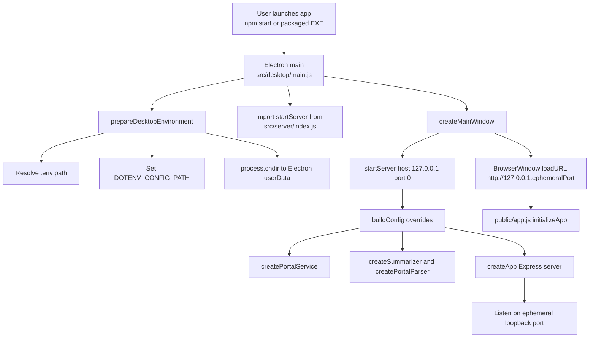
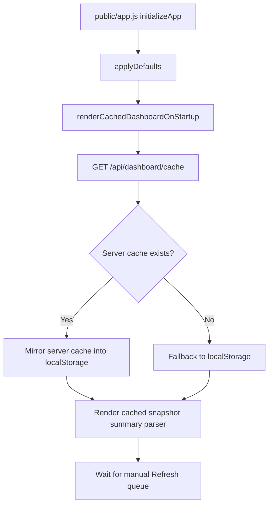
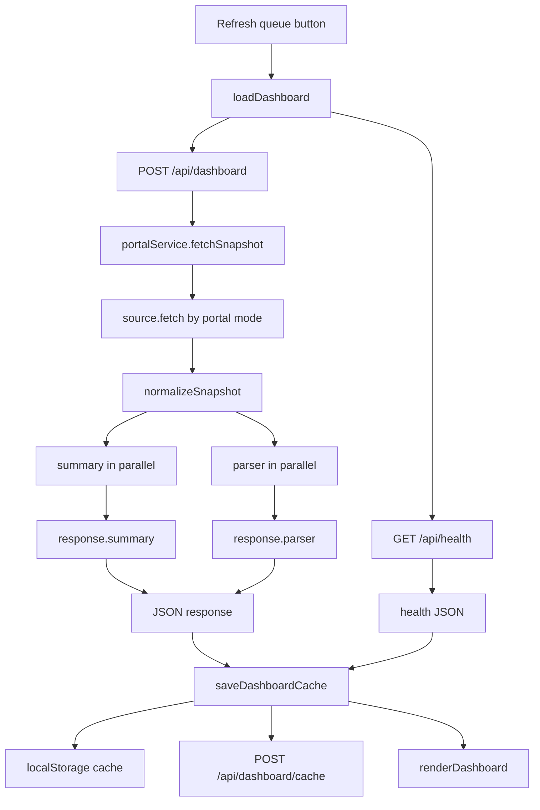
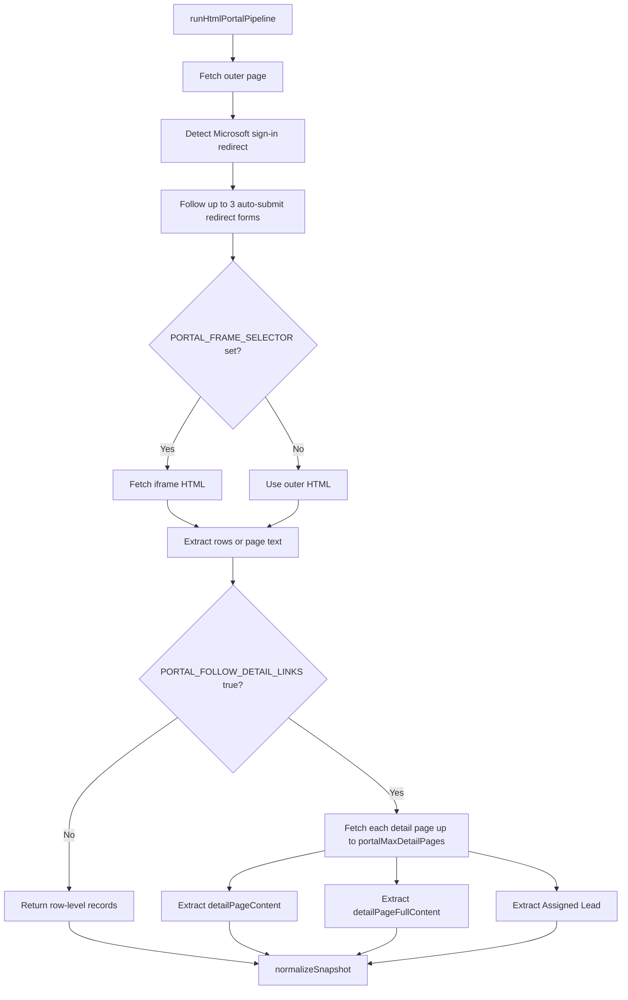

# Portal Visualizer Workflow

This document covers the main Portal Visualizer app from launch to rendered dashboard, including the desktop shell, embedded server, scrape pipeline, API routes, cache/storage locations, and the OpenAI payload assembly path.

Scope notes:
- This document covers the main app rooted at `src/desktop`, `src/server`, and `public`.
- The Graph tester under `src/graph-tester` is a separate app path and is not part of the normal Portal Visualizer dashboard workflow.
- File references below use current line ranges from this checkout.

## Entry Points

- Electron main entry: `package.json:8-21` points the app at `src/desktop/main.js` and exposes the main launch scripts.
- Desktop shell bootstrap: `src/desktop/main.js:46-57`, `src/desktop/main.js:82-155`.
- Server bootstrap: `src/server/index.js:8-45`.
- HTTP route registration: `src/server/app.js:10-103`.
- Frontend bootstrap: `public/app.js:1433-1442`.

## Startup Flow



Code references:
- Desktop readiness and server import: `src/desktop/main.js:46-57`
- Desktop environment setup and `cwd` change: `src/desktop/main.js:157-177`
- `.env` resolution order: `src/desktop/main.js:179-194`
- Embedded server startup with host `127.0.0.1` and port `0`: `src/desktop/main.js:87-103`
- Server bootstrap and dependency wiring: `src/server/index.js:8-45`
- Frontend initialization: `public/app.js:1433-1442`

## Critical Desktop Runtime Detail

In the desktop shell, `prepareDesktopEnvironment()` changes the working directory to Electron's user-data folder before the server starts (`src/desktop/main.js:157-177`).

That means relative server storage paths resolve under the Electron runtime area, not the repo root:
- `DASHBOARD_CACHE_FILE=.local-state/dashboard-cache.json` resolves under `<electron-userData>/.local-state/dashboard-cache.json`
- `PORTAL_COOKIE_CACHE_FILE=.local-auth/portal-cookie-cache.json` resolves under `<electron-userData>/.local-auth/portal-cookie-cache.json`

The desktop shell also overrides `playwrightUserDataDir` to `<electron-userData>/browser-profile` when it starts the embedded server (`src/desktop/main.js:89-96`), so browser-backed scraping in the desktop shell uses an app-local browser profile by default.

## Frontend Startup and Restore Flow

On page load, the frontend does not immediately scrape the portal. It restores the last cached dashboard first.



Code references:
- Generic frontend request wrapper: `public/app.js:43-63`
- Startup restore path: `public/app.js:1140-1158`
- Server-cache-first fallback logic: `public/app.js:1058-1081`
- Local browser cache key and write/read helpers: `public/app.js:1014-1056`

## Main Refresh Flow

The normal user path is the dashboard refresh button, which calls `/api/dashboard` and `/api/health` in parallel.



Code references:
- Refresh button wiring: `public/app.js:1429-1430`
- Refresh request body and parallel route calls: `public/app.js:1266-1306`
- `/api/dashboard` and `/api/health` route registration: `src/server/app.js:17-28`, `src/server/app.js:77-94`
- `/api/dashboard` server flow: `src/server/app.js:142-167`

## API Route Matrix

| Route | Method | Purpose | Request body | Response body | Code refs |
| --- | --- | --- | --- | --- | --- |
| `/api/health` | `GET` | Returns runtime config summary and feature status. Does not scrape portal data. | None | `ok`, `config`, `now` | `src/server/app.js:17-28` |
| `/api/dashboard/cache` | `GET` | Returns the disk/in-memory dashboard cache record if present. | None | Cached dashboard record or `null` | `src/server/app.js:30-32`, `src/server/services/dashboardCache.js:24-46` |
| `/api/dashboard/cache` | `POST` | Persists the browser cache record back to the server-side file. | Entire cache record from browser | Normalized cache record | `src/server/app.js:34-44`, `src/server/services/dashboardCache.js:48-61` |
| `/api/portal/preview` | `POST` | Fetches a fresh snapshot and optionally a summary. Does not run the parser. | `includeSummary`, `focus` | `snapshot`, optional `summary` | `src/server/app.js:46-59`, `src/server/app.js:105-120` |
| `/api/portal/parse` | `POST` | Fetches a fresh snapshot and runs parser only. | `focus`, `testchat`, optional `model` | `snapshot`, `parser` | `src/server/app.js:61-75`, `src/server/app.js:122-140` |
| `/api/dashboard` | `POST` | Main dashboard route. Fetches one snapshot, then summary and parser in parallel. | `includeSummary`, `focus`, `parserFocus`, `parserTestchat`, optional `model` | `snapshot`, `summary`, `parser` | `src/server/app.js:77-94`, `src/server/app.js:142-167` |

## Portal Source Selection

The server chooses the scrape/fetch implementation from `PORTAL_SOURCE_MODE`.

Available modes:
- `mock`
- `http-json`
- `http-html`
- `cookie-html`
- `browser-html`

Code references:
- Mode selection: `src/server/services/portal/index.js:39-55`
- Config inputs: `src/server/config/env.js:11-65`

### `http-json`

Flow:
- Fetch JSON from `PORTAL_TARGET_URL`
- Apply `PORTAL_DATA_PATH`
- Normalize each entry into a record with generated `id`
- Build a truncated raw JSON preview

Code references:
- `src/server/services/portal/httpJsonPortalSource.js:13-37`
- Record normalization: `src/server/services/portal/httpJsonPortalSource.js:41-60`

### `http-html`

Flow:
- Fetch the target HTML
- Follow auto-submit redirect forms when present
- Optionally jump into an iframe via `PORTAL_FRAME_SELECTOR`
- Extract rows via selectors
- Optionally follow detail links for more content

Code references:
- Source wrapper: `src/server/services/portal/httpHtmlPortalSource.js:17-27`
- Request construction and cookie header handling: `src/server/services/portal/httpHtmlPortalSource.js:30-93`

### `cookie-html`

Flow:
- Try `PORTAL_COOKIE` first
- Else try saved cookie cache from `.local-auth/portal-cookie-cache.json`
- If those cookies fail due to auth, open a browser session, let the user sign in if needed, capture fresh cookies, write them to the cookie cache file, then rerun HTML scraping with the cookie header

Code references:
- Source entry and decision tree: `src/server/services/portal/cookieHtmlPortalSource.js:20-66`
- Refresh-cookie browser flow: `src/server/services/portal/cookieHtmlPortalSource.js:90-167`
- Cookie capture/write: `src/server/services/portal/cookieHtmlPortalSource.js:125-147`

### `browser-html`

Flow:
- Open or attach to a Playwright browser session
- Navigate with a real browser context
- If the first main HTML load succeeds, seed the cookie cache
- Run the same HTML extraction pipeline on page content

Code references:
- Source entry: `src/server/services/portal/playwrightHtmlPortalSource.js:19-77`
- Browser page fetch flow: `src/server/services/portal/playwrightHtmlPortalSource.js:80-147`
- Cookie cache seeding: `src/server/services/portal/playwrightHtmlPortalSource.js:200-213`
- Browser session creation: `src/server/services/portal/browserSession.js:44-63`, `src/server/services/portal/browserSession.js:91-168`
- Browser executable/profile resolution: `src/server/services/portal/browserExecutable.js:4-89`, `src/server/services/portal/browserProfile.js:28-63`

## HTML Scrape Pipeline

All HTML-backed modes converge on the same pipeline.



Code references:
- Pipeline entry: `src/server/services/portal/htmlPortalPipeline.js:4-45`
- Redirect detection: `src/server/services/portal/htmlPortalPipeline.js:48-70`
- Iframe resolution: `src/server/services/portal/htmlPortalPipeline.js:73-101`
- Auto-submit form following: `src/server/services/portal/htmlPortalPipeline.js:103-122`, `src/server/services/portal/htmlPortalPipeline.js:361-463`
- Row extraction: `src/server/services/portal/htmlPortalPipeline.js:124-171`
- Detail-page enrichment: `src/server/services/portal/htmlPortalPipeline.js:173-215`
- Detail page parsing and OpenAI field extraction: `src/server/services/portal/htmlPortalPipeline.js:218-243`
- Raw preview sanitization and redaction: `src/server/services/portal/htmlPortalPipeline.js:469-488`

## Snapshot Construction

Every source returns a payload which `portalService.fetchSnapshot()` normalizes into a common shape:

```json
{
  "source": "...",
  "target": "...",
  "title": "...",
  "fetchedAt": "...",
  "recordCount": 0,
  "metrics": {
    "statusCounts": {},
    "ownerCounts": {},
    "totalRecords": 0
  },
  "records": [],
  "rawPreview": "...",
  "summaryInput": "JSON string sent to OpenAI summarizer"
}
```

Code references:
- Fetch and normalize snapshot: `src/server/services/portal/index.js:16-19`, `src/server/services/portal/index.js:57-71`
- Metrics: `src/server/services/portal/index.js:74-92`
- Summary payload string construction: `src/server/services/portal/index.js:95-97`

### Important server-only vs browser-visible fields

Server-side snapshot fields:
- `summaryInput` exists only on the server snapshot object.
- HTML detail enrichment can add `detailPageFullContent` per record.

Before the snapshot is sent to the browser:
- `summaryInput` is stripped at the snapshot level.
- `detailPageFullContent` is stripped per record.
- `detailPageContent` remains and is sent to the browser.

Code references:
- Snapshot-to-client transformation: `src/server/services/portal/index.js:21-29`
- Record field stripping: `src/server/services/portal/index.js:99-101`
- Detail enrichment fields: `src/server/services/portal/htmlPortalPipeline.js:198-205`

## OpenAI Payload Bundling

The app builds one normalized OpenAI-oriented payload shape from records and reuses it for both summary and parser inputs.

```mermaid
flowchart LR
  A[records[]] --> B[extractOpenAiPortalFields]
  B --> C[buildOpenAiPortalPayload]
  C --> D[JSON string with Records array]
  D --> E[snapshot.summaryInput]
  D --> F[buildPortalParserInput]
  E --> G[summarizer client.responses.create]
  F --> H[parser client.responses.create]
  H --> I{testchat?}
  I -->|No| J[JSON schema structured output]
  I -->|Yes| K[Plain text responseText]
```

The normalized OpenAI record fields are metadata-only:
- `ID`
- `Title`
- `Status`
- `Owner`
- `Requester`
- `Priority`
- `Due Date`
- `Application`
- `Business`
- `Detail`
- `Href`

Code references:
- OpenAI field spec and extraction: `src/server/services/portal/openAiPortalFields.js:1-38`, `src/server/services/portal/openAiPortalFields.js:50-90`
- Shared payload builder: `src/server/services/portal/openAiPortalFields.js:40-48`
- Summary input string: `src/server/services/portal/index.js:95-97`
- Parser input string: `src/server/services/ai/portalParserInput.js:1-5`

### Field extraction rules

The OpenAI field builder now uses only top-level record metadata and the short row `detail` snippet.
It does not read `detailPageContent` or `detailPageFullContent`.

Code references:
- Extraction precedence: `src/server/services/portal/openAiPortalFields.js:50-60`
- Backfill rules: `src/server/services/portal/openAiPortalFields.js:72-90`

## OpenAI Calls

### Summarizer

The summarizer is optional and only enabled when both `OPENAI_ENABLED=true` and `OPENAI_API_KEY` are present.

Behavior:
- Uses `new OpenAI({ apiKey })`
- Calls `client.responses.create(...)`
- Sends `store: false`
- Uses `snapshot.summaryInput` as the `input`
- Returns `response.output_text`

Code references:
- Config gate: `src/server/services/ai/index.js:5-10`
- Summarizer request: `src/server/services/ai/index.js:20-35`
- OpenAI config fields: `src/server/config/env.js:62-65`

### Parser

The parser is also optional behind the same config gate.

Behavior:
- Builds `originalText` from `buildPortalParserInput(snapshot)`
- Uses `store: false`
- In structured mode, adds a JSON schema
- In `testchat` mode, sends plain input without schema
- Returns either `parsed` JSON or `responseText`
- Includes `originalText` in the API response

Code references:
- Config gate and parser creation: `src/server/services/ai/portalParser.js:71-88`
- Request assembly: `src/server/services/ai/portalParser.js:140-179`
- Structured/testchat return branches: `src/server/services/ai/portalParser.js:105-135`

## Where Scraped Data Lives

### 1. In-memory during a live request

This is the richest form of the data:
- `records`
- `rawPreview`
 - `summaryInput`
 - optional `detailPageFullContent`

This exists inside the server request pipeline before `toClientSnapshot()` strips server-only fields.

Code references:
- Snapshot creation: `src/server/services/portal/index.js:57-71`
- Detail page enrichment: `src/server/services/portal/htmlPortalPipeline.js:198-205`

### 2. Browser memory

After a successful refresh, the frontend stores the returned dashboard payload in `currentViewState`.

That browser-visible payload includes:
- `snapshot`
- `summary`
- `parser`
- `healthPayload`
- control state

Code references:
- Dashboard render state assignment: `public/app.js:148-159`
- Startup restore and render: `public/app.js:1140-1157`

### 3. Browser localStorage

The browser writes a cache record under:
- Key: `portal-visualizer.dashboard-cache.v1`

The cache record includes:
- `cachedAt`
- `healthPayload`
- full dashboard `payload`
- UI control state

Code references:
- Cache record shape: `public/app.js:1018-1024`
- Write/read localStorage: `public/app.js:1027-1056`

### 4. Disk-backed dashboard cache

The browser also `POST`s the same cache record to `/api/dashboard/cache`, and the server writes it to the dashboard cache file.

Default relative path:
- `.local-state/dashboard-cache.json`

Desktop-shell effective location:
- `<electron-userData>/.local-state/dashboard-cache.json`

Server-side cache behavior:
- Keeps an in-memory `Map` keyed by resolved file path
- Reads from disk when available
- Writes normalized JSON to disk

Code references:
- Browser POST back to server: `public/app.js:1083-1105`
- Server route: `src/server/app.js:30-44`
- Path resolution and file write: `src/server/services/dashboardCache.js:17-22`, `src/server/services/dashboardCache.js:48-61`

### 5. Disk-backed cookie cache

When `cookie-html` or `browser-html` captures cookies, the server writes a reusable cookie cache record.

Default relative path:
- `.local-auth/portal-cookie-cache.json`

Desktop-shell effective location:
- `<electron-userData>/.local-auth/portal-cookie-cache.json`

Stored fields:
- `savedAt`
- `targetUrl`
- `sourceMode`
- `cookieHeader`
- normalized cookie metadata list

Code references:
- Path resolution and read/write: `src/server/services/portal/portalCookieCache.js:17-77`
- Capture from Playwright session: `src/server/services/portal/portalCookieCache.js:79-118`

## Important Persistence Nuance

The app strips `summaryInput`, `detailPageFullContent`, and `openAiFields` before sending `snapshot` to the browser, but the parser response adds `originalText` back into the returned `parser` object.

That means:
- The top-level `snapshot.summaryInput` does not get cached client-side.
- The parser's `originalText` does get cached client-side when `/api/dashboard` or `/api/portal/parse` is used.
- Since `originalText` is built from the same `buildOpenAiPortalPayload(...)` function as `summaryInput`, the metadata-only OpenAI payload still ends up in browser memory, localStorage, and the disk-backed dashboard cache whenever the parser runs.

Code references:
- Strip from client snapshot: `src/server/services/portal/index.js:21-29`, `src/server/services/portal/index.js:99-101`
- Parser input generation: `src/server/services/ai/portalParserInput.js:1-5`
- Parser returning `originalText`: `src/server/services/ai/portalParser.js:88-135`
- Main dashboard route always runs parser: `src/server/app.js:152-160`

## What Is Actually Sent to OpenAI

Summary path:
- Input source: `snapshot.summaryInput`
- Provider call: `client.responses.create`
- Output returned: `response.output_text`

Parser path:
- Input source: `buildPortalParserInput(snapshot)`
- Provider call: `client.responses.create`
- Structured mode adds JSON schema
- `testchat` mode removes the schema and returns raw model text

Code references:
- Summary request: `src/server/services/ai/index.js:20-35`
- Parser request: `src/server/services/ai/portalParser.js:88-179`

## Minimal End-to-End Walkthrough

1. User launches the desktop app or a dev script defined in `package.json:8-21`.
2. Electron boots, resolves `.env`, switches `cwd` to user-data, and starts the embedded Express server on loopback (`src/desktop/main.js:46-57`, `src/desktop/main.js:157-177`).
3. The BrowserWindow opens the embedded app URL (`src/desktop/main.js:101-155`).
4. `public/app.js` initializes, loads the last saved cache from server or localStorage, and renders that first (`public/app.js:1140-1157`, `public/app.js:1433-1442`).
5. When the user clicks Refresh queue, the browser posts to `/api/dashboard` and fetches `/api/health` in parallel (`public/app.js:1266-1306`).
6. The server chooses a portal source based on `PORTAL_SOURCE_MODE` and fetches/scrapes the portal into normalized records (`src/server/services/portal/index.js:39-55` plus the selected source file).
7. The server normalizes the snapshot and builds the shared OpenAI payload string (`src/server/services/portal/index.js:57-97`).
8. The server runs summary and parser in parallel for `/api/dashboard` (`src/server/app.js:152-160`).
9. The browser receives `snapshot`, `summary`, and `parser`, renders them, and saves the result to both localStorage and the disk-backed dashboard cache (`public/app.js:1295-1305`, `public/app.js:1083-1105`).

## File Map

| Area | Files |
| --- | --- |
| Desktop shell | `src/desktop/main.js` |
| Server bootstrap | `src/server/index.js`, `src/server/app.js`, `src/server/config/env.js` |
| Portal source selection | `src/server/services/portal/index.js` |
| HTML scraping | `src/server/services/portal/httpHtmlPortalSource.js`, `src/server/services/portal/htmlPortalPipeline.js` |
| Cookie/browser auth | `src/server/services/portal/cookieHtmlPortalSource.js`, `src/server/services/portal/playwrightHtmlPortalSource.js`, `src/server/services/portal/portalCookieCache.js`, `src/server/services/portal/browserSession.js`, `src/server/services/portal/browserProfile.js`, `src/server/services/portal/browserExecutable.js` |
| JSON portal source | `src/server/services/portal/httpJsonPortalSource.js` |
| OpenAI payload shaping | `src/server/services/portal/openAiPortalFields.js`, `src/server/services/ai/portalParserInput.js` |
| OpenAI calls | `src/server/services/ai/index.js`, `src/server/services/ai/portalParser.js` |
| Dashboard cache | `src/server/services/dashboardCache.js`, `public/app.js` |
| Frontend | `public/app.js` |
